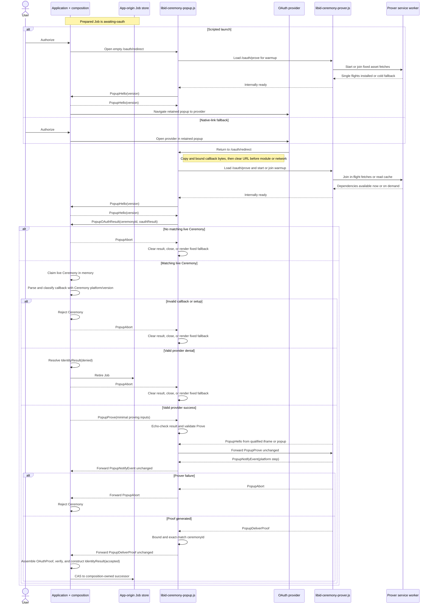

# `@libid/ceremony` architecture

This document defines the `@libid/ceremony` module boundary, application-side
API, browser entrypoints, messages, routes, progress, cancellation, proof
delivery, and browser security policy. It is implementation architecture, not
part of the normative protocol specification.

The normative libID specification owns the proof statement and authorization
encoding. See the
[common ceremony rules](../../../specs/ceremony-common.md) and
[identity-platform ceremonies](../../../specs/platform-ceremonies.md)
for their exact content. This document otherwise stands alone;
application job storage and all post-ceremony effects are outside its scope.
Package acceptance requirements are indexed by [TEST_PLAN.md](TEST_PLAN.md).

The specification's **Ceremony Client** role maps to this package's closed
client, popup, prover, and platform implementation as a whole. Its
**Ceremony Popup** is `libid-ceremony-popup.js`. This architecture uses the
concrete component names below and defines no additional wrapper module or kind.

## Boundary

One ceremony turns an application-owned operation into a locally checked
identity preview and the exact proof-bearing `OAuthProof`:

```text
CeremonyClient.new inputs
    │
    ▼
application-side client ── OAuth ── libid-ceremony-popup.js ── libid-ceremony-prover.js
    │                                                   │
    └────────────────────── Identity ◀─────────────────┘
```

The ceremony owns authorization construction, OAuth, callback handling,
isolated proving, sanitized progress, proof delivery, and local proof
verification. It does not own application jobs, wallet keys or policy,
Registry calls, connectors, transaction submission, finality, React UI, or a
server status service.

External-wallet and native libID wallet compositions use the same ceremony.
They encode their operation into opaque `transactionData` before the ceremony
and interpret it only after verified proof delivery. A native wallet may run
key preparation before the ceremony and wallet confirmation afterward; those
sessions do not extend `PopupMessage`.

The application origin owns the durable job. One application-scoped
`CeremonyClient` owns its live ceremonies, retained popups, and the in-memory
ceremony-ID routing table. The client, redirect, and prover keep credentials,
witnesses, and the generated proof only in memory. The application origin is
an authority boundary: it supplies the operation domain and transaction data,
so compromising it already permits authorizing a different operation. The
ceremony does not attempt to hide its transient OAuth result from other scripts
executing in that origin.
If the application does not verify and commit a delivered proof before the live
channel is lost, the ceremony restarts with fresh OAuth. Downstream application
work may remain resumable independently.

## Package and module structure

Launch publishes one `@libid/ceremony` package:

```text
@libid/ceremony
├── protocol    pure records, codecs, authorization, proof verification, wire version
├── client      ServerConfig fetch, application-side API, and orchestration
├── popup       source entrypoint for libid-ceremony-popup.js
├── prover      source entrypoint for libid-ceremony-prover.js, workers, WASM, and warmup
└── platforms   versioned browser OAuth, progress, witness, and proving modules
```

`protocol` is the pure leaf imported by the client, popup, prover, platform
implementations, and native-wallet confirmation. It performs no browser,
storage, or network work. It owns the closed final-proof verification operation
so the application client and native wallet use the same implementation without
a separate verifier module. `popup` and `prover` are build entrypoints, not
separately versioned packages. They emit `libid-ceremony-popup.js`,
`libid-ceremony-prover.js`, and immutable worker/WASM assets from one compatible
package release. The prover artifact runs in both Window and ServiceWorker
contexts: its Window branch runs warmup or proving, while its ServiceWorker
branch owns the shared asset single flight and cache.

Server implementations are outside the package. `platforms/github` implements
only the normative browser-side token request/response codecs and
validation; the integrating server implements the required confidential
endpoint.

The dependency direction is closed:

```text
ceremony/{client,popup,prover,platforms}
                     │
                     ▼
            ceremony/protocol

client ────────────────> ceremony
wallet ────────────────> ceremony/protocol
wallet-client ─────────> client + ceremony + wallet/protocol
```

`ceremony` never imports the client job store or either wallet composition.
The compositions adapt cancellation, progress projection, and the final
Identity commit around `proveUserIdentity()`. No generic plugin, caller-selected platform
module, validator, or finalizer exists.

The package-facing API surface is:

| Export or entrypoint | Contract |
|---|---|
| `@libid/ceremony/protocol` | closed records, exact codecs and validators, authorization construction, final-proof verification/public-input decoding, and `PopupProtocolVersion` |
| `@libid/ceremony/client` | immutable supported/enabled platform discovery, application-scoped `CeremonyClient`, `ServerConfig` fetch, and stateful `Ceremony` orchestration |
| `@libid/ceremony/popup` | browser entrypoint which emits `libid-ceremony-popup.js` and exposes `startPopup(capture, allowedAppOrigins)` to the cleared redirect document |
| `@libid/ceremony/prover` | dual-context browser entrypoint which emits `libid-ceremony-prover.js`; its Window branch accepts the closed Popup Protocol and its ServiceWorker branch owns warmup fetches |

The API below and the Ceremony Popup Protocol records are the launch surface.
Implementation-private helpers may change without changing authority or wire
behavior.

## APIs and records

### Ceremony client API

An application creates one client for one configured server:

```ts
import {
  createCeremonyClient,
  supportedPlatforms,
} from '@libid/ceremony/client'

const ceremonies = await createCeremonyClient({
  server: 'https://identity.example',
})
```

This is an application-owned instance, not a package-global singleton. Client
creation fetches and exact-validates `ServerConfig`; a configured platform is
enabled only when the installed package has a closed implementation and at
least one advertised verifier version in common.
`supportedPlatforms` is an immutable `readonly PlatformId[]` derived
from that same closed implementation table. It contains every platform compiled
into the package release, exactly once, and has no mutable registration API.

The public catalog and client types are:

```ts
export type PlatformId = 'x' | 'github' | 'google'
export declare const supportedPlatforms: readonly PlatformId[]

interface CeremonyClient {
  readonly enabledPlatforms: readonly PlatformId[]
  new: (
    ceremonyId: string,
    input: {
      chainId: Uint8Array
      platformId: PlatformId
      operationDomain: Uint8Array
      transactionData: Uint8Array
    },
  ) => Promise<Ceremony>
}

const jobId = crypto.randomUUID()
const ceremony = await ceremonies.new(jobId, {
  chainId,
  platformId,
  operationDomain,
  transactionData,
})
```

`enabledPlatforms` is the immutable intersection of `supportedPlatforms` and
the exact platform keys in validated `ServerConfig` that have at least one
verifier version in common with the installed implementation. Catalog order is
stable discovery order, not a product ranking; applications may present another order.
Neither array contains OAuth clients, verifier versions, server configuration,
or display metadata.

The composition selects a Chain Profile and operation per ceremony and supplies
their exact 32-byte `chainId` and `operationDomain` hashes with bounded
`transactionData`. During `new`, the client exact-validates and copies both
hashes without deriving or interpreting them, then treats `transactionData` as opaque. It requires
the selected platform to be enabled by validated `ServerConfig`, chooses the
newest locally preferred verifier version also advertised for that platform,
generates a fresh 32-byte authorization nonce, computes the authorization
digest, and freezes all of those values before constructing OAuth or allowing
provider navigation.

`CeremonyClient.new(ceremonyId, input)` accepts a plain string which must be a
lowercase UUIDv4. A composition normally generates one value and calls it
`jobId` in its Job API and `ceremonyId` in this API. The equality is a
composition invariant, not a shared branded type, and the identifier is public
correlation rather than a nonce.

`new` chooses the platform verifier version, generates a fresh authorization
nonce, derives the code verifier by the normative PKCE construction where
required, and constructs the authorization request with
`state=ceremonyId`, registers that ID to this live `Ceremony`, and returns only
after its navigation data is ready. OAuth `state` is a provider-facing
serialization of `ceremonyId`, not a second identifier:

```ts
interface CeremonyNavigation {
  authorizationHref: string // provider URL used by the real-anchor fallback
  bootstrapHref: string     // fixed empty /oauth/redirect used for scripted warmup
  target: string
}

interface Ceremony {
  readonly navigation: CeremonyNavigation

  onEvent(listener: (event: CeremonyEvent) => void): () => void
  proveUserIdentity(options?: { popup: WindowProxy | null }): Promise<IdentityResult>
  cancel(): Promise<void>
}
```

When the options object is omitted, `proveUserIdentity()` synchronously opens
`navigation.bootstrapHref`
with `navigation.target` before its first asynchronous step. This is the concise API for
scripted-popup integrations. For the reliable native-link fallback, the caller
renders a real anchor from `navigation.authorizationHref` and
`navigation.target`, calls
`window.open(navigation.bootstrapHref, navigation.target)` synchronously, prevents native
navigation only if it receives a usable handle, and passes the resulting handle
or `null` once to `proveUserIdentity({ popup })`. An explicit `null` means native anchor
navigation is already proceeding and forbids a second scripted open. The
returning popup's hello supplies its browser-stamped `MessageEvent.source`,
which becomes the retained handle. There is no mutable `setPopup` API.

```ts
function activate(event: MouseEvent) {
  const popup = window.open(
    ceremony.navigation.bootstrapHref,
    ceremony.navigation.target,
  )
  if (popup) event.preventDefault()
  void ceremony.proveUserIdentity({ popup })
}
```

`proveUserIdentity()` parses the callback's OAuth `state` as a ceremony ID and
claims that ID once in its owning client's live map, sends the minimal proving
inputs, validates the provider return, performs
exchange and proving, verifies the proof locally, and resolves with an accepted
`IdentityResult`. A valid ceremony-bound provider denial resolves with a denied
`IdentityResult`; popup
closure, malformed return, invalid proving input, isolation failure, and
proving failure are ordinary ceremony failures, not denial.

The Job is already committed before `proveUserIdentity()` and remains the composition's
current ceremony state while the call runs. Progress may update its advisory
projection, but no pre-proving authority CAS or ceremony callback exists. The
final composition-owned Job CAS is the authority boundary: if cancellation,
expiry, or another transition retired the Job, a late Identity cannot commit.

`cancel()` is best-effort browser cleanup and is called only after the
composition retires its Job. Losing the application document loses the
in-memory ceremony map and therefore requires fresh OAuth, as already
required by the no-ceremony-recovery launch scope.

### Server configuration

The application server exposes public configuration:

```ts
type PlatformVerifierVersion = number

interface PlatformConfig {
  clientId: string
  verifierVersions: readonly PlatformVerifierVersion[]
}

interface ServerConfig {
  schema: 1
  redirectUri: string
  platforms: Partial<Record<PlatformId, PlatformConfig>>
}
```

The application-scoped client fetches this record once with native `fetch` and
validates it through `@libid/ceremony/protocol`; there is no configuration
module. The fetch requires an exact browser `Origin`. `redirectUri` is the registered HTTPS URL with
path exactly `/oauth/redirect`, no credentials, query, or fragment. Loopback
development may use HTTP. Each platform entry contains its public client ID and
a nonempty, duplicate-free set of supported verifier versions. List order has
no meaning: the client chooses the newest version according to its closed local
implementation table from the intersection. Platform entries contain no credentials.

`allowedAppOrigins` is deployment configuration, not a public `ServerConfig`
field. The server uses the same canonical set for exact request-origin CORS and
embeds it into every `/oauth/redirect` document. It is never derived from that
request's `Origin` or `Referer`.

The client freezes the selected platform, verifier version, client ID, and
redirect URI in the live Ceremony. `PopupProve` carries those values; the popup
applies its existing opener-origin validation and closed platform/version
dispatch without fetching configuration again.

### Ceremony result

```ts
interface Identity {
  oauthProof: OAuthProof
  platformId: PlatformId
  clientId: string
  userId: string
  handle: string
  metadataObservedAt: number
  authorizationDigest: Uint8Array
}

type IdentityResult =
  | { status: 'accepted'; identity: Identity }
  | { status: 'denied' }

```

`PlatformVerifierVersion` is an unsigned 16-bit integer selected by the ceremony client
from the versions advertised in server configuration, never by the caller.
`authorizationNonce` is exactly 32 cryptographically random bytes. For X and
GitHub it also supplies the secret input to PKCE and is not exposed before the
token exchange completes. Exact authorization encoding is delegated to the
normative ceremony specification.

`OAuthProof` is the exact closed normative record: proof, attestations, and the
public authorization fields the Consumer will verify. Its platform-specific
shape is not redefined here.
`@libid/ceremony/protocol`
checks that exact `OAuthProof` against the live Ceremony's retained
authorization fields, derives
the identity preview only from locally verified proof inputs and authenticated
attestation bytes, enforces the platform's canonical encodings and configured client, and
returns `Identity` with the same `OAuthProof`. The client constructs it from
those retained fields and the proof and attestations returned by the prover.
The ceremony exact-matches the
internal ceremony ID, platform, and recomputed authorization digest before
resolving `proveUserIdentity()`. `status: 'accepted'` means the provider result
and local checks succeeded; only Consumer acceptance makes Identity
authoritative. Callers cannot supply or override Identity fields.

The live `Ceremony` privately retains its ID, copied operation inputs, selected
platform and verifier version, authorization nonce and digest, OAuth client and
redirect, derived code verifier, and popup. A restart creates a fresh Ceremony
with a fresh nonce, digest, and verifier. After proof acceptance, the Job may
store the accepted `IdentityResult` and its public `OAuthProof` fields. Before
acceptance, no Job or IndexedDB index stores the authorization nonce or digest,
code verifier, provider credential, or private witness. No separate OAuth-state
value or pre-proof checkpoint is ever persisted.

The ceremony receives no action kind, job revision, chain RPC, Registry client,
wallet key, threshold, fee, connector, transaction submitter, database,
`CryptoKey`, or arbitrary callback. Its output contains the exact `OAuthProof`
but no credential, private witness, wallet signature, fee quote, or transaction
submission capability.

All records are exact-shape validated. `metadataObservedAt` is a nonnegative
safe integer; fractions, infinities, `NaN`, and overflow fail. Ceremony IDs are
lowercase RFC 4122 UUIDv4 values generated with `crypto.randomUUID()` and are
serialized unchanged as OAuth `state`. The code verifier is derived by the
normative PKCE construction. Derived hashes are exact 32-byte `Uint8Array`
values. Unknown fields, aliases, coercions, and
noncanonical encodings fail before use.

## Browser architecture

```text
Application origin
  composition + @libid/ceremony/client
  durable Job and retained WindowProxy
              │ authenticated postMessage
              ▼
Application redirect origin: /oauth/redirect
  fixed URL-clearing bootstrap + libid-ceremony-popup.js
  non-isolated ceremony popup UI and controller
              │ bound parent/child channel or ceremony-ID channel
              ▼
Application redirect origin: /oauth/prove
  libid-ceremony-prover.js + workers/WASM
  warmup in every browser; isolated for proving
              │
              ├─ platform/notary/JWKS network defined by platform version
              └─ optional server-owned same-origin platform route
```

The deployed route surface is:

```text
GET  /_libid/config
GET  /oauth/redirect
GET  /oauth/prove
POST /oauth/github/token  server-provided when GitHub is enabled
```

`/oauth/redirect` is the one registered callback for every enabled platform and
the empty scripted-launch document. It is top-level and non-isolated so it can
authenticate and communicate with the application opener. `/oauth/prove` is
the single prover document used first for warmup and later for proving. Neither
route depends on application business logic or stores ceremony state.
Warmup adds no server route or response variant: both invocations receive the
same `/oauth/prove` HTML and the same deployment-configured prover module. The
Window branch starts warmup on load and begins proof execution only after a
valid `PopupProve`; no request parameter selects a mode.

Before user activation, the composition prepares an action-specific real
anchor with the provider authorization URL and a unique non-reserved browsing
context target. On activation it calls `window.open` synchronously with the
same target and suppresses anchor navigation only if a usable handle is
returned. If scripted opening is blocked, the same tap's native target
navigation proceeds. Both paths preserve `window.opener`; `noopener` and
`noreferrer` are forbidden. A non-null result is retained immediately. On the
native fallback, the application instead binds and retains the returning
popup's browser-stamped `MessageEvent.source` during the bidirectional Hello exchange.
Presentation as a window or tab is a browser choice, not a protocol mode.

The redirect runs the prover in one qualified placement for its lifetime:

- a DIP-isolated same-origin iframe where supported; or
- a top-level isolated popup opened by the user's **Continue proving** anchor.

The redirect never user-agent sniffs or switches placement during a ceremony.
The iframe binds its exact parent/child `WindowProxy` and browser-stamped origin.
The popup cannot rely on `window.opener` after COOP; it receives only the
ceremony ID in its initial fragment, clears it before other work, and uses a
same-origin `BroadcastChannel` derived from that ID. The ceremony ID routes the
live same-origin channel; it is not a separate confidentiality boundary.

Every redirect handshake first loads `/oauth/prove` in a same-origin iframe.
That document may warm assets without isolation or credentials. Its
`libid-ceremony-prover.js` Window branch registers the same module URL as a
module service worker and asks it to start the deployment-fixed asset single
flights. The popup reports readiness only after those flights are installed or
the bounded startup attempt determines that warmup is unavailable; it never
waits for download completion. On a provider return, a qualified DIP iframe
continues from that same document into proving. Without DIP, the unisolated
iframe receives no credential and the user-opened top-level `/oauth/prove`
popup performs proving instead.

The module worker and both documents share one origin and a scope covering
`/oauth/`. COOP changes only top-level opener relationships: it does not
partition the service-worker registration, Cache Storage, or the same-origin
channel. Consequently the COOP-isolated popup fallback joins the same in-flight
fetches as the warmup iframe. The prover requests dependencies normally; the
worker returns the existing single-flight promise or cached response, so no
document-level completion protocol exists.

The prover sends `PopupHello` only after confirming `crossOriginIsolated` and
`SharedArrayBuffer`. The popup forwards `PopupProve` only after that Hello.
Version-specific worker initialization follows `PopupProve`; failure aborts the run
and clears its inputs. There is no unisolated or single-thread fallback.
The existing bounded `/oauth/prove` startup attempt also selects placement: a
qualified iframe sends Hello and becomes the prover; otherwise it remains
warmup-only and provider success exposes **Continue proving**. No second DIP
timeout or capability protocol exists.

## Ceremony Popup Protocol

```ts
type PopupProtocolVersion = 1
```

`PopupProtocolVersion` versions the complete `PopupMessage` union shared by the
application/popup and popup/prover boundaries. It appears only in the
handshake; individual messages do not repeat it and no version negotiation
occurs.

```ts
interface PopupHello {
  popupProtocolVersion: PopupProtocolVersion
  type: 'popup-hello'
}

interface PopupOAuthResult {
  type: 'popup-oauth-result'
  ceremonyId: string
  oauthResult: string
}

interface PopupProve {
  type: 'popup-prove'
  ceremonyId: string
  platformId: PlatformId
  platformVerifierVersion: PlatformVerifierVersion
  clientId: string
  redirectUri: string
  oauthResult: string
  codeVerifier: string | null
}

interface PopupAbort {
  type: 'popup-abort'
}

interface PopupNotifyEvent {
  type: 'popup-notify-event'
  ceremonyId: string
  event: CeremonyEvent
}

interface PopupDeliverProof {
  type: 'popup-deliver-proof'
  ceremonyId: string
  proof: Uint8Array
  attestations: readonly Uint8Array[]
}

type PopupMessage =
  | PopupHello
  | PopupOAuthResult
  | PopupProve
  | PopupAbort
  | PopupNotifyEvent
  | PopupDeliverProof
```

After clearing its URL, the popup sends the
non-sensitive `PopupHello` to `window.opener`. It does not know the
opener's origin yet, so this one discovery message may use `*`; it contains only
the fixed protocol version. The application client accepts it only from a
source whose browser-stamped origin is the exact configured redirect origin and
answers with the same `PopupHello` directly to that source and origin. Before
sending its initial Hello,
the popup loads `/oauth/prove` and starts or joins the worker-owned warmup; Hello
therefore also means that the asset single flights exist or warmup is known to
be unavailable. The popup accepts the answering Hello only from `window.opener`
after exact-matching the browser-reported app origin against its validated,
server-embedded `allowedAppOrigins`. That exchange binds
all later traffic to the exact source/origin pair. Messages are direct;
unknown fields or types, wrong directions, stale order, source/origin changes,
and replays change no state.

If no valid answering Hello arrives within
`REDIRECT_OPENER_TIMEOUT_MS = 30_000`, the popup clears its in-memory capture,
severs the opener, and renders the same fixed unapproved-application result as
an invalid opener origin. No callback value is rendered or used for navigation.

After readiness, popup-to-application messages are `PopupOAuthResult`,
`PopupAbort`, `PopupNotifyEvent`, and `PopupDeliverProof`.
Application-to-popup messages are `PopupProve` and parameterless
`PopupAbort`. They are the two application responses to `PopupOAuthResult`;
application-to-popup Abort may also stop a ceremony after `PopupProve`. Before
`PopupProve`, every Abort identically clears the OAuth result and attempts to
close; if closing fails, the popup renders one fixed fallback message. Afterwards
it cancels reachable proving work and attempts to close. Popup-to-application Abort reports a
technical terminal failure and rejects the live Ceremony. Direction supplies
the meaning; Abort carries no reason and has no response. Warmup has no public
message or input of its own.

`PopupOAuthResult` parses only the captured OAuth `state` into `ceremonyId` and
sends that ID and the bounded raw provider result to the authenticated
application client. The popup does not classify the platform-specific result.
The application origin is trusted for
both the transient `PopupProve` and provider result; the protocol does
not attempt to isolate either value from other scripts executing in that
origin. Exact `targetOrigin`, `MessageEvent.origin`, and `MessageEvent.source`
checks prevent unrelated origins from receiving or injecting this traffic.
The application-scoped `CeremonyClient` uses its in-memory table to select one
live `Ceremony`; it does not query IndexedDB or reveal the ID to the
composition. For an unknown, stale, replayed, or post-reload state, the client
sends `PopupAbort`, and the popup follows the same pre-prove cleanup path.
Otherwise, the client
atomically claims the matching state and uses that Ceremony's retained
platform/version parser to exact-validate and classify the raw result. A
malformed or mismatched result rejects the
Ceremony and sends `PopupAbort`. A valid denial resolves with
`{ status: 'denied' }` and sends `PopupAbort` for popup cleanup. A valid
acceptance constructs `PopupProve` from the live Ceremony's ID, selected
platform/version, frozen client and redirect, derived code verifier, and
received `oauthResult`.
The popup exact-matches the echoed result to its retained capture, validates
the `PopupProve` shape and closed platform/version dispatch, and forwards that exact
message to the qualified prover without another app roundtrip. The claimed map entry,
single-use Ceremony instance, and one-shot popup state machine prevent duplicate
proving; the final Job CAS prevents a late result from producing an application
effect. No separate OAuth-state value, job revision, composition discriminator, wallet state,
or connector crosses the public API.

## Protocol sequence



An implementation executes only one launch path per ceremony.

`PopupDeliverProof` has no acknowledgement or ceremony-side checkpoint;
successful verification resolves `proveUserIdentity()` with an accepted
`IdentityResult`.
External-wallet submission and native-wallet confirmation begin only after the
application verifies the proof and commits its composition-owned successor.

## Redirect ingress

The same fixed `/oauth/redirect` response handles success, provider denial,
malformed input, unknown state, and the empty scripted launch. It contains no
request-derived HTML, header, script URL, origin, platform, or mode.

Its fixed inline bootstrap bounds the combined raw query and fragment to
`MAX_OAUTH_REDIRECT_BYTES = 32 KiB`, copies them into lexical memory, clears
both with `history.replaceState`, and only then integrity-loads
`libid-ceremony-popup.js` and calls:

```ts
interface OAuthRedirectCapture {
  query: string
  fragment: string
}

declare function startPopup(
  capture: OAuthRedirectCapture,
  allowedAppOrigins: readonly string[],
): void

startPopup(capture, allowedAppOrigins)
```

Empty query plus empty fragment is the scripted warmup launch. The bootstrap
clears even malformed or oversized input before rendering. It performs no
parsing, storage, network request, dynamic rendering, or error reporting before
clearing. `startPopup` exact-validates and freezes the nonempty embedded list of
canonical origins before using it; the list is deployment-generated and never
comes from request `Origin`, `Referer`, query, fragment, or a client message.
Redirect servers suppress query strings in access logs, traces, analytics, and
errors.

After loading, the popup authenticates the opener, parses the captured OAuth
`state` as `ceremonyId` for live client
routing, and exact-validates the returned `PopupProve` ID, platform, verifier
version, client ID, redirect URI, provider result, and PKCE shape before using
the credential.
The application client's selected platform/version parser classifies the raw
result. It rejects a Google ID Token at or after its signed `exp`; mutable
X/GitHub proof lifetimes are enforced only by the Platform Verifier. Google
accepts a nonempty fragment and empty query; X and GitHub accept a nonempty
query and empty fragment.

An unsupported or invalid input discovered after `PopupProve`
clears the return, sends popup-to-application `PopupAbort`, and renders
**Application updated—return and try again**. After live binding, an unknown or
stale ceremony ID or a raw result rejected by the selected platform/version
parser makes the application send `PopupAbort`; the popup clears the result,
attempts to close, and renders one fixed fallback message if closing fails. A
wrong opener origin, handshake timeout, or redirect capture without a valid
bounded ceremony ID fails before live binding, sends nothing, and exposes no
callback value.

## Popup/prover channel

The popup/prover boundary reuses the closed `PopupMessage` union. The isolated
prover sends `PopupHello` after binding its channel and passing the isolation
checks. The popup then forwards exactly the `PopupProve` received from
the application. Its bounded `oauthResult` is the provider-returned callback
value; `platformId` and `platformVerifierVersion` select its exact parser and
implementation. `codeVerifier` is null for Google and the already-derived 43-character PKCE
verifier for X and GitHub. `clientId` and `redirectUri` are the values frozen by
the Ceremony Client from its validated `ServerConfig`. The popup and prover
both exact-validate the record.

The prover does not receive the expected Authorization Digest. Google exposes
the signed token nonce as a proof public input; X and GitHub expose the
attested code verifier. The Ceremony Client matches that verified output to
its retained authorization fields after delivery.

After `PopupProve`, the prover sends zero or more `PopupNotifyEvent` records followed
by exactly one `PopupDeliverProof`. Either side may instead send parameterless
`PopupAbort`: popup-to-prover means cancellation and prover-to-popup means
terminal failure. The popup validates and forwards prover events, delivery, and
Abort unchanged to the application. Context loss may produce no terminal
message. Unknown fields or types, invalid order, messages after terminal, and
messages outside the bound channel change no state.

The one-shot channel scopes every message to one ceremony. `PopupProve` and proof
delivery carry the ceremony ID; Hello and Abort do not duplicate it. The DIP
path binds the exact parent/child `WindowProxy` and browser-stamped origin. The
popup path uses the cleared ceremony-ID fragment only to derive its same-origin
`BroadcastChannel`. All browser boundaries share `PopupProtocolVersion`; no
second protocol or version exists.

The prover performs the selected version's exchange, notarization, witness
construction, and proof generation. It returns only the bounded generated
proof and attestations through `PopupDeliverProof`; it does not receive the
operation domain, chain ID, transaction data, or authorization nonce, and it
does not assemble or verify `OAuthProof` or
construct `Identity`. The application client combines the returned material
with its retained ceremony fields, assembles the exact normative `OAuthProof`,
and verifies it locally. For GitHub, the prover—not the
popup—calls the fixed same-origin token route, verifies its response, and then
performs the dependent `/user` notarization. `platforms/github` implements the normative
`TokenRequest` and `TokenResponse` codecs; the platform
specification owns their exact shape and proof semantics.

Neither placement persists credential-bearing state. Inputs and workers are
cleared after proof delivery, Abort, failure, or context destruction.

## Progress and cancellation

```ts
type CeremonyStage =
  | 'authorization'
  | 'oauth-validation'
  | 'prover-activation'
  | 'proof-generation'

interface PlatformStep {
  code: string
  status: 'started' | 'completed' | 'failed'
}

interface CeremonyEvent {
  stage: CeremonyStage
  platformStep: PlatformStep | null
  timestamp: number
}
```

The application-side `Ceremony` client owns the common stage. It enters
`authorization` when `proveUserIdentity()` starts, `oauth-validation` when an
authenticated `PopupOAuthResult` selects the live Ceremony,
`prover-activation` only while the popup waits for the fallback **Continue
proving** activation, and `proof-generation` when proving starts. Immediate
local proof verification and `Identity` construction complete
`proof-generation`; they are not separate progress stages. The popup reports
its two prover lifecycle transitions over the authenticated channel, and the
client confirms them before publishing them.

Each platform-verifier-version module defines only its steps beside the code
which performs them and emits `started` followed by exactly one `completed` or
`failed`. It cannot select a common stage. The prover validates the bounded
string and status shape, stamps `timestamp` as non-negative safe-integer Unix
milliseconds, and attaches its current `proof-generation` stage. The popup
forwards that exact event. The client accepts only an authenticated, legal
stage transition and otherwise does not interpret the platform catalog.
Neither event contains operation inputs, outputs,
credentials, identities, witnesses, proofs, raw exceptions, or raw service
errors. The application may map this advisory view into its broader job
progress; later confirmation, submission, and finality never enter the
Ceremony Popup Protocol.

`CeremonyEvent` carries only advisory progress. OAuth denial is returned only
through `proveUserIdentity()`; acceptance proceeds to `PopupProve`.

The prover's same-origin `BroadcastChannel` supplies routing inside the trusted
deployment, not separate sender authentication, durable state, or proof
authority. A same-origin `PopupAbort` can stop only the current run; it cannot
produce Identity or any later application effect. Missing, duplicated, or
reordered progress affects only UI. The visible prover remains the fallback
when an isolated-popup engine cannot relay progress reliably.

Cancellation first retires the application job. If the authenticated channel
is live, the application sends `PopupAbort`; the popup marks the
ceremony canceled, forwards `PopupAbort` over a live prover channel, removes a DIP
iframe or closes the prover popup, clears memory, and terminates reachable
workers/connections.
Cancellation is best effort: remote stateless work may finish, but no result is
used. A later result cannot commit because the matching Job is gone.
Popup closure alone is never success, failure, denial, or cancellation.

## Prover warmup

Every ceremony attempts consent-overlapped prover warmup. It is fixed behavior,
not configuration, action input, or a separate protocol. Before the ordinary
bidirectional `PopupHello` handshake, the popup loads `/oauth/prove`. The
prover Window branch registers its own deployed
`libid-ceremony-prover.js` module URL as a module service worker and asks it to
start the fixed asset-set single flights. This reuses the same route, artifact,
and prover implementation used later for proving; there is no warmup route,
artifact, URL flag, or public warmup message.

The service-worker branch contains no OAuth or application state and fetches
only the deployment-fixed worker, WASM, and whole-response CRS assets.
It owns every asset fetch from the first byte and extends the initiating worker
event through completion. The popup sends `PopupHello` as soon as the single
flights exist or the bounded startup attempt fails, without waiting for download
completion; the application proceeds to the provider after answering with
`PopupHello`. A later `/oauth/prove` document
requests dependencies normally; the worker makes each request join its
in-flight fetch or read its completed cache entry. Navigation through OAuth
therefore does not restart the work.

The same worker registration and Cache Storage are visible to both qualified
placements. DIP iframe proving uses them directly. A top-level popup remains in
the same origin and service-worker scope after COOP severs its opener, so it
uses the same fetches and cache. A new document reconnects to the worker rather
than awaiting a Promise owned by the destroyed warmup document. Worker
termination after completion is harmless because completed responses live in
the cache; no durable completion marker exists.

Registration, fetch, eviction, quota, or unsupported-worker failure changes
latency only. Proving follows the identical cold fetch path and never weakens
isolation, worker count, or verification. Warm state is never a checkpoint.

## Browser and response policy

| Response | Required policy |
|---|---|
| `/_libid/config` | exact `ServerConfig`; `Cache-Control: no-store`; exact request-origin CORS; no wildcard or credentials |
| `/oauth/redirect` | top-level non-isolated deployment-generated document embedding the canonical allowed-origin set; `COOP: unsafe-none`; no-store/no-referrer; `frame-ancestors 'none'`; `frame-src 'self'` only for DIP; `connect-src 'self'`; exact integrity-pinned root module |
| `/oauth/prove` | the one warmup/proving document; `Document-Isolation-Policy: isolate-and-require-corp`; `COOP: same-origin`; `COEP: require-corp`; no-store/no-referrer; same-origin framing only for DIP; exact script, worker, and network sources |
| server platform routes | prover-only exact method, body, and origin; reject redirects; no-store; bounded time/size; credential log redaction |

Both documents start from `default-src 'none'`, `object-src 'none'`,
`base-uri 'none'`, and `form-action 'none'`. The URL-clearing bootstrap is the
only inline executable and is pinned by its exact deployment-generated CSP
hash. Root modules use immutable URLs, SRI, CORS, and COEP-compatible response
policy. The deployment-fixed same-origin `libid-ceremony-prover.js` URL already
loaded by `/oauth/prove` is also its module-service-worker registration URL; it
permits a scope covering `/oauth/`. This adds no second prover artifact, route,
or `ServerConfig` field. Every worker, WASM, module, and CRS URL belongs to the
fixed deployed asset set; opener or callback input cannot supply an asset URL.

No request value is interpolated into CSP or another response header. Because
a worker cannot directly load a cross-origin worker URL, the prover may create
only a local `blob:` bootstrap which imports the fixed immutable worker module
and installs the same fixed bridge for nested workers. Its CSP permits that
bootstrap and only the exact asset and network origins required by the selected
platform version.

The application page must preserve an opener through the provider roundtrip.
`COOP: unsafe-none` and `same-origin-allow-popups` are compatible; a strictly
cross-origin-isolated launching page is unsupported until another authenticated
transport exists. Redirect and prover pages accept no application HTML,
component, stylesheet, script URL, or raw error markup and render fixed native
DOM UI.

The redirect deployment and configured asset origin are code-supply-chain
trust boundaries. A malicious owner can replace the document, CSP, and matching
assets; the Ceremony Popup Protocol cannot constrain that owner. Dedicated
origins, immutable assets, CSP, SRI, and closed messages reduce accidental
exposure and cross-application confusion, not malicious deployment authority.

## Versioning and compatibility

`PlatformVerifierVersion` versions one platform proof implementation and its
OAuth grammar, progress catalog, circuit, witness, verifier, and notary-proof
behavior. `PlatformConfig.verifierVersions` advertises what the deployment
accepts; the client selects its newest locally preferred member of that set,
and every live ceremony pins it.

`PopupProtocolVersion` changes only when the shared browser message union or
its application/popup or popup/prover semantics break. One package release may
retain older protocol and platform-version validators during its compatibility window. Local
job schema versioning remains owned by the client store; deployment route and
asset versioning remain release concerns. Neither is added to every ceremony
popup message.

An incomplete ceremony whose popup release is no longer supported restarts with
fresh OAuth. A Job which has already committed Identity has left the
ceremony and remains usable under its composition's own compatibility rules.
