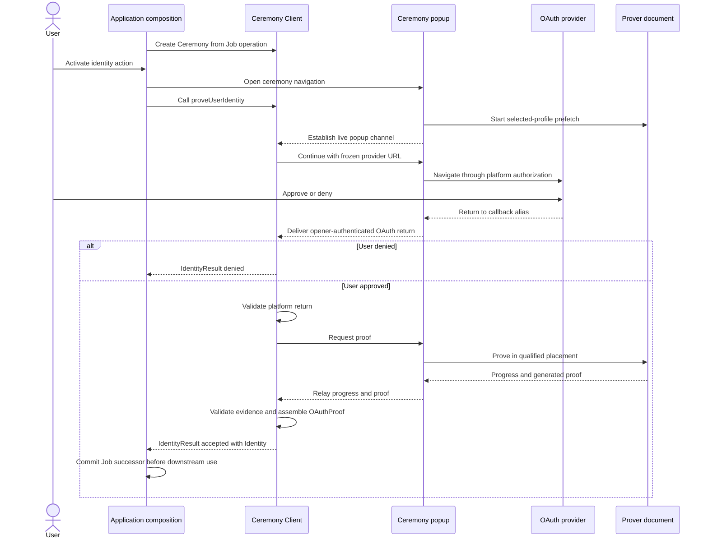

# `@libid/ceremony` architecture

`@libid/ceremony` runs an identity-proof ceremony in the browser. An
application supplies an operation to authorize; the package obtains and proves
platform identity evidence, then returns a locally checked identity preview and
the proof-bearing `OAuthProof` for a Consumer (the downstream proof verifier)
to verify.

This document defines the package boundary, public application API and
configuration, and result lifecycle. The package's browser protocol is defined
in [CCDP.md](CCDP.md), and the prover subsystem is defined in
[PROVER.md](PROVER.md).
The integrating server's routes, deployment inputs, and response policy are
defined in [SERVER.md](SERVER.md). These documents are implementation
architecture, not part of the normative protocol specification.

The normative libID specification owns the proof statement and authorization
encoding. See the
[common ceremony rules](../../../specs/ceremony-common.md) and
[identity-platform ceremonies](../../../specs/platform-ceremonies.md)
for their exact content. Together, this document, CCDP, and the server contract
otherwise stand alone; application job storage and all post-ceremony effects
are outside their scope.
Package acceptance requirements are indexed by [TEST_PLAN.md](TEST_PLAN.md).

The specification's **Ceremony Client** role maps to this package's closed
client, popup, prover, and platform implementation as a whole. Its
**Ceremony Popup** is `libid-ceremony-popup.js`. This architecture uses the
concrete component names below and defines no additional wrapper module or kind.

## System boundary

One ceremony turns an application-owned operation into a locally checked
identity preview and the exact proof-bearing `OAuthProof`:



The ceremony owns authorization construction, OAuth, callback handling,
isolated proving, sanitized progress, proof delivery, and local evidence
validation. It does not own application jobs, wallet keys or policy,
Registry calls, connectors, transaction submission, finality, React UI, or a
server status service.

External-wallet and native libID wallet compositions use the same ceremony.
They encode their operation into opaque `transactionData` before the ceremony
and interpret it only after the ceremony returns `Identity`. A native wallet
may run key preparation before the ceremony and wallet confirmation afterward;
those sessions do not extend the browser message protocol.

The application origin owns the durable operation record, called the Job. One
application-scoped `CeremonyClient` owns its live ceremonies, retained popups,
and the in-memory ceremony-ID routing table. The client, redirect, and prover
keep credentials, witnesses, and the generated proof only in memory. The
application origin is an authority boundary: it supplies the operation domain
and transaction data, so compromising it already permits authorizing a
different operation. The ceremony does not attempt to hide its transient OAuth
result from other scripts executing in that origin. If the application does
not assemble and commit the delivered result before the live channel is lost,
the ceremony restarts with fresh OAuth. Downstream application work may remain
resumable independently.

## Ceremony Cross-Document Protocol

The browser ceremony spans contexts which cannot share memory: the application,
OAuth popup/callback, and isolated prover placement. They communicate through
the package-owned Ceremony Cross-Document Protocol (CCDP), whose document
lifecycle binds the active prover placement and its prefetch readiness.

[CCDP.md](CCDP.md) owns the execution-context rationale, topology,
exact `CCDPMessage` union and message sequence, redirect ingress, prover fallback,
cross-document progress and cancellation, prefetch coordination, browser
response policy, and `CCDPVersion` compatibility. This document retains the
package and public application contracts which initiate and consume that
protocol.

## Package composition

Launch publishes one `@libid/ceremony` package:

```text
@libid/ceremony
├── ccdp        cross-document records, codecs, validation, and wire version
├── client      CeremonyConfig fetch, application-side API, and orchestration
├── popup       source entrypoint for libid-ceremony-popup.js
├── prover      source entrypoint for libid-ceremony-prover.js, workers, WASM, and prefetch
└── platforms
    ├── index    closed platform/version catalog and derived public result types
    ├── authorization  shared digest and PKCE helpers used under platform-version policy
    ├── google/<version>  proof type, validator, OAuth, progress, witness, and proving
    ├── x/<version>       proof type, validator, OAuth, progress, witness, and proving
    └── github/<version>  proof type, validator, OAuth, progress, witness, and proving
```

`ccdp` is the pure browser-message leaf imported by client, popup, and prover.
It performs no platform dispatch, browser work, storage, network, authorization
construction, or cryptographic proof verification. `platforms/authorization`
provides the shared Authorization Digest and PKCE helpers, but each
platform/version module owns whether and how those helpers participate in its
ceremony. Each version module also owns its proof type and validator, exact
proof assembly, and local evidence validation. `platforms/index` is the only
aggregator: it imports those modules, derives the catalog and public result
types, and is re-exported by the package root and client API. Individual
platform modules never import the aggregator. `popup` and `prover` are build entrypoints, not
separately versioned packages. They emit `libid-ceremony-popup.js`,
`libid-ceremony-prover.js`, and immutable worker/WASM assets from one compatible
package release. The prover artifact runs in both Window and ServiceWorker
contexts: its Window branch runs prefetch, coordinates proving, and executes the
active prover placement, while its ServiceWorker branch owns the shared asset
single flight and cache.

Server implementations are outside the package. `platforms/github` implements
only the normative browser-side token request/response codecs and
validation; the integrating server implements the required confidential
endpoint.

The dependency direction is closed:

```text
client, prover, native wallet ───> platforms/index
                                      │
                                      ▼
                           platforms/{google,x,github}
                                      │
                                      ▼
                         platforms/authorization

client, popup, prover, platforms/index ───> ccdp
wallet-client ─────────> client + ceremony + wallet/protocol
```

`ceremony` never imports the client job store or either wallet composition.
The compositions adapt cancellation, progress projection, and the final
Identity commit around `proveUserIdentity()`. No generic plugin, caller-selected platform
module, validator, or finalizer exists.

The package-facing API surface is:

| Export or entrypoint | Contract |
|---|---|
| `@libid/ceremony` | `PlatformId`, `PlatformCeremonyVersion`, `supportedPlatforms`, `ProofByPlatformVersion`, `OAuthProof`, `Identity`, and `IdentityResult`, derived from the closed platform/version catalog |
| `@libid/ceremony/ccdp` | `CCDPMessage`, `CCDPVersion`, exact message codecs, and direction/order/envelope validation |
| `@libid/ceremony/client` | `CeremonyConfig` schema/fetch/validation, application-scoped `CeremonyClient`, stateful `Ceremony` orchestration, and convenience re-exports of public catalog/result types |
| `@libid/ceremony/popup` | browser entrypoint which emits `libid-ceremony-popup.js` and exposes `startPopup(oauthReturn, allowedAppOrigins)` to the cleared redirect document |
| `@libid/ceremony/prover` | dual-context browser entrypoint which emits `libid-ceremony-prover.js`; its Window branch accepts CCDP and its ServiceWorker branch owns asset-prefetch single flights |

The API below and the [CCDP records](CCDP.md#closed-message-union)
are the launch surface.
Implementation-private helpers may change without changing authority or wire
behavior.

## Application integration

### Client lifecycle

An application creates one client for one configured server:

```ts
import {
  createCeremonyClient,
  supportedPlatforms,
} from '@libid/ceremony/client'

const ceremonies = await createCeremonyClient({
  server: 'https://identity.example',
})
```

This is an application-owned instance, not a package-global singleton. Client
creation fetches and exact-validates `CeremonyConfig`; a configured platform is
enabled only when the installed package has a closed implementation and at
least one advertised ceremony version in common.
The package has one closed platform/version-module catalog. `PlatformId`, immutable
`supportedPlatforms`, supported versions, and `ProofByPlatformVersion` all derive
from the same keys and validator return types; no second platform union, version
list, or proof map
exists:

```ts
import * as googleV1 from './platforms/google/v1'
import * as xV1 from './platforms/x/v1'
import * as githubV1 from './platforms/github/v1'

const platforms = {
  google: { versions: { 1: googleV1 } },
  x: { versions: { 1: xV1 } },
  github: { versions: { 1: githubV1 } },
} as const

export type PlatformId = keyof typeof platforms

export type SupportedCeremonyVersion<P extends PlatformId> =
  keyof (typeof platforms)[P]['versions'] & number

export type ProofByPlatformVersion = {
  [P in PlatformId]: {
    [V in SupportedCeremonyVersion<P>]:
      ReturnType<(typeof platforms)[P]['versions'][V]['validateProof']>
  }
}

export declare function validateProofMessage<
  P extends PlatformId,
  V extends SupportedCeremonyVersion<P>,
>(
  platformId: P,
  platformCeremonyVersion: V,
  message: ProverDeliverProof,
): ProverDeliverProof<ProofByPlatformVersion[P][V]>

export const supportedPlatforms: readonly PlatformId[] = Object.freeze(
  Object.keys(platforms) as PlatformId[],
)

interface CeremonyClient {
  readonly enabledPlatforms: readonly PlatformId[]
  new: <P extends PlatformId>(
    ceremonyId: string,
    input: {
      chainId: Uint8Array
      platformId: P
      operationDomain: Uint8Array
      transactionData: Uint8Array
    },
  ) => Promise<Ceremony<P>>
}

const jobId = crypto.randomUUID()
const ceremony = await ceremonies.new(jobId, {
  chainId,
  platformId,
  operationDomain,
  transactionData,
})
```

`validateProofMessage` dispatches to the selected version module's exact runtime
validator and returns the generic CCDP envelope narrowed to that validator's
derived proof type. Any implementation-only assertion needed to express the
indexed dispatch to TypeScript remains behind this validated aggregation
boundary; the Ceremony Client performs no cast. CCDP continues to use
`ProverDeliverProof<unknown>` and does not import the catalog.

Adding a platform or local ceremony version changes this catalog and its closed
implementation and proof type together. A new version cannot silently inherit
another version's proof validator. There is no mutable registration API. A configured
platform is enabled only when its catalog entry and validated `CeremonyConfig`
entry have a version in common; each Ceremony freezes the selected version.

`enabledPlatforms` is the immutable intersection of `supportedPlatforms` and
the exact platform keys in validated `CeremonyConfig` that have at least one
ceremony version in common with the installed implementation. Catalog order is
stable discovery order, not a product ranking; applications may present
another order. Neither array contains OAuth clients, ceremony versions, server
configuration, or display metadata.

The composition selects a Chain Profile and operation per ceremony and supplies
their exact 32-byte `chainId` and `operationDomain` hashes with bounded
`transactionData`. During `new`, the client exact-validates and copies both
hashes without deriving or interpreting them, then treats `transactionData` as
opaque. It requires the selected platform to be enabled by validated
`CeremonyConfig`, chooses the newest locally preferred ceremony version also
advertised for that platform, generates a fresh 32-byte authorization nonce,
computes the authorization digest and code verifier, and freezes all of those
values before constructing OAuth or allowing provider navigation.

`CeremonyClient.new(ceremonyId, input)` accepts a plain string which must be a
lowercase UUIDv4. A composition normally generates one value and calls it
`jobId` in its Job API and `ceremonyId` in this API. The equality is a
composition invariant, not a shared branded type. The identifier is not chain
authorization, but its unpredictability and one-use handling provide browser
continuity: the initial popup discloses it to the initiating app, the
post-OAuth popup withholds it, and `AppAuthenticateOrigin` must return it.

`new` chooses the platform ceremony version, generates the fresh authorization
nonce, derives the code verifier from it and the Authorization Digest by the
normative Proof Key for Code Exchange (PKCE) construction where required, and
constructs the authorization request with `state=ceremonyId`, registers that ID
to this live `Ceremony`, and returns only after its navigation data is ready.
OAuth `state` is a provider-facing serialization of `ceremonyId`, not a second
identifier:

```ts
interface CeremonyNavigation {
  href: string   // /api/v1/ceremony/popup#launch(ceremonyId, platformId, ceremonyVersion)
  target: string
}

interface Ceremony<P extends PlatformId = PlatformId> {
  readonly navigation: CeremonyNavigation

  onEvent(listener: (event: CeremonyEvent) => void): () => void
  proveUserIdentity(options?: { expectedPopup: WindowProxy }): Promise<IdentityResult<P>>
  cancel(): Promise<void>
}
```

The caller owns launch UI and invokes `window.open`; the ceremony package never
renders an anchor or chooses between launch paths. `navigation.target` is a
unique, non-reserved browsing-context name. The caller renders an
action-specific real anchor from `navigation.href` and `navigation.target`,
attempts `window.open('about:blank', navigation.target)` synchronously, and
prevents native navigation only if it receives a usable handle. It passes that
handle once as `expectedPopup`. If no handle is returned, it omits
`expectedPopup` and leaves the same activation's real-anchor navigation
untouched.

The scripted path is primary and PoC-qualified; the qualified mobile browsers
did not reject it. The real anchor is a hedge against an unqualified browser or
embedding policy returning `null`, not a claim that a launch target is known to
require it.

`expectedPopup` is a channel-authority input, not UI configuration. When
present, `proveUserIdentity()` immediately navigates that `WindowProxy` to
`navigation.href` and exact-matches the first popup message against it. When
absent, the package opens or navigates nothing; the real anchor reaches the
same URL and the client binds its browser-stamped `MessageEvent.source` after
matching `ProverPrefetchingAssets`'s ceremony ID, platform ID, and ceremony version
to the live Ceremony. Both paths then
retain the same source through OAuth. There is no nullable popup value or
mutable `setPopup` API.

```ts
function activate(event: MouseEvent) {
  const expectedPopup = window.open(
    'about:blank',
    ceremony.navigation.target,
  )
  if (expectedPopup) event.preventDefault()
  void ceremony.proveUserIdentity(
    expectedPopup ? { expectedPopup } : undefined,
  )
}
```

`proveUserIdentity()` parses the callback's OAuth `state` as a ceremony ID and
claims that ID once in its owning client's live map, sends the minimal proving
inputs, validates the provider return, performs exchange and proving,
constructs the non-authoritative identity preview and OAuth proof, and resolves
with an accepted `IdentityResult`. A valid ceremony-bound provider denial
resolves with a denied `IdentityResult`; popup closure, malformed return,
invalid proving input, isolation failure, and proving failure are ordinary
ceremony failures, not denial.

The Job is already committed before `proveUserIdentity()` and remains the
composition's current ceremony state while the call runs. Progress may update
its advisory projection, but no pre-proving authority CAS or ceremony callback
exists. The final composition-owned Job CAS is the authority boundary: if
cancellation, expiry, or another transition retired the Job, a late Identity
cannot commit.

`cancel()` is best-effort browser cleanup and is called only after the
composition retires its Job. Losing the application document loses the
in-memory ceremony map and therefore requires fresh OAuth, as already
required by the no-ceremony-recovery launch scope.

### Server configuration

The integrating server exposes the exact `CeremonyConfig` and origin-controlled
fetch defined in [SERVER.md](SERVER.md#public-configuration). The
application-scoped client fetches it once with native `fetch` and validates it
in `@libid/ceremony/client`; no separate configuration module exists. Popup and
prover do not fetch it.

The client freezes the selected platform, ceremony version, client ID, and
redirect URI in the live Ceremony. `AppRequestProof` carries those values; the popup
applies its existing opener-origin validation and closed platform/version
dispatch without fetching configuration again.

## Result and lifecycle

```ts
interface GoogleProofV1 {
  honkProof: Uint8Array
  clientId: string              // exact signed aud bytes
  userId: string                // exact signed sub bytes
  email: string                 // exact signed email bytes
  tokenExpiresAt: number        // exact signed exp
  signingKeyModulus: Uint8Array
}

interface XProofV1 {
  honkProof: Uint8Array
  tokenAttestation: NotaryAttestation
  identityAttestation: NotaryAttestation
}

interface GitHubProofV1 {
  honkProof: Uint8Array
  tokenAttestation: NotaryAttestation
  identityAttestation: NotaryAttestation
}

type OAuthProof<P extends PlatformId = PlatformId> = {
  [K in P]: {
    [V in SupportedCeremonyVersion<K>]: {
      platformId: K
      platformCeremonyVersion: V
      operationDomain: Uint8Array      // exactly 32 bytes
      authorizationNonce: Uint8Array   // exactly 32 bytes
      transactionData: Uint8Array      // bounded opaque bytes
      proof: ProofByPlatformVersion[K][V]
    }
  }[SupportedCeremonyVersion<K>]
}[P]

type Identity<P extends PlatformId = PlatformId> = {
  [K in P]: {
    oauthProof: OAuthProof<K>
    platformId: K
    clientId: string
    userId: string
    handle: string
    metadataObservedAt: number
    authorizationDigest: Uint8Array
  }
}[P]

type IdentityResult<P extends PlatformId = PlatformId> =
  | { status: 'accepted'; identity: Identity<P> }
  | { status: 'denied' }

```

The platform type selected in `CeremonyClient.new` flows through `Ceremony`,
`IdentityResult`, and `OAuthProof`. A literal platform input therefore returns
the corresponding `proof` type; a dynamic `PlatformId` returns the platform
proof union. The mapped-union form preserves the relationship between each
`platformId`, `platformCeremonyVersion`, and proof type when a dynamic result is
narrowed. Adding a platform or version extends the closed catalog, not
`OAuthProof` or CCDP.

Callers do not supply a generic explicitly. A static platform literal flows
through `new` and `proveUserIdentity()`:

```ts
const ceremony = await ceremonies.new(jobId, {
  chainId,
  platformId: 'google',
  operationDomain,
  transactionData,
})

const result = await ceremony.proveUserIdentity()
if (result.status === 'accepted') {
  result.identity.oauthProof.proof.email // GoogleProofV1
}
```

Composition wrappers preserve the same inference by carrying the generic:

```ts
async function proveWithJob<P extends PlatformId>(
  ceremony: Ceremony<P>,
): Promise<IdentityResult<P>> {
  // Composition-owned Job logic may run around this call.
  return ceremony.proveUserIdentity()
}
```

Accepting only `PlatformId` or returning unparameterized `IdentityResult`
intentionally widens the result to the platform union.

`PlatformCeremonyVersion` is an unsigned 16-bit integer selected by the ceremony client
from the versions advertised in ceremony configuration, never by the caller. It
versions one platform's complete ceremony semantics: authorization-digest
construction, OAuth request and return handling, platform proof construction,
and assembly of the final `OAuthProof`. It does not version a chain, Registry,
or verifier contract; multiple chain-specific Consumers may accept the same
ceremony output.
The selected `PlatformCeremonyVersion` is also the proof-shape discriminator in
`OAuthProof`; there is no independent proof or contract-verifier version. Each
current platform has only version `1`. A new ceremony version must add its own
version module, proof type, and validator, even when it deliberately retains the
same fields. The caller cannot select a version directly.
`authorizationNonce` is exactly 32 cryptographically random bytes. For X and
GitHub the Ceremony Client derives the code verifier from the Authorization
Digest and that nonce, sends only the derived verifier to the prover, and
retains the nonce until the token exchange has completed. The accepted
`OAuthProof` then publishes `authorizationNonce` so the Platform Verifier can
reproduce the binding. Exact authorization and PKCE encoding are delegated to
the normative ceremony specification.

`OAuthProof<P>` is the single exact wrapper assembled by the Ceremony Client;
its nested `proof` varies by platform and ceremony version. Each version module owns that
proof type and validator. `NotaryAttestation` reuses the pinned notary client's
exact attested-data-and-signature record and serialization; the ceremony does
not define a second representation. Every numeric and byte field is exact-shape
and bounds checked. Unknown fields are rejected.

`GoogleProofV1` names the circuit's semantic public values rather than exposing
bb.js's ordered field array. The Google adapter's pure
`buildGooglePublicInputs(authorizationDigest, proof)` helper hashes and packs
those values into the circuit's exact 56-field verifier input only at the
verifier/transaction-encoding boundary. The Ceremony Client does not call it to
verify the proof. Google has no attestation from which the Platform Verifier
could recover these values, so they remain part of `GoogleProofV1`. `XProofV1` and
`GitHubProofV1` need no equivalent fields: their Platform Verifiers reconstruct
the two bearer commitments from their respective verified attestations. Their
client identifier, identity, and evidence time likewise come only from those
signed attestation bytes.

No record contains chain ID or Authorization Digest: the Proof Verifier
observes the former from its chain environment and recomputes the latter. No
record adds a verifier address, verification key, validity bound, normalized
handle, or a second copy of any field already authenticated by a proof or
attestation.
The Ceremony Client uses shared protocol primitives and the selected platform
module to check that exact `OAuthProof` against the live Ceremony's retained
authorization fields, derive the identity preview from locally validated
platform evidence, enforce the platform's canonical encodings and configured
client, and return `Identity` with the same `OAuthProof`. It constructs the
record from those retained fields after `validateProofMessage` returns the
platform-and-version-typed proof value.
The ceremony exact-matches the
internal ceremony ID, platform, and recomputed authorization digest before
resolving `proveUserIdentity()`. `status: 'accepted'` means the selected parser
classified the provider parameters as success and local checks succeeded; only Consumer
acceptance makes Identity authoritative. Callers cannot supply or override
Identity fields.

The live `Ceremony` privately retains its ID, copied operation inputs, selected
platform and ceremony version, authorization nonce and digest, OAuth client and
redirect, derived code verifier, and popup. A restart creates a fresh Ceremony
with a fresh nonce, digest, and verifier. After proof acceptance, the Job may
store the accepted `IdentityResult` and its public `OAuthProof` fields. Before
acceptance, no Job or IndexedDB index stores the authorization nonce or digest,
code verifier, provider credential, or private witness. No separate OAuth-state
value or pre-proof checkpoint is ever persisted.

The ceremony receives no action kind, job revision, chain RPC, Registry client,
wallet key, threshold, fee, connector, transaction submitter, database,
`CryptoKey`, or arbitrary callback. Its output contains the exact `OAuthProof`
but no credential, private witness, wallet signature, fee quote, or transaction
submission capability.

All records are exact-shape validated. `metadataObservedAt` is a nonnegative
safe integer; fractions, infinities, `NaN`, and overflow fail. Ceremony IDs are
lowercase RFC 4122 UUIDv4 values generated with `crypto.randomUUID()` and are
serialized unchanged as OAuth `state`. The code verifier is derived by the
normative PKCE construction. Derived hashes are exact 32-byte `Uint8Array`
values. Unknown fields, aliases, coercions, and
noncanonical encodings fail before use.

## Prover subsystem

The closed prover implementation is defined in [PROVER.md](PROVER.md). It owns
platform pipelines and progress catalogs, circuit and notarization assets, the
Noir and bb.js toolchain, worker topology, service-worker prefetch and caching,
CRS policy, and proof-generation compatibility.

This package architecture retains only the boundary: the Ceremony Client sends
one authenticated `AppRequestProof` through CCDP and receives bounded progress,
one structured-clone proof value, or a technical failure. CCDP does not know
platform/version proof types. The selected version module validates the value, and the
client assembles `OAuthProof` and `Identity`; the prover does not own
application Jobs, Consumer verification, or post-ceremony effects.

## Progress, cancellation, and recovery

```ts
type CeremonyStage =
  | 'authorization'
  | 'oauth-validation'
  | 'proof-generation'

interface PlatformStep {
  code: string
  status: 'started' | 'completed' | 'failed'
}

interface CeremonyEvent {
  stage: CeremonyStage
  platformStep: PlatformStep | null
  timestamp: number
}
```

The application-side `Ceremony` client owns the common stage. It enters
`authorization` when `proveUserIdentity()` starts, `oauth-validation` when an
authenticated `PopupDeliverParams` selects the live Ceremony, and
`proof-generation` immediately before it sends `AppRequestProof`.
`proof-generation` includes prover isolation selection, any fallback
**Continue proving** activation, platform steps, proof delivery, and immediate
`Identity` construction. The client publishes these transitions from its own
control flow; no popup lifecycle message or platform-step inference changes the
common stage.

Each platform-ceremony-version module owns its ordered step catalog beside the
code which performs it; it cannot select a common stage. The client otherwise
does not interpret that catalog. Neither common-stage nor platform-step events
contain operation inputs, outputs, credentials, identities, witnesses, proofs,
raw exceptions, or raw service errors.

`CeremonyEvent` is advisory. The application may project it into broader Job
progress, but confirmation, submission, and finality remain outside this
package. [CCDP progress and cancellation](CCDP.md#progress-cancellation-and-recovery)
defines timestamp ownership, authenticated cross-document relay, delivery
ordering, cancellation propagation, and failure behavior.

## Versioning and compatibility

`PlatformCeremonyVersion` versions one platform's authorization digest, OAuth
grammar, progress catalog, circuit, witness, proof pieces, and final
`OAuthProof` assembly. `PlatformConfig.ceremonyVersions` advertises what the
deployment can execute; the client selects its newest locally preferred member
of that set, and every live ceremony pins it. Chain-specific contract and
Registry versions are outside this boundary and independently decide which
ceremony outputs they accept.

`platforms/authorization` is code reuse, not a second compatibility boundary.
Each platform-version module owns the helper inputs, outputs, and whether it
uses the shared digest or PKCE construction at all. Changing those semantics
therefore changes that platform's `PlatformCeremonyVersion`; it does not version
the helper independently or force another platform to adopt the change.

The launch protocol intentionally does not split digest, OAuth, proof, and
output-shape versions. A proof change normally changes the assembled
`OAuthProof`; a rare compatible internal change does not justify another
public compatibility axis. One package release may retain older platform-version
validators during its compatibility window.

[`CCDPVersion`](CCDP.md#protocol-version) independently versions the browser
message protocol. Local Job schema versioning remains owned by the client
store; deployment route and asset versioning remain release concerns. A Job
which has already committed Identity has left the ceremony and remains usable
under its composition's own compatibility rules.
