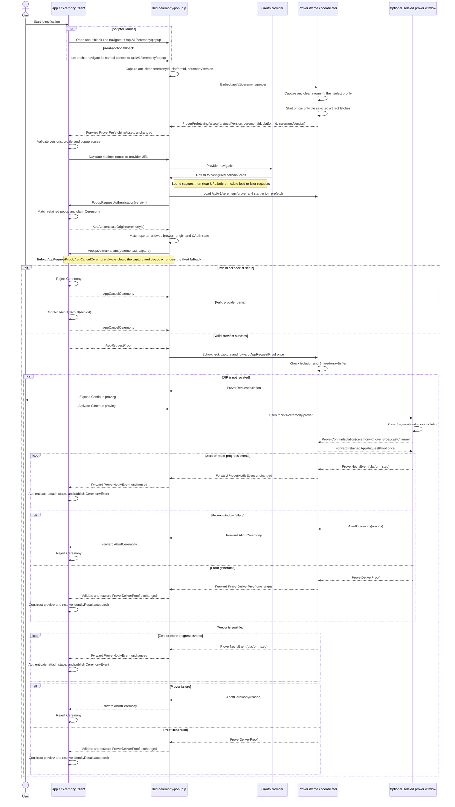

# `@libid/ceremony` architecture

`@libid/ceremony` runs an identity-proof ceremony in the browser. An
application supplies an operation to authorize; the package obtains and proves
platform identity evidence, then returns a locally checked identity preview and
the proof-bearing `OAuthProof` for a Consumer (the downstream proof verifier)
to verify.

This document defines the package boundary, application API, browser
entrypoints, routes, messages, lifecycle, and browser security policy. It is
implementation architecture, not part of the normative protocol specification.

The normative libID specification owns the proof statement and authorization
encoding. See the
[common ceremony rules](../../../specs/ceremony-common.md) and
[identity-platform ceremonies](../../../specs/platform-ceremonies.md)
for their exact content. This document otherwise stands alone;
application job storage and all post-ceremony effects are outside its scope.
Package acceptance requirements are indexed by [TEST_PLAN.md](TEST_PLAN.md).

The specification's **Ceremony Client** role maps to this package's closed
client, popup, prover, and platform implementation as a whole. Its
**Ceremony Popup** is `libid-ceremony-popup.js`. This architecture uses the
concrete component names below and defines no additional wrapper module or kind.

## System boundary

One ceremony turns an application-owned operation into a locally checked
identity preview and the exact proof-bearing `OAuthProof`:

```text
CeremonyClient.new inputs
    │
    ▼
application-side client ── OAuth ── libid-ceremony-popup.js ── libid-ceremony-prover.js
    │                                                   │
    └────────────────────── Identity ◀─────────────────┘
```

The ceremony owns authorization construction, OAuth, callback handling,
isolated proving, sanitized progress, proof delivery, and local evidence
validation. It does not own application jobs, wallet keys or policy,
Registry calls, connectors, transaction submission, finality, React UI, or a
server status service.

External-wallet and native libID wallet compositions use the same ceremony.
They encode their operation into opaque `transactionData` before the ceremony
and interpret it only after the ceremony returns `Identity`. A native wallet
may run key preparation before the ceremony and wallet confirmation afterward;
those sessions do not extend `PopupMessage`.

The application origin owns the durable operation record, called the Job. One
application-scoped `CeremonyClient` owns its live ceremonies, retained popups,
and the in-memory ceremony-ID routing table. The client, redirect, and prover
keep credentials, witnesses, and the generated proof only in memory. The
application origin is an authority boundary: it supplies the operation domain
and transaction data, so compromising it already permits authorizing a
different operation. The ceremony does not attempt to hide its transient OAuth
result from other scripts executing in that origin. If the application does
not assemble and commit the delivered result before the live channel is lost,
the ceremony restarts with fresh OAuth. Downstream application work may remain
resumable independently.

## Architecture drivers and decisions

### Execution contexts

The browser ceremony crosses four execution contexts with incompatible jobs.
DIP means `Document-Isolation-Policy`; COOP means
`Cross-Origin-Opener-Policy`. Both are HTTP response policies which application
JavaScript cannot add to an already loaded document.

| Context | Owns | Browser constraint |
|---|---|---|
| Application page | operation inputs, live `Ceremony`, durable application Job, final result commit | may be embedded into an application with its own headers and lifecycle; must retain the popup `WindowProxy` |
| Ceremony popup/callback | OAuth navigation and return, URL clearing, opener authentication, fixed progress UI | must remain top-level and non-isolated and preserve communication with the application opener; its callback alias is the registered server-hosted `redirect_uri` |
| Prover iframe or window | credentials after callback, notary sessions, witness construction, multithreaded proving | must be cross-origin isolated with `SharedArrayBuffer`; runs in a DIP-qualified iframe where available or a COOP-isolated top-level fallback |
| Prover service worker | artifact single flights and caches across navigation and proving placements | must share the prover origin and survive replacement of the prefetch document |

No single page can satisfy the interactive constraints. The OAuth popup must
preserve its cross-origin opener, while the prover must use isolation headers
which sever that opener when applied to a top-level document. OAuth also
returns by loading a registered server route, replacing the document that
started provider navigation. Multithreaded proving cannot be made a normal
function call in the application page because isolation is a response-level
property, not a library option.

### Why a popup protocol exists

The package provides the application-side client, but the popup and prover are
independent server-hosted documents emitted by that same package release. A
JavaScript heap, callback, or imported object cannot cross provider navigation,
document replacement, COOP isolation, or the iframe/window boundary. The
browser transports available across those boundaries are `postMessage` for
live opener and parent/child channels and a same-origin `BroadcastChannel` for
the optional prover window after COOP removes its opener.

`PopupMessage` is therefore an internal browser application binary interface
(ABI), not a remote product API or plugin system. Its closed records provide
the minimum information needed to:

- bind messages to the expected `WindowProxy`, browser-stamped origin, and live
  ceremony;
- return the OAuth capture only to the application which retained that
  ceremony;
- move proving input into whichever isolated placement the browser supports;
- relay advisory progress, cancellation, and proof delivery without sharing
  application storage or executable callbacks; and
- reject incompatible document releases before using credentials.

Collapsing the messages into ordinary library calls would require collapsing
the documents too, which would either lose OAuth opener continuity or lose the
isolation required by the prover. The protocol stays closed and package-owned
so that this necessary transport does not become an extension surface.

### Decision summary

| Decision | Constraint and rationale | Cost and revisit condition |
|---|---|---|
| Serve fixed popup and prover documents from the configured server | OAuth needs a registered callback document; isolation, Content Security Policy (CSP), allowed origins, and asset manifests are response properties | server must expose the documented routes; revisit only if browsers provide an authenticated callback and isolated-prover primitive without separate documents |
| Keep the popup non-isolated and isolate the prover separately | preserving the application opener conflicts with top-level COOP isolation | requires the Popup Protocol and a prover child; this is the core unavoidable complexity |
| Reuse one ceremony popup across launch, provider navigation, callback, and proving UI | preserves user activation, opener continuity, and one primary visible ceremony surface | navigation destroys popup memory, so the application retains ceremony state and reauthenticates the returned document |
| Prefer DIP iframe proving with a user-opened isolated-window fallback | DIP gives an isolated child without severing the popup; browser support is not universal | adds two package-internal placement messages and a **Continue proving** action; remove the fallback only after the supported browser matrix makes it unnecessary |
| Prefetch prover assets through a service worker during consent | proving assets are large and popup navigation destroys document-owned fetch state | adds cache orchestration; retain because the PoC showed material cold-start improvement |
| Keep ceremonies memory-only and one-shot | durable OAuth/proof recovery would add credential storage, replay, migration, and cleanup state | interruption before delivery repeats OAuth; add recovery only as a separately justified protocol revision |
| Use one closed message union and one `PopupProtocolVersion` | popup, coordinator, and fallback are one package-owned browser protocol | a breaking wire change increments one version; no per-message negotiation |

Future material decisions belong here with their constraint, consequence, and
concrete revisit condition. Exact mechanics belong in their owning reference
section.

## Browser topology and routes

```text
Application origin
  composition + @libid/ceremony/client
  durable Job and retained WindowProxy
              │ authenticated postMessage
              ▼
Configured server origin
  /api/v1/ceremony/popup and callback alias
    fixed URL-clearing bootstrap + libid-ceremony-popup.js
    non-isolated popup UI and controller
              ├─ top-level navigation ── OAuth provider (and back)
              │ bound parent/child postMessage
              ▼
  /api/v1/ceremony/prover
    libid-ceremony-prover.js + workers/WebAssembly (WASM)
    DIP iframe, or coordinator + COOP-isolated fallback window
              │ same-origin BroadcastChannel on fallback path
              ├─ platform/notary/JWK-set network defined by platform version
              └─ optional server-owned same-origin platform route
```

The deployed route surface is:

```text
GET  /api/v1/ceremony/config
GET  /api/v1/ceremony/popup
GET  {callbackPath}                 byte-identical popup alias; default /auth/v1/callback
GET  /api/v1/ceremony/prover
POST /api/v1/ceremony/github-token  server-provided when GitHub is enabled
```

`/api/v1/ceremony/popup` is the shared launch document. The configured
`redirectUri` path, defaulting to `/auth/v1/callback`, is its registered OAuth
callback alias: the server directly serves the same bytes and headers at both
paths rather than issuing an HTTP redirect. The popup document is top-level and
non-isolated so it can authenticate and communicate with the application
opener. `/api/v1/ceremony/prover` is the single prover document used first for
prefetch and later for proving. Neither route depends on application business
logic or stores ceremony state.
Prefetch adds no server route or response variant: both invocations receive the
same `/api/v1/ceremony/prover` HTML and the same immutable prover module. The
Window branch starts prefetch on load and begins proof execution only after a
valid `AppRequestProof`; no request parameter selects a mode.

The caller launches the popup through the scripted path or real-anchor fallback
defined under [client lifecycle](#client-lifecycle). Both paths preserve
`window.opener`; `noopener` and `noreferrer` are forbidden. Their launch
fragment contains only the ceremony ID, platform ID, and selected ceremony
version and is cleared before subresources or network activity. Both paths then
use the same prefetch, OAuth, callback, and proving protocol; presentation as a
window or tab is a browser choice, not a protocol mode.

After the provider callback, that redirect document creates one
`/api/v1/ceremony/prover` iframe which remains the prover coordinator for the
rest of its lifetime. The coordinator runs the prover itself when DIP gives it
isolation, or relays the same protocol to a top-level isolated prover window
opened by the user's **Continue proving** anchor.

The redirect never user-agent sniffs. It binds the coordinator through its
exact parent/child `WindowProxy` and browser-stamped origin. The fallback window
cannot rely on `window.opener` after COOP; it receives only the ceremony ID in
its initial fragment, clears it before other work, and connects to the
coordinator through a same-origin `BroadcastChannel` derived from that ID. The
ceremony ID routes the live same-origin channel; it is not a separate
confidentiality boundary.

The initial popup's prover iframe only starts prefetch. The callback popup's fresh
iframe coordinates proving: it proves in place under DIP or relays to the
isolated-window fallback. Both placements reuse the same worker-owned fetches
and caches; neither adds a server mode or durable state. See
[prefetch and shared caching](#prefetch-and-shared-caching) for fetching and the
[popup/prover channel](#popupprover-channel) for isolation, binding, and
forwarding.

## Flow at a glance

1. The initial popup starts selected-profile prefetch and identifies its package
   version, ceremony, platform, and source to the application.
2. The application navigates that retained popup through OAuth. The registered
   callback clears the returned URL before loading package code.
3. The returned popup signals only that OAuth returned. The application proves
   continuity by sending the ceremony ID back over the retained `WindowProxy`;
   only then does the popup release the captured result.
4. The application validates the platform return and either aborts or sends the
   closed proving input. The coordinator proves under DIP or binds the isolated
   fallback window.
5. Progress and the generated proof travel back over the same live path. The
   application assembles `OAuthProof`; no browser context persists a checkpoint.

The full branch and failure ordering appears in the
[end-to-end sequence](#end-to-end-sequence). The remaining sections define the
package and application APIs first, followed by the browser protocol, prover
internals, lifecycle behavior, response policy, and compatibility rules.

## Package composition

Launch publishes one `@libid/ceremony` package:

```text
@libid/ceremony
├── protocol    pure records, codecs, authorization, proof assembly, wire version
├── client      CeremonyConfig fetch, application-side API, and orchestration
├── popup       source entrypoint for libid-ceremony-popup.js
├── prover      source entrypoint for libid-ceremony-prover.js, workers, WASM, and prefetch
└── platforms   versioned browser OAuth, progress, witness, and proving modules
```

`protocol` is the pure leaf imported by the client, popup, prover, platform
implementations, and native-wallet confirmation. It performs no browser,
storage, network, or cryptographic proof-verification work. It owns the closed
`OAuthProof` construction and local evidence-validation helpers so the
application client and native wallet use the same implementation. `popup` and `prover` are build entrypoints, not
separately versioned packages. They emit `libid-ceremony-popup.js`,
`libid-ceremony-prover.js`, and immutable worker/WASM assets from one compatible
package release. The prover artifact runs in both Window and ServiceWorker
contexts: its Window branch runs prefetch, coordinates proving, and executes the
active prover placement, while its ServiceWorker branch owns the shared asset
single flight and cache.

Server implementations are outside the package. `platforms/github` implements
only the normative browser-side token request/response codecs and
validation; the integrating server implements the required confidential
endpoint.

The dependency direction is closed:

```text
ceremony/{client,popup,prover,platforms}
                     │
                     ▼
            ceremony/protocol

client ────────────────> ceremony
wallet ────────────────> ceremony/protocol
wallet-client ─────────> client + ceremony + wallet/protocol
```

`ceremony` never imports the client job store or either wallet composition.
The compositions adapt cancellation, progress projection, and the final
Identity commit around `proveUserIdentity()`. No generic plugin, caller-selected platform
module, validator, or finalizer exists.

The package-facing API surface is:

| Export or entrypoint | Contract |
|---|---|
| `@libid/ceremony/protocol` | closed records, exact codecs and validators, authorization and `OAuthProof` construction, local evidence decoding, and `PopupProtocolVersion` |
| `@libid/ceremony/client` | immutable supported/enabled platform discovery, application-scoped `CeremonyClient`, `CeremonyConfig` fetch, and stateful `Ceremony` orchestration |
| `@libid/ceremony/popup` | browser entrypoint which emits `libid-ceremony-popup.js` and exposes `startPopup(capture, allowedAppOrigins)` to the cleared redirect document |
| `@libid/ceremony/prover` | dual-context browser entrypoint which emits `libid-ceremony-prover.js`; its Window branch accepts the closed Popup Protocol and its ServiceWorker branch owns asset-prefetch single flights |

The API below and the Ceremony Popup Protocol records are the launch surface.
Implementation-private helpers may change without changing authority or wire
behavior.

## Application integration

### Client lifecycle

An application creates one client for one configured server:

```ts
import {
  createCeremonyClient,
  supportedPlatforms,
} from '@libid/ceremony/client'

const ceremonies = await createCeremonyClient({
  server: 'https://identity.example',
})
```

This is an application-owned instance, not a package-global singleton. Client
creation fetches and exact-validates `CeremonyConfig`; a configured platform is
enabled only when the installed package has a closed implementation and at
least one advertised ceremony version in common.
`supportedPlatforms` is an immutable `readonly PlatformId[]` derived
from that same closed implementation table. It contains every platform compiled
into the package release, exactly once, and has no mutable registration API.

The launch release's closed local version table is:

| Platform | Locally supported ceremony versions |
|---|---|
| `google` | `1` |
| `x` | `1` |
| `github` | `1` |

No other local ceremony version is supported. A platform is therefore enabled
at launch only when its validated `CeremonyConfig` entry advertises version `1`,
and every created Ceremony for that platform freezes version `1`.

The public catalog and client types are:

```ts
export type PlatformId = 'x' | 'github' | 'google'
export declare const supportedPlatforms: readonly PlatformId[]

interface CeremonyClient {
  readonly enabledPlatforms: readonly PlatformId[]
  new: (
    ceremonyId: string,
    input: {
      chainId: Uint8Array
      platformId: PlatformId
      operationDomain: Uint8Array
      transactionData: Uint8Array
    },
  ) => Promise<Ceremony>
}

const jobId = crypto.randomUUID()
const ceremony = await ceremonies.new(jobId, {
  chainId,
  platformId,
  operationDomain,
  transactionData,
})
```

`enabledPlatforms` is the immutable intersection of `supportedPlatforms` and
the exact platform keys in validated `CeremonyConfig` that have at least one
ceremony version in common with the installed implementation. Catalog order is
stable discovery order, not a product ranking; applications may present
another order. Neither array contains OAuth clients, ceremony versions, server
configuration, or display metadata.

The composition selects a Chain Profile and operation per ceremony and supplies
their exact 32-byte `chainId` and `operationDomain` hashes with bounded
`transactionData`. During `new`, the client exact-validates and copies both
hashes without deriving or interpreting them, then treats `transactionData` as
opaque. It requires the selected platform to be enabled by validated
`CeremonyConfig`, chooses the newest locally preferred ceremony version also
advertised for that platform, generates a fresh 32-byte authorization nonce,
computes the authorization digest, and freezes all of those values before
constructing OAuth or allowing provider navigation.

`CeremonyClient.new(ceremonyId, input)` accepts a plain string which must be a
lowercase UUIDv4. A composition normally generates one value and calls it
`jobId` in its Job API and `ceremonyId` in this API. The equality is a
composition invariant, not a shared branded type. The identifier is not chain
authorization, but its unpredictability and one-use handling provide browser
continuity: the initial popup discloses it to the initiating app, the
post-OAuth popup withholds it, and `AppAuthenticateOrigin` must return it.

`new` chooses the platform ceremony version, generates a fresh authorization
nonce, derives the code verifier by the normative Proof Key for Code Exchange
(PKCE) construction where required, and constructs the authorization request
with `state=ceremonyId`, registers that ID to this live `Ceremony`, and returns
only after its navigation data is ready. OAuth `state` is a provider-facing
serialization of `ceremonyId`, not a second identifier:

```ts
interface CeremonyNavigation {
  href: string   // /api/v1/ceremony/popup#launch(ceremonyId, platformId, ceremonyVersion)
  target: string
}

interface Ceremony {
  readonly navigation: CeremonyNavigation

  onEvent(listener: (event: CeremonyEvent) => void): () => void
  proveUserIdentity(options?: { expectedPopup: WindowProxy }): Promise<IdentityResult>
  cancel(): Promise<void>
}
```

The caller owns launch UI and invokes `window.open`; the ceremony package never
renders an anchor or chooses between launch paths. `navigation.target` is a
unique, non-reserved browsing-context name. The caller renders an
action-specific real anchor from `navigation.href` and `navigation.target`,
attempts `window.open('about:blank', navigation.target)` synchronously, and
prevents native navigation only if it receives a usable handle. It passes that
handle once as `expectedPopup`. If no handle is returned, it omits
`expectedPopup` and leaves the same activation's real-anchor navigation
untouched.

The scripted path is primary and PoC-qualified; the qualified mobile browsers
did not reject it. The real anchor is a hedge against an unqualified browser or
embedding policy returning `null`, not a claim that a launch target is known to
require it.

`expectedPopup` is a channel-authority input, not UI configuration. When
present, `proveUserIdentity()` immediately navigates that `WindowProxy` to
`navigation.href` and exact-matches the first popup message against it. When
absent, the package opens or navigates nothing; the real anchor reaches the
same URL and the client binds its browser-stamped `MessageEvent.source` after
matching `ProverPrefetchingAssets`'s ceremony ID, platform ID, and ceremony version
to the live Ceremony. Both paths then
retain the same source through OAuth. There is no nullable popup value or
mutable `setPopup` API.

```ts
function activate(event: MouseEvent) {
  const expectedPopup = window.open(
    'about:blank',
    ceremony.navigation.target,
  )
  if (expectedPopup) event.preventDefault()
  void ceremony.proveUserIdentity(
    expectedPopup ? { expectedPopup } : undefined,
  )
}
```

`proveUserIdentity()` parses the callback's OAuth `state` as a ceremony ID and
claims that ID once in its owning client's live map, sends the minimal proving
inputs, validates the provider return, performs exchange and proving,
constructs the non-authoritative identity preview and OAuth proof, and resolves
with an accepted `IdentityResult`. A valid ceremony-bound provider denial
resolves with a denied `IdentityResult`; popup closure, malformed return,
invalid proving input, isolation failure, and proving failure are ordinary
ceremony failures, not denial.

The Job is already committed before `proveUserIdentity()` and remains the
composition's current ceremony state while the call runs. Progress may update
its advisory projection, but no pre-proving authority CAS or ceremony callback
exists. The final composition-owned Job CAS is the authority boundary: if
cancellation, expiry, or another transition retired the Job, a late Identity
cannot commit.

`cancel()` is best-effort browser cleanup and is called only after the
composition retires its Job. Losing the application document loses the
in-memory ceremony map and therefore requires fresh OAuth, as already
required by the no-ceremony-recovery launch scope.

### Server configuration

The application server exposes public configuration at
`GET /api/v1/ceremony/config`:

```ts
type PlatformCeremonyVersion = number

interface PlatformConfig {
  clientId: string
  ceremonyVersions: readonly PlatformCeremonyVersion[]
}

interface CeremonyConfig {
  schema: 1
  redirectUri: string
  platforms: Partial<Record<PlatformId, PlatformConfig>>
}
```

The application-scoped client fetches this record once with native `fetch` and
validates it through `@libid/ceremony/protocol`; there is no configuration
module. The fetch requires an exact browser `Origin`. `redirectUri` is the
registered HTTPS URL on the configured server origin, with no credentials,
query, or fragment. Its path is deployment-configurable and defaults to
`/auth/v1/callback`; loopback development may use HTTP. Each platform entry
contains its public client ID and a nonempty, duplicate-free set of supported
ceremony versions. List order has no meaning: the client chooses the newest
version according to its closed local implementation table from the
intersection. Platform entries contain no credentials.

`allowedAppOrigins` is deployment configuration, not a public `CeremonyConfig`
field. The server uses the same canonical set for exact request-origin
Cross-Origin Resource Sharing (CORS) and embeds it into the byte-identical popup
document served at both `/api/v1/ceremony/popup` and the configured
`redirectUri` path. It is never derived from a request's `Origin` or `Referer`.

The client freezes the selected platform, ceremony version, client ID, and
redirect URI in the live Ceremony. `AppRequestProof` carries those values; the popup
applies its existing opener-origin validation and closed platform/version
dispatch without fetching configuration again.

## Result and lifecycle

```ts
interface Identity {
  oauthProof: OAuthProof
  platformId: PlatformId
  clientId: string
  userId: string
  handle: string
  metadataObservedAt: number
  authorizationDigest: Uint8Array
}

type IdentityResult =
  | { status: 'accepted'; identity: Identity }
  | { status: 'denied' }

```

`PlatformCeremonyVersion` is an unsigned 16-bit integer selected by the ceremony client
from the versions advertised in ceremony configuration, never by the caller. It
versions one platform's complete ceremony semantics: authorization-digest
construction, OAuth request and return handling, platform proof construction,
and assembly of the final `OAuthProof`. It does not version a chain, Registry,
or verifier contract; multiple chain-specific Consumers may accept the same
ceremony output.
`authorizationNonce` is exactly 32 cryptographically random bytes. For X and
GitHub it also supplies the secret input to PKCE and is not exposed before the
token exchange completes. Exact authorization encoding is delegated to the
normative ceremony specification.

`OAuthProof` is the exact closed normative record: proof, attestations, and the
public authorization fields the Consumer will verify. Its platform-specific
shape is not redefined here.
`@libid/ceremony/protocol`
checks that exact `OAuthProof` against the live Ceremony's retained
authorization fields, derives
the identity preview from locally validated platform evidence, enforces the
platform's canonical encodings and configured client, and
returns `Identity` with the same `OAuthProof`. The client constructs it from
those retained fields and the proof and attestations returned by the prover.
The ceremony exact-matches the
internal ceremony ID, platform, and recomputed authorization digest before
resolving `proveUserIdentity()`. `status: 'accepted'` means the selected parser
classified the capture as success and local checks succeeded; only Consumer
acceptance makes Identity authoritative. Callers cannot supply or override
Identity fields.

The live `Ceremony` privately retains its ID, copied operation inputs, selected
platform and ceremony version, authorization nonce and digest, OAuth client and
redirect, derived code verifier, and popup. A restart creates a fresh Ceremony
with a fresh nonce, digest, and verifier. After proof acceptance, the Job may
store the accepted `IdentityResult` and its public `OAuthProof` fields. Before
acceptance, no Job or IndexedDB index stores the authorization nonce or digest,
code verifier, provider credential, or private witness. No separate OAuth-state
value or pre-proof checkpoint is ever persisted.

The ceremony receives no action kind, job revision, chain RPC, Registry client,
wallet key, threshold, fee, connector, transaction submitter, database,
`CryptoKey`, or arbitrary callback. Its output contains the exact `OAuthProof`
but no credential, private witness, wallet signature, fee quote, or transaction
submission capability.

All records are exact-shape validated. `metadataObservedAt` is a nonnegative
safe integer; fractions, infinities, `NaN`, and overflow fail. Ceremony IDs are
lowercase RFC 4122 UUIDv4 values generated with `crypto.randomUUID()` and are
serialized unchanged as OAuth `state`. The code verifier is derived by the
normative PKCE construction. Derived hashes are exact 32-byte `Uint8Array`
values. Unknown fields, aliases, coercions, and
noncanonical encodings fail before use.

## Ceremony Popup Protocol

`PopupMessage` is the closed internal browser protocol between the application,
ceremony popup, and prover placements. It carries one ceremony through launch,
OAuth return, opener authentication, proving, and delivery because those steps
cross independent documents and cannot share library calls or memory. The
[architecture drivers](#why-a-popup-protocol-exists) explain why these browser
boundaries exist; this section defines their ordered messages.

A message name starts with the component which creates it: `App`, `Popup`, or
`Prover`, followed by its action. Intermediaries forward a message unchanged, so
the prefix records its original creator rather than its latest transport hop.
`AbortCeremony` is the sole origin-prefix exception because popup and prover
share the same upstream technical-failure contract.

Every receiver exact-validates message shape, direction, source, origin, and
current phase. Unknown, replayed, out-of-order, or post-terminal messages change
no state. The protocol has no caller-defined message, extension point, or
negotiated capability.

### Protocol version

```ts
type PopupProtocolVersion = 1
```

`PopupProtocolVersion` versions the complete `PopupMessage` union shared by the
application/popup and popup/prover boundaries. The initial and returned
ceremony popup carries the version in its first application-facing message. The
client validates it before OAuth and again after return; it does not echo or
negotiate a version. The package-internal popup/prover boundary introduces no
second version exchange.

### Launch and prover prefetch

```ts
interface ProverPrefetchingAssets {
  popupProtocolVersion: PopupProtocolVersion
  type: 'prover-prefetching-assets'
  ceremonyId: string
  platformId: PlatformId
  platformCeremonyVersion: PlatformCeremonyVersion
}
```

On initial launch, the popup exact-validates and clears its fragment's ceremony
ID, platform ID, and ceremony version, then loads
`/api/v1/ceremony/prover#prefetch(ceremonyId, platformId,
platformCeremonyVersion)`. The child clears that fragment, resolves the exact
profile, and asks the service worker to start or join only those artifact
fetches. It returns `ProverPrefetchingAssets` after the single flights exist or
the bounded prefetch attempt is unavailable; it does not wait for downloads to
finish. The popup accepts the message only from its exact child and forwards it
unchanged to `window.opener` using only server-embedded allowed origins. A
missing or invalid profile or silent child fails before OAuth; ordinary cache
or fetch failure continues on the cold proving path.

The application accepts `ProverPrefetchingAssets` only from the configured
server origin with its live ceremony ID, platform, version, and expected source. A
scripted launch exact-matches the supplied `WindowProxy`; a real-anchor launch
binds the matching message source. The client validates the protocol version,
retains that source, and navigates it to the frozen provider authorization URL.
Prefetch requires no opener reply because it handles only public assets.

### Callback and opener authentication

```ts
interface PopupRequestAuthentication {
  popupProtocolVersion: PopupProtocolVersion
  type: 'popup-request-authentication'
}

interface AppAuthenticateOrigin {
  type: 'app-authenticate-origin'
  ceremonyId: string
}

interface OAuthRedirectCapture {
  query: string
  fragment: string
}

interface PopupDeliverParams {
  type: 'popup-deliver-params'
  ceremonyId: string
  capture: OAuthRedirectCapture
}
```

The popup clears the provider callback URL before parsing it. An absent,
malformed, or duplicate OAuth `state` changes no live state and produces no
application message. After extracting exactly one syntactically valid state,
the callback popup sends `PopupRequestAuthentication`. It asks the
retained application to prove continuity before the popup releases the captured
redirect; it exposes neither the ceremony ID nor that capture and does not
classify approval, denial, or malformed platform fields. The client
accepts it only from the retained popup source at the configured server origin
and expected protocol version, then returns its retained ceremony ID in
`AppAuthenticateOrigin`.

The popup accepts `AppAuthenticateOrigin` only from `window.opener`, requires
the browser-stamped origin to be allowed, and exact-matches the supplied
ceremony ID to the captured OAuth state. Only then does it return the unchanged
bounded query and fragment in `PopupDeliverParams` to that exact source
and origin. The message has no origin or version field: the browser supplies the
origin, and the client already validated the returned popup's version. A
different allowed application occupying the opener receives neither the
ceremony ID nor the redirect capture. No callback-time binding record or
storage is needed.

If no valid `AppAuthenticateOrigin` arrives within
`REDIRECT_OPENER_TIMEOUT_MS = 30_000`, the popup clears its in-memory capture,
severs the opener, and renders the same fixed unapproved-application result as
an invalid opener origin. It renders no callback value and performs no
navigation with it.

### OAuth classification and proof dispatch

```ts
interface AppRequestProof {
  type: 'app-request-proof'
  ceremonyId: string
  platformId: PlatformId
  platformCeremonyVersion: PlatformCeremonyVersion
  clientId: string
  redirectUri: string
  capture: OAuthRedirectCapture
  codeVerifier: string | null
}
```

The application-scoped client selects the live `Ceremony` from the authenticated
`PopupDeliverParams`; it does not query IndexedDB or reveal the ID to
the composition. An unknown, stale, replayed, or post-reload ceremony ID changes
no live state and causes cleanup through `AppCancelCeremony`. Otherwise the client
atomically claims the state and uses that Ceremony's platform/version parser to
exact-validate the capture's transport and fields.

A malformed or mismatched result rejects the Ceremony. A valid provider denial
resolves `{ status: 'denied' }`. Both paths send `AppCancelCeremony` for popup cleanup.
A valid acceptance constructs `AppRequestProof` from the live ceremony ID,
selected platform/version, frozen client and redirect, derived code verifier, and
unchanged capture. The application origin is trusted for this transient input;
the protocol does not try to hide it from other scripts executing in that
origin.

The popup byte-matches the echoed capture to its retained capture, validates the
closed platform/version and PKCE shape, and forwards the exact
`AppRequestProof` once to its coordinator iframe. The claimed client entry, one-shot Ceremony, and
popup state machine prevent duplicate proving. The composition's final Job CAS
prevents a late result from producing an application effect. No separate OAuth
state, job revision, composition discriminator, wallet state, or connector
crosses this protocol.

### Isolated prover-window fallback

```ts
interface ProverRequestIsolation {
  type: 'prover-request-isolation'
}

interface ProverConfirmIsolation {
  type: 'prover-confirm-isolation'
  ceremonyId: string
}
```

These messages remain package-internal. The coordinator iframe and fallback
window are two placements of the same prover implementation, not different
prover roles. A coordinator which cannot prove in its DIP iframe sends
`ProverRequestIsolation`; the popup exposes the user-opened
fallback action. The resulting COOP-isolated window sends
`ProverConfirmIsolation` over the ceremony-scoped same-origin channel. The
coordinator exact-matches the ceremony ID before forwarding its retained
`AppRequestProof` once. Neither message crosses the application boundary or
changes the Ceremony result. Prefetch selection remains document bootstrap
data, not a protocol message.

### Progress and proof delivery

```ts
interface ProverNotifyEvent {
  type: 'prover-notify-event'
  ceremonyId: string
  platformStep: PlatformStep
  timestamp: number
}

interface ProverDeliverProof {
  type: 'prover-deliver-proof'
  ceremonyId: string
  proof: Uint8Array
  attestations: readonly Uint8Array[]
}
```

After `AppRequestProof`, the active prover sends zero or more bounded
`ProverNotifyEvent` records followed by one `ProverDeliverProof`, unless the run
aborts. The coordinator and popup validate and forward them without adding
proof or application state. Progress is advisory; delivery contains only the
generated proof and attestations needed for application-side `OAuthProof`
assembly. Their detailed semantics are defined under
[progress, cancellation, and recovery](#progress-cancellation-and-recovery) and
the [popup/prover channel](#popupprover-channel).

### Cancellation and technical failure

```ts
interface AppCancelCeremony {
  type: 'app-cancel-ceremony'
}

interface AbortCeremony {
  type: 'abort-ceremony'
  reason: string
}
```

`AppCancelCeremony` is the parameterless downstream command used when the
application no longer wants the ceremony to continue, including explicit cancellation,
provider denial, invalid callback classification, or retired Job authority.
Before `AppRequestProof`, the popup clears its capture and attempts to close,
rendering one fixed fallback if closing fails. Afterwards it also cancels
reachable proving work.

`AbortCeremony` is the upstream technical-failure message created by the popup
or prover. Its `reason` is a sanitized diagnostic string, not a stable
machine-readable code or raw exception. The application rejects the live
Ceremony for every `AbortCeremony`. A closed reason enum may replace the string
once implementation experience identifies stable, actionable failure
categories; launch does not guess them in advance. Neither message carries a
ceremony ID, acknowledgement, or response. Context loss may produce neither
message.

### Closed message union

```ts
type PopupMessage =
  | ProverPrefetchingAssets
  | PopupRequestAuthentication
  | AppAuthenticateOrigin
  | PopupDeliverParams
  | AppRequestProof
  | AppCancelCeremony
  | ProverRequestIsolation
  | ProverConfirmIsolation
  | ProverNotifyEvent
  | ProverDeliverProof
  | AbortCeremony
```

### End-to-end sequence



An implementation executes only one launch path per ceremony.

`ProverDeliverProof` has no acknowledgement or ceremony-side checkpoint;
successful assembly and local evidence validation resolve `proveUserIdentity()` with an accepted
`IdentityResult`.
External-wallet submission and native-wallet confirmation begin only after the
application commits its composition-owned successor. Only Consumer acceptance
makes the proof authoritative.

### Redirect ingress

The same fixed popup response is served at `/api/v1/ceremony/popup` for the
initial shared launch and at the configured callback alias, default
`/auth/v1/callback`, for OAuth success, provider denial, malformed input, and
unknown state. The alias is not an HTTP redirect.
The response contains no
request-derived HTML, header, script URL, origin, platform, or mode.

Its fixed inline bootstrap bounds the combined raw query and fragment to
`MAX_OAUTH_REDIRECT_BYTES = 32 KiB`, copies them into lexical memory, clears
both with `history.replaceState`, and only then integrity-loads
`libid-ceremony-popup.js` and calls:

```ts
declare function startPopup(
  capture: OAuthRedirectCapture,
  allowedAppOrigins: readonly string[],
): void

startPopup(capture, allowedAppOrigins)
```

An empty query plus the closed launch fragment containing ceremony ID, platform
ID, and ceremony version is the initial shared launch. Provider callbacks
instead carry their platform's closed query/fragment grammar, including only
the same ceremony ID as OAuth `state`. The
bootstrap clears even malformed or oversized input before rendering. It performs no
parsing, storage, network request, dynamic rendering, or error reporting before
clearing. `startPopup` exact-validates and freezes the nonempty embedded list of
canonical origins before using it; the list is deployment-generated and never
comes from request `Origin`, `Referer`, query, fragment, or a client message.
Redirect servers suppress query strings in access logs, traces, analytics, and
errors.

`OAuthRedirectCapture.query` and `.fragment` are the exact captured
`location.search` and `location.hash` strings, including a leading delimiter
when nonempty. After loading, the popup extracts the single routing state,
authenticates the opener through `AppAuthenticateOrigin`, and exact-validates the returned
`AppRequestProof` ID, platform, ceremony version, client ID, redirect URI, unchanged
capture, and PKCE shape before using the credential.
The application client's selected platform/version parser classifies the
capture. It rejects a Google ID Token at or after its signed `exp`; mutable
X/GitHub proof lifetimes are enforced only by the Platform Verifier. Google
accepts a nonempty fragment and empty query; X and GitHub accept a nonempty
query and empty fragment.

An unsupported or invalid input discovered after `AppRequestProof`
clears the return, sends popup-to-application `AbortCeremony(reason)`, and renders
**Application updated—return and try again**. An unknown or stale ceremony does
not send `AppAuthenticateOrigin`; an authenticated capture rejected by the
selected platform/version parser makes the application send `AppCancelCeremony`. The
popup clears the result, attempts to close, and renders one fixed fallback
message if closing fails. A wrong opener origin, authentication timeout, or
redirect capture without a valid bounded ceremony ID sends no callback value.

### Popup/prover channel

The popup/prover boundary reuses the closed `PopupMessage` union. The ceremony
popup always forwards the application's exact `AppRequestProof` once to its
coordinator iframe. On receipt, the coordinator checks isolation and
shared-memory availability before any credential-bearing network request. Its
bounded `capture` preserves the provider-returned query
and fragment unchanged; `platformId` and `platformCeremonyVersion` select its
exact parser and implementation. `codeVerifier` is null for Google and the already-derived 43-character PKCE
verifier for X and GitHub. `clientId` and `redirectUri` are the values frozen by
the Ceremony Client from its validated `CeremonyConfig`. The ceremony popup,
coordinator, and active fallback window exact-validate the record where they
receive it. Client classification and prover credential
extraction use the same closed platform/version parser; the prover admits no
second interpretation of the capture.

When qualified, the coordinator proves in place. Otherwise it retains
`AppRequestProof` in memory and sends `ProverRequestIsolation` only to its exact
parent. The ceremony popup renders the real **Continue proving** anchor and
opens no window without that user activation. The top-level `/api/v1/ceremony/prover`
window clears its ceremony-ID fragment, validates isolation and shared memory,
then sends `ProverConfirmIsolation(ceremonyId)` over the scoped
`BroadcastChannel`. The coordinator exact-matches that ID and forwards its
retained `AppRequestProof` once. Unknown, stale, duplicate, pre-request, or wrong-ID
readiness changes no state. Before isolation confirmation, the only other
accepted window message is `AbortCeremony(reason)`, reporting that the top-level
document could not qualify;
the coordinator forwards it upstream as a terminal technical failure.

The prover does not receive the expected Authorization Digest. Google exposes
the signed token nonce as a proof public input; X and GitHub expose the
attested code verifier. The Consumer verification path matches that binding to
the Authorization Digest it recomputes from the OAuth proof.

After `AppRequestProof`, the active proving placement sends zero or more
`ProverNotifyEvent` records followed by exactly one `ProverDeliverProof`. The
application may instead send parameterless `AppCancelCeremony` downstream. The
popup and coordinator forward it to cancel reachable proving work. Either active
prover may send `AbortCeremony(reason)` upstream for terminal technical failure.
The coordinator validates and forwards window events, delivery, and
`AbortCeremony` unchanged to the ceremony popup, which forwards them to the application.
Context loss may produce no terminal message. Unknown fields or types, invalid
order, messages after terminal, and messages outside the bound channel change
no state.

The one-shot channel scopes every message to one ceremony. `AppRequestProof` and proof
delivery carry the ceremony ID; `AppCancelCeremony` and `AbortCeremony` do not
duplicate it. The DIP path binds
the exact parent/child `WindowProxy` and browser-stamped origin. The fallback
window uses the cleared ceremony-ID fragment only to derive its same-origin
`BroadcastChannel` with the coordinator. All browser boundaries share
`PopupProtocolVersion`; no
second protocol or version exists.

The prover performs the selected version's exchange, notarization, witness
construction, and proof generation. It returns only the bounded generated
proof and attestations through `ProverDeliverProof`; it does not receive the
operation domain, chain ID, transaction data, or authorization nonce, and it
does not assemble or verify `OAuthProof` or
construct `Identity`. The application client combines the returned proof and
attestations with its retained ceremony fields, assembles the exact normative
`OAuthProof`, and derives a locally checked but non-authoritative preview. For
GitHub, the prover—not the
popup—calls the fixed same-origin token route, verifies its response, and then
performs the dependent `/user` notarization. `platforms/github` implements the normative
`TokenRequest` and `TokenResponse` codecs; the platform
specification owns their exact shape and proof semantics.

Neither placement persists credential-bearing state. Inputs and workers are
cleared after proof delivery, AbortCeremony, failure, or context destruction.

## Prover implementation

The prover selects one closed platform/version pipeline. Each pipeline consumes
the immutable release artifacts defined under
[deployment assets and shared toolchain](#deployment-assets-and-shared-toolchain),
then returns only the proof and attestations required by the application-side
assembly.

### Platform pipelines

The platform modules own witness construction and orchestration; the circuit
repository owns the exact proof relation and ABI. Launch uses these artifacts:

| Profile | Circuit | Returned attestations |
|---|---|---|
| `google/v1` | [`oidc-google`](https://github.com/libid-org/libid-circuits/blob/91bc3446eeaa50ab2056d88dd9941374aa4fa34c/circuits/oidc-google/src/main.nr) | none |
| `x/v1` | [`bearer-link`](https://github.com/libid-org/libid-circuits/blob/91bc3446eeaa50ab2056d88dd9941374aa4fa34c/circuits/bearer-link/src/main.nr) | token, identity |
| `github/v1` | the same `bearer-link` artifact | token exchange, identity |

Those links pin the current launch source snapshot. Deployment consumes the
matching compiled Abstract Circuit Intermediate Representation (ACIR), circuit
ABI, and manifest from a
[`libid-circuits` release](https://github.com/libid-org/libid-circuits/releases),
not source or an application-selected URL. A profile is available when the
ceremony package and its matching circuit release are deployed. Whether a
chain-specific Consumer accepts the resulting `OAuthProof` is independent.

All three pipelines use one proving engine. The platform module builds the
closed Noir input map, the Noir ACIR virtual machine (ACVM) runtime solves the
witness, and the circuit-compatible
[Aztec bb.js](https://github.com/AztecProtocol/aztec-packages/tree/v5.2.0/barretenberg/ts/bb.js)
release generates an UltraHonk proof. bb.js returns raw proof bytes and an
ordered flat array of field-valued public inputs inside the prover. The prover
discards that internal array after generation and returns only the proof and
attestations. The Consumer verification path reconstructs the exact public
inputs from the OAuth proof's authenticated fields and attestations; the
browser does not duplicate the circuit ABI or verify the generated proof.

X and GitHub additionally use the browser TLSNotary bundle built by the
[`libid-org/notary` build script](https://github.com/libid-org/notary/blob/e0ce1f1e0bedcde54740d1af70d4eaf9b439a9fb/scripts/build-tlsn-wasm.sh)
and published in [`libid-org/notary` releases](https://github.com/libid-org/notary/releases).
That release contains the JavaScript wrapper, WASM, and worker bootstrap. The
profile's `notarization-client-wasm` entry selects its heavy WASM member; the
wrapper and worker bootstrap remain immutable dependencies of the prover root
module. Neither an application nor `AppRequestProof` selects a notary, circuit, or
bb.js version.

#### Google

`platforms/google` receives the captured ID Token and frozen client identifier.
It obtains the JSON Web Key (JWK) selected by the token's `kid` from Google's
JSON Web Key Set (JWKS) endpoint and constructs the `oidc_google` input map:

- private witness: JSON Web Token (JWT) signing input and payload bytes with
  their lengths, checked-claim offsets and lengths, raw email/`sub`/`aud` bytes,
  RSA signature, and the RSA reduction witness;
- public inputs, in circuit order: 32 authorization-digest bytes, two fields
  containing `SHA256(aud)`, one packed `sub` field, two packed email fields,
  `exp`, and eighteen RSA-modulus limbs.

The semantic groups flatten to exactly 56 bb.js public-input fields. The module
derives the candidate authorization digest from the signed nonce; the circuit
re-encodes it as the exact unpadded base64url nonce and verifies the RS256
signature and signed claims. The module then generates one proof and returns it
with an empty attestation list. The Ceremony Client derives the local identity
preview and OAuth-proof fields from its retained ID Token, frozen client
identifier, and the JWK selected by `kid`; only Consumer verification makes
them authoritative.

#### X

`platforms/x` performs two browser-owned TLSNotary Proxy sessions:

1. Notarize the fixed `/2/oauth2/token` exchange using the captured code,
   derived code verifier, frozen redirect URI, and client identifier. Reveal
   the profile-owned request and delimiter ranges and commit the returned bearer.
2. Use that bearer in the fixed `/2/users/me` request. Reveal the complete
   request framing around its committed bearer plus the identity response's
   canonical `id` and `username` ranges.
3. Build the shared `bearer-link` witness from the private bearer, its length,
   and the two independent 16-byte TLSNotary blinders, then generate the proof.

The token and identity TLS setup may overlap, but the identity request waits for
the token exchange to produce the bearer. The circuit constrains the bearer to
nonempty printable ASCII of at most 128 bytes and exposes exactly the two
32-byte bearer commitments, token first and identity second; Noir flattens them
to 64 bb.js public-input fields. Delivery contains only the proof and the two
attestations in the same token/identity order. Identity fields and the
authorization digest are authenticated by the attestations and Platform
Verifier, not duplicated as circuit outputs.

#### GitHub

`platforms/github` first sends the captured code and derived verifier to the
fixed server token-exchange route. The server uses its confidential client
secret, performs the token-exchange TLSNotary session, and returns the bounded
access token, token attestation, and `bearerBlinder`: the canonical unpadded
base64url encoding of the token session's exact 16-byte TLSNotary blinder. The
browser validates that response and blinder before using the
bearer in its own fixed `/user` TLSNotary session, which commits the bearer and
reveals the canonical `id` and `login` ranges.

The module then runs the same `bearer-link` circuit with the token-exchange and
identity blinders. Its public-input count and order are identical to X: 64
fields representing token commitment then identity commitment. Delivery
contains only the proof and the two attestations in token-exchange/identity
order.
GitHub-specific server exchange and transcript construction therefore remain
platform code; no GitHub-specific proving circuit or proving engine exists.

### Platform-specific progress

Each profile emits this closed, ordered sequence after `AppRequestProof`. The common
stage and event envelope are defined under
[progress, cancellation, and recovery](#progress-cancellation-and-recovery).

| Profile | Platform-step codes |
|---|---|
| `google/v1` | `prover-readiness` → `token-decoding` → `signing-key-fetch` → `signing-key-selection` → `circuit-inputs` → `witness` → `proof` |
| `x/v1` | `prover-readiness` → `notary-initialization` → `token-session` → `token-attestation` → `identity-session` → `identity-attestation` → `circuit-inputs` → `witness` → `proof` |
| `github/v1` | `prover-readiness` → `token-exchange-request` → `token-exchange-validation` → `notary-initialization` → `identity-session` → `identity-attestation` → `circuit-inputs` → `witness` → `proof` |

`prover-readiness` covers awaiting the selected artifact single flights after
`AppRequestProof`; those downloads may already have started during prefetch. Google
then decodes the ID Token, fetches and selects its JWK, and constructs the
closed circuit inputs. X exposes initialization of the browser notary client,
each notarized session, and each resulting attestation separately. GitHub
exposes the start of its one server request and local validation of the complete
response, but no fictional server-internal progress; its browser-owned identity
session remains separate. `circuit-inputs` ends when the complete closed Noir
input map exists, `witness` covers ACVM execution and constraint solving, and
`proof` covers bb.js proof generation.

For each code, the platform module emits `started`, followed by `completed`
before starting the next code or `failed` immediately before AbortCeremony. A cache hit
still emits the same sequence. OAuth, isolation, delivery, and preview
construction are represented elsewhere and do not add platform steps.

### Deployment assets and shared toolchain

Only libID-owned prover release assets are deployment data embedded into
`/api/v1/ceremony/prover`, not frontend `CeremonyConfig` or ceremony input:

```ts
type ProverArtifactKind =
  | 'notarization-client-wasm'
  | 'circuit'

interface ProverArtifact {
  kind: ProverArtifactKind
  url: string
}

interface ProverProfile {
  platformId: PlatformId
  platformCeremonyVersion: PlatformCeremonyVersion
  artifacts: readonly ProverArtifact[]
}

interface ProverAssets {
  profiles: readonly ProverProfile[]
}
```

The server generates each `/api/v1/ceremony/prover` document with one exact, validated
`ProverAssets` value containing only circuit and notarization-client release
locations. Its bootstrap passes that value and its already-cleared
closed fragment input to the imported prover entrypoint. This is the prover-side equivalent of embedding
`allowedAppOrigins` into the popup document: request values cannot add or replace
a profile or URL, and the prover never fetches
`CeremonyConfig`. The document contains every still-supported deployed profile,
but a ceremony fetches only its selected platform/version profile.

The ceremony package pins the compatible Noir and bb.js dependencies in code.
Their JavaScript is part of the prover build; whether the build emits one
`libid-ceremony-prover.js` file or immutable companion chunks is not deployment
configuration. The build likewise owns every toolchain worker, WASM, and common
reference string (CRS) location. A deployer cannot replace those dependencies
through `ProverAssets`.

Each closed platform/version module pins its circuit release. The ceremony
package pins one launch-wide structured reference string size,
`SRS_SIZE = 2 ** 18`; SRS size is code, not deployment data:

| Profile | Configurable libID assets | Measured circuit size | Pinned BN254 SRS size |
|---|---|---:|---:|
| `x/v1` | shared notarization-client WASM and `bearer-link` circuit descriptor | 42,006 | 262,144 (2^18) points |
| `github/v1` | the same two shared artifacts as X | 42,006 | 262,144 (2^18) points |
| `google/v1` | `oidc_google` circuit descriptor | 179,443 | 262,144 (2^18) points |

The pinned current-circuit heavy-resource subtotal is:

| Profile | Non-CRS artifact bodies | Pinned CRS bodies | Known heavy subtotal |
|---|---:|---:|---:|
| `google/v1` | 8,092,815 bytes (7.72 MiB) | 12,583,040 bytes (12.00 MiB) | 20,675,855 bytes (19.72 MiB) |
| `x/v1` or `github/v1` | 24,683,695 bytes (23.54 MiB) | 12,583,040 bytes (12.00 MiB) | 37,266,735 bytes (35.54 MiB) |

These exact resource-body counts use the compatible tuple Nargo
`1.0.0-beta.25`, native bb `5.2.0`, and bb.js `5.2.0`, as recorded by
[`libid-circuits v0.3.0`](https://github.com/libid-org/libid-circuits/releases/tag/v0.3.0),
whose target is the source commit pinned below. `oidc_google.json` is 1,312,738
bytes and `bearer_link.json` is 171,956 bytes. The pinned bb.js
`barretenberg-threads.wasm.gz` is 3,071,085 bytes. The pinned Noir runtime adds
3,049,596 bytes of `acvm_js_bg.wasm` and 659,396 bytes of
`noirc_abi_wasm_bg.wasm`; every profile shares these code-owned build assets.
The [`libid-org/notary v0.2.0`](https://github.com/libid-org/notary/releases/tag/v0.2.0)
browser bundle contains a 17,731,662-byte `tlsn_wasm_bg.wasm`; commits between
that tag and the source link below do not change the bundle.

The circuit release's pinned `bb gates -t evm` produces the measured sizes in
the table, but gate count alone does not determine the deployable SRS floor.
bb.js 5.2 requires compressed SRS input to be a positive multiple of its 4 MiB
verification chunk, so `bearer_link` fails at its mathematical 2^16 ceiling and
has a qualified 2^17 minimum; `oidc_google` requires 2^18. Launch deliberately
uses 2^18 for every profile so one download serves users who link multiple
platforms. This costs X/GitHub-only users 4 MiB and removes per-platform SRS
selection and later cache upgrades. The policy may split if measurements show
that cost matters; doing so does not change `PlatformCeremonyVersion` while the
proof statement and output remain identical. The CRS column is therefore the shared compressed BN254
G1 prefix at 32 bytes per point, the shared 2^16-point Grumpkin G1 data at 64
bytes per point, and 128 bytes of BN254 G2 data. These constants are identical
on every browser; libID does not inherit
bb.js's generic 2^20 desktop and 2^18 iOS defaults. Circuit release tooling
qualifies the same values with the pinned browser prover and records them in
release metadata so a circuit or bb.js change cannot silently retain an
undersized platform constant; encoding the
size in artifact filenames is optional and carries no additional authority.

The first ceremony downloads the one shared SRS set. A later ceremony for any
platform reuses it and fetches only missing profile assets. X/GitHub after
Google fetches 17,903,618 bytes of notary WASM and the bearer circuit; Google
after X/GitHub fetches only its 1,312,738-byte circuit.

The counts are before HTTP content encoding and exclude HTML, the root and
worker JavaScript graph, headers, OAuth/notary traffic, and attestations. They
are therefore reproducible heavy-resource subtotals, not a promise about total
transferred bytes. The JavaScript graph does not exist yet and must publish its
own measured size when built.

Importing bb.js or fetching its prover WASM does not fetch the CRS. bb.js loads
the CRS only while initializing `Barretenberg.new()`, before
`generateProof()`. Prefetch starts that network work explicitly without creating
the prover backend: the module service worker calls the browser exports
`Crs.new(SRS_SIZE)` and `GrumpkinCrs.new(2 ** 16)` under its
extended worker event. Those loaders use bb.js's own fixed CRS endpoints and
IndexedDB cache. A later prover waits for that worker-owned attempt, then
`Barretenberg.new({ srsSize: SRS_SIZE })` reads the same cache.
Navigation can destroy the prefetch iframe without owning or restarting the
download.

The pinned bb.js 5.2.0 browser build owns the downloader, compressed 32-byte G1
format, and [`srsSize` constructor option](https://github.com/AztecProtocol/aztec-packages/pull/23419).
The selected build also includes [Aztec #25290](https://github.com/AztecProtocol/aztec-packages/pull/25290),
which persists the compressed download so `Crs.new()` alone is durable. That
fix changes cache behavior, not the resource-body counts above. The compatible
Nargo compiler, native `bb` used to produce the verification key and verifier,
and `bb.js` prover remain one circuit release and verifier rollout. The shared
size prevents a later platform from expanding and refetching the cache.
The selected bb.js bytes also fix its primary and fallback CRS origins, which
are the only CRS origins admitted by the prover response policy.

Deployment selects the closed platform/version and embeds only its circuit and
notarization-client URLs. Platform-version code pins the expected digest for
each libID artifact. Noir and bb.js code, workers, WASM, CRS locations, and the
shared SRS size likewise remain closed ceremony-build constants. The deployment neither
computes nor configures them and does not copy, slice, or reimplement the CRS
downloader.

Shared deployment entries use the same immutable URL. Platform modules define
each ceremony version's exact artifact kinds and digests, then reject missing,
duplicate, or additional entries and any URL mapped to conflicting kinds
before fetching. Canonical-URL single flights and the separate CRS cache are
defined under [prefetch and shared caching](#prefetch-and-shared-caching).

`/api/v1/ceremony/prover` has three closed fragment forms. The bootstrap copies and clears
the fragment before importing the root module or using storage or the network:

- `prefetch(ceremonyId, platformId, ceremonyVersion)` creates the prefetch iframe;
- an empty fragment creates the returned-callback coordinator iframe; and
- a bare ceremony ID creates the top-level fallback prover window.

These are document bootstrap roles, not server request variants or popup
messages. The fragment never contains an asset URL. The same HTML, headers,
embedded manifest, and root module are served in all three cases.

## Progress, cancellation, and recovery

```ts
type CeremonyStage =
  | 'authorization'
  | 'oauth-validation'
  | 'prover-activation'
  | 'proof-generation'

interface PlatformStep {
  code: string
  status: 'started' | 'completed' | 'failed'
}

interface CeremonyEvent {
  stage: CeremonyStage
  platformStep: PlatformStep | null
  timestamp: number
}
```

The application-side `Ceremony` client owns the common stage. It enters
`authorization` when `proveUserIdentity()` starts, `oauth-validation` when an
authenticated `PopupDeliverParams` selects the live Ceremony,
`prover-activation` only while the popup waits for the fallback **Continue
proving** activation, and `proof-generation` when proving starts. Immediate
`Identity` construction completes `proof-generation`; it is not a separate
progress stage. The popup reports
its two prover lifecycle transitions over the authenticated channel, and the
client confirms them before publishing them.

Each platform-ceremony-version module defines only its steps beside the code
which performs them and emits `started` followed by exactly one `completed` or
`failed`. It cannot select a common stage. The prover validates only the bounded
string and status shape, stamps `timestamp` as non-negative safe-integer Unix
milliseconds, and sends both in `ProverNotifyEvent`; the message contains no
common stage. A fallback window sends that
exact message through the coordinator, and the ceremony popup forwards it
unchanged. The client accepts it only from the authenticated live ceremony
while its local common stage is `proof-generation`, validates and preserves the
prover timestamp, and publishes the resulting `CeremonyEvent`. Locally generated
common-stage events use client timestamps. The client otherwise does not
interpret the platform catalog. Neither
event contains operation inputs, outputs,
credentials, identities, witnesses, proofs, raw exceptions, or raw service
errors. The application may map this advisory view into its broader job
progress; later confirmation, submission, and finality never enter the
Ceremony Popup Protocol.

`CeremonyEvent` carries only advisory progress. OAuth denial is returned only
through `proveUserIdentity()`; acceptance proceeds to `AppRequestProof`.

The coordinator/window same-origin `BroadcastChannel` supplies routing inside
the trusted deployment, not separate sender authentication, durable state, or
proof authority. A same-origin `AppCancelCeremony` can stop only the current run; it
cannot produce Identity or any later application effect. Missing, duplicated,
or reordered progress affects only UI. The visible prover remains the fallback
when an isolated-popup engine cannot relay progress reliably.

Cancellation first retires the application job. If the authenticated channel
is live, the application sends `AppCancelCeremony`; the ceremony popup marks the
ceremony canceled and forwards `AppCancelCeremony` to the coordinator iframe.
The coordinator cancels local work or relays `AppCancelCeremony` to its active
prover window, which attempts
to close itself. The popup removes the coordinator, clears memory, and
terminates reachable workers/connections.
Cancellation is best effort: remote stateless work may finish, but no result is
used. A later result cannot commit because the matching Job is gone.
Popup closure alone is never success, failure, denial, or cancellation.

## Prefetch and shared caching

Every ceremony attempts consent-overlapped prover prefetch. It is fixed behavior,
not configuration or action input. The shared launch popup loads `/api/v1/ceremony/prover`.
The prover Window branch registers its own deployed
`libid-ceremony-prover.js` module URL as a module service worker and asks it to
start only the selected platform/version profile's artifact single flights.
This reuses the same route, artifact, and prover implementation used later for
proving; there is no prefetch route, artifact, or mode flag.

The `/api/v1/ceremony/prover` bootstrap exact-validates its server-embedded `ProverAssets`.
For prefetch, its Window branch accepts only the closed, cleared
`#prefetch(ceremonyId, platformId, ceremonyVersion)` fragment and selects exactly
one matching profile, combining its libID-owned deployment entries with the
toolchain assets pinned by the prover build. The fragment can select a manifest
profile but cannot supply an asset URL. The ceremony ID is only echoed in readiness; it is not
passed into the proving implementation. The service-worker branch contains no
OAuth or application state. It owns each selected immutable asset fetch from
the first byte, keys ordinary artifact single flights by canonical URL, starts
the fixed launch bb.js CRS loaders as their curve-specific single flights,
rejects a manifest conflict, and extends the initiating worker event through
completion. Merely importing bb.js is not CRS prefetch. As soon as those single
flights exist or the bounded startup attempt fails, without waiting for
download completion, the child returns `ProverPrefetchingAssets`, and the
application proceeds to the provider without replying.

A later coordinator or prover window resolves the same profile from its own
embedded manifest and code-pinned assets using the exact `AppRequestProof`
platform/version. Normal asset
requests join an in-flight fetch or read the completed Cache Storage entry. It
first asks the service worker to finish or restart the fixed CRS single flights;
`Barretenberg.new({ srsSize: SRS_SIZE })` then reads the resulting bb.js IndexedDB cache
before proof generation. A later ceremony for another platform likewise reuses
every repeated artifact URL and the same CRS entries; only its
profile-specific circuit or other missing entry is fetched. Navigation through
OAuth therefore neither restarts shared work nor downloads unrelated platform
profiles.

The same worker registration and Cache Storage are visible to both qualified
placements. DIP iframe proving uses them directly. A top-level window remains in
the same origin and service-worker scope after COOP severs its opener, so it
uses the same fetches and cache. A new document reconnects to the worker rather
than awaiting a Promise owned by the destroyed prefetch document. Worker
termination after completion is harmless because ordinary responses live in
Cache Storage and completed CRS data lives in bb.js's IndexedDB cache; no
separate durable completion marker exists.

Registration, fetch, eviction, quota, or unsupported-worker failure changes
latency only. A missing or malformed selected profile fails before OAuth;
ordinary prefetch failure follows the identical selected-profile cold fetch path
and never weakens isolation, worker count, or verification. Warm state is never
a checkpoint.

## Browser and response policy

| Response | Required policy |
|---|---|
| `/api/v1/ceremony/config` | exact `CeremonyConfig`; `Cache-Control: no-store`; exact request-origin CORS; no wildcard or credentials |
| `/api/v1/ceremony/popup`, configured callback alias (default `/auth/v1/callback`) | byte-identical top-level non-isolated deployment-generated popup document embedding the canonical allowed-origin set; callback is a direct alias, not an HTTP redirect; `COOP: unsafe-none`; no-store/no-referrer; `frame-ancestors 'none'`; `frame-src 'self'` only for DIP; `connect-src 'self'`; exact integrity-pinned root module |
| `/api/v1/ceremony/prover` | the one deployment-generated prefetch/proving document embedding exact libID-owned `ProverAssets`; `Document-Isolation-Policy: isolate-and-require-corp`; `COOP: same-origin`; `Cross-Origin-Embedder-Policy (COEP): require-corp`; no-store/no-referrer; same-origin framing only for DIP; exact script, worker, and network sources |
| server platform routes | prover-only exact method, body, and origin; reject redirects; no-store; bounded time/size; credential log redaction |

Both documents start from `default-src 'none'`, `object-src 'none'`,
`base-uri 'none'`, and `form-action 'none'`. The URL-clearing bootstrap is the
only inline executable and is pinned by its exact deployment-generated CSP
hash. Root modules use immutable URLs, Subresource Integrity (SRI), CORS, and
COEP-compatible response policy. The deployment-fixed same-origin
`libid-ceremony-prover.js` URL already
loaded by `/api/v1/ceremony/prover` is also its module-service-worker registration URL; it
permits a scope covering `/api/v1/ceremony/`. This adds no second prover artifact, route,
or `CeremonyConfig` field. The server embeds only the configurable notary and
circuit URLs in `ProverAssets`; platform-version code pins their digests, and
the prover build pins its Noir and bb.js dependency graph. Opener,
launch profile, and callback input can only select an exact listed
platform/version and cannot supply an asset URL or SRS size. The pinned bb.js
module fixes the only admitted CRS origins.

No request value is interpolated into CSP or another response header. Because
a worker cannot directly load a cross-origin worker URL, the prover may create
only a local `blob:` bootstrap which imports the fixed immutable worker module
and installs the same fixed bridge for nested workers. Its CSP permits that
bootstrap, the deployment manifest's libID-asset origins, and the exact
code-pinned toolchain network origins. Runtime fetches remain restricted to the
selected profile's resolved exact URLs.

The application page must preserve an opener through the provider roundtrip.
`COOP: unsafe-none` and `same-origin-allow-popups` are compatible; a strictly
cross-origin-isolated launching page is unsupported until another authenticated
transport exists. Redirect and prover pages accept no application HTML,
component, stylesheet, script URL, or raw error markup and render fixed native
DOM UI.

The redirect deployment, configured libID-asset origins, and code-pinned
toolchain origins are code-supply-chain trust boundaries. A malicious owner can
replace the document, CSP, and matching assets; the Ceremony Popup Protocol
cannot constrain that owner. Dedicated
origins, immutable assets, CSP, SRI, and closed messages reduce accidental
exposure and cross-application confusion, not malicious deployment authority.

## Versioning and compatibility

`PlatformCeremonyVersion` versions one platform's authorization digest, OAuth
grammar, progress catalog, circuit, witness, proof pieces, and final
`OAuthProof` assembly. `PlatformConfig.ceremonyVersions` advertises what the
deployment can execute; the client selects its newest locally preferred member
of that set, and every live ceremony pins it. Chain-specific contract and
Registry versions are outside this boundary and independently decide which
ceremony outputs they accept.

The launch protocol intentionally does not split digest, OAuth, proof, and
output-shape versions. A proof change normally changes the assembled
`OAuthProof`; a rare compatible internal change does not justify another
public compatibility axis.

`PopupProtocolVersion` changes only when the shared browser message union or
its application/popup or popup/prover semantics break. One package release may
retain older protocol and platform-version validators during its compatibility window. Local
job schema versioning remains owned by the client store; deployment route and
asset versioning remain release concerns. Neither is added to every ceremony
popup message.

An incomplete ceremony whose popup release is no longer supported restarts with
fresh OAuth. A Job which has already committed Identity has left the
ceremony and remains usable under its composition's own compatibility rules.
