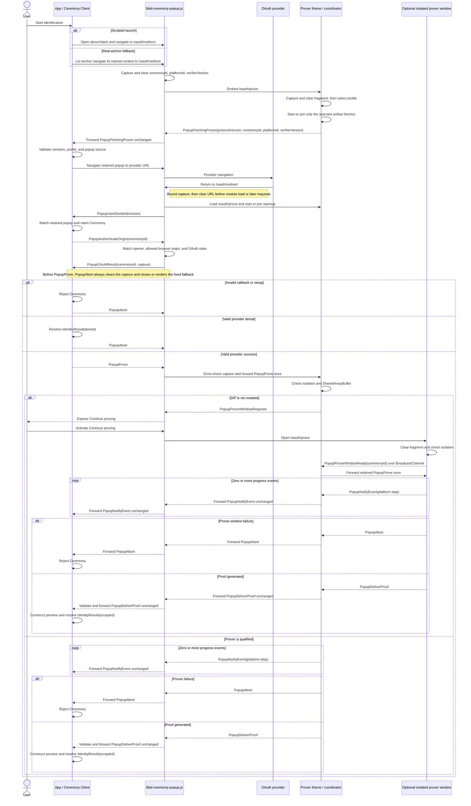

# `@libid/ceremony` architecture

This document defines the `@libid/ceremony` module boundary, application-side
API, browser entrypoints, messages, routes, progress, cancellation, proof
delivery, and browser security policy. It is implementation architecture, not
part of the normative protocol specification.

The normative libID specification owns the proof statement and authorization
encoding. See the
[common ceremony rules](../../../specs/ceremony-common.md) and
[identity-platform ceremonies](../../../specs/platform-ceremonies.md)
for their exact content. This document otherwise stands alone;
application job storage and all post-ceremony effects are outside its scope.
Package acceptance requirements are indexed by [TEST_PLAN.md](TEST_PLAN.md).

The specification's **Ceremony Client** role maps to this package's closed
client, popup, prover, and platform implementation as a whole. Its
**Ceremony Popup** is `libid-ceremony-popup.js`. This architecture uses the
concrete component names below and defines no additional wrapper module or kind.

## Boundary

One ceremony turns an application-owned operation into a locally checked
identity preview and the exact proof-bearing `OAuthProof`:

```text
CeremonyClient.new inputs
    │
    ▼
application-side client ── OAuth ── libid-ceremony-popup.js ── libid-ceremony-prover.js
    │                                                   │
    └────────────────────── Identity ◀─────────────────┘
```

The ceremony owns authorization construction, OAuth, callback handling,
isolated proving, sanitized progress, proof delivery, and local evidence
validation. It does not own application jobs, wallet keys or policy,
Registry calls, connectors, transaction submission, finality, React UI, or a
server status service.

External-wallet and native libID wallet compositions use the same ceremony.
They encode their operation into opaque `transactionData` before the ceremony
and interpret it only after verified proof delivery. A native wallet may run
key preparation before the ceremony and wallet confirmation afterward; those
sessions do not extend `PopupMessage`.

The application origin owns the durable job. One application-scoped
`CeremonyClient` owns its live ceremonies, retained popups, and the in-memory
ceremony-ID routing table. The client, redirect, and prover keep credentials,
witnesses, and the generated proof only in memory. The application origin is
an authority boundary: it supplies the operation domain and transaction data,
so compromising it already permits authorizing a different operation. The
ceremony does not attempt to hide its transient OAuth result from other scripts
executing in that origin.
If the application does not verify and commit a delivered proof before the live
channel is lost, the ceremony restarts with fresh OAuth. Downstream application
work may remain resumable independently.

## Package and module structure

Launch publishes one `@libid/ceremony` package:

```text
@libid/ceremony
├── protocol    pure records, codecs, authorization, proof verification, wire version
├── client      ServerConfig fetch, application-side API, and orchestration
├── popup       source entrypoint for libid-ceremony-popup.js
├── prover      source entrypoint for libid-ceremony-prover.js, workers, WASM, and warmup
└── platforms   versioned browser OAuth, progress, witness, and proving modules
```

`protocol` is the pure leaf imported by the client, popup, prover, platform
implementations, and native-wallet confirmation. It performs no browser,
storage, or network work. It owns the closed final-proof verification operation
so the application client and native wallet use the same implementation without
a separate verifier module. `popup` and `prover` are build entrypoints, not
separately versioned packages. They emit `libid-ceremony-popup.js`,
`libid-ceremony-prover.js`, and immutable worker/WASM assets from one compatible
package release. The prover artifact runs in both Window and ServiceWorker
contexts: its Window branch runs warmup, coordinates proving, and executes the
active prover placement, while its ServiceWorker branch owns the shared asset
single flight and cache.

Server implementations are outside the package. `platforms/github` implements
only the normative browser-side token request/response codecs and
validation; the integrating server implements the required confidential
endpoint.

The dependency direction is closed:

```text
ceremony/{client,popup,prover,platforms}
                     │
                     ▼
            ceremony/protocol

client ────────────────> ceremony
wallet ────────────────> ceremony/protocol
wallet-client ─────────> client + ceremony + wallet/protocol
```

`ceremony` never imports the client job store or either wallet composition.
The compositions adapt cancellation, progress projection, and the final
Identity commit around `proveUserIdentity()`. No generic plugin, caller-selected platform
module, validator, or finalizer exists.

The package-facing API surface is:

| Export or entrypoint | Contract |
|---|---|
| `@libid/ceremony/protocol` | closed records, exact codecs and validators, authorization construction, final-proof verification/public-input decoding, and `PopupProtocolVersion` |
| `@libid/ceremony/client` | immutable supported/enabled platform discovery, application-scoped `CeremonyClient`, `ServerConfig` fetch, and stateful `Ceremony` orchestration |
| `@libid/ceremony/popup` | browser entrypoint which emits `libid-ceremony-popup.js` and exposes `startPopup(capture, allowedAppOrigins)` to the cleared redirect document |
| `@libid/ceremony/prover` | dual-context browser entrypoint which emits `libid-ceremony-prover.js`; its Window branch accepts the closed Popup Protocol and its ServiceWorker branch owns warmup fetches |

The API below and the Ceremony Popup Protocol records are the launch surface.
Implementation-private helpers may change without changing authority or wire
behavior.

## APIs and records

### Ceremony client API

An application creates one client for one configured server:

```ts
import {
  createCeremonyClient,
  supportedPlatforms,
} from '@libid/ceremony/client'

const ceremonies = await createCeremonyClient({
  server: 'https://identity.example',
})
```

This is an application-owned instance, not a package-global singleton. Client
creation fetches and exact-validates `ServerConfig`; a configured platform is
enabled only when the installed package has a closed implementation and at
least one advertised verifier version in common.
`supportedPlatforms` is an immutable `readonly PlatformId[]` derived
from that same closed implementation table. It contains every platform compiled
into the package release, exactly once, and has no mutable registration API.

The launch release's closed local version table is:

| Platform | Locally supported verifier versions |
|---|---|
| `google` | `1` |
| `x` | `1` |
| `github` | `1` |

No other local verifier version is supported. A platform is therefore enabled
at launch only when its validated `ServerConfig` entry advertises version `1`,
and every created Ceremony for that platform freezes version `1`.

The public catalog and client types are:

```ts
export type PlatformId = 'x' | 'github' | 'google'
export declare const supportedPlatforms: readonly PlatformId[]

interface CeremonyClient {
  readonly enabledPlatforms: readonly PlatformId[]
  new: (
    ceremonyId: string,
    input: {
      chainId: Uint8Array
      platformId: PlatformId
      operationDomain: Uint8Array
      transactionData: Uint8Array
    },
  ) => Promise<Ceremony>
}

const jobId = crypto.randomUUID()
const ceremony = await ceremonies.new(jobId, {
  chainId,
  platformId,
  operationDomain,
  transactionData,
})
```

`enabledPlatforms` is the immutable intersection of `supportedPlatforms` and
the exact platform keys in validated `ServerConfig` that have at least one
verifier version in common with the installed implementation. Catalog order is
stable discovery order, not a product ranking; applications may present another order.
Neither array contains OAuth clients, verifier versions, server configuration,
or display metadata.

The composition selects a Chain Profile and operation per ceremony and supplies
their exact 32-byte `chainId` and `operationDomain` hashes with bounded
`transactionData`. During `new`, the client exact-validates and copies both
hashes without deriving or interpreting them, then treats `transactionData` as opaque. It requires
the selected platform to be enabled by validated `ServerConfig`, chooses the
newest locally preferred verifier version also advertised for that platform,
generates a fresh 32-byte authorization nonce, computes the authorization
digest, and freezes all of those values before constructing OAuth or allowing
provider navigation.

`CeremonyClient.new(ceremonyId, input)` accepts a plain string which must be a
lowercase UUIDv4. A composition normally generates one value and calls it
`jobId` in its Job API and `ceremonyId` in this API. The equality is a
composition invariant, not a shared branded type. The identifier is not chain
authorization, but its unpredictability and one-use handling provide browser
continuity: the initial popup discloses it to the initiating app, the
post-OAuth popup withholds it, and `PopupAuthenticateOrigin` must return it.

`new` chooses the platform verifier version, generates a fresh authorization
nonce, derives the code verifier by the normative PKCE construction where
required, and constructs the authorization request with
`state=ceremonyId`, registers that ID to this live `Ceremony`, and returns only
after its navigation data is ready. OAuth `state` is a provider-facing
serialization of `ceremonyId`, not a second identifier:

```ts
interface CeremonyNavigation {
  href: string   // /oauth/redirect#launch(ceremonyId, platformId, verifierVersion)
  target: string
}

interface Ceremony {
  readonly navigation: CeremonyNavigation

  onEvent(listener: (event: CeremonyEvent) => void): () => void
  proveUserIdentity(options?: { expectedPopup: WindowProxy }): Promise<IdentityResult>
  cancel(): Promise<void>
}
```

The caller owns launch UI and invokes `window.open`; the ceremony package never
renders an anchor or chooses between launch paths. The caller renders a real
anchor from `navigation.href` and `navigation.target`, attempts
`window.open('about:blank', navigation.target)` synchronously, and prevents
native navigation only if it receives a usable handle. It passes that handle
once as `expectedPopup`. If no handle is returned, it omits `expectedPopup` and
leaves the real-anchor navigation untouched.

`expectedPopup` is a channel-authority input, not UI configuration. When
present, `proveUserIdentity()` immediately navigates that `WindowProxy` to
`navigation.href` and exact-matches the first popup message against it. When
absent, the package opens or navigates nothing; the real anchor reaches the
same URL and the client binds its browser-stamped `MessageEvent.source` after
matching `PopupFetchingProver`'s ceremony ID, platform ID, and verifier version
to the live Ceremony. Both paths then
retain the same source through OAuth. There is no nullable popup value or
mutable `setPopup` API.

```ts
function activate(event: MouseEvent) {
  const expectedPopup = window.open(
    'about:blank',
    ceremony.navigation.target,
  )
  if (expectedPopup) event.preventDefault()
  void ceremony.proveUserIdentity(
    expectedPopup ? { expectedPopup } : undefined,
  )
}
```

`proveUserIdentity()` parses the callback's OAuth `state` as a ceremony ID and
claims that ID once in its owning client's live map, sends the minimal proving
inputs, validates the provider return, performs exchange and proving,
constructs the non-authoritative identity preview and OAuth proof, and resolves with an accepted
`IdentityResult`. A valid ceremony-bound provider denial resolves with a denied
`IdentityResult`; popup
closure, malformed return, invalid proving input, isolation failure, and
proving failure are ordinary ceremony failures, not denial.

The Job is already committed before `proveUserIdentity()` and remains the composition's
current ceremony state while the call runs. Progress may update its advisory
projection, but no pre-proving authority CAS or ceremony callback exists. The
final composition-owned Job CAS is the authority boundary: if cancellation,
expiry, or another transition retired the Job, a late Identity cannot commit.

`cancel()` is best-effort browser cleanup and is called only after the
composition retires its Job. Losing the application document loses the
in-memory ceremony map and therefore requires fresh OAuth, as already
required by the no-ceremony-recovery launch scope.

### Server configuration

The application server exposes public configuration:

```ts
type PlatformVerifierVersion = number

interface PlatformConfig {
  clientId: string
  verifierVersions: readonly PlatformVerifierVersion[]
}

interface ServerConfig {
  schema: 1
  redirectUri: string
  platforms: Partial<Record<PlatformId, PlatformConfig>>
}
```

The application-scoped client fetches this record once with native `fetch` and
validates it through `@libid/ceremony/protocol`; there is no configuration
module. The fetch requires an exact browser `Origin`. `redirectUri` is the registered HTTPS URL with
path exactly `/oauth/redirect`, no credentials, query, or fragment. Loopback
development may use HTTP. Each platform entry contains its public client ID and
a nonempty, duplicate-free set of supported verifier versions. List order has
no meaning: the client chooses the newest version according to its closed local
implementation table from the intersection. Platform entries contain no credentials.

`allowedAppOrigins` is deployment configuration, not a public `ServerConfig`
field. The server uses the same canonical set for exact request-origin CORS and
embeds it into every `/oauth/redirect` document. It is never derived from that
request's `Origin` or `Referer`.

The client freezes the selected platform, verifier version, client ID, and
redirect URI in the live Ceremony. `PopupProve` carries those values; the popup
applies its existing opener-origin validation and closed platform/version
dispatch without fetching configuration again.

### Prover deployment assets

Heavy prover assets are deployment data embedded into `/oauth/prove`, not
frontend `ServerConfig` or ceremony input:

```ts
type ProverArtifactKind =
  | 'notarization-client-wasm'
  | 'prover-wasm'
  | 'circuit'

interface ProverArtifact {
  kind: ProverArtifactKind
  url: string
  integrity: string
}

interface ProverProfile {
  platformId: PlatformId
  platformVerifierVersion: PlatformVerifierVersion
  srsSize: number
  artifacts: readonly ProverArtifact[]
}

interface ProverAssets {
  profiles: readonly ProverProfile[]
}
```

The server generates each `/oauth/prove` document with one exact, validated
`ProverAssets` value. Its bootstrap passes that value and its already-cleared
closed fragment input to the imported prover entrypoint. This is the prover-side equivalent of embedding
`allowedAppOrigins` into `/oauth/redirect`: request values cannot add or replace
a profile, URL, or integrity value, and the prover never fetches
`ServerConfig`. The document contains every still-supported deployed profile,
but a ceremony fetches only its selected platform/version profile.

The launch profiles are:

| Platform | Artifacts | BN254 SRS size |
|---|---|---:|
| X | shared notarization-client WASM, shared prover WASM, shared `bearer-link` circuit descriptor | 2^16 points |
| GitHub | the same notarization-client WASM, prover WASM, and `bearer-link` circuit descriptor | 2^16 points |
| Google | prover WASM and Google circuit descriptor | 2^18 points |

The current known heavy cold-start payload is:

| Profile | Profile artifacts | bb.js CRS | Known cold total |
|---|---:|---:|---:|
| `google/v1` | 4,081,773 bytes (3.89 MiB) | 20,971,648 bytes (20.00 MiB) | 25,053,421 bytes (23.89 MiB) |
| `x/v1` or `github/v1` | 20,674,830 bytes (19.72 MiB) | 8,388,736 bytes (8.00 MiB) | 29,063,566 bytes (27.72 MiB) |

These exact resource-body counts use
[`libid-circuits v0.3.0-rc.1`](https://github.com/libid-org/libid-circuits/releases/tag/v0.3.0-rc.1),
whose target is the source commit pinned below: `jwt_email.json` is 1,296,747
bytes and `bearer_link.json` is 158,142 bytes. The pinned bb.js
`barretenberg-threads.wasm.gz` is 2,785,026 bytes. The
[`libid-org/notary v0.2.0`](https://github.com/libid-org/notary/releases/tag/v0.2.0)
browser bundle contains a 17,731,662-byte `tlsn_wasm_bg.wasm`; commits between
that tag and the source link below do not change the bundle.

The pinned `bb gates -t evm` reports circuit sizes of 42,008 for
`bearer_link` and 179,413 for `jwt_email`. Deployment generation rounds each up
to its dyadic ceiling and emits that value as the profile's `srsSize`: 2^16 and
2^18 respectively. The CRS column is therefore the selected BN254 G1 prefix at
64 bytes per point, the shared 2^16-point Grumpkin G1 data, and 128 BN254 G2
bytes. This circuit-derived value is identical on every browser; libID does not
inherit bb.js's generic 2^20 desktop and 2^18 iOS defaults.

A later cold X/GitHub ceremony after either one fetches no new heavy profile
asset. X/GitHub after Google reuses its larger BN254 cache and fetches only
17,889,804 bytes of notary WASM and the bearer circuit. Google after X/GitHub
replaces the shorter BN254 prefix with its 2^18-point prefix and fetches its
1,296,747-byte circuit.

The counts are before HTTP content encoding and exclude HTML, the root bundled
JavaScript, headers, OAuth/notary traffic, and attestations. They are therefore
reproducible heavy-resource payloads, not a promise about transferred bytes.
The root bundle does not exist yet and must publish its own measured size when
built.

Importing bb.js or fetching its prover WASM does not fetch the CRS. bb.js loads
the CRS only while initializing `Barretenberg.new()`, before
`generateProof()`. Warmup starts that network work explicitly without creating
the prover backend: the module service worker calls the browser exports
`Crs.new(profile.srsSize)` and `GrumpkinCrs.new(2 ** 16)` under its extended
worker event. Those loaders use bb.js's own fixed CRS endpoints and IndexedDB
cache. A later prover waits for that worker-owned attempt, then
`Barretenberg.new({ srsSize: profile.srsSize })` reads the same cache.
Navigation can destroy the warmup iframe without owning or restarting the
download.

The pinned bb.js browser build already owns the downloader and IndexedDB cache.
Aztec's [`srsSize` constructor option](https://github.com/AztecProtocol/aztec-packages/pull/23419)
is released in bb.js 5.2.0. Its compressed loader, however, persists G1 only
after WASM decompression; [Aztec #25290](https://github.com/AztecProtocol/aztec-packages/pull/25290)
also persists the download so `Crs.new()` alone is durable. The final
circuit-compatible pin must provide both behaviors. The older measured nightly
already persists its uncompressed download and needs only the `srsSize`
backport; a compressed release needs #25290. Without aligned sizing, a
circuit-sized warmup is followed by a larger desktop refetch. The selected
bb.js bytes also fix its primary and fallback CRS origins, which are the only
CRS origins admitted by the prover response policy.

Deployment generation runs the pinned circuit-size command for every profile,
emits `srsSize`, and fails if it differs from the platform version's checked-in
expectation. It does not copy, slice, or reimplement the CRS downloader.

Shared entries use the same immutable URL and integrity value. The service
worker keys ordinary artifact single flights and Cache Storage entries by
canonical URL; repeating an entry in another profile joins the existing request
or cache hit. CRS single flights are keyed by curve and point count and complete
through bb.js's IndexedDB cache. One URL with conflicting kind or integrity is
invalid deployment data. Platform modules define the exact artifact kinds and
SRS size for each verifier version and reject a missing, duplicate, additional,
or mismatched value before fetching.

`/oauth/prove` has three closed fragment forms. The bootstrap copies and clears
the fragment before importing the root module or using storage or the network:

- `fetch(ceremonyId, platformId, verifierVersion)` creates the warmup iframe;
- an empty fragment creates the returned-callback coordinator iframe; and
- a bare ceremony ID creates the top-level fallback prover window.

These are document bootstrap roles, not server request variants or popup
messages. The fragment never contains an asset URL. The same HTML, headers,
embedded manifest, and root module are served in all three cases.

### Platform proving pipelines

The platform modules own witness construction and orchestration; the circuit
repository owns the exact proof relation and ABI. Launch uses these artifacts:

| Profile | Circuit | Returned attestations |
|---|---|---|
| `google/v1` | [`jwt_email`](https://github.com/libid-org/libid-circuits/blob/2b0e181485fb08441f63c57b3561e3655d394264/circuits/jwt_email/src/main.nr) | none |
| `x/v1` | [`bearer-link`](https://github.com/libid-org/libid-circuits/blob/2b0e181485fb08441f63c57b3561e3655d394264/circuits/bearer-link/src/main.nr) | token, identity |
| `github/v1` | the same `bearer-link` artifact | token exchange, identity |

Those links pin the current launch source snapshot. Deployment consumes the
matching compiled ACIR/ABI and manifest from a
[`libid-circuits` release](https://github.com/libid-org/libid-circuits/releases),
not source or an application-selected URL. A profile is unavailable until its
circuit release and matching Consumer verifier are both deployed.

All three pipelines use one proving engine. The platform module builds the
closed Noir input map, the Noir/ACVM runtime solves the witness, and the
circuit-compatible [Aztec bb.js](https://github.com/AztecProtocol/aztec-packages/tree/v5.0.0-nightly.20260324/barretenberg/ts/bb.js)
release generates an UltraHonk proof. bb.js returns raw proof bytes and an
ordered flat array of field-valued public inputs inside the prover. The prover
discards that internal array after generation and returns only the proof and
attestations. The Consumer verification path reconstructs the exact public
inputs from the OAuth proof's authenticated fields and attestations; the
browser does not duplicate the circuit ABI or verify the generated proof.

X and GitHub additionally use the browser TLSNotary bundle built by the
[`libid-org/notary` build script](https://github.com/libid-org/notary/blob/e0ce1f1e0bedcde54740d1af70d4eaf9b439a9fb/scripts/build-tlsn-wasm.sh)
and published in [`libid-org/notary` releases](https://github.com/libid-org/notary/releases).
That release contains the JavaScript wrapper, WASM, and worker bootstrap. The
profile's `notarization-client-wasm` entry selects its heavy WASM member; the
wrapper and worker bootstrap remain immutable dependencies of the prover root
module. Neither an application nor `PopupProve` selects a notary, circuit, or
bb.js version.

#### Google

`platforms/google` receives the captured ID Token and frozen client identifier.
It obtains the JWK selected by the token's `kid` from Google's JWKS endpoint and
constructs the `jwt_email` input map:

- private witness: JWT signing input and payload bytes with their lengths,
  checked-claim offsets and lengths, raw email/`sub`/`aud` bytes, RSA signature,
  and the RSA reduction witness;
- public inputs, in circuit order: 32 authorization-digest bytes, two fields
  containing `SHA256(aud)`, one packed `sub` field, two packed email fields,
  `exp`, and eighteen RSA-modulus limbs.

The semantic groups flatten to exactly 56 bb.js public-input fields. The module
derives the candidate authorization digest from the signed nonce; the circuit
re-encodes it as the exact unpadded base64url nonce and verifies the RS256
signature and signed claims. The module then generates one proof and returns it
with an empty attestation list. The Ceremony Client derives the local identity
preview and OAuth-proof fields from its retained ID Token, frozen client
identifier, and the JWK selected by `kid`; only Consumer verification makes
them authoritative.

#### X

`platforms/x` performs two browser-owned TLSNotary Proxy sessions:

1. Notarize the fixed `/2/oauth2/token` exchange using the captured code,
   derived code verifier, frozen redirect URI, and client identifier. Reveal
   the profile-owned request and delimiter ranges and commit the returned bearer.
2. Use that bearer in the fixed `/2/users/me` request. Reveal the complete
   request framing around its committed bearer plus the identity response's
   canonical `id` and `username` ranges.
3. Build the shared `bearer-link` witness from the private bearer, its length,
   and the two independent 16-byte TLSNotary blinders, then generate the proof.

The token and identity TLS setup may overlap, but the identity request waits for
the token exchange to produce the bearer. The circuit constrains the bearer to
nonempty printable ASCII of at most 128 bytes and exposes exactly the two
32-byte bearer commitments, token first and identity second; Noir flattens them
to 64 bb.js public-input fields. Delivery contains only the proof and the two
attestations in the same token/identity order. Identity fields and the
authorization digest are authenticated by the attestations and Platform
Verifier, not duplicated as circuit outputs.

#### GitHub

`platforms/github` first sends the captured code and derived verifier to the
fixed server token-exchange route. The server uses its confidential client
secret, performs the token-exchange TLSNotary session, and returns the bounded
access token, token attestation, and `bearerBlinder`: the canonical unpadded
base64url encoding of the token session's exact 16-byte TLSNotary blinder. The
browser validates that response and blinder before using the
bearer in its own fixed `/user` TLSNotary session, which commits the bearer and
reveals the canonical `id` and `login` ranges.

The module then runs the same `bearer-link` circuit with the token-exchange and
identity blinders. Its public-input count and order are identical to X: 64
fields representing token commitment then identity commitment. Delivery
contains only the proof and the two attestations in token-exchange/identity
order.
GitHub-specific server exchange and transcript construction therefore remain
platform code; no GitHub-specific proving circuit or proving engine exists.

### Platform progress

Each profile emits this closed, ordered sequence after `PopupProve`:

| Profile | Platform-step codes |
|---|---|
| `google/v1` | `prover-readiness` → `token-decoding` → `signing-key-fetch` → `signing-key-selection` → `circuit-inputs` → `witness` → `proof` |
| `x/v1` | `prover-readiness` → `notary-initialization` → `token-session` → `token-attestation` → `identity-session` → `identity-attestation` → `circuit-inputs` → `witness` → `proof` |
| `github/v1` | `prover-readiness` → `token-exchange-request` → `token-exchange-validation` → `notary-initialization` → `identity-session` → `identity-attestation` → `circuit-inputs` → `witness` → `proof` |

`prover-readiness` covers awaiting the selected artifact single flights after
`PopupProve`; those downloads may already have started during warmup. Google
then decodes the ID Token, fetches and selects its JWK, and constructs the
closed circuit inputs. X exposes initialization of the browser notary client,
each notarized session, and each resulting attestation separately. GitHub
exposes the start of its one server request and local validation of the complete
response, but no fictional server-internal progress; its browser-owned identity
session remains separate. `circuit-inputs` ends when the complete closed Noir
input map exists, `witness` covers ACVM execution and constraint solving, and
`proof` covers bb.js proof generation.

For each code, the platform module emits `started`, followed by `completed`
before starting the next code or `failed` immediately before Abort. A cache hit
still emits the same sequence. OAuth, isolation, delivery, and preview
construction are represented elsewhere and do not add platform steps.

### Ceremony result

```ts
interface Identity {
  oauthProof: OAuthProof
  platformId: PlatformId
  clientId: string
  userId: string
  handle: string
  metadataObservedAt: number
  authorizationDigest: Uint8Array
}

type IdentityResult =
  | { status: 'accepted'; identity: Identity }
  | { status: 'denied' }

```

`PlatformVerifierVersion` is an unsigned 16-bit integer selected by the ceremony client
from the versions advertised in server configuration, never by the caller.
`authorizationNonce` is exactly 32 cryptographically random bytes. For X and
GitHub it also supplies the secret input to PKCE and is not exposed before the
token exchange completes. Exact authorization encoding is delegated to the
normative ceremony specification.

`OAuthProof` is the exact closed normative record: proof, attestations, and the
public authorization fields the Consumer will verify. Its platform-specific
shape is not redefined here.
`@libid/ceremony/protocol`
checks that exact `OAuthProof` against the live Ceremony's retained
authorization fields, derives
the identity preview from locally validated platform evidence, enforces the
platform's canonical encodings and configured client, and
returns `Identity` with the same `OAuthProof`. The client constructs it from
those retained fields and the proof and attestations returned by the prover.
The ceremony exact-matches the
internal ceremony ID, platform, and recomputed authorization digest before
resolving `proveUserIdentity()`. `status: 'accepted'` means the selected parser
classified the capture as success and local checks succeeded; only Consumer
acceptance makes Identity authoritative. Callers cannot supply or override
Identity fields.

The live `Ceremony` privately retains its ID, copied operation inputs, selected
platform and verifier version, authorization nonce and digest, OAuth client and
redirect, derived code verifier, and popup. A restart creates a fresh Ceremony
with a fresh nonce, digest, and verifier. After proof acceptance, the Job may
store the accepted `IdentityResult` and its public `OAuthProof` fields. Before
acceptance, no Job or IndexedDB index stores the authorization nonce or digest,
code verifier, provider credential, or private witness. No separate OAuth-state
value or pre-proof checkpoint is ever persisted.

The ceremony receives no action kind, job revision, chain RPC, Registry client,
wallet key, threshold, fee, connector, transaction submitter, database,
`CryptoKey`, or arbitrary callback. Its output contains the exact `OAuthProof`
but no credential, private witness, wallet signature, fee quote, or transaction
submission capability.

All records are exact-shape validated. `metadataObservedAt` is a nonnegative
safe integer; fractions, infinities, `NaN`, and overflow fail. Ceremony IDs are
lowercase RFC 4122 UUIDv4 values generated with `crypto.randomUUID()` and are
serialized unchanged as OAuth `state`. The code verifier is derived by the
normative PKCE construction. Derived hashes are exact 32-byte `Uint8Array`
values. Unknown fields, aliases, coercions, and
noncanonical encodings fail before use.

## Browser architecture

```text
Application origin
  composition + @libid/ceremony/client
  durable Job and retained WindowProxy
              │ authenticated postMessage
              ▼
Application redirect origin: /oauth/redirect
  fixed URL-clearing bootstrap + libid-ceremony-popup.js
  non-isolated ceremony popup UI and controller
              │ bound parent/child channel or ceremony-ID channel
              ▼
Application redirect origin: /oauth/prove
  libid-ceremony-prover.js + workers/WASM
  warmup in every browser; isolated for proving
              │
              ├─ platform/notary/JWKS network defined by platform version
              └─ optional server-owned same-origin platform route
```

The deployed route surface is:

```text
GET  /_libid/config
GET  /oauth/redirect
GET  /oauth/prove
POST /oauth/github/token  server-provided when GitHub is enabled
```

`/oauth/redirect` is the one registered callback for every enabled platform and
the shared launch document. It is top-level and non-isolated so it can
authenticate and communicate with the application opener. `/oauth/prove` is
the single prover document used first for warmup and later for proving. Neither
route depends on application business logic or stores ceremony state.
Warmup adds no server route or response variant: both invocations receive the
same `/oauth/prove` HTML and the same deployment-configured prover module. The
Window branch starts warmup on load and begins proof execution only after a
valid `PopupProve`; no request parameter selects a mode.

Before user activation, the composition prepares an action-specific real
anchor whose `href` is `/oauth/redirect` with a closed fragment containing only
the ceremony ID, platform ID, and selected verifier version, and whose target
is a unique non-reserved browsing-context name. On activation it calls
`window.open('about:blank', target)` synchronously and suppresses anchor
navigation only if a usable handle is returned; `proveUserIdentity()` then
navigates that handle to the same `href`. If scripted opening is blocked, the
same tap's native target navigation reaches that `href`. Both paths preserve
`window.opener`; `noopener` and `noreferrer` are forbidden. The inline redirect
bootstrap captures and clears that launch fragment before subresources or
network activity. Presentation as a window or tab is a browser choice, not a
protocol mode.

The scripted open is the primary, PoC-qualified launch path; the qualified
mobile browsers did not reject it. The real anchor remains a low-cost hedge
against an unqualified browser or embedding policy returning `null`, not a
claim that a launch target is known to require it. Both paths start the same
consent-overlapped warmup. `PopupFetchingProver` lets the fallback bind and
retain its `WindowProxy` before OAuth, after which both paths use the same
navigation, continuity, callback, and proving protocol.

After the provider callback, that redirect document creates one `/oauth/prove`
iframe which remains the prover coordinator for the rest of its lifetime. The
coordinator runs the prover itself when DIP gives it isolation, or relays the
same protocol to a top-level isolated prover window opened by the user's
**Continue proving** anchor.

The redirect never user-agent sniffs. It binds the coordinator through its
exact parent/child `WindowProxy` and browser-stamped origin. The fallback window
cannot rely on `window.opener` after COOP; it receives only the ceremony ID in
its initial fragment, clears it before other work, and connects to the
coordinator through a same-origin `BroadcastChannel` derived from that ID. The
ceremony ID routes the live same-origin channel; it is not a separate
confidentiality boundary.

Every redirect document first loads `/oauth/prove` in a same-origin iframe.
That document may warm assets without isolation or credentials. Its
`libid-ceremony-prover.js` Window branch registers the same module URL as a
module service worker. The redirect gives the child a closed
`#fetch(ceremonyId, platformId, verifierVersion)` bootstrap fragment. The child
clears it before importing the root module or using the network, selects that profile from
its server-embedded manifest, and asks the worker to start only those artifact
single flights. The ceremony ID is retained only for the readiness response;
the proving implementation receives only the selected platform and verifier version. After
the flights exist or the bounded startup attempt determines that warmup is
unavailable, the child returns `PopupFetchingProver` and the redirect forwards
it to the client. It never waits for download completion. On a provider return,
the new coordinator iframe loads the same response and joins those fetches. It retains the
`PopupProve` input in memory while either running proving itself or relaying it
to the fallback window; iframe isolation is not a credential-confidentiality
boundary.

The module worker and both documents share one origin and a scope covering
`/oauth/`. COOP changes only top-level opener relationships: it does not
partition the service-worker registration, Cache Storage, or the same-origin
channel. Consequently the COOP-isolated popup fallback joins the same in-flight
fetches as the warmup iframe. The prover requests dependencies normally; the
worker returns the existing single-flight promise or cached response, so no
artifact-download completion message exists. `PopupFetchingProver` marks only
the selected profile's bounded startup barrier.

The popup forwards `PopupProve` once to the coordinator iframe. On receipt, the
coordinator immediately checks `crossOriginIsolated` and `SharedArrayBuffer`
before any credential-bearing network request. If qualified, it proves in
place. Otherwise it sends `PopupProverWindowRequired`; the redirect consumes
that nonterminal message and exposes **Continue proving**. The resulting
top-level prover window checks isolation before sending
`PopupProverWindowReady(ceremonyId)` over the ceremony channel. The coordinator
then forwards its retained `PopupProve` exactly once. All window progress,
delivery, and Abort messages return through the coordinator. Version-specific
worker initialization follows the isolation check; later failure aborts the run
and clears its inputs. There is no unisolated or single-thread fallback.

## Ceremony Popup Protocol

```ts
type PopupProtocolVersion = 1
```

`PopupProtocolVersion` versions the complete `PopupMessage` union shared by the
application/popup and popup/prover boundaries. The initial and returned
ceremony popup sends its version in its first application-facing message. The
client validates it before OAuth and again after return; it does not echo or
negotiate a version. The package-internal popup/prover boundary introduces no
second version exchange.

```ts
interface PopupFetchingProver {
  popupProtocolVersion: PopupProtocolVersion
  type: 'popup-fetching-prover'
  ceremonyId: string
  platformId: PlatformId
  platformVerifierVersion: PlatformVerifierVersion
}

interface PopupUserDecided {
  popupProtocolVersion: PopupProtocolVersion
  type: 'popup-user-decided'
}

interface PopupAuthenticateOrigin {
  type: 'popup-authenticate-origin'
  ceremonyId: string
}

interface OAuthRedirectCapture {
  query: string
  fragment: string
}

interface PopupOAuthResult {
  type: 'popup-oauth-result'
  ceremonyId: string
  capture: OAuthRedirectCapture
}

interface PopupProve {
  type: 'popup-prove'
  ceremonyId: string
  platformId: PlatformId
  platformVerifierVersion: PlatformVerifierVersion
  clientId: string
  redirectUri: string
  capture: OAuthRedirectCapture
  codeVerifier: string | null
}

interface PopupProverWindowRequired {
  type: 'popup-prover-window-required'
}

interface PopupProverWindowReady {
  type: 'popup-prover-window-ready'
  ceremonyId: string
}

interface PopupAbort {
  type: 'popup-abort'
}

interface PopupNotifyEvent {
  type: 'popup-notify-event'
  ceremonyId: string
  event: CeremonyEvent
}

interface PopupDeliverProof {
  type: 'popup-deliver-proof'
  ceremonyId: string
  proof: Uint8Array
  attestations: readonly Uint8Array[]
}

type PopupMessage =
  | PopupFetchingProver
  | PopupUserDecided
  | PopupAuthenticateOrigin
  | PopupOAuthResult
  | PopupProve
  | PopupProverWindowRequired
  | PopupProverWindowReady
  | PopupAbort
  | PopupNotifyEvent
  | PopupDeliverProof
```

On an initial launch, the redirect exact-validates and clears its fragment's
ceremony ID, platform ID, and verifier version, then loads
`/oauth/prove#fetch(ceremonyId, platformId, platformVerifierVersion)`. The
child captures and clears that fragment before importing the root module or using the
network, selects exactly that profile from its server-embedded `ProverAssets`, asks the
service worker to start or join only those artifact fetches, and returns
`PopupFetchingProver(popupProtocolVersion, ceremonyId, platformId,
platformVerifierVersion)` after the single flights exist or the bounded attempt
determines that warmup is unavailable. The redirect accepts this only from its
exact child and forwards it unchanged to `window.opener`, trying only the
server-embedded allowed origins as exact `targetOrigin` values. A missing or
invalid profile or silent child fails before OAuth; ordinary fetch/cache failure
still follows the cold proving path. Warmup requires no opener response or
origin authentication.

The application accepts `PopupFetchingProver` only from the exact configured
redirect origin and a matching live ceremony ID, platform ID, and verifier
version. A scripted launch additionally requires
`MessageEvent.source === expectedPopup`; a real-anchor launch binds that source
to the matching Ceremony. The client exact-validates the popup protocol version,
retains the source, and navigates it directly to the frozen provider
authorization URL.

After clearing a provider callback URL and extracting exactly one syntactically
valid OAuth `state` as its ceremony ID, the new redirect document sends
`PopupUserDecided(version)` to the server-embedded allowed origins. This means
only that the provider returned from its user-decision step; it does not classify
approval, denial, or malformed platform fields. The client accepts it only from
the retained popup source at the exact configured redirect origin and under the
expected protocol version. It responds directly with
`PopupAuthenticateOrigin(ceremonyId)`.

The popup accepts `PopupAuthenticateOrigin` only from `window.opener`, requires
its browser-stamped `MessageEvent.origin` to be in `allowedAppOrigins`, and
exact-matches the supplied ceremony ID to the captured OAuth state. It then
sends `PopupOAuthResult` only to that exact source and origin. The message has
no origin or version field: the browser supplies the authoritative origin and
the client already validated the popup's version. A different allowed origin
occupying the opener after OAuth receives no ceremony ID, cannot authenticate,
and receives no OAuth result. No binding record or callback-time storage exists.

If a provider callback receives no valid `PopupAuthenticateOrigin` within
`REDIRECT_OPENER_TIMEOUT_MS = 30_000`, the popup clears its in-memory capture,
severs the opener, and renders the same fixed unapproved-application result as
an invalid opener origin. No callback value is rendered or used for navigation.

After authentication, popup-to-application messages are `PopupOAuthResult`,
`PopupAbort`, `PopupNotifyEvent`, and `PopupDeliverProof`.
Application-to-popup messages are `PopupAuthenticateOrigin`, `PopupProve`, and
parameterless `PopupAbort`. `PopupProve` and Abort are the two application
responses to `PopupOAuthResult`;
application-to-popup Abort may also stop a ceremony after `PopupProve`. Before
`PopupProve`, every Abort identically clears the OAuth capture and attempts to
close; if closing fails, the popup renders one fixed fallback message. Afterwards
it cancels reachable proving work and attempts to close. Popup-to-application Abort reports a
technical terminal failure and rejects the live Ceremony. Direction supplies
the meaning; Abort carries no reason and has no response. Warmup exposes only
`PopupFetchingProver` to the application.

`PopupProverWindowRequired` and `PopupProverWindowReady` are package-internal
messages. Neither changes the Ceremony result; they request and bind the
fallback proving window. Warmup selection is document bootstrap data, not a
popup message. Only the resulting `PopupFetchingProver` crosses the application
boundary.

`PopupOAuthResult` sends the authenticated ceremony ID and unchanged bounded
`OAuthRedirectCapture`. An absent, malformed, or duplicate OAuth state changes
no live state. The popup does not select a transport or classify the
platform-specific result.
The application origin is trusted for
both the transient `PopupProve` and provider capture; the protocol does
not attempt to isolate either value from other scripts executing in that
origin. Exact `targetOrigin`, `MessageEvent.origin`, and `MessageEvent.source`
checks prevent unrelated origins from receiving or injecting this traffic.
The application-scoped `CeremonyClient` uses its in-memory table to select one
live `Ceremony`; it does not query IndexedDB or reveal the ID to the
composition. For an unknown, stale, replayed, or post-reload state, the client
sends `PopupAbort`, and the popup follows the same pre-prove cleanup path.
Otherwise, the client
atomically claims the matching state and uses that Ceremony's retained
platform/version parser to exact-validate the capture's transport and fields
and classify its outcome. A
malformed or mismatched capture rejects the
Ceremony and sends `PopupAbort`. A valid denial resolves with
`{ status: 'denied' }` and sends `PopupAbort` for popup cleanup. A valid
acceptance constructs `PopupProve` from the live Ceremony's ID, selected
platform/version, frozen client and redirect, derived code verifier, and
received `capture`.
The popup byte-matches both components of the echoed capture to its retained
capture, validates
the `PopupProve` shape and closed platform/version dispatch, and forwards that
exact message to the coordinator iframe without another app roundtrip. The claimed map entry,
single-use Ceremony instance, and one-shot popup state machine prevent duplicate
proving; the final Job CAS prevents a late result from producing an application
effect. No separate OAuth-state value, job revision, composition discriminator, wallet state,
or connector crosses the public API.

## Protocol sequence



An implementation executes only one launch path per ceremony.

`PopupDeliverProof` has no acknowledgement or ceremony-side checkpoint;
successful verification resolves `proveUserIdentity()` with an accepted
`IdentityResult`.
External-wallet submission and native-wallet confirmation begin only after the
application verifies the proof and commits its composition-owned successor.

## Redirect ingress

The same fixed `/oauth/redirect` response handles success, provider denial,
malformed input, unknown state, and the initial shared launch. It contains no
request-derived HTML, header, script URL, origin, platform, or mode.

Its fixed inline bootstrap bounds the combined raw query and fragment to
`MAX_OAUTH_REDIRECT_BYTES = 32 KiB`, copies them into lexical memory, clears
both with `history.replaceState`, and only then integrity-loads
`libid-ceremony-popup.js` and calls:

```ts
declare function startPopup(
  capture: OAuthRedirectCapture,
  allowedAppOrigins: readonly string[],
): void

startPopup(capture, allowedAppOrigins)
```

An empty query plus the closed launch fragment containing ceremony ID, platform
ID, and verifier version is the initial shared launch. Provider callbacks
instead carry their platform's closed query/fragment grammar, including only
the same ceremony ID as OAuth `state`. The
bootstrap clears even malformed or oversized input before rendering. It performs no
parsing, storage, network request, dynamic rendering, or error reporting before
clearing. `startPopup` exact-validates and freezes the nonempty embedded list of
canonical origins before using it; the list is deployment-generated and never
comes from request `Origin`, `Referer`, query, fragment, or a client message.
Redirect servers suppress query strings in access logs, traces, analytics, and
errors.

`OAuthRedirectCapture.query` and `.fragment` are the exact captured
`location.search` and `location.hash` strings, including a leading delimiter
when nonempty. After loading, the popup extracts the single routing state,
authenticates the opener through `PopupAuthenticateOrigin`, and exact-validates the returned
`PopupProve` ID, platform, verifier version, client ID, redirect URI, unchanged
capture, and PKCE shape before using the credential.
The application client's selected platform/version parser classifies the
capture. It rejects a Google ID Token at or after its signed `exp`; mutable
X/GitHub proof lifetimes are enforced only by the Platform Verifier. Google
accepts a nonempty fragment and empty query; X and GitHub accept a nonempty
query and empty fragment.

An unsupported or invalid input discovered after `PopupProve`
clears the return, sends popup-to-application `PopupAbort`, and renders
**Application updated—return and try again**. An unknown or stale ceremony does
not send `PopupAuthenticateOrigin`; an authenticated capture rejected by the
selected platform/version parser makes the application send `PopupAbort`. The
popup clears the result, attempts to close, and renders one fixed fallback
message if closing fails. A wrong opener origin, authentication timeout, or
redirect capture without a valid bounded ceremony ID sends no callback value.

## Popup/prover channel

The popup/prover boundary reuses the closed `PopupMessage` union. The ceremony
popup always forwards the application's exact `PopupProve` once to its
coordinator iframe. On receipt, the coordinator checks isolation and
shared-memory availability before any credential-bearing network request. Its
bounded `capture` preserves the provider-returned query
and fragment unchanged; `platformId` and `platformVerifierVersion` select its
exact parser and implementation. `codeVerifier` is null for Google and the already-derived 43-character PKCE
verifier for X and GitHub. `clientId` and `redirectUri` are the values frozen by
the Ceremony Client from its validated `ServerConfig`. The ceremony popup,
coordinator, and active fallback window exact-validate the record where they
receive it. Client classification and prover credential
extraction use the same closed platform/version parser; the prover admits no
second interpretation of the capture.

When qualified, the coordinator proves in place. Otherwise it retains
`PopupProve` in memory and sends `PopupProverWindowRequired` only to its exact
parent. The ceremony popup renders the real **Continue proving** anchor and
opens no window without that user activation. The top-level `/oauth/prove`
window clears its ceremony-ID fragment, validates isolation and shared memory,
then sends `PopupProverWindowReady(ceremonyId)` over the scoped
`BroadcastChannel`. The coordinator exact-matches that ID and forwards its
retained `PopupProve` once. Unknown, stale, duplicate, pre-request, or wrong-ID
readiness changes no state. Before Ready, the only other accepted window message
is `PopupAbort`, reporting that the top-level document itself could not qualify;
the coordinator forwards it upstream as a terminal technical failure.

The prover does not receive the expected Authorization Digest. Google exposes
the signed token nonce as a proof public input; X and GitHub expose the
attested code verifier. The Consumer verification path matches that binding to
the Authorization Digest it recomputes from the OAuth proof.

After `PopupProve`, the active proving placement sends zero or more
`PopupNotifyEvent` records followed by exactly one `PopupDeliverProof`. Either
side may instead send parameterless `PopupAbort`: downstream means cancellation
and upstream means terminal failure. Thus the ceremony popup may cancel its
coordinator, and the coordinator may cancel its fallback window; either active
prover reports failure in the reverse direction.
The coordinator validates and forwards window events, delivery, and Abort
unchanged to the ceremony popup, which forwards them to the application.
Context loss may produce no terminal message. Unknown fields or types, invalid
order, messages after terminal, and messages outside the bound channel change
no state.

The one-shot channel scopes every message to one ceremony. `PopupProve` and proof
delivery carry the ceremony ID; Abort does not duplicate it. The DIP path binds
the exact parent/child `WindowProxy` and browser-stamped origin. The fallback
window uses the cleared ceremony-ID fragment only to derive its same-origin
`BroadcastChannel` with the coordinator. All browser boundaries share
`PopupProtocolVersion`; no
second protocol or version exists.

The prover performs the selected version's exchange, notarization, witness
construction, and proof generation. It returns only the bounded generated
proof and attestations through `PopupDeliverProof`; it does not receive the
operation domain, chain ID, transaction data, or authorization nonce, and it
does not assemble or verify `OAuthProof` or
construct `Identity`. The application client combines the returned proof and
attestations with its retained ceremony fields, assembles the exact normative
`OAuthProof`, and derives a locally checked but non-authoritative preview. For
GitHub, the prover—not the
popup—calls the fixed same-origin token route, verifies its response, and then
performs the dependent `/user` notarization. `platforms/github` implements the normative
`TokenRequest` and `TokenResponse` codecs; the platform
specification owns their exact shape and proof semantics.

Neither placement persists credential-bearing state. Inputs and workers are
cleared after proof delivery, Abort, failure, or context destruction.

## Progress and cancellation

```ts
type CeremonyStage =
  | 'authorization'
  | 'oauth-validation'
  | 'prover-activation'
  | 'proof-generation'

interface PlatformStep {
  code: string
  status: 'started' | 'completed' | 'failed'
}

interface CeremonyEvent {
  stage: CeremonyStage
  platformStep: PlatformStep | null
  timestamp: number
}
```

The application-side `Ceremony` client owns the common stage. It enters
`authorization` when `proveUserIdentity()` starts, `oauth-validation` when an
authenticated `PopupOAuthResult` selects the live Ceremony,
`prover-activation` only while the popup waits for the fallback **Continue
proving** activation, and `proof-generation` when proving starts. Immediate
`Identity` construction completes `proof-generation`; it is not a separate
progress stage. The popup reports
its two prover lifecycle transitions over the authenticated channel, and the
client confirms them before publishing them.

Each platform-verifier-version module defines only its steps beside the code
which performs them and emits `started` followed by exactly one `completed` or
`failed`. It cannot select a common stage. The prover validates the bounded
string and status shape, stamps `timestamp` as non-negative safe-integer Unix
milliseconds, and attaches its current `proof-generation` stage. A fallback
window sends that exact event through the coordinator; the ceremony popup then
forwards it to the client. The client accepts only an authenticated, legal
stage transition and otherwise does not interpret the platform catalog.
Neither event contains operation inputs, outputs,
credentials, identities, witnesses, proofs, raw exceptions, or raw service
errors. The application may map this advisory view into its broader job
progress; later confirmation, submission, and finality never enter the
Ceremony Popup Protocol.

`CeremonyEvent` carries only advisory progress. OAuth denial is returned only
through `proveUserIdentity()`; acceptance proceeds to `PopupProve`.

The coordinator/window same-origin `BroadcastChannel` supplies routing inside
the trusted deployment, not separate sender authentication, durable state, or
proof authority. A same-origin `PopupAbort` can stop only the current run; it
cannot produce Identity or any later application effect. Missing, duplicated,
or reordered progress affects only UI. The visible prover remains the fallback
when an isolated-popup engine cannot relay progress reliably.

Cancellation first retires the application job. If the authenticated channel
is live, the application sends `PopupAbort`; the ceremony popup marks the
ceremony canceled and forwards Abort to the coordinator iframe. The coordinator
cancels local work or relays Abort to its active prover window, which attempts
to close itself. The popup removes the coordinator, clears memory, and
terminates reachable workers/connections.
Cancellation is best effort: remote stateless work may finish, but no result is
used. A later result cannot commit because the matching Job is gone.
Popup closure alone is never success, failure, denial, or cancellation.

## Prover warmup

Every ceremony attempts consent-overlapped prover warmup. It is fixed behavior,
not configuration or action input. The shared launch popup loads `/oauth/prove`.
The prover Window branch registers its own deployed
`libid-ceremony-prover.js` module URL as a module service worker and asks it to
start only the selected platform/version profile's artifact single flights.
This reuses the same route, artifact, and prover implementation used later for
proving; there is no warmup route, artifact, or mode flag.

The `/oauth/prove` bootstrap exact-validates its server-embedded `ProverAssets`.
For warmup, its Window branch accepts only the closed, cleared
`#fetch(ceremonyId, platformId, verifierVersion)` fragment and selects exactly
one matching profile. The fragment can select a manifest profile but cannot
supply an asset URL. The ceremony ID is only echoed in readiness; it is not
passed into the proving implementation. The service-worker branch contains no
OAuth or application state. It owns each selected immutable asset fetch from
the first byte, keys ordinary artifact single flights by canonical URL, starts
the profile's exact bb.js CRS loaders as a curve/point-count single flight,
rejects a manifest conflict, and extends the initiating worker event through
completion. Merely importing bb.js is not CRS warmup. As soon as those single
flights exist or the bounded startup attempt fails, without waiting for
download completion, the child returns `PopupFetchingProver`, and the
application proceeds to the provider without replying.

A later coordinator or prover window selects the same profile from its own
embedded manifest using the exact `PopupProve` platform/version. Normal asset
requests join an in-flight fetch or read the completed Cache Storage entry. It
first asks the service worker to finish or restart the exact CRS single flight;
`Barretenberg.new({ srsSize })` then reads the resulting bb.js IndexedDB cache
before proof generation. A later ceremony for another platform likewise reuses
every repeated artifact URL and any sufficiently large CRS entry; only its
profile-specific circuit or other missing entry is fetched. Navigation through
OAuth therefore neither restarts shared work nor downloads unrelated platform
profiles.

The same worker registration and Cache Storage are visible to both qualified
placements. DIP iframe proving uses them directly. A top-level window remains in
the same origin and service-worker scope after COOP severs its opener, so it
uses the same fetches and cache. A new document reconnects to the worker rather
than awaiting a Promise owned by the destroyed warmup document. Worker
termination after completion is harmless because ordinary responses live in
Cache Storage and completed CRS data lives in bb.js's IndexedDB cache; no
separate durable completion marker exists.

Registration, fetch, eviction, quota, or unsupported-worker failure changes
latency only. A missing or malformed selected profile fails before OAuth;
ordinary warmup failure follows the identical selected-profile cold fetch path
and never weakens isolation, worker count, or verification. Warm state is never
a checkpoint.

## Browser and response policy

| Response | Required policy |
|---|---|
| `/_libid/config` | exact `ServerConfig`; `Cache-Control: no-store`; exact request-origin CORS; no wildcard or credentials |
| `/oauth/redirect` | top-level non-isolated deployment-generated document embedding the canonical allowed-origin set; `COOP: unsafe-none`; no-store/no-referrer; `frame-ancestors 'none'`; `frame-src 'self'` only for DIP; `connect-src 'self'`; exact integrity-pinned root module |
| `/oauth/prove` | the one deployment-generated warmup/proving document embedding exact `ProverAssets`; `Document-Isolation-Policy: isolate-and-require-corp`; `COOP: same-origin`; `COEP: require-corp`; no-store/no-referrer; same-origin framing only for DIP; exact script, worker, and network sources |
| server platform routes | prover-only exact method, body, and origin; reject redirects; no-store; bounded time/size; credential log redaction |

Both documents start from `default-src 'none'`, `object-src 'none'`,
`base-uri 'none'`, and `form-action 'none'`. The URL-clearing bootstrap is the
only inline executable and is pinned by its exact deployment-generated CSP
hash. Root modules use immutable URLs, SRI, CORS, and COEP-compatible response
policy. The deployment-fixed same-origin `libid-ceremony-prover.js` URL already
loaded by `/oauth/prove` is also its module-service-worker registration URL; it
permits a scope covering `/oauth/`. This adds no second prover artifact, route,
or `ServerConfig` field. The server embeds every prefetched WASM and circuit URL
plus integrity and the generated exact SRS size in `ProverAssets`; opener,
launch profile, and callback input can only select an exact listed
platform/version and cannot supply an asset URL or SRS size. The pinned bb.js
module fixes the only admitted CRS origins.

No request value is interpolated into CSP or another response header. Because
a worker cannot directly load a cross-origin worker URL, the prover may create
only a local `blob:` bootstrap which imports the fixed immutable worker module
and installs the same fixed bridge for nested workers. Its CSP permits that
bootstrap and only the deployment manifest's asset origins plus the exact
runtime network origins required by enabled platform versions. Runtime fetches
remain restricted to the selected profile's exact URLs.

The application page must preserve an opener through the provider roundtrip.
`COOP: unsafe-none` and `same-origin-allow-popups` are compatible; a strictly
cross-origin-isolated launching page is unsupported until another authenticated
transport exists. Redirect and prover pages accept no application HTML,
component, stylesheet, script URL, or raw error markup and render fixed native
DOM UI.

The redirect deployment and configured asset origin are code-supply-chain
trust boundaries. A malicious owner can replace the document, CSP, and matching
assets; the Ceremony Popup Protocol cannot constrain that owner. Dedicated
origins, immutable assets, CSP, SRI, and closed messages reduce accidental
exposure and cross-application confusion, not malicious deployment authority.

## Versioning and compatibility

`PlatformVerifierVersion` versions one platform proof implementation and its
OAuth grammar, progress catalog, circuit, witness, verifier, and notary-proof
behavior. `PlatformConfig.verifierVersions` advertises what the deployment
accepts; the client selects its newest locally preferred member of that set,
and every live ceremony pins it.

`PopupProtocolVersion` changes only when the shared browser message union or
its application/popup or popup/prover semantics break. One package release may
retain older protocol and platform-version validators during its compatibility window. Local
job schema versioning remains owned by the client store; deployment route and
asset versioning remain release concerns. Neither is added to every ceremony
popup message.

An incomplete ceremony whose popup release is no longer supported restarts with
fresh OAuth. A Job which has already committed Identity has left the
ceremony and remains usable under its composition's own compatibility rules.
