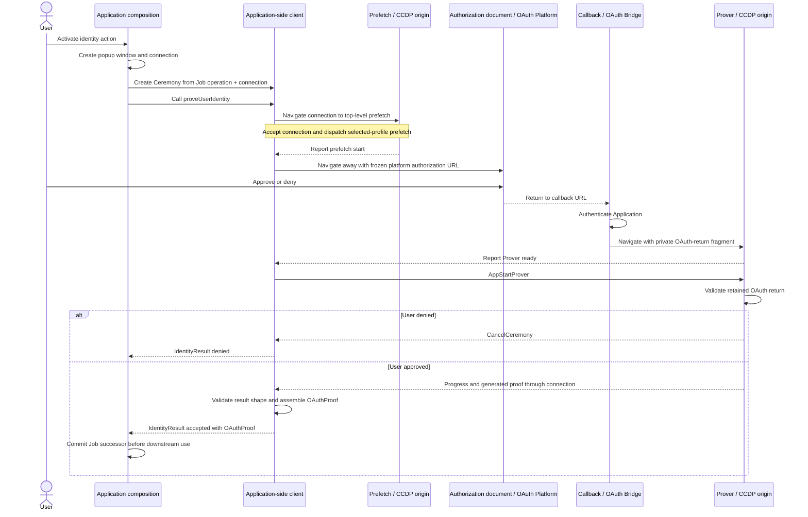

# `@libid/ceremony` architecture

`@libid/ceremony` runs an identity-proof ceremony in the browser. An
application supplies an operation to authorize; the package obtains and proves
platform identity evidence, then returns an `OAuthProof` with prover-extracted
identity details for the downstream Ledger Verifier. Those details are not
authoritative until ledger verification.

This document defines the package boundary, public application API and
configuration, and result lifecycle. The package's browser protocol is defined
in [CCDP.md](CCDP.md), and its static distribution contract in
[CCDP_DISTRIBUTION.md](CCDP_DISTRIBUTION.md); popup lifecycle and communication
are supplied by
[`@libid/popup`](../popup/README.md). Proof-generation internals are defined in
[PROVING.md](PROVING.md). Browser TLSNotary sessions and
signed-attestation handoff are defined in [NOTARIZATION.md](NOTARIZATION.md).
The OAuth bridge's routes, deployment inputs, and callback response policy are
defined in [OAUTH_BRIDGE.md](OAUTH_BRIDGE.md). The package's measurement and
export boundary is defined in [METRICS.md](METRICS.md). This document and the
linked component documents define implementation architecture; CCDP defines
the browser protocol.

The normative libID specification owns the proof statement and authorization
encoding. See the
[common ceremony rules](../../../specs/ceremony-common.md) and
[identity-platform ceremonies](../../../specs/platform-ceremonies.md)
for their exact content. Together, this document, CCDP, and the OAuth bridge
contract
and their linked proof-generation and notarization documents otherwise stand
alone; application job storage and all post-ceremony effects are outside their
scope.
Package acceptance requirements are indexed by [TEST_PLAN.md](TEST_PLAN.md).

The specification's **Ceremony Client** role maps to this package's closed
client, platform implementation, and CCDP [resources](CCDP.md#documents-and-routes)
as a whole. Its
**Ceremony Popup** is the auxiliary browser window containing the CCDP
[documents](CCDP.md#documents-and-routes). `@libid/popup` owns the window and
connection but is not a ceremony-protocol participant.

## System boundary

One ceremony turns an application-owned operation into an `OAuthProof`:



The ceremony owns authorization construction, OAuth, callback handling,
isolated proving, sanitized progress, proof delivery, and prover-side evidence
interpretation. It does not own application jobs, wallet keys or policy,
Registry calls, connectors, transaction submission, finality, React UI, or a
server status service.

External-wallet and native libID wallet compositions use the same ceremony.
They encode their operation into opaque `transactionData` before the ceremony
and interpret it only after the ceremony returns `OAuthProof`. A native wallet
may run key preparation before the ceremony and wallet confirmation afterward;
those sessions do not extend the browser message protocol.

The application origin owns the durable operation record, called the Job. One
application-scoped `CeremonyClient` creates independent `Ceremony` instances.
Each instance owns its in-memory state and handlers on the popup connection
supplied by the composition. Apart from the transient private OAuth-return
fragment handoff, credentials, witnesses, and the generated proof remain in
memory; the package creates no credential store. The
application origin is an authority boundary: it supplies the operation domain
and transaction data, so compromising it already permits authorizing a
different operation. Raw OAuth returns stay in the popup documents and are not
sent to the Application. This narrows transient credential exposure, not
operation authority; the delivered proof still contains the evidence required
by its platform profile. If the application does not assemble and commit the
delivered result before the live connection is lost,
the ceremony restarts with fresh OAuth. Downstream application work may remain
resumable independently.

Prover is one logical CCDP participant. Its [isolation response
contract](CCDP_DISTRIBUTION.md#prover-isolation) and `@libid/popup` own any
browser-dependent document replacement; the ceremony client and CCDP handlers
do not branch on it.

## Ceremony Cross-Document Protocol

[CCDP.md](CCDP.md) defines the protocol between the Application, Callback,
and isolated Prover, including each participant's local lifecycle and
UI. [`@libid/popup`](../popup/README.md) carries it. This document owns only the
package and public client contracts around them.

## Package composition

Launch publishes one `@libid/ceremony` package:

```text
@libid/ceremony
├── ccdp
│   └── index         ceremony records, directional codecs, and protocol version
├── client      CeremonyConfig fetch, application-side API, and orchestration
├── callback    source entrypoint for the versioned CCDP Callback implementation
├── prefetch    source entrypoint for Prefetch, the shared worker, and asset cache
├── prover
│   ├── index          source entrypoint for the isolated Prover and WASM proving
│   └── notarization  internal TLSNotary session and attestation adapter
└── platforms
    ├── index    client-safe platform/version catalog and derived public result types
    ├── authorization  shared digest and PKCE helpers used under platform-version policy
    ├── google/<version>/{client,types,prover}
    ├── x/<version>/{client,types,prover}
    └── github/<version>/{client,types,prover}
```

`ccdp/index` is the pure protocol leaf imported by client, callback,
prefetch, and prover. It performs no platform dispatch, browser work, storage,
network, authorization construction, or cryptographic proof verification.
Those entrypoints use the caller-supplied `@libid/popup` connection without
owning its carriers or continuity machinery.

### CCDP codecs

The implementation represents each CCDP record with one TypeScript interface
and a same-named decoder companion. A shared assertion performs the plain-record,
exact-field-set, and discriminator checks; each companion validates its own
field types and bounds. Decoding returns the received object without coercion,
normalization, defaults, field removal, or replacement allocation.

```ts
const ProverDeliverProof = {
  type: 'prover-deliver-proof',

  decode(value: unknown): ProverDeliverProof {
    assertMessage(value, this.type, ['proof'])
    return value
  },
} as const satisfies MessageType<ProverDeliverProof>
```

Each endpoint registers only its permitted inbound companions with its popup
connection. The connection dispatches by the companion discriminator, invokes
that decoder once, and gives the handler the narrowed record. Direction and
ceremony state remain handler checks. The platform proof stays opaque at this
layer and is validated by the selected platform/version module. There is no
aggregate runtime decoder, global registration, import-time registration, or
plugin API; any aggregate TypeScript union exists only for compile-time
connection typing.

`platforms/authorization`
provides the shared Authorization Digest and PKCE helpers, but each
platform/version slice owns whether and how those helpers participate in its
ceremony. Its `client` leaf owns authorization-request construction and final
assembly and re-exports its
`types` leaf; `types` owns the proof type and side-effect-free runtime validator;
and `prover` owns OAuth-return parsing, progress, witness construction, and
proof generation.
`platforms/index` imports only the client-safe `client` leaves, derives the
catalog and public result types, and is re-exported by the package root and
client API. Prover leaves are internal imports of the prover entrypoint and
never enter the client catalog.
Individual platform leaves never import the aggregator. `callback`,
`prefetch`, and `prover` are build entrypoints, not separately versioned
packages. The CCDP Distribution serves Callback as a cross-origin-loadable
module, embeds Prefetch and Prover entry code directly into their
versioned documents, and serves the Prefetch Service Worker at CCDP's versioned
worker path; internal bundle filenames are deployment details. The Prefetch entrypoint
runs in Window and Service Worker contexts: its
Window branch dispatches the selected asset profile, while its Service Worker
branch composes popup continuity with ceremony-owned asset single flights and
cache. Both Prover responses embed the same entrypoint, which configures
`PopupConnection.accept` with the Distribution's isolation fallback URL.
The popup package owns isolation selection and carrier continuity. Prover
registers its CCDP handlers, awaits connection readiness, and only then emits
`ProverReady` and accepts proof input. It joins the cached flights in the active
top-level document. The OAuth-bridge Callback installs no Worker.
`prover/notarization` is an internal leaf shared by
the X and GitHub prover leaves, not another package entrypoint or artifact.

OAuth Bridge implementations are outside the package. The GitHub version's
prover leaf implements only the bridge-contract browser request/response codecs
and validation; the bridge implements the required confidential endpoint.

The dependency direction is closed:

```text
client, native wallet ───> platforms/index
                                │
                                ▼
                 platforms/<platform>/<version>/client ───> types
                                │
                                ▼
                      platforms/authorization

prover ───> platforms/<platform>/<version>/prover ───> types
                              │
                              └──> platforms/authorization

platforms/{x,github}/<version>/prover ───> prover/notarization

client, callback, prefetch, prover, platforms/index ───> ccdp
client, callback, prefetch, prover ───> @libid/popup
wallet-client ─────────> client + ceremony + wallet/protocol + @libid/popup
```

`ceremony` never imports the client job store or either wallet composition.
The compositions adapt cancellation, progress projection, and the final
result commit around `proveUserIdentity()`. No generic plugin, caller-selected platform
module, validator, or finalizer exists.

The package-facing API surface is:

| Export or entrypoint | Contract |
|---|---|
| `@libid/ceremony` | `PlatformId`, `PlatformCeremonyVersion`, `supportedPlatforms`, `ProofByPlatformVersion`, `OAuthProof`, `Identity`, and `IdentityResult`, derived from the closed platform/version catalog |
| `@libid/ceremony/ccdp` | internal CCDP record types, per-record decoder companions, protocol version, and direction/order checks; no application export |
| `@libid/ceremony/client` | `CeremonyConfig` fetch/validation, application-scoped `CeremonyClient`, stateful `Ceremony` orchestration, and public catalog/result re-exports |
| `@libid/ceremony/callback` | [browser entrypoint](CCDP.md#callback-get-callbackjs) served from the CCDP origin as the versioned Callback implementation |
| `@libid/ceremony/prefetch` | dual-context browser entrypoint embedded by the versioned Prefetch document and served at the versioned Worker path |
| `@libid/ceremony/prover` | [browser entrypoint](CCDP.md#prover-get-prover) embedded by the versioned isolated Prover document |

The API below and the [CCDP records](CCDP.md#messages)
are the launch surface.
Implementation-private helpers may change without changing authority or wire
behavior.

## Application integration

### Client lifecycle

An application creates one client for one configured OAuth bridge:

```ts
import {
  createCeremonyClient,
  supportedPlatforms,
} from '@libid/ceremony/client'

const ceremonies = await createCeremonyClient({
  oauthBridge: 'https://oauth.example',
})
```

This is an application-owned instance, not a package-global singleton. Client
creation fetches and exact-validates `CeremonyConfig`; a configured platform is
enabled only when the installed package has a closed implementation and at
least one advertised ceremony version in common.
One closed catalog derives `PlatformId`, `supportedPlatforms`, supported
versions, and `ProofByPlatformVersion` from the same keys and validators:

```ts
import * as googleV1 from './platforms/google/1/client'
import * as xV1 from './platforms/x/1/client'
import * as githubV1 from './platforms/github/1/client'

const platforms = {
  google: { versions: { 1: googleV1 } },
  x: { versions: { 1: xV1 } },
  github: { versions: { 1: githubV1 } },
} as const

export type PlatformId = keyof typeof platforms

export type SupportedCeremonyVersion<P extends PlatformId> =
  keyof (typeof platforms)[P]['versions'] & number

export type ProofByPlatformVersion = {
  [P in PlatformId]: {
    [V in SupportedCeremonyVersion<P>]:
      (typeof platforms)[P]['versions'][V] extends {
        validateProof(value: unknown): infer Proof
      } ? Proof : never
  }
}

export declare function validateProofMessage<
  P extends PlatformId,
  V extends SupportedCeremonyVersion<P>,
>(
  platformId: P,
  platformCeremonyVersion: V,
  message: ProverDeliverProof,
): ProverDeliverProof & { proof: ProofByPlatformVersion[P][V] }

export const supportedPlatforms: readonly PlatformId[] = Object.freeze(
  Object.keys(platforms) as PlatformId[],
)

interface CeremonyClient {
  readonly enabledPlatforms: readonly PlatformId[]
  new: <P extends PlatformId>(
    ceremonyId: string,
    input: {
      connection: PopupConnection<Message>
      chainId: Uint8Array
      platformId: P
      operationDomain: Uint8Array
      transactionData: Uint8Array
    },
  ) => Ceremony<P>
}
```

`validateProofMessage` dispatches to the selected version's exact `types`
validator and returns the same CCDP envelope with its proof field narrowed to
that validator's derived proof type. Any implementation-only assertion needed
to express the indexed dispatch to TypeScript remains behind this validated aggregation
boundary; the Ceremony Client performs no cast. The CCDP codec layer keeps the
proof opaque and does not import the catalog.

The prover entrypoint imports matching `prover` leaves through an exhaustive
internal dispatch. Adding a platform or version changes the catalog,
implementation, and proof validator together; no mutable registration API or
second platform list exists.

`enabledPlatforms` is the immutable intersection of `supportedPlatforms` and
the exact platform keys in validated `CeremonyConfig` that have at least one
ceremony version in common with the installed implementation. Catalog order is
stable discovery order, not a product ranking; applications may present
another order. Neither array contains OAuth clients, ceremony versions, server
configuration, or display metadata.

The composition selects a Chain Profile and operation per ceremony and supplies
their exact 32-byte `chainId` and `operationDomain` hashes with bounded
`transactionData`. During `new`, the client exact-validates and copies both
hashes without deriving or interpreting them, then treats `transactionData` as
opaque. It requires the selected platform to be enabled by validated
`CeremonyConfig`, chooses the numerically greatest ceremony version supported
both locally and by that platform, generates a fresh 32-byte authorization nonce,
computes the authorization digest and code verifier, and freezes all of those
values before constructing OAuth or allowing OAuth-platform navigation. Client
initialization has already fetched and validated `CeremonyConfig`, so `new`
does only local synchronous work.

`CeremonyClient.new(ceremonyId, input)` accepts a plain string which must be a
lowercase UUIDv4. A composition normally generates one value and calls it
`jobId` in its Job API and `ceremonyId` in this API. The equality is a
composition invariant, not a shared branded type. The identifier is not chain
authorization, but its unpredictability and one-use handling provide browser
continuity. The composition uses the same value as the supplied popup
connection's private `connectionId`; no CCDP message carries it. It is not a
second authorization secret.

`new` chooses the platform ceremony version, generates the fresh authorization
nonce, derives the code verifier from it and the Authorization Digest by the
normative Proof Key for Code Exchange (PKCE) construction where required, and
constructs the authorization request with the [CCDP-defined OAuth
state](CCDP.md#documents-and-routes), and returns the `Ceremony` with its launch
URL ready. OAuth `state` carries the CCDP
routing version plus `ceremonyId`; it is not a second identifier:

```ts
interface Ceremony<P extends PlatformId = PlatformId> {
  readonly launchUrl: string

  onEvent(listener: (event: CeremonyEvent) => void): () => void
  proveUserIdentity(): Promise<IdentityResult<P>>
  cancel(): Promise<void>
}
```

The caller owns launch UI and constructs the popup connection. The ceremony
package never opens a window, renders an anchor, or selects a carrier.
The caller chooses one unique non-reserved browsing-context target, uses it for
both `PopupWindow.open` and the action-specific real anchor, and passes the
resulting connection to `new`. Ceremony exposes only the initial CCDP Prefetch
location as `launchUrl`. The activation handler prevents native navigation only
when scripted popup creation succeeded; otherwise the same activation's anchor
proceeds while the armed connection binds it.

The scripted path is primary and PoC-qualified; the qualified mobile browsers
did not reject it. The real anchor is a hedge against an unqualified browser or
embedding policy returning `null`, not a claim that a launch target is known to
require it.

`proveUserIdentity()` navigates the retained connection to Prefetch using its
bare URL and a separate `URLSearchParams` fragment argument. `launchUrl` is
the equivalent browser URL for the native anchor, not a string passed into
`connection.navigate`. It waits for `PrefetchStarted`, then calls
`connection.navigateAway` with the frozen platform authorization destination
(and a separate fragment argument if that platform uses one), without
disclosing that URL to the Prefetch peer. With native-anchor fallback,
`@libid/popup` binds the anchor-created window while the Application's anchor performs the initial
navigation; ceremony observes only its typed messages. There is no popup
argument to proving and no mutable connection setter.

```ts
function activate(event: MouseEvent) {
  const anchor = event.currentTarget as HTMLAnchorElement
  const ceremonyId = crypto.randomUUID()
  const target = `libid-${ceremonyId}`
  const popupWindow = PopupWindow.open(target)
  const connection = PopupConnection.connect<Message>(popupWindow, {
    connectionId: ceremonyId,
    allowedPopupOrigins: [ccdpOrigin, new URL(redirectUri).origin],
  })
  const ceremony = ceremonies.new(ceremonyId, {
    connection,
    chainId,
    platformId,
    operationDomain,
    transactionData,
  })

  anchor.href = ceremony.launchUrl
  anchor.target = target
  if (popupWindow.opened) event.preventDefault()
  void ceremony.proveUserIdentity()
}
```

Callback authenticates the Application, then navigates directly to Prover
with the captured OAuth query/fragment in a private structured fragment.
`proveUserIdentity()` receives no OAuth return. It accepts one fieldless
`ProverReady` and sends one `AppStartProver` containing the frozen platform,
version, client ID, redirect URI, and nullable code verifier.

The selected Prover leaf validates the retained return against that request,
the CCDP version, and the authenticated connection's ceremony ID. A valid
OAuth denial sends `CancelCeremony`, making the client resolve a denied
`IdentityResult`. Malformed returns and technical failures use
`AbortCeremony` and reject. Only accepted OAuth proceeds to proof execution.
On proof delivery the client structurally validates the selected platform/version
proof, wraps it with retained authorization fields, and resolves an accepted
`IdentityResult`. A locally canceled ceremony ignores any later remote result.

The ceremony never closes its popup. The application composition owns whether
to retain, navigate, or close the window after any result, cancellation, or
failure; a wallet composition may therefore continue its own flow in the same
popup.

The Job is already committed before `proveUserIdentity()` and remains the
composition's current ceremony state while the call runs. Progress may update
its advisory projection, but no pre-proving authority CAS or ceremony callback
exists. The final composition-owned Job CAS is the authority boundary: if
cancellation, expiry, or another transition retired the Job, a late result
cannot commit.

`cancel()` is best-effort ceremony-work and connection cleanup and is called
only after the composition retires its Job. It does not close or navigate the
popup. Losing the application document loses the in-memory Ceremony and
therefore requires fresh OAuth, as already required by the
no-ceremony-recovery launch scope.

### OAuth Bridge configuration

The client fetches and validates the origin-controlled
[`CeremonyConfig`](OAUTH_BRIDGE.md#public-configuration) once, then freezes
the chosen platform, version, client ID, redirect URI, and CCDP origin. CCDP
[resources](CCDP.md#documents-and-routes) never fetch it.

## Result and lifecycle

```ts
interface Identity<P extends PlatformId = PlatformId> {
  platformId: P
  oauthClientId: string
  userId: string
  userName: string
}

interface GoogleProofV1 {
  identity: Identity<'google'>
  identityProof: Uint8Array
  tokenExpiresAt: number        // exact signed exp
  signingKeyModulus: Uint8Array
}

interface XProofV1 {
  identity: Identity<'x'>
  bearerLinkProof: Uint8Array
  tokenAttestation: NotaryAttestation
  identityAttestation: NotaryAttestation
}

interface GitHubProofV1 {
  identity: Identity<'github'>
  bearerLinkProof: Uint8Array
  tokenAttestation: NotaryAttestation
  identityAttestation: NotaryAttestation
}

type OAuthProof<P extends PlatformId = PlatformId> = {
  [K in P]: {
    [V in SupportedCeremonyVersion<K>]: {
      platformId: K
      platformCeremonyVersion: V
      operationDomain: Uint8Array      // exactly 32 bytes
      authorizationNonce: Uint8Array   // exactly 32 bytes
      transactionData: Uint8Array      // bounded opaque bytes
      proof: ProofByPlatformVersion[K][V]
    }
  }[SupportedCeremonyVersion<K>]
}[P]

type IdentityResult<P extends PlatformId = PlatformId> =
  | { status: 'accepted'; oauthProof: OAuthProof<P> }
  | { status: 'denied' }

```

The platform type selected in `CeremonyClient.new` flows through `Ceremony`,
`IdentityResult`, and `OAuthProof`. A literal platform input therefore returns
the corresponding `proof` type; a dynamic `PlatformId` returns the platform
proof union. The mapped-union form preserves the relationship between each
`platformId`, `platformCeremonyVersion`, and proof type when a dynamic result is
narrowed. Adding a platform or version extends the closed catalog, not
`OAuthProof` or CCDP.

Callers do not supply a generic explicitly. A static platform literal flows
through `new` and `proveUserIdentity()`:

```ts
const ceremony = ceremonies.new(jobId, {
  connection,
  chainId,
  platformId: 'google',
  operationDomain,
  transactionData,
})

const result = await ceremony.proveUserIdentity()
if (result.status === 'accepted') {
  result.oauthProof.proof.identity.userName // Google's exact signed email
  result.oauthProof.proof.identityProof     // GoogleProofV1
}
```

Wrappers preserve inference by carrying `P extends PlatformId`; widening either
input or return type to `PlatformId` intentionally widens the result union.

`PlatformCeremonyVersion` is an unsigned 16-bit integer selected by the ceremony client
from the versions advertised in ceremony configuration, never by the caller. It
versions one platform's complete ceremony semantics: authorization-digest
construction, OAuth request and return handling, platform proof construction,
and assembly of the final `OAuthProof`. It does not version a chain, Registry,
or verifier contract; multiple chain-specific Consumers may accept the same
ceremony output.
The selected `PlatformCeremonyVersion` is also the proof-shape discriminator in
`OAuthProof`; there is no independent proof or contract-verifier version. Each
current platform has only version `1`. A new ceremony version must add its own
version slice, proof type, and validator, even when it deliberately retains the
same fields. The caller cannot select a version directly.
`authorizationNonce` is exactly 32 cryptographically random bytes. For X and
GitHub the Ceremony Client derives the code verifier from the Authorization
Digest and that nonce, sends only the derived verifier to the prover, and
retains the nonce until the token exchange has completed. The accepted
`OAuthProof` then publishes `authorizationNonce` so the Platform Verifier can
reproduce the binding. Exact authorization and PKCE encoding are delegated to
the normative ceremony specification.

`OAuthProof<P>` is the single exact wrapper assembled by the Ceremony Client;
its nested `proof` varies by platform and ceremony version. Each version's
`types` leaf owns that proof type and structural validator. Each platform
retains its own proof type even when fields coincide. Proof-byte names describe
the statement: Google's `identityProof` proves its signed identity claims;
X/GitHub's `bearerLinkProof` links the hidden bearer in two attested sessions.

`Identity` is the common prover-extracted view. `oauthClientId` and `userId`
preserve the platform's exact identifier strings. `userName` is Google's signed
email, X's username, or GitHub's login, not a display name or normalized handle.
`platformId` must match the selected platform. No observation time, expiry,
signing key, digest, or proof bytes belong in this shared view.

[`NotaryAttestation`](NOTARIZATION.md#internal-contract) contains the original
`attestedData` and `signature` bytes plus their complete `decoded` view. The
Prover attaches that view from its existing decoder; the Client does not
decode the bytes again. Signed evidence time remains in each attestation's
`decoded.createdAt`, not a second proof-level `metadataObservedAt` field.
The result types are client-safe; importing them does not import the Prover's
decoder or WASM.

`GoogleProofV1` names the circuit's semantic public values rather than exposing
bb.js's ordered field array. The Google adapter's pure
`buildGooglePublicInputs(authorizationDigest, proof)` helper hashes and packs
those values, including `identity.oauthClientId`, `identity.userId`, and
`identity.userName`, into the circuit's exact 56-field verifier input only at the
verifier/transaction-encoding boundary. The Ceremony Client does not call it to
verify the proof. Google has no attestation from which the Platform Verifier
could recover these values, so they remain proof inputs. For X and GitHub,
the Platform Verifiers reconstruct the bearer commitments, client identifier,
identity, and evidence time from verified attestation bytes. Their browser
`identity` and `decoded` fields are convenience views for UI and diagnostics,
not additional verifier inputs.

Neither `OAuthProof` nor its platform proof contains chain ID or Authorization
Digest: the Proof Verifier observes the former from its chain environment and
recomputes the latter. No proof record adds a verifier address, verification
key, caller-selected validity bound, or normalized handle. Ledger serialization
omits the attestation `decoded` views and X/GitHub's convenience `identity`;
it passes the original signed bytes unchanged. Changing a convenience view
cannot change authoritative ledger identity or evidence time.

The Ceremony Client calls `validateProofMessage` with its retained platform and
version, then constructs `OAuthProof` from the typed value and its retained
authorization fields. Validation checks exact shapes, field types, bounds,
and the selected platform identity; it does not parse attestation bytes,
derive identity, repeat prover-side evidence checks, recompute the retained
digest, or cryptographically verify the proof. Prover-side platform code owns
canonical evidence parsing and configured-client checks.
`status: 'accepted'` means the Prover reported successful OAuth/proving and the
Client accepted the result shape, not that the Client authenticated its
contents. UI and diagnostics may use the extracted fields as unverified
information; only Ledger Verifier acceptance makes identity authoritative.

The live `Ceremony` privately retains its ID, copied operation inputs, selected
platform and ceremony version, authorization nonce and digest, OAuth client and
redirect, derived code verifier, and supplied popup connection. A restart creates a fresh Ceremony
with a fresh nonce, digest, and verifier. After proof acceptance, the Job may
store the accepted `IdentityResult` and its public `OAuthProof` fields. Before
acceptance, no Job or IndexedDB index stores the authorization nonce or digest,
code verifier, OAuth-platform credential, or private witness. No separate OAuth-state
value or pre-proof checkpoint is ever persisted.

The ceremony receives no action kind, job revision, chain RPC, Registry client,
wallet key, threshold, fee, connector, transaction submitter, database,
`CryptoKey`, or arbitrary callback. Its output contains the exact `OAuthProof`
but no live bearer credential, private witness, wallet signature, fee quote,
or transaction submission capability.

All records are exact-shape and bounds validated without coercion. Ceremony IDs are
lowercase RFC 4122 UUIDv4 values generated with `crypto.randomUUID()` and are
serialized as the suffix of `v1.<ceremonyId>` OAuth `state`. The code verifier is derived by the
normative PKCE construction. Derived hashes are exact 32-byte `Uint8Array`
values. Unknown fields, aliases, coercions, and
noncanonical encodings fail before use.

## Proof-generation subsystem

[PROVING.md](PROVING.md) defines pipelines, asset use, workers, caching, and
proof delivery; [CCDP_DISTRIBUTION.md](CCDP_DISTRIBUTION.md) defines asset deployment. After
`ProverReady`, the client sends one `AppStartProver`, validates the returned
platform proof's structure, and assembles `OAuthProof`.

## Progress, cancellation, and recovery

```ts
type CeremonyStage =
  | 'authorization'
  | 'proof-generation'

interface PlatformStep {
  code: string
  label: string
  status: 'started' | 'completed' | 'failed'
  progress: number
}

interface CeremonyEvent {
  stage: CeremonyStage
  platformStep: PlatformStep | null
  timestamp: number
}
```

The application-side `Ceremony` client owns the common stage. It enters
`authorization` when `proveUserIdentity()` starts and `proof-generation`
immediately before it sends `AppStartProver` after `ProverReady`.
The latter includes Prover-side OAuth validation, platform steps, proof
delivery, and immediate `OAuthProof` assembly. There is no separate
`oauth-validation` stage: the client does not observe that internal boundary.
The client publishes these transitions from its own control flow; no callback
lifecycle message or platform-step inference changes the common stage.

Each platform-ceremony-version prover leaf owns its closed diagnostic-span
catalog and partial-order rules beside the code which performs it; it cannot
select a common stage. Spans may overlap, and the client otherwise does not
interpret that catalog. `label` is bounded package-owned display text for the
current code, and `progress` is a finite monotonic value in `[0, 1)` derived by
the prover from completed weighted leaf spans. It is advisory milestone
progress, not elapsed time or an estimated completion time. Neither
common-stage nor platform-step events contain operation inputs, outputs,
credentials, identities, witnesses, proofs, raw exceptions, or raw service
errors.

`CeremonyEvent` is advisory. The application may project it into broader Job
progress, but confirmation, submission, and finality remain outside this
package. [CCDP](CCDP.md#4-prover-execution) defines authenticated
connection delivery ordering.

## Versioning and compatibility

`PlatformCeremonyVersion` versions one platform's authorization digest, OAuth
grammar, progress-code lifecycle, circuit, witness, proof pieces, and final
`OAuthProof` assembly. `PlatformConfig.ceremonyVersions` advertises what the
deployment can execute; the client selects the numerically greatest member also
present in its closed local catalog, independent of list or object-key order,
and every live ceremony pins it. Chain-specific contract and
Registry versions are outside this boundary and independently decide which
ceremony outputs they accept.

Changing a status label or tuning presentation weights without changing the
closed progress codes or their causal lifecycle is UI-compatible and does not
increment `PlatformCeremonyVersion` or `CCDPVersion`.

`platforms/authorization` is code reuse, not a second compatibility boundary.
Each platform-version slice owns the helper inputs, outputs, and whether it
uses the shared digest or PKCE construction at all. Changing those semantics
therefore changes that platform's `PlatformCeremonyVersion`; it does not version
the helper independently or force another platform to adopt the change.

The launch protocol intentionally does not split digest, OAuth, proof, and
output-shape versions. A proof change normally changes the assembled
`OAuthProof`; a rare compatible internal change does not justify another
public compatibility axis. One package release may retain older platform-version
validators during its compatibility window.

[`CCDPVersion`](CCDP.md#paths-and-versioning) independently versions CCDP
[resources](CCDP.md#documents-and-routes), navigation, fragments, and browser
messages.
CCDP paths and OAuth `state` select it before protocol code runs;
messages do not repeat it. The OAuth bridge API
namespace remains independent. The popup package's
[`ConnectionVersion`](../popup/CONNECTION.md) independently versions private
connection controls. Local Job schema versioning
remains owned by the client store, while immutable asset revisioning remains a
[CCDP Distribution](CCDP_DISTRIBUTION.md#proving-assets) release concern. A Job which has
already committed OAuthProof has left the ceremony and remains usable under its
composition's own compatibility rules.
