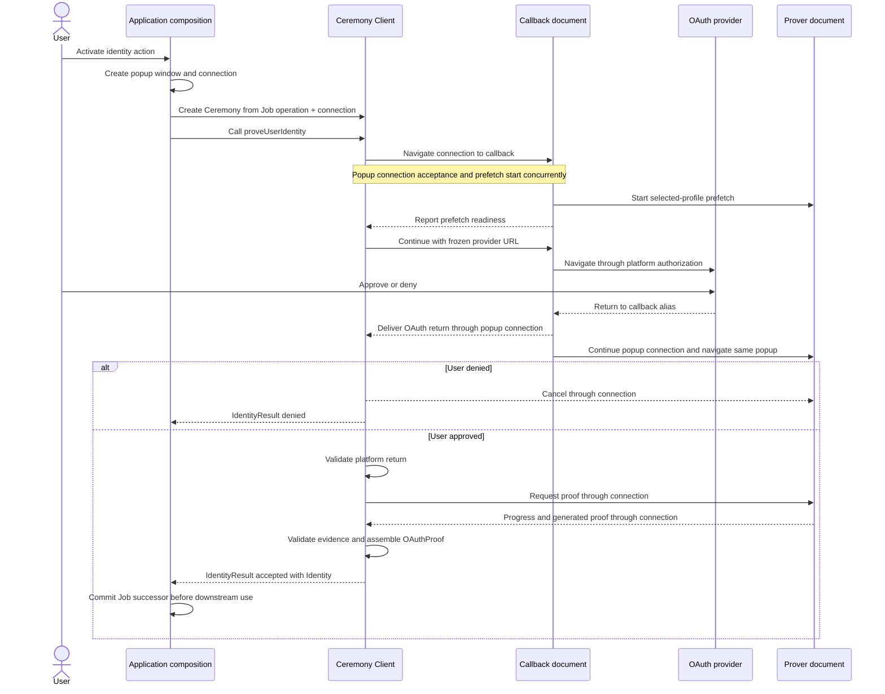

# `@libid/ceremony` architecture

`@libid/ceremony` runs an identity-proof ceremony in the browser. An
application supplies an operation to authorize; the package obtains and proves
platform identity evidence, then returns a locally checked identity preview and
the proof-bearing `OAuthProof` for a Consumer (the downstream proof verifier)
to verify.

This document defines the package boundary, public application API and
configuration, and result lifecycle. The package's browser protocol is defined
in [CCDP.md](CCDP.md); popup lifecycle and communication are supplied by
[`@libid/popup`](../popup/README.md). The callback participant
is defined in [CALLBACK.md](CALLBACK.md), and the prover subsystem in
[PROVER.md](PROVER.md). Browser TLSNotary sessions and
signed-attestation handoff are defined in [NOTARIZATION.md](NOTARIZATION.md).
The integrating server's routes, deployment inputs, and response policy are
defined in [SERVER.md](SERVER.md). The package's measurement and export
boundary is defined in [METRICS.md](METRICS.md). These documents are
implementation architecture, not part of the normative protocol specification.

The normative libID specification owns the proof statement and authorization
encoding. See the
[common ceremony rules](../../../specs/ceremony-common.md) and
[identity-platform ceremonies](../../../specs/platform-ceremonies.md)
for their exact content. Together, this document, CCDP, and the server contract
and their linked callback, prover, and notarization documents otherwise stand
alone; application job storage and all post-ceremony effects are outside their
scope.
Package acceptance requirements are indexed by [TEST_PLAN.md](TEST_PLAN.md).

The specification's **Ceremony Client** role maps to this package's closed
client, callback, prover, and platform implementation as a whole. Its
**Ceremony Popup** is the auxiliary browser window; the package documents
running inside it are the callback and prover. `@libid/popup` owns the window
and connection but is not a ceremony-protocol participant.

## System boundary

One ceremony turns an application-owned operation into a locally checked
identity preview and the exact proof-bearing `OAuthProof`:



The ceremony owns authorization construction, OAuth, callback handling,
isolated proving, sanitized progress, proof delivery, and local evidence
validation. It does not own application jobs, wallet keys or policy,
Registry calls, connectors, transaction submission, finality, React UI, or a
server status service.

External-wallet and native libID wallet compositions use the same ceremony.
They encode their operation into opaque `transactionData` before the ceremony
and interpret it only after the ceremony returns `Identity`. A native wallet
may run key preparation before the ceremony and wallet confirmation afterward;
those sessions do not extend the browser message protocol.

The application origin owns the durable operation record, called the Job. One
application-scoped `CeremonyClient` creates independent `Ceremony` instances.
Each instance owns its in-memory state and handlers on the popup connection
supplied by the composition. The client, callback, and prover
keep credentials, witnesses, and the generated proof only in memory. The
application origin is an authority boundary: it supplies the operation domain
and transaction data, so compromising it already permits authorizing a
different operation. The ceremony does not attempt to hide its transient OAuth
result from other scripts executing in that origin. If the application does
not assemble and commit the delivered result before the live connection is lost,
the ceremony restarts with fresh OAuth. Downstream application work may remain
resumable independently.

### Document-Isolation-Policy evolution

[Document-Isolation-Policy (DIP)](https://wicg.github.io/document-isolation-policy/)
can isolate the prover document itself without applying COOP/COEP to its whole
frame chain. With interoperable browser support, libID could keep the prover in
an isolated cross-origin iframe while the non-isolated ceremony popup retains
its ordinary opener communication. That would remove the top-level
callback-to-prover replacement and its popup-connection continuity machinery. It
would not protect against an OAuth provider response that itself severs the
opener with COOP; an opener-independent popup connection remains necessary for
that independent case.

DIP is an evolution path, not a launch dependency. Status checked 2026-09-02:

| Engine | Current status | Tracker |
|---|---|---|
| Chromium | shipped on desktop in Chrome 137; mobile support must still be qualified independently | [Chrome documentation](https://developer.chrome.com/blog/document-isolation-policy) |
| Gecko | positive standards position; implementation remains open | [Mozilla position](https://github.com/mozilla/standards-positions/issues/1074), [Firefox implementation](https://bugzilla.mozilla.org/show_bug.cgi?id=2063367) |
| WebKit | position and implementation remain open, with continuing implementer demand | [WebKit position](https://github.com/WebKit/standards-positions/issues/399) |

Reconsider the launch topology only after Gecko and WebKit ship compatible
behavior and real-device tests confirm `crossOriginIsolated`,
`SharedArrayBuffer`/WASM threads, cross-origin iframe messaging, asset policy,
and mobile lifecycle behavior. Until then, the top-level isolated prover is the
portable baseline.

## Ceremony Cross-Document Protocol

[CCDP.md](CCDP.md) defines the package-owned protocol between the application,
callback, and isolated prover; [`@libid/popup`](../popup/README.md) carries it;
and [CALLBACK.md](CALLBACK.md) defines the callback's local
state and UI. This document owns only the package and public client contracts
around them.

## Package composition

Launch publishes one `@libid/ceremony` package:

```text
@libid/ceremony
├── ccdp
│   └── index         ceremony records, directional codecs, and protocol version
├── client      CeremonyConfig fetch, application-side API, and orchestration
├── callback    source entrypoint for the CCDP callback root
├── prover
│   ├── index          source entrypoint for the CCDP prover root, workers, WASM, and prefetch
│   └── notarization  internal TLSNotary session and attestation adapter
└── platforms
    ├── index    client-safe platform/version catalog and derived public result types
    ├── authorization  shared digest and PKCE helpers used under platform-version policy
    ├── google/<version>/{client,types,prover}
    ├── x/<version>/{client,types,prover}
    └── github/<version>/{client,types,prover}
```

`ccdp/index` is the pure protocol leaf imported by client, callback, and prover.
It performs no platform dispatch, browser work, storage, network, authorization
construction, or cryptographic proof verification. Those entrypoints use the
caller-supplied `@libid/popup` connection without owning its carriers or
continuity machinery.
`platforms/authorization`
provides the shared Authorization Digest and PKCE helpers, but each
platform/version slice owns whether and how those helpers participate in its
ceremony. Its `client` leaf owns OAuth and final assembly and re-exports its
`types` leaf; `types` owns the proof type and side-effect-free runtime validator;
and `prover` owns progress, witness construction, and proof generation.
`platforms/index` imports only the client-safe `client` leaves, derives the
catalog and public result types, and is re-exported by the package root and
client API. Prover leaves are internal imports of the prover entrypoint and
never enter the client catalog.
Individual platform leaves never import the aggregator. `callback` and `prover`
are build entrypoints, not separately versioned packages. They emit the
immutable roots whose filenames and shell selection are defined by CCDP, plus
worker/WASM assets from one compatible package release. The prover artifact
runs in both Window and Service Worker contexts: its Window branch runs iframe
prefetch or the one active top-level prover, while its Service Worker branch
owns only shared asset single flights and cache.
`prover/notarization` is an internal leaf shared by
the X and GitHub prover leaves, not another package entrypoint or artifact.

Server implementations are outside the package. The GitHub version's prover
leaf implements only the server-contract browser request/response codecs and
validation; the integrating server implements the required confidential
endpoint.

The dependency direction is closed:

```text
client, native wallet ───> platforms/index
                                │
                                ▼
                 platforms/<platform>/<version>/client ───> types
                                │
                                ▼
                      platforms/authorization

prover ───> platforms/<platform>/<version>/prover ───> types
                              │
                              └──> platforms/authorization

platforms/{x,github}/<version>/prover ───> prover/notarization

client, callback, prover, platforms/index ───> ccdp
client, callback, prover ───> @libid/popup
wallet-client ─────────> client + ceremony + wallet/protocol + @libid/popup
```

`ceremony` never imports the client job store or either wallet composition.
The compositions adapt cancellation, progress projection, and the final
Identity commit around `proveUserIdentity()`. No generic plugin, caller-selected platform
module, validator, or finalizer exists.

The package-facing API surface is:

| Export or entrypoint | Contract |
|---|---|
| `@libid/ceremony` | `PlatformId`, `PlatformCeremonyVersion`, `supportedPlatforms`, `ProofByPlatformVersion`, `OAuthProof`, `Identity`, and `IdentityResult`, derived from the closed platform/version catalog |
| `@libid/ceremony/ccdp` | internal CCDP `Message` union and decoders, `CCDPVersion`, and direction/order rules; no application export |
| `@libid/ceremony/client` | `CeremonyConfig` fetch/validation, application-scoped `CeremonyClient`, stateful `Ceremony` orchestration, and public catalog/result re-exports |
| `@libid/ceremony/callback` | [browser entrypoint](CALLBACK.md) implementing the CCDP-selected callback root |
| `@libid/ceremony/prover` | dual-context browser entrypoint implementing the CCDP-selected prover root; its Window branch runs prefetch or proving, while its Service Worker branch owns only package-private asset prefetch and cache |

The API below and the [CCDP records](CCDP.md#closed-message-union)
are the launch surface.
Implementation-private helpers may change without changing authority or wire
behavior.

## Application integration

### Client lifecycle

An application creates one client for one configured server:

```ts
import {
  createCeremonyClient,
  supportedPlatforms,
} from '@libid/ceremony/client'

const ceremonies = await createCeremonyClient({
  server: 'https://identity.example',
})
```

This is an application-owned instance, not a package-global singleton. Client
creation fetches and exact-validates `CeremonyConfig`; a configured platform is
enabled only when the installed package has a closed implementation and at
least one advertised ceremony version in common.
One closed catalog derives `PlatformId`, `supportedPlatforms`, supported
versions, and `ProofByPlatformVersion` from the same keys and validators:

```ts
import * as googleV1 from './platforms/google/1/client'
import * as xV1 from './platforms/x/1/client'
import * as githubV1 from './platforms/github/1/client'

const platforms = {
  google: { versions: { 1: googleV1 } },
  x: { versions: { 1: xV1 } },
  github: { versions: { 1: githubV1 } },
} as const

export type PlatformId = keyof typeof platforms

export type SupportedCeremonyVersion<P extends PlatformId> =
  keyof (typeof platforms)[P]['versions'] & number

export type ProofByPlatformVersion = {
  [P in PlatformId]: {
    [V in SupportedCeremonyVersion<P>]:
      ReturnType<(typeof platforms)[P]['versions'][V]['validateProof']>
  }
}

export declare function validateProofMessage<
  P extends PlatformId,
  V extends SupportedCeremonyVersion<P>,
>(
  platformId: P,
  platformCeremonyVersion: V,
  message: ProverDeliverProof,
): ProverDeliverProof<ProofByPlatformVersion[P][V]>

export const supportedPlatforms: readonly PlatformId[] = Object.freeze(
  Object.keys(platforms) as PlatformId[],
)

interface CeremonyClient {
  readonly enabledPlatforms: readonly PlatformId[]
  new: <P extends PlatformId>(
    ceremonyId: string,
    input: {
      connection: PopupConnection<Message>
      chainId: Uint8Array
      platformId: P
      operationDomain: Uint8Array
      transactionData: Uint8Array
    },
  ) => Ceremony<P>
}
```

`validateProofMessage` dispatches to the selected version's exact `types`
validator and returns the generic CCDP envelope narrowed to that validator's
derived proof type. Any implementation-only assertion needed to express the
indexed dispatch to TypeScript remains behind this validated aggregation
boundary; the Ceremony Client performs no cast. CCDP continues to use
`ProverDeliverProof<unknown>` and does not import the catalog.

The prover entrypoint imports matching `prover` leaves through an exhaustive
internal dispatch. Adding a platform or version changes the catalog,
implementation, and proof validator together; no mutable registration API or
second platform list exists.

`enabledPlatforms` is the immutable intersection of `supportedPlatforms` and
the exact platform keys in validated `CeremonyConfig` that have at least one
ceremony version in common with the installed implementation. Catalog order is
stable discovery order, not a product ranking; applications may present
another order. Neither array contains OAuth clients, ceremony versions, server
configuration, or display metadata.

The composition selects a Chain Profile and operation per ceremony and supplies
their exact 32-byte `chainId` and `operationDomain` hashes with bounded
`transactionData`. During `new`, the client exact-validates and copies both
hashes without deriving or interpreting them, then treats `transactionData` as
opaque. It requires the selected platform to be enabled by validated
`CeremonyConfig`, chooses the numerically greatest ceremony version supported
both locally and by that platform, generates a fresh 32-byte authorization nonce,
computes the authorization digest and code verifier, and freezes all of those
values before constructing OAuth or allowing provider navigation. Client
initialization has already fetched and validated `CeremonyConfig`, so `new`
does only local synchronous work.

`CeremonyClient.new(ceremonyId, input)` accepts a plain string which must be a
lowercase UUIDv4. A composition normally generates one value and calls it
`jobId` in its Job API and `ceremonyId` in this API. The equality is a
composition invariant, not a shared branded type. The identifier is not chain
authorization, but its unpredictability and one-use handling provide browser
continuity. The composition uses the same value as the supplied popup
connection's private `connectionId`; no CCDP message carries it. It is not a
second authorization secret.

`new` chooses the platform ceremony version, generates the fresh authorization
nonce, derives the code verifier from it and the Authorization Digest by the
normative Proof Key for Code Exchange (PKCE) construction where required, and
constructs the authorization request with the [CCDP-defined OAuth
state](CCDP.md#protocol-locations), and returns the `Ceremony` with its launch
URL ready. OAuth `state` carries the CCDP
routing version plus `ceremonyId`; it is not a second identifier:

```ts
interface Ceremony<P extends PlatformId = PlatformId> {
  readonly launchUrl: string

  onEvent(listener: (event: CeremonyEvent) => void): () => void
  proveUserIdentity(): Promise<IdentityResult<P>>
  cancel(): Promise<void>
}
```

The caller owns launch UI and constructs the popup connection. The ceremony
package never opens a window, renders an anchor, or selects a carrier.
The caller chooses one unique non-reserved browsing-context target, uses it for
both `PopupWindow.open` and the action-specific real anchor, and passes the
resulting connection to `new`. Ceremony exposes only the initial CCDP callback
location as `launchUrl`. The activation handler prevents native navigation only
when scripted popup creation succeeded; otherwise the same activation's anchor
proceeds while the armed connection binds it.

The scripted path is primary and PoC-qualified; the qualified mobile browsers
did not reject it. The real anchor is a hedge against an unqualified browser or
embedding policy returning `null`, not a claim that a launch target is known to
require it.

`proveUserIdentity()` navigates the retained connection to `launchUrl`
when direct popup control exists. With native-anchor fallback, connection
binding and navigation are owned by `@libid/popup`; ceremony observes only its
typed messages. There is no popup argument to proving and no mutable connection
setter.

```ts
function activate(event: MouseEvent) {
  const anchor = event.currentTarget as HTMLAnchorElement
  const ceremonyId = crypto.randomUUID()
  const target = `libid-${ceremonyId}`
  const popupWindow = PopupWindow.open(target)
  const connection = PopupConnection.connect<Message>(popupWindow, {
    connectionId: ceremonyId,
    popupOrigin,
  })
  const ceremony = ceremonies.new(ceremonyId, {
    connection,
    chainId,
    platformId,
    operationDomain,
    transactionData,
  })

  anchor.href = ceremony.launchUrl
  anchor.target = target
  if (popupWindow.opened) event.preventDefault()
  void ceremony.proveUserIdentity()
}
```

When `CallbackDeliverParams` arrives on the retained connection,
`proveUserIdentity()` parses its OAuth `state`, exact-matches the CCDP version
and ceremony ID against this instance's frozen values, and consumes that return
once. It then sends the minimal proving inputs, validates the provider return,
performs exchange and proving, constructs the non-authoritative identity preview
and OAuth proof, and resolves with an accepted `IdentityResult`. A valid
ceremony-bound provider denial
resolves with a denied `IdentityResult`; popup closure, malformed return,
invalid proving input, isolation failure, and proving failure are ordinary
ceremony failures, not denial.

The ceremony never closes its popup. The application composition owns whether
to retain, navigate, or close the window after any result, cancellation, or
failure; a wallet composition may therefore continue its own flow in the same
popup.

The Job is already committed before `proveUserIdentity()` and remains the
composition's current ceremony state while the call runs. Progress may update
its advisory projection, but no pre-proving authority CAS or ceremony callback
exists. The final composition-owned Job CAS is the authority boundary: if
cancellation, expiry, or another transition retired the Job, a late Identity
cannot commit.

`cancel()` is best-effort ceremony-work and connection cleanup and is called
only after the composition retires its Job. It does not close or navigate the
popup. Losing the application document loses the in-memory ceremony map and
therefore requires fresh OAuth, as already required by the
no-ceremony-recovery launch scope.

### Server configuration

The client fetches and validates the origin-controlled
[`CeremonyConfig`](SERVER.md#public-configuration) once, then freezes the chosen
platform, version, client ID, and redirect URI. Callback and prover never fetch it.

## Result and lifecycle

```ts
interface GoogleProofV1 {
  honkProof: Uint8Array
  clientId: string              // exact signed aud bytes
  userId: string                // exact signed sub bytes
  email: string                 // exact signed email bytes
  tokenExpiresAt: number        // exact signed exp
  signingKeyModulus: Uint8Array
}

interface XProofV1 {
  honkProof: Uint8Array
  tokenAttestation: NotaryAttestation
  identityAttestation: NotaryAttestation
}

interface GitHubProofV1 {
  honkProof: Uint8Array
  tokenAttestation: NotaryAttestation
  identityAttestation: NotaryAttestation
}

type OAuthProof<P extends PlatformId = PlatformId> = {
  [K in P]: {
    [V in SupportedCeremonyVersion<K>]: {
      platformId: K
      platformCeremonyVersion: V
      operationDomain: Uint8Array      // exactly 32 bytes
      authorizationNonce: Uint8Array   // exactly 32 bytes
      transactionData: Uint8Array      // bounded opaque bytes
      proof: ProofByPlatformVersion[K][V]
    }
  }[SupportedCeremonyVersion<K>]
}[P]

type Identity<P extends PlatformId = PlatformId> = {
  [K in P]: {
    oauthProof: OAuthProof<K>
    platformId: K
    clientId: string
    userId: string
    handle: string
    metadataObservedAt: number
    authorizationDigest: Uint8Array
  }
}[P]

type IdentityResult<P extends PlatformId = PlatformId> =
  | { status: 'accepted'; identity: Identity<P> }
  | { status: 'denied' }

```

The platform type selected in `CeremonyClient.new` flows through `Ceremony`,
`IdentityResult`, and `OAuthProof`. A literal platform input therefore returns
the corresponding `proof` type; a dynamic `PlatformId` returns the platform
proof union. The mapped-union form preserves the relationship between each
`platformId`, `platformCeremonyVersion`, and proof type when a dynamic result is
narrowed. Adding a platform or version extends the closed catalog, not
`OAuthProof` or CCDP.

Callers do not supply a generic explicitly. A static platform literal flows
through `new` and `proveUserIdentity()`:

```ts
const ceremony = ceremonies.new(jobId, {
  connection,
  chainId,
  platformId: 'google',
  operationDomain,
  transactionData,
})

const result = await ceremony.proveUserIdentity()
if (result.status === 'accepted') {
  result.identity.oauthProof.proof.email // GoogleProofV1
}
```

Wrappers preserve inference by carrying `P extends PlatformId`; widening either
input or return type to `PlatformId` intentionally widens the result union.

`PlatformCeremonyVersion` is an unsigned 16-bit integer selected by the ceremony client
from the versions advertised in ceremony configuration, never by the caller. It
versions one platform's complete ceremony semantics: authorization-digest
construction, OAuth request and return handling, platform proof construction,
and assembly of the final `OAuthProof`. It does not version a chain, Registry,
or verifier contract; multiple chain-specific Consumers may accept the same
ceremony output.
The selected `PlatformCeremonyVersion` is also the proof-shape discriminator in
`OAuthProof`; there is no independent proof or contract-verifier version. Each
current platform has only version `1`. A new ceremony version must add its own
version slice, proof type, and validator, even when it deliberately retains the
same fields. The caller cannot select a version directly.
`authorizationNonce` is exactly 32 cryptographically random bytes. For X and
GitHub the Ceremony Client derives the code verifier from the Authorization
Digest and that nonce, sends only the derived verifier to the prover, and
retains the nonce until the token exchange has completed. The accepted
`OAuthProof` then publishes `authorizationNonce` so the Platform Verifier can
reproduce the binding. Exact authorization and PKCE encoding are delegated to
the normative ceremony specification.

`OAuthProof<P>` is the single exact wrapper assembled by the Ceremony Client;
its nested `proof` varies by platform and ceremony version. Each version's
`types` leaf owns that proof type and validator. `NotaryAttestation` reuses the
pinned notary client's exact attested-data-and-signature record and
serialization; the ceremony does not define a second representation. Every
numeric and byte field is exact-shape and bounds checked. Unknown fields are
rejected.

`GoogleProofV1` names the circuit's semantic public values rather than exposing
bb.js's ordered field array. The Google adapter's pure
`buildGooglePublicInputs(authorizationDigest, proof)` helper hashes and packs
those values into the circuit's exact 56-field verifier input only at the
verifier/transaction-encoding boundary. The Ceremony Client does not call it to
verify the proof. Google has no attestation from which the Platform Verifier
could recover these values, so they remain part of `GoogleProofV1`. `XProofV1` and
`GitHubProofV1` need no equivalent fields: their Platform Verifiers reconstruct
the two bearer commitments from their respective verified attestations. Their
client identifier, identity, and evidence time likewise come only from those
signed attestation bytes.

No record contains chain ID or Authorization Digest: the Proof Verifier
observes the former from its chain environment and recomputes the latter. No
record adds a verifier address, verification key, validity bound, normalized
handle, or a second copy of any field already authenticated by a proof or
attestation.
The Ceremony Client uses shared protocol primitives and the selected platform
module to check that exact `OAuthProof` against the live Ceremony's retained
authorization fields, derive the identity preview from locally validated
platform evidence, enforce the platform's canonical encodings and configured
client, and return `Identity` with the same `OAuthProof`. It constructs the
record from those retained fields after `validateProofMessage` returns the
platform-and-version-typed proof value.
The ceremony validates with its retained platform/version and recomputes the
authorization digest before resolving `proveUserIdentity()`. `status: 'accepted'` means the selected parser
classified the provider parameters as success and local checks succeeded; only Consumer
acceptance makes Identity authoritative. Callers cannot supply or override
Identity fields.

The live `Ceremony` privately retains its ID, copied operation inputs, selected
platform and ceremony version, authorization nonce and digest, OAuth client and
redirect, derived code verifier, and supplied popup connection. A restart creates a fresh Ceremony
with a fresh nonce, digest, and verifier. After proof acceptance, the Job may
store the accepted `IdentityResult` and its public `OAuthProof` fields. Before
acceptance, no Job or IndexedDB index stores the authorization nonce or digest,
code verifier, provider credential, or private witness. No separate OAuth-state
value or pre-proof checkpoint is ever persisted.

The ceremony receives no action kind, job revision, chain RPC, Registry client,
wallet key, threshold, fee, connector, transaction submitter, database,
`CryptoKey`, or arbitrary callback. Its output contains the exact `OAuthProof`
but no credential, private witness, wallet signature, fee quote, or transaction
submission capability.

All records are exact-shape validated. `metadataObservedAt` is a nonnegative
safe integer; fractions, infinities, `NaN`, and overflow fail. Ceremony IDs are
lowercase RFC 4122 UUIDv4 values generated with `crypto.randomUUID()` and are
serialized as the suffix of `v1.<ceremonyId>` OAuth `state`. The code verifier is derived by the
normative PKCE construction. Derived hashes are exact 32-byte `Uint8Array`
values. Unknown fields, aliases, coercions, and
noncanonical encodings fail before use.

## Prover subsystem

[PROVER.md](PROVER.md) defines pipelines, assets, workers, caching, and proof
delivery. The client sends one `AppRequestProof`, validates the returned
platform proof, and assembles `OAuthProof` and `Identity`.

## Progress, cancellation, and recovery

```ts
type CeremonyStage =
  | 'authorization'
  | 'oauth-validation'
  | 'proof-generation'

interface PlatformStep {
  code: string
  label: string
  status: 'started' | 'completed' | 'failed'
  progress: number
}

interface CeremonyEvent {
  stage: CeremonyStage
  platformStep: PlatformStep | null
  timestamp: number
}
```

The application-side `Ceremony` client owns the common stage. It enters
`authorization` when `proveUserIdentity()` starts, `oauth-validation` when an
authenticated `CallbackDeliverParams` selects the live Ceremony, and
`proof-generation` immediately before it sends `AppRequestProof`.
`proof-generation` includes platform steps, proof delivery, and immediate
`Identity` construction. The client publishes these transitions from its own
control flow; no callback lifecycle message or platform-step inference changes the
common stage.

Each platform-ceremony-version prover leaf owns its closed diagnostic-span
catalog and partial-order rules beside the code which performs it; it cannot
select a common stage. Spans may overlap, and the client otherwise does not
interpret that catalog. `label` is bounded package-owned display text for the
current code, and `progress` is a finite monotonic value in `[0, 1)` derived by
the prover from completed weighted leaf spans. It is advisory milestone
progress, not elapsed time or an estimated completion time. Neither
common-stage nor platform-step events contain operation inputs, outputs,
credentials, identities, witnesses, proofs, raw exceptions, or raw service
errors.

`CeremonyEvent` is advisory. The application may project it into broader Job
progress, but confirmation, submission, and finality remain outside this
package. [CCDP](CCDP.md#progress-and-proof-delivery) defines authenticated
connection delivery ordering.

## Versioning and compatibility

`PlatformCeremonyVersion` versions one platform's authorization digest, OAuth
grammar, progress-code lifecycle, circuit, witness, proof pieces, and final
`OAuthProof` assembly. `PlatformConfig.ceremonyVersions` advertises what the
deployment can execute; the client selects the numerically greatest member also
present in its closed local catalog, independent of list or object-key order,
and every live ceremony pins it. Chain-specific contract and
Registry versions are outside this boundary and independently decide which
ceremony outputs they accept.

Changing a status label or tuning presentation weights without changing the
closed progress codes or their causal lifecycle is UI-compatible and does not
increment `PlatformCeremonyVersion` or `CCDPVersion`.

`platforms/authorization` is code reuse, not a second compatibility boundary.
Each platform-version slice owns the helper inputs, outputs, and whether it
uses the shared digest or PKCE construction at all. Changing those semantics
therefore changes that platform's `PlatformCeremonyVersion`; it does not version
the helper independently or force another platform to adopt the change.

The launch protocol intentionally does not split digest, OAuth, proof, and
output-shape versions. A proof change normally changes the assembled
`OAuthProof`; a rare compatible internal change does not justify another
public compatibility axis. One package release may retain older platform-version
validators during its compatibility window.

[`CCDPVersion`](CCDP.md#version) independently versions callback/prover roots,
navigation, fragments, and browser messages. Fragments and OAuth `state` select
it before module loading; messages do not repeat it. The ceremony server API
namespace remains independent. The popup package's
[`ConnectionVersion`](../popup/CONNECTION.md) independently versions private
connection controls. Local Job schema versioning
remains owned by the client store, while immutable asset revisioning remains a
release concern. A Job which has already committed Identity has left the
ceremony and remains usable under its composition's own compatibility rules.
