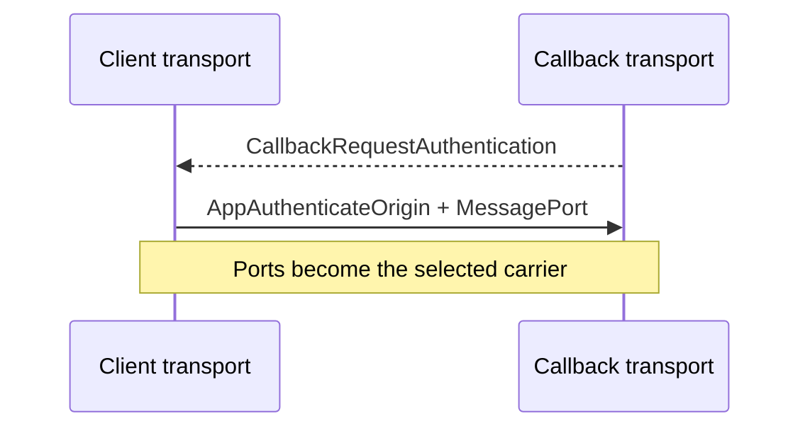

# CCDP MessagePort carrier

This document defines the browser-local carrier used by the concrete CCDP
transport when the returned callback retains its application opener. It owns
callback opener authentication, one `MessageChannel`, and opaque-value
delivery.

[CCDP.md](CCDP.md) defines ceremony messages. [CCDP-TRANSPORT.md](CCDP-TRANSPORT.md)
defines carrier selection, navigation, and cleanup. The
[WebRTC carrier](CCDP-CARRIER-WEBRTC.md) is the opener-severed fallback.

These controls are package-private. They are not CCDP messages, application
APIs, extension points, or durable ceremony state.

## Boundary

The carrier owns:

- callback authentication from browser-stamped source and origin;
- creation of one ceremony-bound `MessageChannel`;
- ordered opaque-value delivery over its two ports; and
- exact local cleanup when binding fails.

It does not parse OAuth, inspect a value, select a carrier, navigate the popup,
persist credentials, or recover a ceremony. The transport moves the callback
endpoint across navigation through the shared handoff.

## Callback authentication

```ts
interface CallbackRequestAuthentication {
  ccdpVersion: CCDPVersion
  type: 'callback-request-authentication'
}

interface AppAuthenticateOrigin {
  type: 'app-authenticate-origin'
  ceremonyId: string
}
```

After first-script URL clearing and extraction of exactly one syntactically
valid OAuth state, the returned callback attempts this carrier only while its
retained opener remains usable. It sends `CallbackRequestAuthentication`
without the ceremony ID or OAuth return. The client transport accepts it only
from the retained popup source at the configured callback origin and expected
CCDP version.

The client transport creates one `MessageChannel`, retains one endpoint, and
sends `AppAuthenticateOrigin` with the other endpoint as the only transferable.
The callback accepts it only from `window.opener`, requires a browser-stamped
origin in its immutable server-provided allowlist, exact-matches the supplied
ceremony ID to OAuth state, and rejects a missing or additional port.

The authentication operation returns the native `MessagePort`; transport wraps
it only after these checks. No ceremony payload crosses the WindowProxy
authentication exchange. Transport sends the opaque callback value and moves
the popup endpoint through the navigation handoff.

An absent, severed, wrong-source, wrong-origin, malformed, or timed-out binding
produces no carrier. The coordinator may commit RTC; a late local reply cannot
replace that selection.

## Failure and security invariants

- Every window control exact-checks browser-stamped source, origin, shape, and
  version against the current binding.
- A transferred application port is accepted exactly once and only after the
  ceremony ID matches cleared OAuth state.
- Wrong, missing, duplicate, replayed, or post-terminal controls fail closed
  without releasing the OAuth return.
- The carrier preserves ordered, nonduplicated structured-clone values and does
  not decode them.
- `MessagePort` closure or context destruction may be silent; neither is a
  ceremony result or recovery signal.
- No `BroadcastChannel`, cookie, IndexedDB record, request body, or URL carries
  the endpoint or OAuth return.

## Sequence


