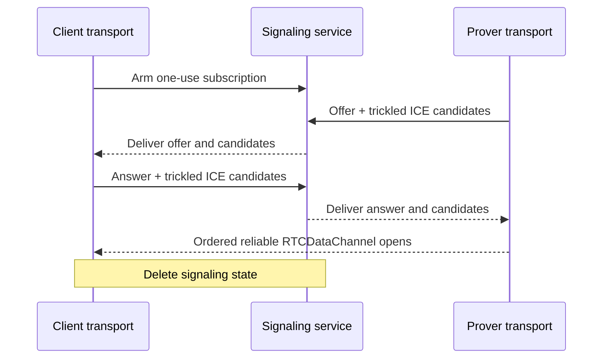

# CCDP WebRTC carrier

This document defines the WebRTC carrier used by the concrete CCDP transport
when provider response policy severs callback opener authentication. It owns
signaling, peer establishment, and opaque-value delivery over one
`RTCDataChannel`.

## Why this carrier exists

The browser-local [MessagePort carrier](CCDP-CARRIER-MESSAGEPORT.md) is simpler,
but cannot establish after response isolation severs the callback's opener.
This follows the [HTML COOP model](https://html.spec.whatwg.org/multipage/browsers.html#cross-origin-opener-policies)
and its unresolved [cross-group opener-messaging limitation](https://github.com/whatwg/html/issues/6364).
No known alternative to WebRTC satisfies the transport constraints after that
severance: cross-site operation, current-engine support, mobile suspension, no
application-origin endpoint, no additional window, and direct browser-local
application messages. WebRTC is therefore the opener-independent fallback. Its
signaling service establishes the peers but never relays application-level
messages.

## Topology

The application page and final top-level prover are the only RTC peers. The
callback never creates an `RTCPeerConnection`; navigation would destroy it. No
iframe, worker, signaling service, or ceremony server terminates the
`RTCDataChannel`.

```text
Application transport      Signaling service      Isolated prover transport
        |<--- SDP / ICE --------->|<--- SDP / ICE --------->|
        |<========== direct RTCDataChannel =================>|

        ---- signaling through service
        ==== direct browser-to-browser application data
```

The client transport arms one bounded, one-use signaling subscription before
provider navigation. Arming creates no peer connection, SDP, ICE candidate, or
ceremony-data record. The client transport closes it unused when MessagePort
wins. When RTC is committed, the final prover creates the offer and the
application answers.

## Signaling service

The signaling service is a bounded rendezvous, not a CCDP carrier. The
application subscribes as answerer and the prover publishes as offerer under
the same fresh, one-use ceremony ID. That random ID correlates requests but
does not authenticate either role. The service exact-checks the application and
ceremony-server origins; signaled DTLS fingerprints bind the resulting channel.
No second ceremony nonce is added.

The signaling contract accepts only:

- one application subscription from an allowed application origin;
- one prover offer from the configured ceremony-server origin;
- one answer;
- bounded trickled ICE candidate updates from the bound roles; and
- terminal connected, failed, or abandoned cleanup.

Records exact-match the caller-supplied application version, ceremony ID, role,
and one live generation. They expire quickly, are consumed once, and never
enter URLs, logs, analytics, or durable storage. The service may delay or deny
the ceremony but cannot read DTLS-protected framed values. The configured
server already supplies browser code, so signaling adds no second signature
system.

The signaling service is selected over the available establishment mechanisms:

| Mechanism | Tradeoff |
| --- | --- |
| Signaling service | Works cross-site, is event-driven, and needs no application-origin endpoint or additional iframe. It carries only bounded SDP and ICE metadata; application messages remain browser-local. |
| Cookie or storage polling | Requires an additional ceremony-server iframe under the application and works only when application and ceremony server are same-site. Browser throttling made PoC signaling take more than one second, comparable to a service round trip, while still not covering cross-site deployments. |
| `BroadcastChannel` or shared worker | Cannot reliably cross the origin and storage-partition boundary between application and ceremony server. |
| Application endpoint or frontend-origin callback page | Can rendezvous the peers, but adds application-specific server or hosting integration that the deployment model excludes. |
| TURN | Solves peer reachability rather than signaling and relays application messages, violating the browser-local transport constraint. |

The selected path therefore works when application and ceremony server are
cross-site without turning the signaling service into an application-message
relay.

## API

Signaling is private carrier machinery. Both endpoints receive the ceremony ID
as a transport-construction input before any CCDP message exists; neither finds
it by inspecting a transported value. The client arms its endpoint before OAuth,
and the final prover connects only after transport commits RTC fallback:

```ts
interface WebRTCEndpointOptions {
  signalingServiceUrl: string
  stunUrls: readonly string[]
  applicationVersion: number
  ceremonyId: string
  signal: AbortSignal
}

declare function armClientWebRTC(
  options: WebRTCEndpointOptions,
): Promise<RTCDataChannel>

declare function connectProverWebRTC(
  options: WebRTCEndpointOptions,
): Promise<RTCDataChannel>

declare function rtcDataChannelCarrier(channel: RTCDataChannel): Carrier
```

`armClientWebRTC` synchronously starts the bounded answerer subscription and
returns a pending channel promise. It creates the answering peer only after a
valid offer arrives. `connectProverWebRTC` creates the offering peer and data
channel, publishes its offer and candidates, and consumes the answer and remote
candidates. Each resolves only after its local channel opens. Internally they
own every signaling request, trickled candidate update, origin-bound role,
timeout, and cleanup operation.

The client transport retains the first promise without awaiting it during
OAuth. MessagePort selection aborts it. Under RTC selection each endpoint
awaits its own operation, adapts its channel, and exposes only the common
carrier API. Abort or establishment failure rejects, closes every reachable
signaling and peer resource, and releases no transported value. No signaling
API is exposed to CCDP or package consumers.

## Peer establishment

The top-level prover creates one ordered reliable `RTCDataChannel` and offers;
the application answers. Neither peer sets `maxPacketLifeTime` nor
`maxRetransmits`.

Both use trickle ICE with deployment-configured STUN servers. They send each
local description as soon as it exists and forward candidates as discovered.
Host and mDNS candidates may connect immediately; server-reflexive candidates
provide the mobile path without depending on mDNS resolution or local-network
permission. ICE completion is diagnostic because the channel may open earlier.

The selected SDP and DTLS fingerprints are immutable for the one generation.
Duplicate signaling records are idempotent; candidate records append only exact
new candidates. Changed descriptions, roles, fingerprints, or accepted
candidates fail. Signaling state is deleted when the channel opens, either side
fails, MessagePort wins, or the bounded expiry passes.

## Frame delivery

The carrier owns binary encoding, bounded framing, fragmentation below the
browser's permitted message size, reassembly, and send-buffer pressure. It
preserves every closed value used by CCDP, including `Uint8Array`, without
changing its logical shape.

A malformed frame, duplicate or missing chunk, inconsistent length, oversized
message, decode failure, or buffer overflow aborts the carrier before transport
delivers the value. The carrier does not inspect that value. Establishment
returns the native `RTCDataChannel`; transport then wraps it. There is one
connection, with no reconnection, carrier switch, or message resend.

## Failure and security invariants

- Signaling carries no OAuth return, proof request, progress, proof, witness,
  attestation, cancellation, or other transported value.
- The application signaling handshake requires an allowed browser-stamped
  `Origin`; the prover handshake requires the exact ceremony-server origin.
- Ceremony ID is fresh, unguessable, one-use, exact-matched to the live client
  transport, and retired when either carrier wins.
- `RTCDataChannel` framing is bounded and cannot add a value outside its
  authenticated connection.
- Signaling loss, ICE failure, channel loss, popup closure, or context
  destruction is never a ceremony result or recovery signal.
- Observable failure clears reachable inputs without selecting another carrier;
  failure may otherwise be silent.

## Sequence


