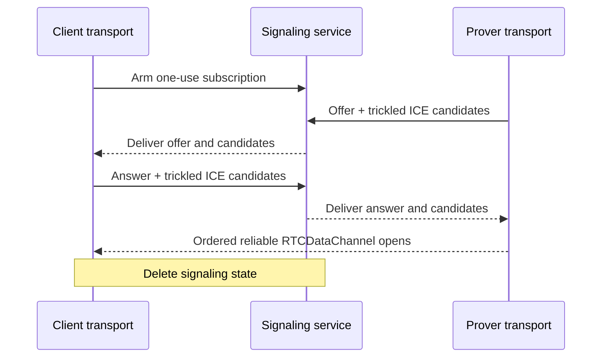

# CCDP WebRTC carrier

This document defines the WebRTC carrier used by the concrete CCDP transport
when provider response policy severs callback opener authentication. It owns
signaling, peer establishment, and opaque-value delivery over one
`RTCDataChannel`.

[CCDP.md](CCDP.md) defines ceremony messages. [CCDP-TRANSPORT.md](CCDP-TRANSPORT.md)
defines carrier selection, callback-to-prover navigation, and cleanup.
The [MessagePort carrier](CCDP-CARRIER-MESSAGEPORT.md) is the preferred
browser-local path. The signaling service API and deployment configuration
remain later server work; this document defines the behavior the carrier needs.

## Why this carrier exists

Authenticated `window.postMessage` followed by one `MessagePort` supplies
browser-stamped origins and exact target-origin delivery without SDP, ICE,
STUN, framing, or a network rendezvous.

A provider may return a callback under a Cross-Origin-Opener-Policy which puts
it in another browsing-context group and severs `window.opener`, its
`WindowProxy`, and any opener-created `MessagePort`. This protects cross-origin
window/process boundaries but removes the browser's narrow authenticated return
channel. See the [WHATWG opener messaging discussion](https://github.com/whatwg/html/issues/6364)
and [HTML COOP model](https://html.spec.whatwg.org/multipage/browsers.html#cross-origin-opener-policies).

WebRTC is therefore a compatibility carrier, not a data relay or preferred
default. A future browser primitive which safely preserves authenticated
cross-group messaging can replace it without changing CCDP messages.

## Topology

The application page and final top-level prover are the only RTC peers. The
callback never creates an `RTCPeerConnection`; navigation would destroy it. No
iframe, worker, signaling service, or ceremony server terminates the
`RTCDataChannel`.

```text
Application client transport
          │
          │ ordered reliable RTCDataChannel
          │
Top-level isolated prover transport
```

The client transport arms one bounded, one-use signaling subscription before
provider navigation. Arming creates no peer connection, SDP, ICE candidate, or
ceremony-data record. The coordinator closes it unused when MessagePort wins.
When RTC is committed, the final prover creates the offer and the application
answers.

## Signaling service

The signaling service is a bounded rendezvous, not a CCDP carrier. The
application subscribes as answerer and the prover publishes as offerer under
the same fresh, one-use ceremony ID. That random ID correlates requests but
does not authenticate either role. The service exact-checks the application and
ceremony-server origins; signaled DTLS fingerprints bind the resulting channel.
No second ceremony nonce is added.

The signaling contract accepts only:

- one application subscription from an allowed application origin;
- one prover offer from the configured ceremony-server origin;
- one answer;
- bounded trickled ICE candidate updates from the bound roles; and
- terminal connected, failed, or abandoned cleanup.

Records exact-match the caller-supplied compatibility tag, ceremony ID, role,
and one live generation. They expire quickly, are consumed once, and never
enter URLs, logs, analytics, or durable storage. The service may delay or deny
the ceremony but cannot read DTLS-protected framed values. The configured
server already supplies browser code, so signaling adds no second signature
system.

No cookie, polling iframe, `BroadcastChannel`, TURN data relay, application
backend endpoint, or frontend-origin callback page participates. The signaling
path therefore works when application and ceremony server are cross-site.

## Peer establishment

The top-level prover creates one ordered reliable `RTCDataChannel` and offers;
the application answers. Neither peer sets `maxPacketLifeTime` nor
`maxRetransmits`.

Both use trickle ICE with deployment-configured STUN servers. They send each
local description as soon as it exists and forward candidates as discovered.
Host and mDNS candidates may connect immediately; server-reflexive candidates
provide the mobile path without depending on mDNS resolution or local-network
permission. ICE completion is diagnostic because the channel may open earlier.

The selected SDP and DTLS fingerprints are immutable for the one generation.
Duplicate signaling records are idempotent; candidate records append only exact
new candidates. Changed descriptions, roles, fingerprints, or accepted
candidates fail. Signaling state is deleted when the channel opens, either side
fails, MessagePort wins, or the bounded expiry passes.

TURN is not required for launch because it would relay ceremony traffic. It may
be added only if real connectivity measurements show material direct-pair
failure; that does not change CCDP messages.

## Frame delivery

The carrier owns binary encoding, bounded framing, fragmentation below the
browser's permitted message size, reassembly, and send-buffer pressure. It
preserves every closed value used by CCDP, including `Uint8Array`, without
changing its logical shape.

A malformed frame, duplicate or missing chunk, inconsistent length, oversized
message, decode failure, or buffer overflow aborts the carrier before transport
delivers the value. The carrier does not inspect that value. Establishment
returns the native `RTCDataChannel`; transport then wraps it. There is one
connection, with no reconnection, carrier switch, or message resend.

## Failure and security invariants

- Signaling carries no OAuth return, proof request, progress, proof, witness,
  attestation, cancellation, or other transported value.
- The application signaling handshake requires an allowed browser-stamped
  `Origin`; the prover handshake requires the exact ceremony-server origin.
- Ceremony ID is fresh, unguessable, one-use, exact-matched to the live client
  transport, and retired when either carrier wins.
- `RTCDataChannel` framing is bounded and cannot add a value outside its
  authenticated connection.
- Signaling loss, ICE failure, channel loss, popup closure, or context
  destruction is never a ceremony result or recovery signal.
- Observable failure clears reachable inputs without selecting another carrier;
  failure may otherwise be silent.

## Sequence


