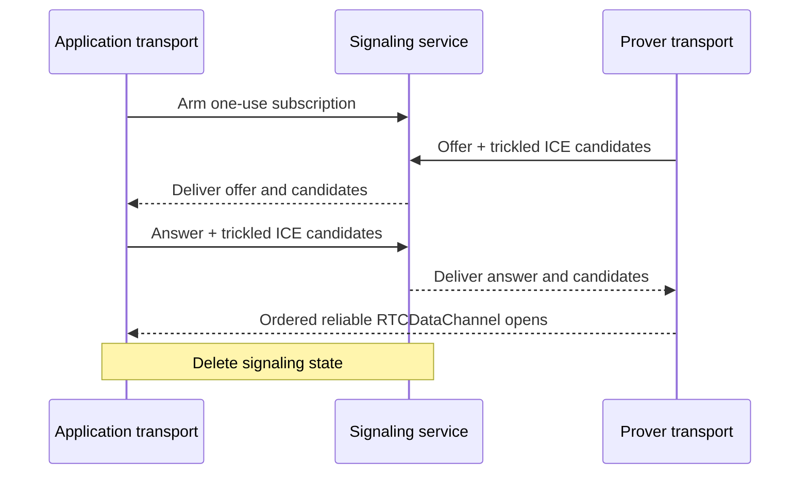

# CCDP WebRTC carrier

This document defines the WebRTC carrier used by the concrete CCDP transport
when provider response policy severs callback opener authentication. It owns
signaling, peer establishment, and logical-value delivery over one
`RTCDataChannel`.

## Why this carrier exists

The browser-local [MessagePort carrier](CCDP-CARRIER-MESSAGEPORT.md) is simpler,
but cannot establish after response isolation severs the callback's opener.
This follows the [HTML COOP model](https://html.spec.whatwg.org/multipage/browsers.html#cross-origin-opener-policies)
and its unresolved [cross-group opener-messaging limitation](https://github.com/whatwg/html/issues/6364).
No known alternative to WebRTC satisfies the transport constraints after that
severance: cross-site operation, current-engine support, mobile suspension, no
application-origin endpoint, no additional window, and direct browser-local
application messages. WebRTC is therefore the available opener-independent
fallback. Its signaling service establishes the peers but never relays
application-level messages. A deployment without TURN accepts that direct ICE
can fail on restrictive networks.

## Topology

The application page and final top-level prover are the only RTC peers. The
callback never creates an `RTCPeerConnection`; navigation would destroy it. No
iframe, worker, signaling service, or ceremony server terminates the
`RTCDataChannel`.

```text
Application transport      Signaling service      Isolated prover transport
        |<--- SDP / ICE --------->|<--- SDP / ICE --------->|
        |<========== direct RTCDataChannel =================>|

        ---- signaling through service
        ==== direct browser-to-browser application data
```

The application transport starts one bounded, one-use signaling subscription
before provider navigation. This creates no peer connection, SDP, ICE candidate,
or ceremony-data record. The application transport closes it unused when
MessagePort wins. When RTC is committed, the final prover creates the offer and
the application answers.

## Signaling service

The signaling service is a bounded rendezvous, not a CCDP carrier. The
application subscribes as answerer and the prover publishes as offerer under
the same fresh, unguessable, one-use ceremony ID. The ID is the rendezvous
capability; the browser-stamped `Origin` restricts which browser role may present
it but is not a general client credential. The service exact-checks the
application and ceremony-server origins. Signaled DTLS fingerprints bind the
resulting channel to the exchanged descriptions but do not independently
authenticate the signaling service. No second ceremony nonce is added.

The signaling contract accepts only:

- one application subscription from an allowed application origin;
- one prover offer from the configured ceremony-server origin;
- one answer;
- bounded trickled ICE candidate updates from the bound roles; and
- terminal connected, failed, or abandoned cleanup.

The live subscription exact-matches the caller-supplied application version,
ceremony ID, and role and lasts only for that ceremony. Once RTC fallback starts,
offer, answer, and candidate state is transient and is deleted when the channel
opens, either side fails or disconnects, MessagePort wins, or the ceremony ends.
Signaling records are consumed once and never enter signaling URLs, logs,
analytics, or durable storage.

An honest service is not on the data path and cannot read DTLS-protected framed
values. A compromised service can replace exchanged fingerprints and
man-in-the-middle the channel, but the signaling service is part of the same
configured ceremony-server trust boundary that supplies both browser programs.
It therefore adds no independent signature or trust system.

The signaling service is selected over the available establishment mechanisms:

| Mechanism | Tradeoff |
| --- | --- |
| Signaling service | Works cross-site, is event-driven, and needs no application-origin endpoint or additional iframe. It carries only bounded SDP and ICE metadata; application messages remain browser-local. |
| Cookie or storage polling | Requires an additional ceremony-server iframe under the application and works only when application and ceremony server are same-site. Browser throttling made PoC signaling take more than one second, comparable to a service round trip, while still not covering cross-site deployments. |
| `BroadcastChannel` or shared worker | Cannot reliably cross the origin and storage-partition boundary between application and ceremony server. |
| Application endpoint or frontend-origin callback page | Can rendezvous the peers, but adds application-specific server or hosting integration that the deployment model excludes. |
| TURN | Solves peer reachability rather than signaling. It relays encrypted DTLS/SCTP packets, placing a service on every packet path and violating the direct browser-local transport constraint, but does not terminate the data channel or read its plaintext. |

The selected path supports cross-site peers without turning the signaling
service into an application-message relay. With STUN only, inability to form a
direct ICE path fails the ceremony rather than selecting another carrier.

## API

Signaling is private carrier machinery. Both endpoints receive the ceremony ID
as a transport-construction input before any CCDP message exists; neither finds
it by inspecting a transported value. The application starts connecting before
OAuth, and the ceremony endpoint connects only after transport commits RTC
fallback:

```ts
interface WebRTCOptions {
  signalingServiceUrl: string
  stunUrls: readonly string[]
  applicationVersion: number
  ceremonyId: string
  signal: AbortSignal
}

declare function connectApplicationWebRTC<M>(
  options: WebRTCOptions,
): Promise<Carrier<M>>

declare function connectCeremonyWebRTC<M>(
  options: WebRTCOptions,
): Promise<Carrier<M>>
```

`connectApplicationWebRTC` synchronously starts the bounded answerer
subscription and returns a pending carrier promise. It creates the answering
peer only after a valid offer arrives. `connectCeremonyWebRTC` creates the
offering peer and data channel, publishes its offer and candidates, and consumes
the answer and remote candidates. Each resolves with an authenticated carrier
only after its local channel opens. Internally they retain the peer connection
and channel and own every signaling request, trickled candidate update,
origin-bound role, timeout, codec, framing, pressure, and cleanup operation.

The application transport observes and retains the first promise without
awaiting it during OAuth, so an early failure produces no unhandled rejection.
MessagePort selection aborts it. Under RTC selection each endpoint awaits its
own operation and exposes only the common carrier API. Abort, carrier closure,
or establishment failure closes every reachable signaling, peer, and channel
resource and releases no transported value. No signaling API or native RTC
resource is exposed to CCDP or package consumers.

## Peer establishment

The top-level prover creates one ordered reliable `RTCDataChannel` and offers;
the application answers. Neither peer sets `maxPacketLifeTime` nor
`maxRetransmits`.

Both use trickle ICE with deployment-configured STUN servers. They send each
local description as soon as it exists and forward candidates as discovered.
Host and mDNS candidates may connect immediately; server-reflexive candidates
provide a mobile path without depending on mDNS resolution or local-network
permission. ICE completion is diagnostic because the channel may open earlier.
Launch configures no TURN server. Networks whose NAT or firewall prevents a
direct path fail closed; this is an explicit availability tradeoff, not a
transport downgrade or recovery signal.

The selected SDP and DTLS fingerprints are immutable for the connection.
Duplicate signaling records are idempotent; candidate records append only exact
new candidates. Changed descriptions, roles, fingerprints, or accepted
candidates fail. Signaling state is deleted when the channel opens, either side
fails or disconnects, MessagePort wins, or the ceremony ends.

## Message delivery

[`RTCDataChannel.send`](https://www.w3.org/TR/webrtc/#dom-rtcdatachannel-send)
accepts strings and binary buffers, not structured-clone objects. This carrier
therefore owns one dependency-free wire codec in addition to bounded framing,
reassembly, and send-buffer pressure. Its logical value domain is `null`,
booleans, finite numbers other than negative zero, strings, dense arrays, plain
records with enumerable own string-keyed data properties, and `Uint8Array`.
It rejects `undefined`, `bigint`, nonfinite numbers, negative zero, sparse
arrays or arrays with non-index properties, symbol or nonenumerable keys,
accessors, functions, cycles, class instances, `Date`, `Map`, `Set`, raw
`ArrayBuffer`, and other platform objects before sending.

The codec recursively replaces each `Uint8Array` with the exact JSON object
`{"$bytes":"<unpadded-base64url>"}`. `$bytes` is reserved and cannot be an
ordinary record key. It then uses `JSON.stringify` and `TextEncoder` to produce
UTF-8 bytes. JSON is selected because it is built into every target browser and
needs no package; CBOR or MessagePack would reduce byte expansion but add a
dependency or custom codec without changing the protocol boundary. The JSON
encoding is not canonical and is never hashed, signed, or otherwise treated as
proof bytes; only each byte tag's base64url spelling is canonical.

One serialized message is sent completely before the next. The ordered reliable
channel needs only two frame forms:

```text
first:         0x01 | uint32be totalLength | payload
continuation:  0x00 | payload
```

The first frame may complete the message. Otherwise continuation payloads append
until exactly `totalLength` bytes have arrived. The carrier fragments below the
retained peer connection's `RTCSctpTransport.maxMessageSize` and its own bounded
chunk cap, and pauses its bounded send queue using `bufferedAmount` and
`bufferedamountlow`. Ordering and the noninterleaving send queue remove the need
for message IDs, chunk indexes, acknowledgements, or a checksum.

On receipt the channel uses `binaryType = 'arraybuffer'`. The carrier exact-checks
the frame sequence and total length, decodes UTF-8 fatally, parses JSON, restores
exact canonical byte tags to `Uint8Array`, validates the generic value domain,
and gives the resulting `unknown` to transport. Transport then selects and calls
its registered `Decoder`; the carrier never reads a message discriminator.

An unexpected start or continuation, incomplete or excess body, oversized
message, invalid UTF-8 or JSON, malformed or noncanonical byte tag, unsupported
value, decode failure, or send-buffer overflow closes the carrier before any
value reaches a handler. The connection functions return the carrier and retain
the native peer and channel privately. There is one connection, with no
reconnection, carrier switch, or message resend.

## Failure and security invariants

- Signaling carries no OAuth return, proof request, progress, proof, witness,
  attestation, cancellation, or other transported value.
- The application signaling handshake requires an allowed browser-stamped
  `Origin`; the prover handshake requires the exact ceremony-server origin.
  Origin restricts browser callers but is not accepted as a standalone client
  credential.
- Ceremony ID is the fresh, unguessable, one-use rendezvous capability. It is
  exact-matched to the live client transport and retired when either carrier
  wins.
- `RTCDataChannel` message encoding and framing are bounded and cannot add a
  value outside its authenticated connection.
- Signaling loss, ICE failure, channel loss, popup closure, or context
  destruction is never a ceremony result or recovery signal.
- Observable failure clears reachable inputs without selecting another carrier;
  failure may otherwise be silent.

## Connection establishment

This diagram shows the logical RTC fallback establishment; it does not define
the signaling-service wire records or show CCDP values.


