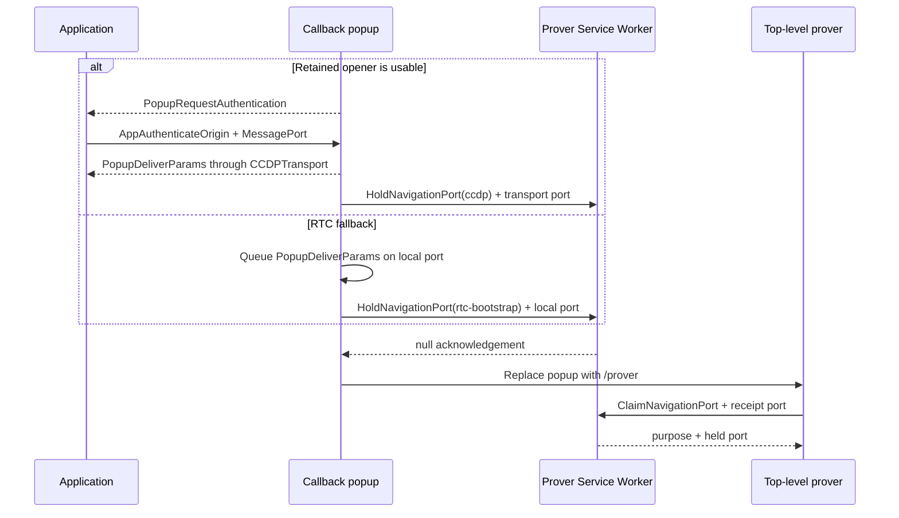

# CCDP MessagePort transport

This document defines the browser-local transport used by the Ceremony
Cross-Document Protocol (CCDP): pre-OAuth popup readiness, callback opener
authentication, `MessageChannel` binding, and the short-lived Service Worker
port courier across callback-to-prover navigation.

The transport-neutral contract, ceremony messages, ordering, and transport
selection are defined in [CCDP.md](CCDP.md). The WebRTC fallback is defined in
[CCDP-RTC.md](CCDP-RTC.md). Popup and prover behavior are defined in
[POPUP.md](POPUP.md) and [PROVER.md](PROVER.md). Server routes, worker scope,
and response policy are defined in [SERVER.md](SERVER.md).

These records and mechanics are package-private browser controls. They are not
members of `CCDPMessage`, application APIs, extension points, or durable
ceremony state.

## Transport boundary

The MessagePort transport owns:

- pre-OAuth readiness over authenticated `window.postMessage` routing;
- callback authentication from browser-stamped source and origin;
- creation of one ceremony-bound `MessageChannel`;
- adaptation of its endpoints to `CCDPTransport`;
- in-memory transfer of one port across immediate same-origin navigation; and
- exact cleanup when binding or transfer fails.

It does not parse a platform OAuth result, select proof semantics, inspect CCDP
payloads after binding, persist credentials, recover a ceremony, or send data
through the ceremony server. The WebRTC transport may reuse only the navigation
port courier to move the cleared OAuth return into the replacement prover; that
does not make its `RTCDataChannel` a MessagePort transport.

## Pre-OAuth readiness

```ts
interface ProverPrefetchingAssets {
  ccdpVersion: CCDPVersion
  type: 'prover-prefetching-assets'
  ceremonyId: string
  platformId: PlatformId
  platformCeremonyVersion: PlatformCeremonyVersion
}
```

On initial launch, the popup exact-validates and clears its fragment's ceremony
ID, platform ID, and ceremony version, then loads
`/api/v1/ceremony/prover#prefetch(ceremonyId, platformId,
platformCeremonyVersion)`. The child clears that fragment, resolves the exact
profile, activates the prover Service Worker, and starts selected-profile
prefetch. It returns `ProverPrefetchingAssets` after registration and dispatch
settle; it does not wait for downloads.

The popup accepts the record only from its exact child at the configured server
origin in the active prefetch phase and forwards it unchanged to each embedded
allowed application origin. The application exact-matches version, ceremony,
profile, server origin, and retained source. A scripted launch already knows
the expected `WindowProxy`; a real-anchor launch atomically binds the matching
source. The application then navigates that source to the frozen provider URL.

Prefetch handles public assets and requires no application reply or transport.
Provider navigation would destroy any early popup endpoint. Missing profile,
document load, registration, or activation fails before OAuth; an ordinary
artifact fetch failure continues on the same cold proving path.

## Callback authentication

```ts
interface PopupRequestAuthentication {
  ccdpVersion: CCDPVersion
  type: 'popup-request-authentication'
}

interface AppAuthenticateOrigin {
  type: 'app-authenticate-origin'
  ceremonyId: string
}
```

After first-script URL clearing and extraction of exactly one syntactically
valid OAuth `state`, the callback attempts this transport only while its retained
opener remains usable. It sends `PopupRequestAuthentication` without the
ceremony ID or OAuth return. The application accepts it only from the retained
popup source at the configured server origin and expected CCDP version.

The application creates one `MessageChannel`, retains one endpoint, and sends
`AppAuthenticateOrigin` with the other endpoint as the only transferable. The
popup accepts it only from `window.opener`, requires a browser-stamped origin in
its immutable server-provided allowlist, exact-matches the supplied ceremony ID
to OAuth state, and rejects a missing or additional port. This exchange binds
the transport to one popup source, application origin, live ceremony, and
protocol version.

The retained application endpoint and callback endpoint each become a
`CCDPTransport`. The callback sends `PopupDeliverParams` through that transport,
then hands its endpoint to the navigation courier. Application replies remain
ordered and queued while ownership moves to the top-level prover.

An absent, severed, wrong-source, wrong-origin, malformed, or timed-out opener
binding releases no OAuth return through this transport. Transport selection then
uses the WebRTC path defined in [CCDP-RTC.md](CCDP-RTC.md); a late local reply
cannot replace the selected transport.

## Navigation port courier

The same-popup top-level prover cannot inherit JavaScript memory across
navigation. The already-active prover Service Worker temporarily holds one
port. It never receives or decodes messages queued on that port.

```ts
type NavigationPortPurpose = 'ccdp' | 'rtc-bootstrap'

interface HoldNavigationPort {
  type: 'hold-navigation-port'
  ceremonyId: string
  purpose: NavigationPortPurpose
}

interface ClaimNavigationPort {
  type: 'claim-navigation-port'
  ceremonyId: string
}
```

There are four `postMessage` operations but only two control schemas:

```text
Callback -> Worker: HoldNavigationPort + held port + receipt port
Worker   -> Callback receipt port: null

Callback replaces itself with /prover

Prover   -> Worker: ClaimNavigationPort + receipt port
Worker   -> Prover receipt port: purpose + held port
```

Both replies travel through fresh one-use receipt ports, so they need no
discriminator or repeated ceremony ID. The hold acknowledgement is `null`. The
claim reply is the exact `NavigationPortPurpose` literal with the held port as
its only transferable.

The first round trip establishes worker ownership before the callback destroys
itself. The second is required because the destination document does not exist
before navigation. Removing the hold acknowledgement reintroduces a race
between worker event handling and the new document's claim; discovering the
new client from the worker would merely replace the explicit claim with a
readiness race.

The callback obtains the active registration with
`navigator.serviceWorker.getRegistration('/api/v1/ceremony/')`. It does not use
`navigator.serviceWorker.ready`, because the developer-configurable callback
path need not be controlled by that scope. The worker exact-validates the
record, purpose, transferable count, duplicate ID, and expiry before storing
the port in memory and acknowledging it.

Only after acknowledgement does the callback replace itself with
`/api/v1/ceremony/prover#ceremonyId`. The clearing top-level bootstrap creates
a fresh `MessageChannel` and contacts the active worker from the same registration
before importing package code or using the network. The worker atomically
removes the matching holder and returns its purpose and port. Both receipt
ports then close.

For `ccdp`, the delivered port is already bound to the application and is
adapted directly to `CCDPTransport`. For `rtc-bootstrap`, the delivered port
contains exactly one queued, bounded `PopupDeliverParams`; the prover consumes
it locally and forwards it only after the RTC transport opens. The worker sees
neither variant's payload.

Service Worker lifetime is required only for this acknowledged, immediate
same-origin navigation—not provider consent time. The hold event remains alive
until claim or a short implementation-bounded expiry. The worker keeps no
durable record, OAuth bytes, proof request, progress, or proof.

## Failure and security invariants

- Every application-facing window record exact-checks browser-stamped source,
  origin, shape, version, and current phase.
- A transferred application port is accepted exactly once and only after the
  ceremony ID matches cleared OAuth state.
- Hold and claim exact-check ceremony ID, purpose, transferable count, phase,
  and one-use ownership.
- Wrong, missing, expired, duplicate, replayed, or post-terminal controls fail
  closed without storage, another window, or a fresh ceremony.
- The worker cannot read a transferred port's queued CCDP or OAuth data.
- Messages queued while an endpoint has no document owner preserve their
  order when the top-level prover claims it.
- `MessagePort` closure or context destruction may be silent; neither is a
  protocol result or recovery signal.
- No `BroadcastChannel`, cookie, IndexedDB record, request body, or URL carries
  the transport endpoint or OAuth return.

## Sequence



The RTC negotiation which follows `rtc-bootstrap` is defined only in
[CCDP-RTC.md](CCDP-RTC.md).
