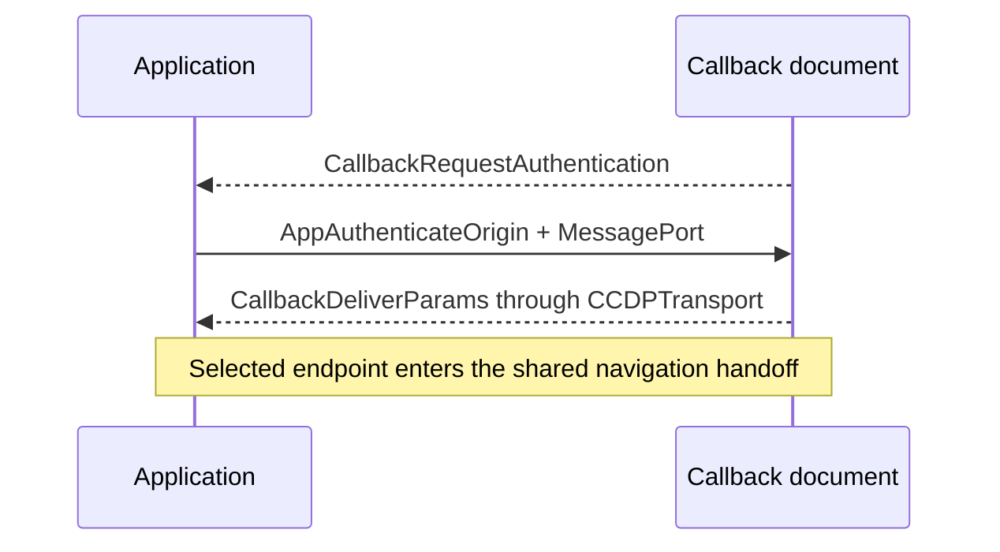

# CCDP MessagePort transport

This document defines the browser-local transport used by the Ceremony
Cross-Document Protocol (CCDP): callback opener authentication and
`MessageChannel` binding.

The transport-neutral contract, ceremony messages, ordering, and transport
selection are defined in [CCDP.md](CCDP.md). The WebRTC fallback is defined in
[CCDP-RTC.md](CCDP-RTC.md). Callback and prover behavior are defined in
[CALLBACK.md](CALLBACK.md) and [PROVER.md](PROVER.md). Server routes, worker scope,
and response policy are defined in [SERVER.md](SERVER.md).

These records and mechanics are package-private browser controls. They are not
members of `CCDPMessage`, application APIs, extension points, or durable
ceremony state.

## Transport boundary

The MessagePort transport owns:

- callback authentication from browser-stamped source and origin;
- creation of one ceremony-bound `MessageChannel`;
- adaptation of its endpoints to `CCDPTransport`;
- exact cleanup when binding fails.

It does not parse a platform OAuth result, select proof semantics, inspect CCDP
payloads after binding, persist credentials, recover a ceremony, or send data
through the ceremony server. Transport selection and the shared
callback-to-prover navigation requirement are defined in [CCDP.md](CCDP.md);
[NAVIGATION-HANDOFF.md](NAVIGATION-HANDOFF.md) defines its implementation. CCDP's
[pre-transport bootstrap](CCDP.md#pre-transport-bootstrap) owns pre-OAuth
readiness.

## Callback authentication

```ts
interface CallbackRequestAuthentication {
  ccdpVersion: CCDPVersion
  type: 'callback-request-authentication'
}

interface AppAuthenticateOrigin {
  type: 'app-authenticate-origin'
  ceremonyId: string
}
```

After first-script URL clearing and extraction of exactly one syntactically
valid OAuth `state`, the callback attempts this transport only while its retained
opener remains usable. It sends `CallbackRequestAuthentication` without the
ceremony ID or OAuth return. The application accepts it only from the retained
popup source at the configured server origin and expected CCDP version.

The application creates one `MessageChannel`, retains one endpoint, and sends
`AppAuthenticateOrigin` with the other endpoint as the only transferable. The
callback accepts it only from `window.opener`, requires a browser-stamped origin in
its immutable server-provided allowlist, exact-matches the supplied ceremony ID
to OAuth state, and rejects a missing or additional port. This exchange binds
the transport to one popup source, application origin, live ceremony, and
protocol version.

The retained application endpoint and callback endpoint each become a
`CCDPTransport`. The callback sends `CallbackDeliverParams` through that transport,
then passes its endpoint to `holdNavigationPort` with this transport's private
`message-port` purpose. Application replies remain ordered and queued while
ownership moves to the top-level prover.

An absent, severed, wrong-source, wrong-origin, malformed, or timed-out opener
binding releases no OAuth return through this transport. CCDP selects its
fallback transport; a late local reply cannot replace the selection.

## Failure and security invariants

- Every application-facing window record exact-checks browser-stamped source,
  origin, shape, version, and current phase.
- A transferred application port is accepted exactly once and only after the
  ceremony ID matches cleared OAuth state.
- Wrong, missing, duplicate, replayed, or post-terminal authentication controls
  fail closed without releasing the OAuth return.
- `MessagePort` closure or context destruction may be silent; neither is a
  protocol result or recovery signal.
- No `BroadcastChannel`, cookie, IndexedDB record, request body, or URL carries
  the MessagePort endpoint or OAuth return.

## Sequence


