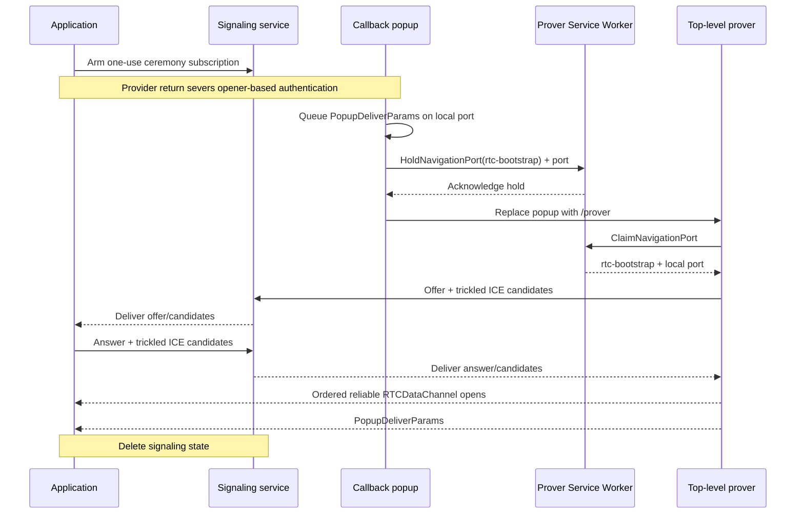

# CCDP WebRTC transport

This document defines the WebRTC transport used when provider response policy has
severed the callback popup's opener relationship and the browser-local
MessagePort transport cannot authenticate. It preserves the same CCDP messages,
transport contract, one-popup UX, and server-independent ceremony data path.

The transport-neutral contract and selection rule are defined in
[CCDP.md](CCDP.md). Browser-local authentication and the navigation port
courier are defined in [CCDP-MESSAGEPORT.md](CCDP-MESSAGEPORT.md). The signaling
service API and deployment configuration are intentionally left to later server
work; this document defines only the behavior the transport requires.

## Why this transport exists

Authenticated `window.postMessage` followed by one `MessagePort` is the simpler
transport. It supplies browser-stamped origins and exact target-origin delivery
without SDP, ICE, STUN, signaling state, framing, or a network rendezvous.

A provider may nevertheless return a callback under a Cross-Origin-Opener-
Policy which places it in another browsing-context group and severs
`window.opener`, its `WindowProxy`, and any opener-created `MessagePort`. That policy
protects cross-origin window/process boundaries; the loss of a narrow,
authenticated return transport is a limitation of the browser model rather than
a ceremony requirement. The relevant standards context is the
[WHATWG opener messaging discussion](https://github.com/whatwg/html/issues/6364)
and the current
[HTML COOP model](https://html.spec.whatwg.org/multipage/browsers.html#cross-origin-opener-policies).

WebRTC is therefore a compatibility transport, not a data relay or preferred
default. A future browser primitive which safely preserves authenticated
cross-group messaging can replace it without changing `CCDPMessage`.

## Topology and activation

The application page and final top-level `/prover` document are the only RTC
peers. The callback popup never creates an `RTCPeerConnection`: its immediate
replacement navigation would destroy it. No application iframe, worker,
signaling service, or ceremony server terminates the `RTCDataChannel`.

```text
Application / Ceremony Client
          │
          │ ordered reliable RTCDataChannel
          │
Top-level isolated /prover
```

The application arms one bounded, one-use signaling subscription for the live
ceremony before provider navigation. Arming creates no peer connection, SDP,
ICE candidate, or ceremony-data record. It is necessary because a severed
callback has no browser-local event with which to wake the application. A
successful MessagePort binding closes the unused subscription before any RTC
offer exists.

When local callback authentication is unavailable, the callback:

1. clears and bounds the provider return and extracts its ceremony ID;
2. queues exactly one `PopupDeliverParams` on a fresh local `MessagePort`;
3. asks the navigation courier to hold the peer port with purpose
   `rtc-bootstrap`; and
4. after acknowledgement, replaces itself with the top-level prover.

The prover claims that port before package import or network use, consumes the
single queued return in memory, and then creates the RTC offer. The raw return
never enters signaling, storage, a request, or another URL. The Service Worker
cannot read it.

## Signaling service

The signaling service is a bounded rendezvous, not a CCDP transport. The
application subscribes as answerer and the prover publishes as offerer under
the same fresh, one-use ceremony ID. That ID is already a cryptographically
random UUIDv4 OAuth state and is sufficient as the rendezvous capability; the
transport adds no second ceremony nonce.

The eventual signaling contract must accept only:

- one application subscription from an allowed application origin;
- one prover offer from the configured ceremony server origin;
- one answer;
- bounded trickled ICE candidate updates from the bound roles; and
- terminal connected, failed, or abandoned cleanup.

Records exact-match CCDP version, ceremony ID, role, phase, and one live
generation. They expire quickly, are consumed once, and are never placed in
URLs, logs, analytics, or durable storage. The service may delay or deny the
ceremony, but it cannot read DTLS-protected CCDP data. The configured server is
already a browser-code supply-chain boundary, so the transport does not add a
second signature system around its signaling records.

No cookie, polling iframe, `BroadcastChannel`, TURN data relay, application
backend endpoint, or frontend-origin callback page participates. The same
service path therefore works when the application and ceremony server are
cross-site.

## Peer establishment

The top-level prover is the offerer and creates one ordered, reliable
`RTCDataChannel`. The application is the answerer. Neither sets `maxPacketLifeTime` nor
`maxRetransmits`.

Both peers use trickle ICE with the deployment's configured STUN servers. They
send the local description as soon as it exists and then forward candidates as
they are discovered. Host and mDNS candidates may connect immediately;
server-reflexive candidates provide the ordinary mobile path without depending
on mDNS resolution or local-network permission. ICE completion is diagnostic:
the `RTCDataChannel` may open earlier.

The selected SDP and its DTLS fingerprints are immutable for the one
generation. Duplicate signaling records are idempotent; candidate records may
only append exact new candidates. Changed descriptions, roles, fingerprints,
or accepted candidate entries fail. Signaling state is deleted when the `RTCDataChannel`
opens, either side fails, the ceremony selects MessagePort, or the bounded
expiry passes.

TURN is not required for launch because it would relay ceremony traffic. It may
be added only if real connectivity measurements show that direct candidate
pairs fail materially; doing so does not change CCDP messages.

## `CCDPTransport` adaptation

`RTCDataChannel` is configured for ordered, reliable delivery and adapted to
the same `CCDPTransport` interface as MessagePort. The implementation owns binary
encoding, bounded framing, fragmentation below the browser's permitted message
size, reassembly, and send-buffer pressure. Those mechanics are private to this
transport; adding a platform does not change them.

Decoded values enter CCDP as `unknown` and pass the same exact directional and
phase validators as MessagePort values. Encoding preserves every closed CCDP
value used by the package, including `Uint8Array`, without changing its logical
shape. A malformed frame, duplicate or missing chunk, inconsistent length,
oversized message, decode failure, or buffer overflow aborts the transport before
the value reaches CCDP.

After `RTCDataChannel.onopen`, the prover forwards the queued
`PopupDeliverParams` unchanged as the first CCDP message. The application then
classifies the OAuth result and sends `AppRequestProof` or
`AppCancelCeremony`. Progress, proof delivery, cancellation, and technical
failure use the same transport. There is no second connection, reconnection,
mid-ceremony transport switch, or proof-request resend.

## Selection and race behavior

MessagePort has priority while the callback can authenticate its retained
opener. RTC activates only after that path is observably unavailable or its
bounded authentication deadline expires.

Selection is one-shot in the application ceremony state:

- a valid `AppAuthenticateOrigin` selects MessagePort and closes signaling;
- an accepted prover offer selects RTC and makes a late local bootstrap inert;
- only one selected transport may deliver `PopupDeliverParams`; and
- transport loss does not select the other transport or recover the ceremony.

The prover offer cannot race a still-live callback because it is created only
after the callback has committed `rtc-bootstrap`, received the worker
acknowledgement, and replacement-navigated. Concurrent ceremonies use distinct
ceremony IDs, signaling entries, worker holders, peer connections, and
`RTCDataChannel` instances.

## Failure and security invariants

- Signaling carries no OAuth return, proof request, progress, proof, witness,
  attestation, or cancellation payload.
- The application signaling handshake requires an allowed browser-stamped
  `Origin`; the prover handshake requires the exact ceremony server origin.
- Ceremony ID is fresh, unguessable, one-use, exact-matched to the live
  application ceremony, and retired when either transport wins.
- The final prover verifies cross-origin isolation and shared memory before
  credential-bearing work under either transport.
- `RTCDataChannel` framing is bounded and cannot add a platform, message type, or
  extension outside the exact CCDP validators.
- Unexpected signaling loss, ICE failure, `RTCDataChannel` loss, popup closure, or
  context destruction is never success, denial, cancellation, or recovery.
- Failure may be silent. When observable, it rejects the live ceremony and
  clears reachable inputs without trying another transport.

## Sequence


