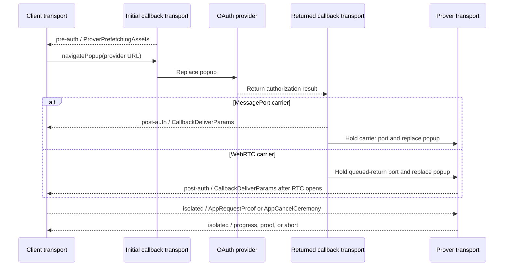

# CCDP transport

This document defines the package-private transport coordinator used by the
Ceremony Cross-Document Protocol (CCDP). It owns browser-phase routing,
application/popup endpoint lifecycles, carrier selection, navigation, and
cleanup. It does not own ceremony message semantics.

[CCDP.md](CCDP.md) defines the messages and their valid phases. The
[MessagePort](CCDP-CARRIER-MESSAGEPORT.md) and
[WebRTC](CCDP-CARRIER-WEBRTC.md) documents define the two carriers. The shared
[navigation handoff](NAVIGATION-HANDOFF.md) moves an opaque port across the
callback-to-prover navigation.

## Boundary

`CCDPTransport` is one concrete package component, not an interface implemented
by each carrier. It owns:

- the application endpoint and each short-lived popup-document endpoint;
- exact source, origin, ceremony, version, and phase binding;
- phase-stamped delivery to CCDP handlers;
- MessagePort-first carrier selection and WebRTC fallback;
- callback-to-prover navigation and port handoff; and
- one-shot closure and race resolution.

It does not parse OAuth, inspect proof values, know platform steps, persist a
ceremony, or hardcode CCDP message types. Message codecs registered by CCDP own
message-specific validation. Carriers move opaque transport frames and cannot
select a handler.

## Concrete endpoints

The module has two named constructors:

```ts
const clientTransport = CCDPTransport.client({
  ceremonyId,
  ccdpVersion,
  callbackOrigin,
  expectedPopup,
  signaling,
})

const popupTransport = CCDPTransport.popup({
  ceremonyId,
  ccdpVersion,
  phase,
  allowedAppOrigins,
  signaling,
})
```

The application creates one client endpoint for the live ceremony. It survives
the entire attempt and owns the retained popup source, the idle signaling
subscription, carrier selection, handlers, and cleanup.

Each package document inside the popup creates a fresh popup endpoint after
classifying and clearing its trusted bootstrap input:

| Document lifetime | Phase |
|---|---|
| Initial callback before provider navigation | `pre-auth` |
| Returned callback after provider authorization | `post-auth` |
| Top-level isolated prover | `isolated` |

Here `auth` means provider authorization. The phase does not claim that a
transport or identity has already been authenticated.

Both endpoints expose the same package-private operations:

```ts
type TransportPhase = 'pre-auth' | 'post-auth' | 'isolated'

transport.on(phase, codec, handler)
transport.send(phase, message)
transport.navigatePopup(url)
transport.close()
```

`codec` supplies the message discriminator and exact decoder. `on` returns an
unsubscribe function. The transport uses only the phase and discriminator to
dispatch; it does not contain a switch over CCDP message names. `send` queues an
already validated value and is not a delivery acknowledgement. `close` is
idempotent and sends no ceremony result.

`navigatePopup` is available only to package control flow. On the client side it
navigates the exact retained popup to the frozen provider URL. On the popup side
it performs the required acknowledged handoff before replacing the callback
with the prover. It accepts no caller-selected transport, carrier, phase, or
handoff purpose.

## Frames and phase routing

The transport wraps each logical value in an internal frame:

```ts
interface TransportFrame {
  phase: TransportPhase
  message: unknown
}
```

Once a carrier is selected, its transport instance already binds ceremony ID
and CCDP version, so post-binding frames repeat neither. The pre-auth
`ProverPrefetchingAssets` message carries its ceremony ID and version because it
also binds the real-anchor popup source before a carrier exists.

The transport exact-validates the frame and current phase before invoking the
registered codec. CCDP owns the message-to-phase rules:

| Phase | CCDP traffic |
|---|---|
| `pre-auth` | selected-profile `ProverPrefetchingAssets` readiness |
| `post-auth` | one `CallbackDeliverParams` or observable callback `AbortCeremony` |
| `isolated` | proof request, cancellation, prover progress, proof delivery, and technical abort |

The phase records the logical protocol lane, not necessarily the document which
physically forwards it. In the RTC path the callback creates the `post-auth`
frame, the navigation handoff preserves it locally, and the isolated prover
forwards it after RTC opens. The application still dispatches it to the
`post-auth` handler.

Private carrier controls—opener authentication, SDP, ICE, and navigation-port
receipts—are not transport frames or CCDP messages.

## Lifecycle

### Pre-auth

The client endpoint retains the expected popup when scripted opening succeeds
and arms one idle RTC signaling subscription. The initial callback endpoint
loads the same-origin prover prefetch child. Its matching
`ProverPrefetchingAssets` is delivered through the `pre-auth` WindowProxy path.

The client exact-checks callback origin, source when already known, ceremony,
version, and selected profile. A real-anchor launch binds the observed source at
this point. Its CCDP handler then calls `navigatePopup` with the already frozen
provider URL. This phase does not choose MessagePort or RTC.

### Post-auth

Provider navigation destroys the initial popup endpoint. The returned callback
clears its URL, extracts the one ceremony ID from OAuth state, and creates a
`post-auth` popup endpoint. The transport chooses one path:

1. A usable retained opener completes the MessagePort carrier's exact
   source/origin authentication. The callback sends one post-auth
   `CallbackDeliverParams` frame through that carrier.
2. An absent, severed, invalid, or timed-out opener commits the RTC path. The
   callback queues the same frame on a local port without sending it through
   signaling.

MessagePort has priority until the callback commits the RTC path. The client
atomically accepts the first valid selection; late authentication, signaling,
or messages from another path are inert. A selected path never migrates to the
other carrier after failure.

### Isolated

The callback endpoint passes either the application-bound MessagePort endpoint
or the local queued-return port to the navigation handoff, waits for its
acknowledgement, and replaces itself with the top-level prover. The prover's new
`isolated` popup endpoint claims the port before package import or network use.

- A MessagePort holder resumes the already selected carrier; queued isolated
  frames remain ordered while ownership moves.
- An RTC-bootstrap holder yields the post-auth callback frame. The prover opens
  the RTC carrier through the pre-armed signaling subscription and forwards
  that frame first.

The application then sends isolated proof or cancellation traffic. The prover
sends isolated progress, proof delivery, or technical abort traffic. No later
opener, navigation, carrier selection, or reconnection exists.

## Carrier contract

Each carrier supplies ordered, nonduplicated opaque-frame delivery and
idempotent local closure. MessagePort adapts a browser `MessagePort`; WebRTC
adapts one ordered reliable `RTCDataChannel` and privately owns encoding,
framing, and buffering.

Carriers expose no ceremony message, platform, phase transition, popup
navigation, recovery, or application API. Remote context loss may be silent,
so the coordinator promises no remote-close notification under either carrier.

## Race and failure rules

- Every window exchange exact-checks browser-stamped source and origin before
  binding or releasing a value.
- One live ceremony accepts one popup source, one carrier, one callback return,
  and one isolated proof attempt.
- Wrong, stale, duplicate, replayed, out-of-phase, or post-terminal frames
  change no state.
- Signaling carries no transport frame or ceremony payload.
- Handoff failure prevents callback-to-prover navigation with live state.
- Carrier, popup, worker, or context loss is never success, denial,
  cancellation, or recovery.
- Observable failure rejects the live ceremony and clears reachable inputs;
  unobservable loss may strand it until caller cancellation.

## Sequence



The MessagePort carrier may deliver the post-auth frame before navigation;
the RTC carrier delivers it after the prover opens RTC. Phase dispatch makes
that physical difference invisible to CCDP.

## Versioning

`CCDPVersion` covers phase names, frame semantics, endpoint binding, carrier
selection, and navigation continuity as well as logical messages. Carriers and
the same-release navigation handoff have no separately negotiated version. A
compatible implementation may change internal framing, ICE policy, worker
controls, or equivalent browser mechanics without changing the transport
contract.
