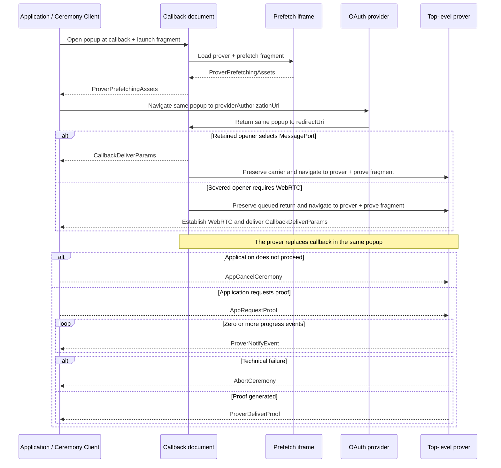

# Ceremony Cross-Document Protocol (CCDP)

This document defines the closed browser protocol used by `@libid/ceremony`
across the application, callback, and isolated prover. It owns ceremony
locations, navigations, messages, ordering, and protocol compatibility.

The concrete [CCDP transport](CCDP-TRANSPORT.md) authenticates, decodes, and
delivers these messages without interpreting them. Shared package types such as
`PlatformId`, `PlatformCeremonyVersion`, and `PlatformStep` retain their
definitions in [ARCHITECTURE.md](ARCHITECTURE.md). These documents are
implementation architecture, not part of the normative proof specification.

## Protocol boundary

| Context | Owns | Browser constraint |
|---|---|---|
| Application page | operation inputs, live `Ceremony`, message ordering, and protocol result | has application-defined headers and lifecycle; may be cross-site from the ceremony server |
| Callback | OAuth navigation, return capture, and transition to proving | remains top-level and non-isolated; it either selects MessagePort or queues the return for WebRTC before the isolated prover replaces it, and its configured alias is the registered server-hosted `redirect_uri` |
| Prover | credentials after callback, visible progress, and proof generation | reuses the popup's top-level browsing context under COOP/COEP isolation |

CCDP is transport-neutral. It defines which document runs at each location,
which participant initiates each navigation, what each message means, and their
order. Transport owns how values cross browser documents and carriers and
invokes CCDP's registered per-message `Decoder` before delivery. Callback,
prover, and client code execute the defined transitions, register only their
permitted inbound messages, and enforce state and order.

## Version

```ts
type CCDPVersion = 1
```

`CCDPVersion` covers internal locations, navigation order, `Message`, its
direction, validation, and transport-binding semantics. The transport's private
controls are independently exact-bound by `TransportVersion`.

## Protocol locations

One live `Ceremony` freezes `serverOrigin`, `redirectUri`,
`providerAuthorizationUrl`, ceremony ID, platform ID, and platform ceremony
version before launch. CCDP uses the following browser locations:

| Location | Browser context | Exact form |
|---|---|---|
| Popup reservation | popup | `about:blank` |
| Initial callback | popup | `${serverOrigin}/api/v1/ceremony/callback#launch?ceremonyId=<uuid>&platformId=<id>&ceremonyVersion=<uint>` |
| Selected-profile prefetch | callback child iframe | `${serverOrigin}/api/v1/ceremony/prover#prefetch?platformId=<id>&ceremonyVersion=<uint>` |
| Platform authorization | popup | the frozen `providerAuthorizationUrl` defined by the selected platform ceremony version |
| Provider return | popup | the frozen `redirectUri` followed by the provider-defined query or fragment return |
| Proof generation | popup | `${serverOrigin}/api/v1/ceremony/prover#prove?ceremonyId=<uuid>` |

Internal fragments use the literal mode, `?`, and URL-search-parameter encoding
shown above. Producers emit each named field exactly once in the displayed
order. Receivers require the exact field set, reject duplicates, and otherwise
do not depend on parameter order. Ceremony IDs are lowercase UUIDv4 values;
platform IDs and version bounds are defined by the package catalog.

The launch and prover routes have no query. Their fragments never reach the
server and are copied and cleared before rendering, module import, storage, or
network use. The receiving participant exact-validates the cleared copy before
any protocol action. No OAuth return, credential, proof input, or proof is
placed in an internal fragment. The provider-mandated query on `redirectUri`
is the only protocol exception.

The prefetch location carries only the selected public profile. It needs no
ceremony ID: the callback binds its one child by browser source, and the child
does not join the application transport.

The selected platform ceremony version owns the exact provider authorization
and return grammar. Where the platform uses them, the authorization request
contains the live ceremony ID as OAuth `state` and the frozen `redirectUri` as
`redirect_uri`. CCDP owns the surrounding popup navigation but does not
duplicate platform fields. `redirectUri` is the exact absolute configured
callback alias for that platform; its default path is `/auth/v1/callback`.

## End-to-end sequence



Private carrier handshakes and URL clearing are omitted from the diagram but
are required at the transitions below.

## Protocol phases

### 1. Launch and prefetch

The scripted launch reserves the named popup at `about:blank`, then application
transport navigates that exact `WindowProxy` to the initial callback location.
The real-anchor fallback navigates directly to the same location and binds its
browser-stamped source through the authenticated initial WindowProxy delivery.

The callback clears and validates the launch fragment, constructs transport,
and loads exactly one selected-profile prefetch iframe. The iframe clears and
validates its own fragment, dispatches prefetch, and reports readiness to its
exact parent. The callback forwards the same logical value to the application:

```ts
interface ProverPrefetchingAssets {
  type: 'prover-prefetching-assets'
}
```

`ProverPrefetchingAssets` is delivered through the authenticated WindowProxy
path before carrier selection. It states that prefetch for the selected public
profile has been dispatched; it does not promise that downloads completed and
grants no authority. The callback already received and validated the selected
profile through its cleared launch input; echoing it would compare the
application with its own values. Transport exact-matches connection ID,
transport version, and origin; it exact-matches a supplied popup source or
binds the browser-stamped source accepted by the client. Acceptance may cause
only navigation of that popup to the provider URL already frozen by the live
`Ceremony`.

After acceptance, application transport navigates the retained popup to the
frozen `providerAuthorizationUrl`. That navigation destroys the initial
callback and prefetch iframe.

### 2. Provider authorization and return

The provider owns the popup until it navigates to the frozen `redirectUri`.
The returned callback is a fresh instance of the same callback document. Its
bootstrap bounds and clears both URL components before package code runs.

```ts
interface CallbackDeliverParams {
  type: 'callback-deliver-params'
  oauthReturn: {
    query: string
    fragment: string
  }
}
```

The callback creates this message from the bounded query and fragment copied and
cleared by the server bootstrap. It extracts only the single OAuth state needed
for ceremony routing and does not classify approval, denial, transport, or
platform fields.

On the successful path, `CallbackDeliverParams` is the first CCDP message after
provider return and reaches the application only through the authenticated
ceremony transport. The `Callback` prefix records its creator even when
transport continuity delivers it after callback replacement.

The application-scoped client uses the live `Ceremony` already bound to that
transport and its platform/version parser to exact-validate response location,
fields, state, client, redirect, success, and provider denial. A stale,
replayed, retired, or post-reload delivery changes no live state.

### 3. Prover activation and application decision

With a retained opener, the returned callback authenticates MessagePort and
delivers `CallbackDeliverParams` before preserving that carrier endpoint. With
a severed opener, it instead queues the same message on a local port for RTC
bootstrap without exposing it to signaling. In both cases transport preserves
one port and replaces callback with the exact proof-generation location.

The isolated top-level prover clears its fragment, constructs its ceremony
transport, and claims the preserved port. It either resumes MessagePort or
establishes WebRTC and delivers the queued callback value first.

The application classifies the already-delivered OAuth return using the live
ceremony's selected platform/version. It either cancels or sends one proof
request to the active prover:

```ts
interface AppRequestProof {
  type: 'app-request-proof'
  platformId: PlatformId
  platformCeremonyVersion: PlatformCeremonyVersion
  clientId: string
  redirectUri: string
  oauthReturn: {
    query: string
    fragment: string
  }
  codeVerifier: string | null
}
```

A malformed result rejects the ceremony. A valid provider denial resolves
`{ status: 'denied' }` and sends `AppCancelCeremony`. A valid acceptance creates
one `AppRequestProof` from the selected platform/version, frozen client and
redirect, derived code verifier, and unchanged OAuth return.

The application origin is trusted for this transient input: it already
supplies the operation being authorized. The client retains the authorization
nonce; only its derived code verifier crosses this boundary. No authorization
digest, operation field, separate OAuth state, Job revision, composition kind,
wallet state, connector, or transport kind enters the request.

The registered decoder validates CCDP shape and bounds. The prover then applies
the exact selected platform/version parser before credential use. The callback
and transport have no platform configuration and cannot perform that second
validation. The one-shot ceremony accepts no duplicate request or late result.

### 4. Proof execution

```ts
interface ProverNotifyEvent {
  type: 'prover-notify-event'
  platformStep: PlatformStep
  timestamp: number
}

interface ProverDeliverProof<Proof = unknown> {
  type: 'prover-deliver-proof'
  proof: Proof
}
```

After `AppRequestProof`, the prover sends zero or more bounded progress records
followed by one proof, unless the run aborts. The closed union uses
`ProverDeliverProof<unknown>`; CCDP validates only its envelope and passes the
logical value unchanged. The selected platform/version validator then narrows
it. Adding a platform does not change CCDP, the transport, or either carrier.

`PlatformStep.label` is nonempty package-owned display text of at most 96 UTF-8
bytes without control characters. `PlatformStep.progress` is finite,
monotonic, and in `[0, 1)`. `timestamp` is the prover's finite nonnegative
`performance.timeOrigin + performance.now()` value in milliseconds; it permits
same-browser ordering and duration diagnostics but grants no authority.
Progress is advisory.

### 5. Terminal control and failure

```ts
interface AppCancelCeremony {
  type: 'app-cancel-ceremony'
}

interface AbortCeremony {
  type: 'abort-ceremony'
  reason: string
}
```

`AppCancelCeremony` is the parameterless downstream command for explicit user
cancellation, valid provider denial, invalid callback classification, or
retired application authority. Reachable proving work clears queued input; no
acknowledgement or platform-specific cancel path exists. Callback and prover
never close or navigate the popup in response.

`AbortCeremony` is the upstream technical-failure message created by callback or
prover code. Its reason is a bounded sanitized diagnostic string, not a stable
code or raw exception. Exact reason enums may emerge from implementation
experience. The application rejects the live ceremony for every observable
abort. It requires a constructed transport but not an authenticated carrier.
Transport-construction failure has no CCDP path and follows the
[undeliverable-failure rule](METRICS.md#undeliverable-failures).

## Closed message union

```ts
type Message =
  | ProverPrefetchingAssets
  | CallbackDeliverParams
  | AppRequestProof
  | AppCancelCeremony
  | ProverNotifyEvent
  | ProverDeliverProof
  | AbortCeremony
```

## Direction and ordering

| Message | Created by | Received by | Valid position and cardinality |
|---|---|---|---|
| `ProverPrefetchingAssets` | prover prefetch child, forwarded unchanged by callback | application | exactly once through authenticated WindowProxy delivery, before provider navigation and carrier selection |
| `CallbackDeliverParams` | callback | application | exactly once after provider return and transport authentication, before the application decision |
| `AppRequestProof` | application | active prover | exactly once after an accepted callback result; starts proving |
| `AppCancelCeremony` | application | active callback or prover endpoint | at most once before another terminal message; makes later messages inert and requests downstream cleanup |
| `ProverNotifyEvent` | prover | application | zero or more after `AppRequestProof` and before a terminal message |
| `ProverDeliverProof` | prover | application | at most once after `AppRequestProof`; ends the prover run |
| `AbortCeremony` | callback or prover | application | at most once after transport construction for an observable technical failure before another terminal message |

Messages outside these directions or positions are invalid. Cancellation,
proof delivery, and abort make later messages inert even when they race in
transit.

## Structural decoding

Each message interface has a same-named `Decoder` companion containing its
literal discriminator and structural decoder. The shared assertion owns the
common plain-record, exact-field-set, and `type` checks:

```ts
declare function assertMessage<
  const Type extends string,
  const Fields extends readonly string[],
>(
  value: unknown,
  type: Type,
  fields: Fields,
): asserts value is { type: Type } & Record<Fields[number], unknown>

const ProverDeliverProof = {
  type: 'prover-deliver-proof',

  decode(value: unknown): ProverDeliverProof {
    assertMessage(value, this.type, ['proof'])
    return value
  },
} as const satisfies Decoder<ProverDeliverProof>
```

A decoder exact-validates its message-specific fields and bounds, rejects
unknown fields, and returns the same received object. It never coerces,
normalizes, supplies defaults, strips fields, or allocates a replacement.
Nested platform proof remains `unknown` here and is decoded later by the
selected platform/version module.

Participants register only their permitted inbound companions with transport:

```ts
transport.on(AppRequestProof, handleProofRequest)
transport.on(AppCancelCeremony, handleCancellation)
```

Transport uses the companion's `type` only as a generic dispatch key, invokes
its decoder exactly once, and gives the handler its concrete message type.
Unknown, duplicate, or unregistered discriminators fail closed. There is no
aggregate decoder, raw discriminator constant, large union handler, global
registration, import-time self-registration, or plugin API. Direction is the
registered decoder set; order and participant state remain handler checks.

Opener authentication, Service Worker controls, SDP, and ICE candidates are not
`Message`. Transport owns those private controls.

## Shared invariants

- One live ceremony accepts one prefetch readiness and one
  `CallbackDeliverParams`.
- Transport authenticates before any OAuth return reaches the application and
  does not interpret or alter message meaning.
- Unknown, malformed, replayed, out-of-order, wrong-direction, or post-terminal
  values change no state.
- No CCDP message carries ceremony ID or transport version because transport
  ownership already supplies both.
- Callback and prover accept only the locations and fragments defined above;
  received CCDP values never select a navigation destination.
- Progress remains advisory and cannot authorize, cancel, or complete a
  ceremony.
- Transport state, navigation, popup closure, and progress are never a ceremony
  result.
- The application composition owns popup lifetime after every terminal outcome;
  callback, prover, and transport cleanup never call `window.close()`.
- Cancellation and context-loss cleanup are best effort.
- No ceremony recovery, durable browser checkpoint, or transport migration
  exists.

## Versioning and compatibility

A loaded application client and server browser artifacts must share
`CCDPVersion`. A compatible release may change internal carrier code, worker
controls, ICE policy, cache mechanics, or equivalent framing without changing
the logical transport or protocol. A breaking internal location, fragment
grammar, navigation order, message shape, direction, ordering, authentication,
transport-binding, or validation rule increments `CCDPVersion`.

`PlatformCeremonyVersion` remains independent and versions one platform's
authorization, OAuth, proof, and output semantics. The server HTTP namespace is
also independent. The package versioning and rollout model applies.
