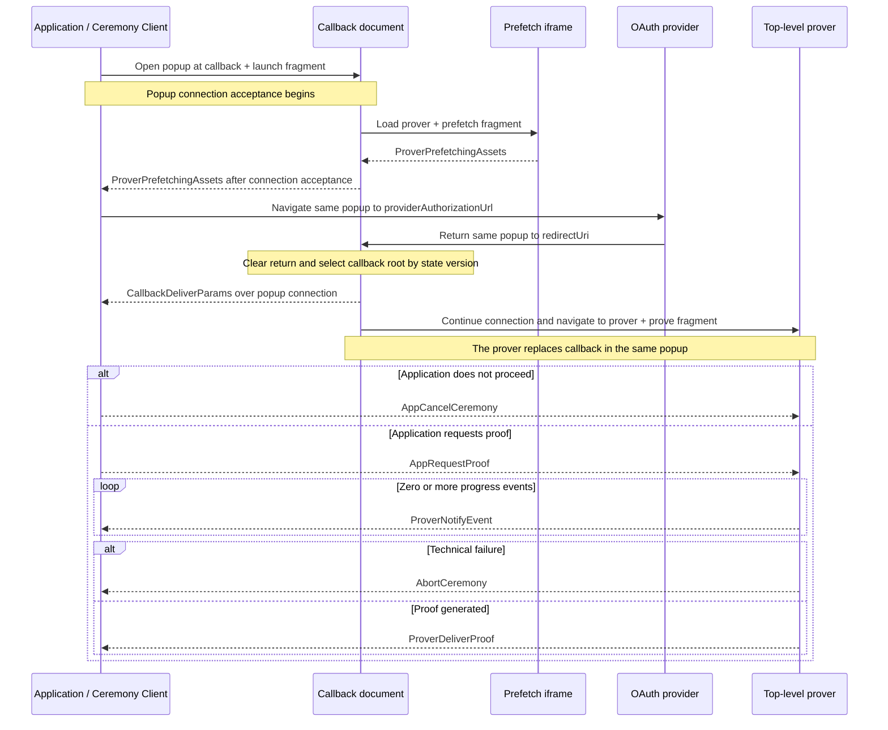

# Ceremony Cross-Document Protocol (CCDP)

This document defines the closed browser protocol used by `@libid/ceremony`
across the application, callback, and isolated prover. It owns ceremony
locations, navigations, messages, ordering, and protocol compatibility.

The caller-supplied [`@libid/popup`](../popup/README.md) connection
authenticates, decodes, and delivers these messages without interpreting them.
Shared package types such as
`PlatformId`, `PlatformCeremonyVersion`, and `PlatformStep` retain their
definitions in [ARCHITECTURE.md](ARCHITECTURE.md). These documents are
implementation architecture, not part of the normative proof specification.

## Protocol boundary

| Context | Owns | Browser constraint |
|---|---|---|
| Application page | operation inputs, live `Ceremony`, message ordering, and protocol result | has application-defined headers and lifecycle; may be cross-site from both identity bridge and prover |
| Callback | OAuth navigation, return capture, and transition to proving | remains top-level and non-isolated; its one configured identity-bridge URL serves initial launch and is the registered `redirect_uri` |
| Prover | credentials after callback, visible progress, and proof generation | reuses the popup's top-level browsing context under COOP/COEP isolation |

CCDP is connection-neutral. It defines which document runs at each location,
which participant initiates each navigation, what each message means, and their
order. `@libid/popup` owns how values cross browser documents and carriers and
invokes CCDP's registered per-message decoder before delivery. Callback,
prover, and client code execute the defined transitions, register only their
permitted inbound messages, and enforce state and order.

## Version

```ts
type CCDPVersion = 1
```

`CCDPVersion` is encoded in the launch/prover fragments and OAuth `state`.
Version `1` selects matching callback and prover root modules, fragment
grammars, navigation order, and `Message` semantics. A message does not repeat
the version selected before its module loads. The identity bridge API and popup
connection controls are independently versioned.

The version-1 browser roots have these exact filenames:

| Document | Root module |
|---|---|
| Callback | `libid-ccdp-v1-callback.js` |
| Prover | `libid-ccdp-v1-prover.js` |

A later CCDP version uses the same pattern with its decimal version substituted
for `1`. Each root is an immutable asset on its document's origin; callback and
prover roots need not share an origin. The stable HTML shells embed closed
`CCDPVersion`-to-root maps; neither a request nor a CCDP message may supply a
root URL.

## Browser shells

The identity bridge's configured callback path and `GET /ccdp/prover` serve the
two stable CCDP HTML shells. They are browser documents, not JSON API routes. A shell update may add
a supported CCDP version to its closed map, while an already published root
remains immutable and available through its compatibility window.

Both responses are request-invariant security shells containing one
CSP-authorized inline clearing bootstrap and one empty mount point. They contain
no application UI. Before storage, rendering, error reporting, module import,
or subsequent network use, each bootstrap bounds and copies its URL input,
clears the input with `history.replaceState`, exact-validates the grammar below,
and imports the one root selected by `CCDPVersion`. Missing, conflicting,
malformed, or unsupported versions import nothing and render only a fixed
failure after clearing. Selection replaces the module request the document
already needs; it adds no HTTP redirect, loader script, or document navigation.
An oversized input is not retained. A root import failure is terminal for that
document and is not retried against the browser's failed module-map entry; a
user retry starts in a fresh document.

### Callback shell

The identity bridge serves the callback shell at one developer-configurable
path whose default is `/auth/v1/callback`. The application uses its absolute
URL for initial launch, and every enabled OAuth application registers that same
URL as its `redirect_uri`. It is not an HTTP redirect and does not encode a
CCDP version.

The callback bootstrap accepts exactly two input modes:

- initial launch: an empty query and the `launch` fragment defined below, whose
  `ccdpVersion` selects the callback root; or
- provider return: the bounded provider-defined query and fragment containing
  exactly one OAuth `state` in the form `v<version>.<ceremonyId>`, whose version
  selects the callback root.

It bounds the combined raw query and fragment to
`MAX_OAUTH_RETURN_BYTES = 32 KiB`, preserves the leading `?` and `#` when
nonempty, and clears both. It parses no platform-specific return field beyond
locating the single routing state. After root selection it invokes:

```ts
interface CallbackShellInputV1 {
  shellVersion: 1
  locationInput: {
    query: string
    fragment: string
  }
  config: {
    allowedApplicationOrigins: readonly string[]
    proverOrigin: string
  }
}

declare function startCallback(input: CallbackShellInputV1): void
```

The selected root exact-validates the versioned object. Its application origins
and prover origin are immutable deployment data, never derived from `Origin`,
`Referer`, or URL input. The object is an entrypoint dependency, not a CCDP
message or pure `ccdp` export. The identity bridge owns its concrete shell and
forward-compatible versioning in
[IDENTITY_BRIDGE.md](IDENTITY_BRIDGE.md#versioned-root-input). Google
credentials remain in the fragment and therefore never reach the bridge;
provider-mandated query parameters are the only credential-bearing URL
exception.

### Prover shell

```ts
interface PopupEndpointOptions {
  allowedApplicationOrigins: readonly string[]
  fallback?: CarrierConstructor
}
```

The prover bootstrap accepts an empty query and exactly one of the `prefetch`
or `prove` fragments defined below. Both modes receive byte-identical HTML,
headers, embedded `ProverAssets`, and the same selected prover root. The
bootstrap exact-validates those assets before package or network use. Prefetch
is valid only in a child iframe; prove is valid only in the popup's top-level
browsing context. Any other context imports nothing.

After root selection it invokes the Window entrypoint:

```ts
declare function startProver(
  fragment: string,
  assets: ProverAssets,
  popup: PopupEndpointOptions,
): void
```

The selected prover root is also evaluated as the prover origin's module
Service Worker. Its worker branch composes popup continuity with asset prefetch
and cache reuse; it executes no CCDP participant or platform pipeline. Prefetch
mode registers and activates that worker but constructs no popup connection or
fallback. Callback deployment and response policy are defined by the
[identity bridge](IDENTITY_BRIDGE.md#callback-document);
`ProverAssets` and prover response policy are defined by
[PROVER.md](PROVER.md#shared-toolchain-and-assets).

## Protocol locations

One live `Ceremony` freezes `proverOrigin`, `redirectUri`,
`providerAuthorizationUrl`, ceremony ID, platform ID, and platform ceremony
version before launch. CCDP uses the following browser locations:

| Location | Browser context | Exact form |
|---|---|---|
| Popup reservation | popup | `about:blank` |
| Initial callback | popup | `${redirectUri}#launch?ccdpVersion=1&ceremonyId=<uuid>&platformId=<id>&ceremonyVersion=<uint>` |
| Selected-profile prefetch | callback child iframe | `${proverOrigin}/ccdp/prover#prefetch?ccdpVersion=1&platformId=<id>&ceremonyVersion=<uint>` |
| Platform authorization | popup | the frozen `providerAuthorizationUrl` defined by the selected platform ceremony version |
| Provider return | popup | the frozen `redirectUri` followed by the provider-defined query or fragment return |
| Proof generation | popup | `${proverOrigin}/ccdp/prover#prove?ccdpVersion=1&ceremonyId=<uuid>` |

Internal fragments use the literal mode, `?`, and URL-search-parameter encoding
shown above. Producers emit each named field exactly once in the displayed
order. Receivers require the exact field set, reject duplicates, and otherwise
do not depend on parameter order. Ceremony IDs are lowercase UUIDv4 values;
platform IDs and version bounds are defined by the package catalog.

The launch and prover routes have no query. Their fragments never reach either
HTTP server and are copied and cleared before rendering, module import,
storage, or network use. Their clearing bootstraps use `ccdpVersion` to select
one exact root module from a deployment-fixed supported map. No OAuth return,
credential, proof input, or proof is placed in an internal fragment. The
provider-mandated query on `redirectUri` is the only protocol exception.

The prefetch location carries only the selected public profile. It needs no
ceremony ID: the callback binds its one child by browser source, and the child
does not join the application popup connection.

The selected platform ceremony version owns the exact provider authorization
and return grammar. OAuth `state` has the exact CCDP routing form
`v1.<ceremonyId>`: the version selects the callback namespace and the lowercase
UUIDv4 suffix remains the popup connection ID. The authorization request
uses that state and the frozen `redirectUri`; CCDP owns the surrounding popup
navigation but does not duplicate platform fields. `redirectUri` is the exact
absolute configured callback URL for that platform; its default path is
`/auth/v1/callback` and does not change between CCDP versions.

## End-to-end sequence



Popup-connection mechanics and URL clearing are omitted from the diagram but
are required at the transitions below.

## Protocol phases

### 1. Launch and prefetch

The application composition constructs one named `PopupWindow` and
`PopupConnection`, then passes that connection to `CeremonyClient.new`.
`proveUserIdentity()` requests navigation to the initial callback location.
The popup package uses the retained handle when scripted opening succeeded and
otherwise leaves the same activation's real-anchor navigation intact.

After clearing and validating the launch fragment, the callback starts popup
connection acceptance and loads exactly one selected-profile prefetch iframe
concurrently. Neither operation waits for the other. The iframe clears and
validates its own fragment, dispatches prefetch, and reports readiness to its
exact parent. If readiness arrives first, the callback retains that fact only
in its current heap. It forwards the same logical value to the application only
after the popup connection is accepted:

```ts
interface ProverPrefetchingAssets {
  type: 'prover-prefetching-assets'
}
```

`ProverPrefetchingAssets` is delivered through the accepted popup connection.
It states that prefetch for the selected public
profile has been dispatched; it does not promise that downloads completed and
grants no authority. The callback already received and validated the selected
profile through its cleared launch input; echoing it would compare the
application with its own values. Popup connection authentication and
correlation are independent of CCDP. Prefetch may start before carrier
establishment, but no CCDP message crosses that boundary. Acceptance may cause
only navigation of that popup to the provider URL already frozen by the live
`Ceremony`.

After acceptance, the application connection navigates the retained popup to
the frozen `providerAuthorizationUrl`. That navigation destroys the initial
callback and prefetch iframe.

### 2. Provider authorization and return

The provider owns the popup until it navigates to the frozen `redirectUri`.
That route serves the same request-invariant callback shell used at launch. Its
inline bootstrap bounds and clears both URL components, extracts exactly one
`v<version>.<ceremonyId>` state, and imports the matching immutable callback
root from its closed supported-version map in the same document. Unknown or
malformed versions fail before package code loads. This replaces the callback
module import the page already requires; it adds no document navigation.

```ts
interface CallbackDeliverParams {
  type: 'callback-deliver-params'
  oauthReturn: {
    query: string
    fragment: string
  }
}
```

The callback creates this message from the bounded query and fragment copied by
its clearing bootstrap. It extracts the ceremony ID suffix from the state and
does not classify approval, denial, OAuth transport, or platform fields.

On the successful path, `CallbackDeliverParams` is the first CCDP message after
provider return and reaches the application only through the authenticated
popup connection. The `Callback` prefix records its creator even when
connection continuity delivers it after callback replacement.

The application-scoped client uses the live `Ceremony` already bound to that
connection and its platform/version parser to exact-validate response location,
fields, state, client, redirect, success, and provider denial. A stale,
replayed, retired, or post-reload delivery changes no live state.

### 3. Prover activation and application decision

The returned callback delivers `CallbackDeliverParams`, then asks its accepted
popup connection to navigate to the exact proof-generation location. The popup
package owns carrier selection and immediate cross-document continuity.

The isolated top-level prover clears its fragment and accepts the same logical
popup connection before handling CCDP. No callback value enters a URL or
signaling record.

The application classifies the already-delivered OAuth return using the live
ceremony's selected platform/version. It either cancels or sends one proof
request to the active prover:

```ts
interface AppRequestProof {
  type: 'app-request-proof'
  platformId: PlatformId
  platformCeremonyVersion: PlatformCeremonyVersion
  clientId: string
  redirectUri: string
  oauthReturn: {
    query: string
    fragment: string
  }
  codeVerifier: string | null
}
```

A malformed result rejects the ceremony. A valid provider denial resolves
`{ status: 'denied' }` and sends `AppCancelCeremony`. A valid acceptance creates
one `AppRequestProof` from the selected platform/version, frozen client and
redirect, derived code verifier, and unchanged OAuth return.

The application origin is trusted for this transient input: it already
supplies the operation being authorized. The client retains the authorization
nonce; only its derived code verifier crosses this boundary. No authorization
digest, operation field, separate OAuth state, Job revision, composition kind,
wallet state, connector, or carrier kind enters the request.

For GitHub, the prover derives the fixed identity bridge token route from the
origin of this frozen `redirectUri`. No second bridge origin or endpoint field
enters CCDP or the prover document.

The registered decoder validates CCDP shape and bounds. The prover then applies
the exact selected platform/version parser before credential use. The callback
and popup connection have no platform configuration and cannot perform that
second validation. The one-shot ceremony accepts no duplicate request or late
result.

### 4. Proof execution

```ts
interface ProverNotifyEvent {
  type: 'prover-notify-event'
  platformStep: PlatformStep
  timestamp: number
}

interface ProverDeliverProof<Proof = unknown> {
  type: 'prover-deliver-proof'
  proof: Proof
}
```

After `AppRequestProof`, the prover sends zero or more bounded progress records
followed by one proof, unless the run aborts. The closed union uses
`ProverDeliverProof<unknown>`; CCDP validates only its envelope and passes the
logical value unchanged. The selected platform/version validator then narrows
it. Adding a platform does not change CCDP or the popup package.

`PlatformStep.label` is nonempty package-owned display text of at most 96 UTF-8
bytes without control characters. `PlatformStep.progress` is finite,
monotonic, and in `[0, 1)`. `timestamp` is the prover's finite nonnegative
`performance.timeOrigin + performance.now()` value in milliseconds; it permits
same-browser ordering and duration diagnostics but grants no authority.
Progress is advisory.

### 5. Terminal control and failure

```ts
interface AppCancelCeremony {
  type: 'app-cancel-ceremony'
}

interface AbortCeremony {
  type: 'abort-ceremony'
  reason: string
}
```

`AppCancelCeremony` is the parameterless downstream command for explicit user
cancellation, valid provider denial, invalid callback classification, or
retired application authority. Reachable proving work clears queued input; no
acknowledgement or platform-specific cancel path exists. Callback and prover
never close or navigate the popup in response.

`AbortCeremony` is the upstream technical-failure message created by callback or
prover code. Its reason is a bounded sanitized diagnostic string, not a stable
code or raw exception. Exact reason enums may emerge from implementation
experience. The application rejects the live ceremony for every observable
abort. It requires an accepted popup connection. Popup-connection construction
or acceptance failure has no CCDP path and follows the
[undeliverable-failure rule](METRICS.md#undeliverable-failures).

## Closed message union

```ts
type Message =
  | ProverPrefetchingAssets
  | CallbackDeliverParams
  | AppRequestProof
  | AppCancelCeremony
  | ProverNotifyEvent
  | ProverDeliverProof
  | AbortCeremony
```

## Direction and ordering

| Message | Created by | Received by | Valid position and cardinality |
|---|---|---|---|
| `ProverPrefetchingAssets` | prover prefetch child, forwarded unchanged by callback | application | exactly once through the accepted popup connection before provider navigation |
| `CallbackDeliverParams` | callback | application | exactly once after provider return and popup-connection acceptance, before the application decision |
| `AppRequestProof` | application | active prover | exactly once after an accepted callback result; starts proving |
| `AppCancelCeremony` | application | active callback or prover endpoint | at most once before another terminal message; makes later messages inert and requests downstream cleanup |
| `ProverNotifyEvent` | prover | application | zero or more after `AppRequestProof` and before a terminal message |
| `ProverDeliverProof` | prover | application | at most once after `AppRequestProof`; ends the prover run |
| `AbortCeremony` | callback or prover | application | at most once after popup-connection acceptance for an observable technical failure before another terminal message |

Messages outside these directions or positions are invalid. Cancellation,
proof delivery, and abort make later messages inert even when they race in
transit.

## Structural decoding

Each message interface has a same-named `MessageType` companion containing its
literal discriminator and structural decoder. The shared assertion owns the
common plain-record, exact-field-set, and `type` checks:

```ts
declare function assertMessage<
  const Type extends string,
  const Fields extends readonly string[],
>(
  value: unknown,
  type: Type,
  fields: Fields,
): asserts value is { type: Type } & Record<Fields[number], unknown>

const ProverDeliverProof = {
  type: 'prover-deliver-proof',

  decode(value: unknown): ProverDeliverProof {
    assertMessage(value, this.type, ['proof'])
    return value
  },
} as const satisfies MessageType<ProverDeliverProof>
```

A decoder exact-validates its message-specific fields and bounds, rejects
unknown fields, and returns the same received object. It never coerces,
normalizes, supplies defaults, strips fields, or allocates a replacement.
Nested platform proof remains `unknown` here and is decoded later by the
selected platform/version module.

Participants register only their permitted inbound companions with the popup
connection:

```ts
connection.on(AppRequestProof, handleProofRequest)
connection.on(AppCancelCeremony, handleCancellation)
```

The popup connection uses the companion's `type` only as a generic dispatch
key, invokes its decoder exactly once, and gives the handler its concrete
message type.
Unknown, duplicate, or unregistered discriminators fail closed. There is no
aggregate decoder, raw discriminator constant, large union handler, global
registration, import-time self-registration, or plugin API. Direction is the
registered decoder set; order and participant state remain handler checks.

Endpoint authentication, continuity controls, and carrier records are not
`Message`. `@libid/popup` owns them.

## Shared invariants

- One live ceremony accepts one prefetch readiness and one
  `CallbackDeliverParams`.
- Prefetch work may start while the popup connection is being accepted, but no
  CCDP message reaches the application before connection authentication.
- The popup connection authenticates before any OAuth return reaches the
  application and does not interpret or alter message meaning.
- Unknown, malformed, replayed, out-of-order, wrong-direction, or post-terminal
  values change no state.
- No CCDP message carries ceremony ID, `CCDPVersion`, or `ConnectionVersion`.
  Popup-connection ownership supplies correlation and its private version; the
  loaded route supplies CCDP version.
- Callback and prover accept only the locations and fragments defined above;
  received CCDP values never select a navigation destination.
- Progress remains advisory and cannot authorize, cancel, or complete a
  ceremony.
- Connection state, navigation, popup closure, and progress are never a ceremony
  result.
- The application composition owns popup lifetime after every terminal outcome;
  callback, prover, and ceremony cleanup never call `connection.close()`.
- Cancellation and context-loss cleanup are best effort.
- No ceremony recovery, durable browser checkpoint, or migration to another
  popup connection exists.

## Versioning and compatibility

A loaded application client selects `CCDPVersion` in its launch fragment. The
callback shell carries it through OAuth `state`, every later internal navigation
repeats it in its fragment, and each shell loads that exact version's immutable
root. The configured callback path and stable `/ccdp/prover` path do not select
or encode a CCDP version.

Compatible implementation changes keep the version. A breaking shell input
grammar, root entrypoint contract, navigation order, message shape, direction,
ordering, or validation rule increments `CCDPVersion` and publishes both new
versioned roots. The shells add the new roots to their closed maps while old
roots remain available for live ceremonies and a compatibility window. A root
may gain immutable companion chunks without changing CCDP when its shell and
protocol contracts remain compatible. No CCDP message repeats the
already-selected version.

`PlatformCeremonyVersion` remains independent and versions one platform's
authorization, OAuth, proof, and output semantics. The popup package's
`ConnectionVersion` independently versions private connection controls. The
identity bridge API namespace is also independent.
