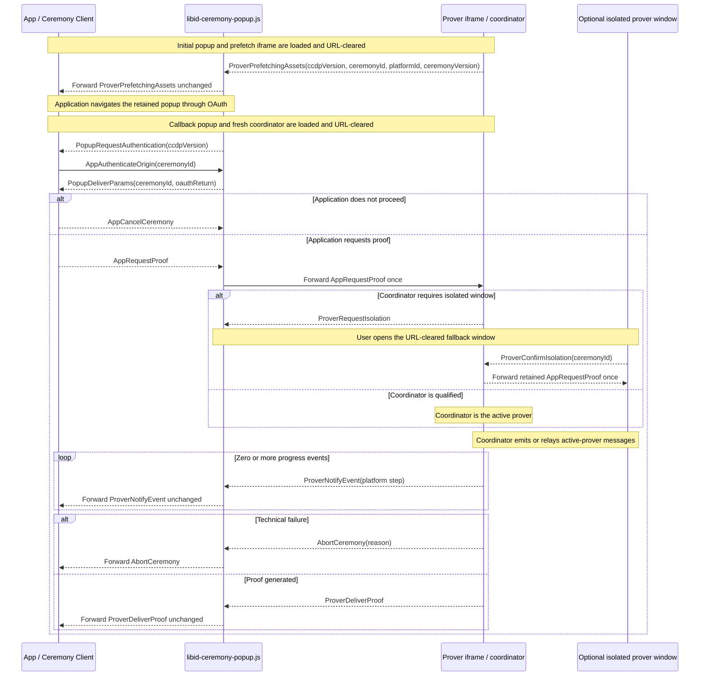

# Ceremony Cross-Document Protocol (CCDP)

This document defines the closed browser protocol used by `@libid/ceremony`
across the application, popup, prover iframe, and isolated prover window. It
also owns cross-document prefetch readiness, placement handoff, and protocol
compatibility rules.

The package boundary, public client API, and result lifecycle are defined in
[ARCHITECTURE.md](ARCHITECTURE.md). The popup participant's local state machine,
UI, and cleanup are defined in [POPUP.md](POPUP.md). Prover pipelines, assets,
workers, and cache behavior are defined in [PROVER.md](PROVER.md).
The deployed routes, embedded inputs, and response policy are defined in
[SERVER.md](SERVER.md). This is implementation architecture, not part of the
normative proof specification.
Package acceptance requirements are indexed by [TEST_PLAN.md](TEST_PLAN.md).
Shared package types and constants such as `PlatformId`,
`PlatformCeremonyVersion`, and `PlatformStep` retain their definitions in the
architecture document. `CeremonyConfig` and `ProverAssets` retain theirs in the
server contract.

## Architecture drivers and decisions

### Execution contexts

The browser ceremony crosses three protocol roles and may add a fourth document
for the isolated-window fallback.
DIP means `Document-Isolation-Policy`; COOP means
`Cross-Origin-Opener-Policy`. Both are HTTP response policies which application
JavaScript cannot add to an already loaded document.

| Context | Owns | Browser constraint |
|---|---|---|
| Application page | operation inputs, live `Ceremony`, durable application Job, final result commit | may be embedded into an application with its own headers and lifecycle; must retain the popup `WindowProxy` |
| Ceremony popup/callback | OAuth navigation and return, opener authentication, prover coordination, fixed progress UI | must remain top-level and non-isolated and preserve communication with the application opener; its callback alias is the registered server-hosted `redirect_uri` |
| Prover iframe or window | credentials after callback and proof generation | must be cross-origin isolated with `SharedArrayBuffer`; runs in a DIP-qualified iframe where available or a COOP-isolated top-level fallback |

The prover's internal service worker does not participate in CCDP. Its cache
and navigation-survival contract is defined in
[PROVER.md](PROVER.md#prefetch-and-cache-lifecycle).

No single page can satisfy the interactive constraints. The OAuth popup must
preserve its cross-origin opener, while the prover must use isolation headers
which sever that opener when applied to a top-level document. OAuth also
returns by loading a registered server route, replacing the document that
started provider navigation. Multithreaded proving cannot be made a normal
function call in the application page because isolation is a response-level
property, not a library option.

Communication among these documents is the **Ceremony Cross-Document Protocol
(CCDP)**.

### Why CCDP exists

The package provides the application-side client, but the popup and prover are
independent server-hosted documents emitted by that same package release. A
JavaScript heap, callback, or imported object cannot cross provider navigation,
document replacement, COOP isolation, or the iframe/window boundary. The
browser transports available across those boundaries are `postMessage` for
live opener and parent/child channels and a same-origin `BroadcastChannel` for
the optional prover window after COOP removes its opener.

CCDP is therefore an internal browser application binary interface
(ABI), not a remote product API or plugin system. Its closed records provide
the minimum information needed to:

- bind messages to the expected `WindowProxy`, browser-stamped origin, and live
  ceremony;
- return the OAuth parameters only to the application which retained that
  ceremony;
- move proving input into whichever isolated placement the browser supports;
- relay advisory progress, cancellation, and proof delivery without sharing
  application storage or executable callbacks; and
- reject incompatible document releases before using credentials.

Collapsing the messages into ordinary library calls would require collapsing
the documents too, which would either lose OAuth opener continuity or lose the
isolation required by the prover. The protocol stays closed and package-owned
so that this necessary transport does not become an extension surface.

### Decision summary

| Decision | Constraint and rationale | Cost and revisit condition |
|---|---|---|
| Serve fixed popup and prover documents from the configured server | OAuth needs a registered callback document; isolation, Content Security Policy (CSP), allowed origins, and asset manifests are response properties | server must expose the documented routes; revisit only if browsers provide an authenticated callback and isolated-prover primitive without separate documents |
| Keep the popup non-isolated and isolate the prover separately | preserving the application opener conflicts with top-level COOP isolation | requires CCDP and a prover child; this is the core unavoidable complexity |
| Reuse one ceremony popup across launch, provider navigation, callback, and proving UI | preserves user activation, opener continuity, and one primary visible ceremony surface | navigation destroys popup memory, so the application retains ceremony state and reauthenticates the returned document |
| Prefer DIP iframe proving with a user-opened isolated-window fallback | DIP gives an isolated child without severing the popup; browser support is not universal | adds two package-internal placement messages and a **Continue proving** action; remove the fallback only after the supported browser matrix makes it unnecessary |
| Signal selected-profile prefetch readiness before OAuth | consent time can overlap large public downloads, but the application must not await their completion | adds one readiness message; the prover subsystem owns the fetch implementation |
| Keep ceremonies memory-only and one-shot | durable OAuth/proof recovery would add credential storage, replay, migration, and cleanup state | interruption before delivery repeats OAuth; add recovery only as a separately justified protocol revision |
| Use one closed message union and one `CCDPVersion` | application, popup, coordinator, and fallback participate in one package-owned cross-document protocol | a breaking wire change increments one version; no per-message negotiation |

Future material decisions belong here with their constraint, consequence, and
concrete revisit condition. Exact mechanics belong in their owning reference
section.

## Browser topology and routes

```text
Application origin
  composition + @libid/ceremony/client
  durable Job and retained WindowProxy
              │ authenticated postMessage
              ▼
Configured server origin
  /api/v1/ceremony/popup and callback alias
    fixed URL-clearing bootstrap + libid-ceremony-popup.js
    non-isolated popup UI and controller
              ├─ top-level navigation ── OAuth provider (and back)
              │ bound parent/child postMessage
              ▼
  /api/v1/ceremony/prover
    libid-ceremony-prover.js + workers/WebAssembly (WASM)
    DIP iframe, or coordinator + COOP-isolated fallback window
              │ same-origin BroadcastChannel on fallback path
              ├─ platform/notary/JWK-set network defined by platform version
              └─ optional server-owned same-origin platform route
```

The exact route surface and response contracts are defined in
[SERVER.md](SERVER.md#route-surface). `/api/v1/ceremony/popup` is the shared
launch document and its configured callback path is the registered OAuth
`redirect_uri`. `/api/v1/ceremony/prover` is the one document used for prefetch,
coordination, and isolated proving. These roles are selected after fragment
clearing; they are not server response variants and keep no ceremony state.

The caller launches the popup through the scripted path or real-anchor fallback
defined under [client lifecycle](ARCHITECTURE.md#client-lifecycle). Both paths preserve
`window.opener`; `noopener` and `noreferrer` are forbidden. Their launch
fragment contains only the ceremony ID, platform ID, and selected ceremony
version and is cleared before subresources or network activity. Both paths then
use the same prefetch, OAuth, callback, and proving protocol; presentation as a
window or tab is a browser choice, not a protocol mode.

After the provider callback, that redirect document creates one
`/api/v1/ceremony/prover` iframe which remains the prover coordinator for the
rest of its lifetime. The coordinator runs the prover itself when DIP gives it
isolation, or relays the same protocol to a top-level isolated prover window
opened by the user's **Continue proving** anchor.

The redirect never user-agent sniffs. It binds the coordinator through its
exact parent/child `WindowProxy` and browser-stamped origin. The fallback window
cannot rely on `window.opener` after COOP; it receives only the ceremony ID in
its initial fragment, clears it before other work, and connects to the
coordinator through a same-origin `BroadcastChannel` derived from that ID. The
ceremony ID routes the live same-origin channel; it is not a separate
confidentiality boundary.

The initial popup's prover iframe only starts prefetch. The callback popup's fresh
iframe coordinates proving: it proves in place under DIP or relays to the
isolated-window fallback. Neither placement adds a server mode or durable state.
See [prover prefetch coordination](#prover-prefetch-coordination) for the CCDP
lifecycle, [PROVER.md](PROVER.md#prefetch-and-cache-lifecycle) for fetching and
caching, [POPUP.md](POPUP.md) for popup behavior, and the
[popup/prover channel](#popupprover-channel) for isolation, binding, and
forwarding.

## Flow at a glance

1. The initial popup starts selected-profile prefetch and identifies its package
   version, ceremony, platform, and source to the application.
2. The application navigates that retained popup through OAuth. The registered
   callback clears the returned URL before loading package code.
3. The returned popup signals only that OAuth returned. The application proves
   continuity by sending the ceremony ID back over the retained `WindowProxy`;
   only then does the popup release the captured result.
4. The application validates the platform return and either aborts or sends the
   closed proving input. The coordinator proves under DIP or binds the isolated
   fallback window.
5. Progress and the generated proof travel back over the same live path. The
   application assembles `OAuthProof`; no browser context persists a checkpoint.

The [package architecture](ARCHITECTURE.md#system-boundary) shows the complete
human-facing ceremony. The message sequence below shows only the live CCDP
path; the surrounding sections own input validation, failure ordering, ingress,
prover placement, lifecycle, prefetch, response policy, and compatibility.

## Protocol definition

CCDP is the closed internal browser protocol between the application, ceremony
popup, and prover placements. Its wire surface is the `CCDPMessage` union. It
carries one ceremony through launch, OAuth return, opener authentication,
proving, and delivery because those steps cross independent documents and
cannot share library calls or memory. The
[architecture drivers](#why-ccdp-exists) explain why these browser
boundaries exist; this section defines their ordered messages.

A message name starts with the component which creates it: `App`, `Popup`, or
`Prover`, followed by its action. Intermediaries forward a message unchanged, so
the prefix records its original creator rather than its latest transport hop.
`AbortCeremony` is the sole origin-prefix exception because popup and prover
share the same upstream technical-failure contract.

Every receiver exact-validates message shape, direction, source, origin, and
current phase. Unknown, replayed, out-of-order, or post-terminal messages change
no state. The protocol has no caller-defined message, extension point, or
negotiated capability.

### Protocol version

```ts
type CCDPVersion = 1
```

`CCDPVersion` versions the complete `CCDPMessage` union shared by the
application/popup and popup/prover boundaries. The initial and returned
ceremony popup carries the version in its first application-facing message. The
client validates it before OAuth and again after return; it does not echo or
negotiate a version. The package-internal popup/prover boundary introduces no
second version exchange.

### Launch and prover prefetch

```ts
interface ProverPrefetchingAssets {
  ccdpVersion: CCDPVersion
  type: 'prover-prefetching-assets'
  ceremonyId: string
  platformId: PlatformId
  platformCeremonyVersion: PlatformCeremonyVersion
}
```

On initial launch, the popup exact-validates and clears its fragment's ceremony
ID, platform ID, and ceremony version, then loads
`/api/v1/ceremony/prover#prefetch(ceremonyId, platformId,
platformCeremonyVersion)`. The child clears that fragment, resolves the exact
profile, and asks the prover subsystem to start its selected-profile prefetch.
It returns `ProverPrefetchingAssets` after the registration/start attempt
settles; it does not wait for downloads to finish. The popup accepts the message
only from its exact child and forwards it unchanged to `window.opener` using
only server-embedded allowed origins. A missing or invalid profile or document
load failure rejects before OAuth; ordinary registration, cache, or fetch
failure continues on the cold proving path. CCDP defines no prefetch timeout.

The application accepts `ProverPrefetchingAssets` only from the configured
server origin with its live ceremony ID, platform, version, and expected source. A
scripted launch exact-matches the supplied `WindowProxy`; a real-anchor launch
binds the matching message source. The client validates the protocol version,
retains that source, and navigates it to the frozen provider authorization URL.
Prefetch requires no opener reply because it handles only public assets.

### Callback and opener authentication

```ts
interface PopupRequestAuthentication {
  ccdpVersion: CCDPVersion
  type: 'popup-request-authentication'
}

interface AppAuthenticateOrigin {
  type: 'app-authenticate-origin'
  ceremonyId: string
}

interface PopupDeliverParams {
  type: 'popup-deliver-params'
  ceremonyId: string
  oauthReturn: {
    query: string
    fragment: string
  }
}
```

The popup clears the provider callback URL before parsing it. An absent,
malformed, or duplicate OAuth `state` changes no live state and produces no
application message. After extracting exactly one syntactically valid state,
the callback popup sends `PopupRequestAuthentication`. It asks the
retained application to prove continuity before the popup releases the captured
redirect parameters; it exposes neither the ceremony ID nor those parameters and does not
classify approval, denial, or malformed platform fields. The client
accepts it only from the retained popup source at the configured server origin
and expected protocol version, then returns its retained ceremony ID in
`AppAuthenticateOrigin`.

The popup accepts `AppAuthenticateOrigin` only from `window.opener`, requires
the browser-stamped origin to be allowed, and exact-matches the supplied
ceremony ID to the captured OAuth state. Only then does it return the unchanged
bounded `oauthReturn` in `PopupDeliverParams` to that exact source
and origin. The message has no origin or version field: the browser supplies the
origin, and the client already validated the returned popup's version. A
different allowed application occupying the opener receives neither the
ceremony ID nor the redirect parameters. No callback-time binding record or
storage is needed.

If no valid `AppAuthenticateOrigin` arrives within
`REDIRECT_OPENER_TIMEOUT_MS = 30_000`, the popup clears its in-memory query and fragment,
severs the opener, and renders the same fixed unapproved-application result as
an invalid opener origin. It renders no callback value and performs no
navigation with it.

### OAuth classification and proof dispatch

```ts
interface AppRequestProof {
  type: 'app-request-proof'
  ceremonyId: string
  platformId: PlatformId
  platformCeremonyVersion: PlatformCeremonyVersion
  clientId: string
  redirectUri: string
  oauthReturn: {
    query: string
    fragment: string
  }
  codeVerifier: string | null
}
```

The application-scoped client selects the live `Ceremony` from the authenticated
`PopupDeliverParams`; it does not query IndexedDB or reveal the ID to
the composition. An unknown, stale, replayed, or post-reload ceremony ID changes
no live state and causes cleanup through `AppCancelCeremony`. Otherwise the client
atomically claims the state and uses that Ceremony's platform/version parser to
exact-validate the `oauthReturn` transport and fields.

A malformed or mismatched result rejects the Ceremony. A valid provider denial
resolves `{ status: 'denied' }`. Both paths send `AppCancelCeremony` for popup cleanup.
A valid acceptance constructs `AppRequestProof` from the live ceremony ID,
selected platform/version, frozen client and redirect, derived code verifier, and
unchanged `oauthReturn`. The application origin is trusted for this transient input;
the protocol does not try to hide it from other scripts executing in that
origin. The Ceremony Client retains the authorization nonce; only its derived
code verifier crosses the prover boundary.

The popup byte-matches the echoed `oauthReturn` fields to its retained values,
validates the generic CCDP shape and bounds, and forwards the exact
`AppRequestProof` once to its coordinator iframe. It cannot validate the
platform, version, client, redirect, or PKCE policy: the returned document has
no launch record or `CeremonyConfig`, and deliberately fetches neither. The
authenticated client has already selected those values, and the prover applies
the selected platform/version parser before credential use. The claimed client
entry, one-shot Ceremony, and popup state machine prevent duplicate proving.
The composition's final Job CAS prevents a late result from producing an
application effect. No separate OAuth state, job revision, composition
discriminator, wallet state, or connector crosses this protocol.

### Isolated prover-window fallback

```ts
interface ProverRequestIsolation {
  type: 'prover-request-isolation'
}

interface ProverConfirmIsolation {
  type: 'prover-confirm-isolation'
  ceremonyId: string
}
```

These messages remain package-internal. The coordinator iframe and fallback
window are two placements of the same prover implementation, not different
prover roles. A coordinator which cannot prove in its DIP iframe sends
`ProverRequestIsolation`; the popup exposes the user-opened
fallback action. The resulting COOP-isolated window sends
`ProverConfirmIsolation` over the ceremony-scoped same-origin channel. The
coordinator exact-matches the ceremony ID before forwarding its retained
`AppRequestProof` once. Neither message crosses the application boundary or
changes the Ceremony result. Prefetch selection remains document bootstrap
data, not a protocol message.

### Progress and proof delivery

```ts
interface ProverNotifyEvent {
  type: 'prover-notify-event'
  ceremonyId: string
  platformStep: PlatformStep
  timestamp: number
}

interface ProverDeliverProof<Proof = unknown> {
  type: 'prover-deliver-proof'
  ceremonyId: string
  proof: Proof
}
```

After `AppRequestProof`, the active prover sends zero or more bounded
`ProverNotifyEvent` records followed by one `ProverDeliverProof`, unless the run
aborts. The closed `CCDPMessage` union uses the default
`ProverDeliverProof<unknown>`. CCDP validates only the envelope and ceremony ID,
then forwards the structured-clone `proof` value unchanged. It neither knows nor
dispatches platform proof types. After receipt, the platform catalog uses the
platform and version already selected by `ceremonyId` to validate and narrow the
message. Adding a platform therefore does not change CCDP. Progress is advisory.
Detailed semantics are defined under
[progress, cancellation, and recovery](#progress-cancellation-and-recovery) and
the [prover delivery boundary](PROVER.md#proof-delivery-boundary).

### Cancellation and technical failure

```ts
interface AppCancelCeremony {
  type: 'app-cancel-ceremony'
}

interface AbortCeremony {
  type: 'abort-ceremony'
  reason: string
}
```

`AppCancelCeremony` is the parameterless downstream command used when the
application no longer wants the ceremony to continue, including explicit cancellation,
provider denial, invalid callback classification, or retired Job authority.
Before `AppRequestProof`, the popup clears its retained query and fragment and attempts to close,
rendering one fixed fallback if closing fails. Afterwards it also cancels
reachable proving work.

`AbortCeremony` is the upstream technical-failure message created by the popup
or prover. Its `reason` is a sanitized diagnostic string, not a stable
machine-readable code or raw exception. The application rejects the live
Ceremony for every `AbortCeremony`. A closed reason enum may replace the string
once implementation experience identifies stable, actionable failure
categories; launch does not guess them in advance. Neither message carries a
ceremony ID, acknowledgement, or response. Context loss may produce neither
message.

### Closed message union

```ts
type CCDPMessage =
  | ProverPrefetchingAssets
  | PopupRequestAuthentication
  | AppAuthenticateOrigin
  | PopupDeliverParams
  | AppRequestProof
  | AppCancelCeremony
  | ProverRequestIsolation
  | ProverConfirmIsolation
  | ProverNotifyEvent
  | ProverDeliverProof
  | AbortCeremony
```

### CCDP message sequence



The diagram deliberately omits application self-transitions, provider
navigation mechanics, URL clearing, user-interface actions, validation
failures, mid-proving cancellation forwarding, and duplicate fallback relay
arrows. Those rules remain normative in their owning subsections.
`ProverDeliverProof` has no acknowledgement or ceremony-side checkpoint.

### Redirect ingress

CCDP preserves the exact captured redirect transport:

```ts
interface OAuthReturn {
  query: string
  fragment: string
}
```

The fields are the exact captured `location.search` and `location.hash`,
including a leading delimiter when nonempty. The server bootstrap owns their
bound and clearing order, and the popup owns launch/callback classification,
routing-state extraction, result custody, and failure UI. See
[SERVER.md](SERVER.md#ingress-bootstrap) and
[POPUP.md](POPUP.md#entrypoint-and-trusted-inputs). CCDP requires
`PopupDeliverParams` and `AppRequestProof` to carry these fields unchanged.
The selected platform/version module owns transport and field semantics.

### Popup/prover channel

The popup/prover boundary reuses the closed `CCDPMessage` union. The popup
forwards the application's exact `AppRequestProof` once to its coordinator
iframe. The coordinator validates isolation and the selected platform/version
input before any credential-bearing network request. The popup validates only
the generic record, ceremony continuity, and echoed OAuth return; it has no
platform configuration. The selected client and prover modules own the two
platform-aware validation boundaries.

When qualified, the coordinator proves in place. Otherwise it retains
`AppRequestProof`, sends `ProverRequestIsolation` to its exact parent, and
accepts `ProverConfirmIsolation` only through its ceremony-scoped same-origin
channel with an exact ID match. It then forwards the retained request once.
Unknown, stale, duplicate, pre-request, or wrong-ID confirmation changes no
state. `AbortCeremony` before confirmation is the only other accepted fallback
message and is forwarded upstream as terminal failure.

After `AppRequestProof`, the active placement sends zero or more
`ProverNotifyEvent` records followed by one `ProverDeliverProof`, or sends
`AbortCeremony`. The coordinator and popup validate their bound channels and
forward those records unchanged. `AppCancelCeremony` travels downstream to all
reachable work. Context loss may produce no terminal message. Invalid order,
post-terminal messages, and messages outside the bound channel change no state.

The one-shot channel scopes every message to one ceremony. `AppRequestProof` and proof
delivery carry the ceremony ID; `AppCancelCeremony` and `AbortCeremony` do not
duplicate it. The DIP path binds
the exact parent/child `WindowProxy` and browser-stamped origin. The fallback
window uses the cleared ceremony-ID fragment only to derive its same-origin
`BroadcastChannel` with the coordinator. All browser boundaries share
`CCDPVersion`; no
second protocol or version exists.

Popup activation, relay, UI, and cleanup are defined in
[POPUP.md](POPUP.md#application-decision-and-proof-coordination). Prover inputs,
pipelines, credentials, and proof behavior are defined in
[PROVER.md](PROVER.md#component-boundary). CCDP owns only which bound context may
send or receive the records and in which order.

## Progress, cancellation, and recovery

The public `CeremonyEvent`, `CeremonyStage`, and `PlatformStep` types and their
application-side stage transitions are defined by the
[progress API](ARCHITECTURE.md#progress-cancellation-and-recovery). CCDP carries
only the platform step and prover timestamp; the common stage remains local to
the application-side client.

CCDP treats a validated `PlatformStep` as opaque and carries its prover-stamped
non-negative safe-integer Unix-millisecond timestamp. Coordinator and popup
forward it unchanged. The client accepts it only from the authenticated live
ceremony during its local `proof-generation` stage. CCDP neither orders
concurrent spans nor permits operation inputs, outputs, credentials,
identities, witnesses, proofs, raw exceptions, or raw service errors in an
event. Exact span semantics are defined by
[PROVER.md](PROVER.md#platform-progress).

`CeremonyEvent` carries only advisory progress. OAuth denial is returned only
through `proveUserIdentity()`; acceptance proceeds to `AppRequestProof`.

The fallback `BroadcastChannel` supplies routing within the trusted deployment,
not durable state or proof authority. Missing, duplicate, or reordered progress
affects only UI. Cancellation is best effort and context loss may remain silent;
popup closure alone is never a result. The application retires its Job before
sending `AppCancelCeremony`, so late output cannot commit. Popup teardown is
defined in [POPUP.md](POPUP.md#relay-ui-and-cleanup), and prover teardown in
[PROVER.md](PROVER.md).

## Prover prefetch coordination

CCDP owns only when prefetch is requested and when its readiness message may be
forwarded. The popup participant loads the prover document with the closed
`prefetch(ceremonyId, platformId, ceremonyVersion)` fragment. The callback
loads the same document with an empty fragment for its coordinator, while the
isolated fallback uses a bare ceremony ID. These fragments select document
bootstrap roles; they are not server variants or CCDP messages and never carry
an asset URL.

The prefetch child emits `ProverPrefetchingAssets` once its selected
registration/start attempt settles, without waiting for downloads to finish. A
missing profile or document load failure rejects before OAuth; an ordinary
registration or fetch failure changes latency only and follows the same cold
proving path. CCDP adds no timeout. Fetching, caching, navigation survival, and
warm/cold failure semantics are defined in
[PROVER.md](PROVER.md#prefetch-and-cache-lifecycle); popup child binding is
defined in [POPUP.md](POPUP.md#initial-launch-and-prefetch).

## Browser isolation consequences

The exact [popup](SERVER.md#popup-response-policy) and
[prover](SERVER.md#prover-response-policy) response policies are defined in the
server contract. Their CCDP consequence is that the popup preserves its
application opener while the prover runs in a separately isolated document.
Neither property can be added by application JavaScript or
negotiated through a message.

The application page must preserve an opener through the provider roundtrip.
`COOP: unsafe-none` and `same-origin-allow-popups` are compatible; a strictly
cross-origin-isolated launching page is unsupported until another authenticated
transport exists. Redirect and prover pages accept no application HTML,
component, stylesheet, script URL, or raw error markup and render fixed native
DOM UI.

The prover worker graph, network ceiling, cross-profile trust consequence, and
isolation failure behavior are defined in
[PROVER.md](PROVER.md#worker-and-network-isolation). CCDP owns only the placement
messages and live channel binding.

## Versioning and compatibility

`CCDPVersion` changes only when the `CCDPMessage` union or
its application/popup or popup/prover semantics break. One package release may
retain older protocol validators during its compatibility window. Deployment
route and asset versioning remain release concerns and are not added to every
CCDP message. `PlatformCeremonyVersion` is the independent platform-semantic
axis defined under
[architecture versioning](ARCHITECTURE.md#versioning-and-compatibility).

An incomplete ceremony whose popup release is no longer supported restarts with
fresh OAuth. A Job which has already committed Identity has left CCDP and
follows the composition compatibility rules defined by the package architecture.
