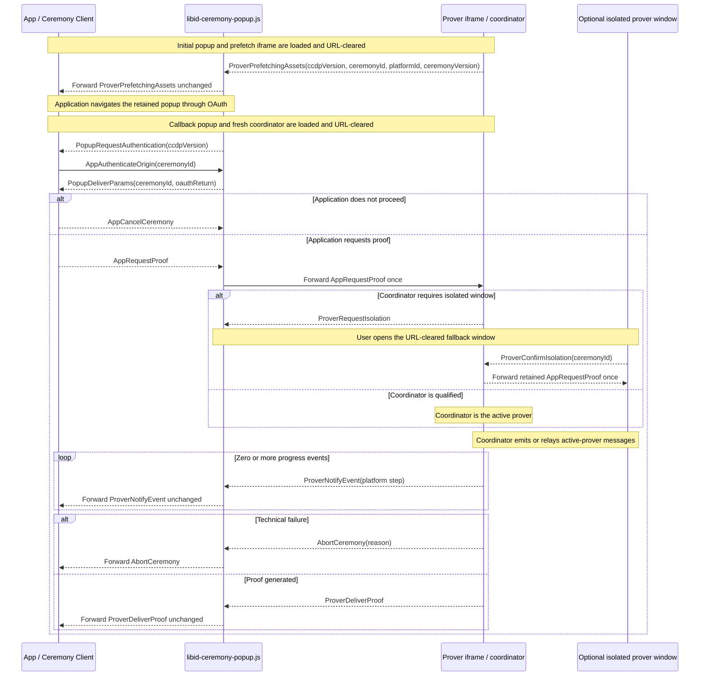

# Ceremony Cross-Document Protocol (CCDP)

This document defines the closed browser protocol used by `@libid/ceremony`
across the application, popup, prover iframe, and isolated prover window. It
also owns their service-worker prefetch coordination, document lifecycle,
isolation behavior, and protocol compatibility rules.

The package boundary, public client API, result lifecycle, platform pipelines,
and prover implementation are defined in [ARCHITECTURE.md](ARCHITECTURE.md).
The deployed routes, embedded inputs, and response policy are defined in
[SERVER.md](SERVER.md). This is implementation architecture, not part of the
normative proof specification.
Package acceptance requirements are indexed by [TEST_PLAN.md](TEST_PLAN.md).
Shared package types and constants such as `PlatformId`,
`PlatformCeremonyVersion`, `PlatformStep`, and `SRS_SIZE` retain their
definitions in the architecture document. `CeremonyConfig` and `ProverAssets`
retain theirs in the server contract.

## Architecture drivers and decisions

### Execution contexts

The browser ceremony crosses four execution contexts with incompatible jobs.
DIP means `Document-Isolation-Policy`; COOP means
`Cross-Origin-Opener-Policy`. Both are HTTP response policies which application
JavaScript cannot add to an already loaded document.

| Context | Owns | Browser constraint |
|---|---|---|
| Application page | operation inputs, live `Ceremony`, durable application Job, final result commit | may be embedded into an application with its own headers and lifecycle; must retain the popup `WindowProxy` |
| Ceremony popup/callback | OAuth navigation and return, URL clearing, opener authentication, fixed progress UI | must remain top-level and non-isolated and preserve communication with the application opener; its callback alias is the registered server-hosted `redirect_uri` |
| Prover iframe or window | credentials after callback, notary sessions, witness construction, multithreaded proving | must be cross-origin isolated with `SharedArrayBuffer`; runs in a DIP-qualified iframe where available or a COOP-isolated top-level fallback |
| Prover service worker | artifact single flights and caches across navigation and proving placements | must share the prover origin and survive replacement of the prefetch document |

No single page can satisfy the interactive constraints. The OAuth popup must
preserve its cross-origin opener, while the prover must use isolation headers
which sever that opener when applied to a top-level document. OAuth also
returns by loading a registered server route, replacing the document that
started provider navigation. Multithreaded proving cannot be made a normal
function call in the application page because isolation is a response-level
property, not a library option.

Communication among these documents is the **Ceremony Cross-Document Protocol
(CCDP)**.

### Why CCDP exists

The package provides the application-side client, but the popup and prover are
independent server-hosted documents emitted by that same package release. A
JavaScript heap, callback, or imported object cannot cross provider navigation,
document replacement, COOP isolation, or the iframe/window boundary. The
browser transports available across those boundaries are `postMessage` for
live opener and parent/child channels and a same-origin `BroadcastChannel` for
the optional prover window after COOP removes its opener.

CCDP is therefore an internal browser application binary interface
(ABI), not a remote product API or plugin system. Its closed records provide
the minimum information needed to:

- bind messages to the expected `WindowProxy`, browser-stamped origin, and live
  ceremony;
- return the OAuth parameters only to the application which retained that
  ceremony;
- move proving input into whichever isolated placement the browser supports;
- relay advisory progress, cancellation, and proof delivery without sharing
  application storage or executable callbacks; and
- reject incompatible document releases before using credentials.

Collapsing the messages into ordinary library calls would require collapsing
the documents too, which would either lose OAuth opener continuity or lose the
isolation required by the prover. The protocol stays closed and package-owned
so that this necessary transport does not become an extension surface.

### Decision summary

| Decision | Constraint and rationale | Cost and revisit condition |
|---|---|---|
| Serve fixed popup and prover documents from the configured server | OAuth needs a registered callback document; isolation, Content Security Policy (CSP), allowed origins, and asset manifests are response properties | server must expose the documented routes; revisit only if browsers provide an authenticated callback and isolated-prover primitive without separate documents |
| Keep the popup non-isolated and isolate the prover separately | preserving the application opener conflicts with top-level COOP isolation | requires CCDP and a prover child; this is the core unavoidable complexity |
| Reuse one ceremony popup across launch, provider navigation, callback, and proving UI | preserves user activation, opener continuity, and one primary visible ceremony surface | navigation destroys popup memory, so the application retains ceremony state and reauthenticates the returned document |
| Prefer DIP iframe proving with a user-opened isolated-window fallback | DIP gives an isolated child without severing the popup; browser support is not universal | adds two package-internal placement messages and a **Continue proving** action; remove the fallback only after the supported browser matrix makes it unnecessary |
| Prefetch prover assets through a service worker during consent | proving assets are large and popup navigation destroys document-owned fetch state | adds cache orchestration; retain because the PoC showed material cold-start improvement |
| Keep ceremonies memory-only and one-shot | durable OAuth/proof recovery would add credential storage, replay, migration, and cleanup state | interruption before delivery repeats OAuth; add recovery only as a separately justified protocol revision |
| Use one closed message union and one `CCDPVersion` | application, popup, coordinator, and fallback participate in one package-owned cross-document protocol | a breaking wire change increments one version; no per-message negotiation |

Future material decisions belong here with their constraint, consequence, and
concrete revisit condition. Exact mechanics belong in their owning reference
section.

## Browser topology and routes

```text
Application origin
  composition + @libid/ceremony/client
  durable Job and retained WindowProxy
              │ authenticated postMessage
              ▼
Configured server origin
  /api/v1/ceremony/popup and callback alias
    fixed URL-clearing bootstrap + libid-ceremony-popup.js
    non-isolated popup UI and controller
              ├─ top-level navigation ── OAuth provider (and back)
              │ bound parent/child postMessage
              ▼
  /api/v1/ceremony/prover
    libid-ceremony-prover.js + workers/WebAssembly (WASM)
    DIP iframe, or coordinator + COOP-isolated fallback window
              │ same-origin BroadcastChannel on fallback path
              ├─ platform/notary/JWK-set network defined by platform version
              └─ optional server-owned same-origin platform route
```

The exact route surface and response contracts are defined in
[SERVER.md](SERVER.md#route-surface). `/api/v1/ceremony/popup` is the shared
launch document and its configured callback path is the registered OAuth
`redirect_uri`. `/api/v1/ceremony/prover` is the one document used for prefetch,
coordination, and isolated proving. These roles are selected after fragment
clearing; they are not server response variants and keep no ceremony state.

The caller launches the popup through the scripted path or real-anchor fallback
defined under [client lifecycle](ARCHITECTURE.md#client-lifecycle). Both paths preserve
`window.opener`; `noopener` and `noreferrer` are forbidden. Their launch
fragment contains only the ceremony ID, platform ID, and selected ceremony
version and is cleared before subresources or network activity. Both paths then
use the same prefetch, OAuth, callback, and proving protocol; presentation as a
window or tab is a browser choice, not a protocol mode.

After the provider callback, that redirect document creates one
`/api/v1/ceremony/prover` iframe which remains the prover coordinator for the
rest of its lifetime. The coordinator runs the prover itself when DIP gives it
isolation, or relays the same protocol to a top-level isolated prover window
opened by the user's **Continue proving** anchor.

The redirect never user-agent sniffs. It binds the coordinator through its
exact parent/child `WindowProxy` and browser-stamped origin. The fallback window
cannot rely on `window.opener` after COOP; it receives only the ceremony ID in
its initial fragment, clears it before other work, and connects to the
coordinator through a same-origin `BroadcastChannel` derived from that ID. The
ceremony ID routes the live same-origin channel; it is not a separate
confidentiality boundary.

The initial popup's prover iframe only starts prefetch. The callback popup's fresh
iframe coordinates proving: it proves in place under DIP or relays to the
isolated-window fallback. Both placements reuse the same worker-owned fetches
and caches; neither adds a server mode or durable state. See
[prefetch and shared caching](#prefetch-and-shared-caching) for fetching and the
[popup/prover channel](#popupprover-channel) for isolation, binding, and
forwarding.

## Flow at a glance

1. The initial popup starts selected-profile prefetch and identifies its package
   version, ceremony, platform, and source to the application.
2. The application navigates that retained popup through OAuth. The registered
   callback clears the returned URL before loading package code.
3. The returned popup signals only that OAuth returned. The application proves
   continuity by sending the ceremony ID back over the retained `WindowProxy`;
   only then does the popup release the captured result.
4. The application validates the platform return and either aborts or sends the
   closed proving input. The coordinator proves under DIP or binds the isolated
   fallback window.
5. Progress and the generated proof travel back over the same live path. The
   application assembles `OAuthProof`; no browser context persists a checkpoint.

The [package architecture](ARCHITECTURE.md#system-boundary) shows the complete
human-facing ceremony. The message sequence below shows only the live CCDP
path; the surrounding sections own input validation, failure ordering, ingress,
prover placement, lifecycle, prefetch, response policy, and compatibility.

## Protocol definition

CCDP is the closed internal browser protocol between the application, ceremony
popup, and prover placements. Its wire surface is the `CCDPMessage` union. It
carries one ceremony through launch, OAuth return, opener authentication,
proving, and delivery because those steps cross independent documents and
cannot share library calls or memory. The
[architecture drivers](#why-ccdp-exists) explain why these browser
boundaries exist; this section defines their ordered messages.

A message name starts with the component which creates it: `App`, `Popup`, or
`Prover`, followed by its action. Intermediaries forward a message unchanged, so
the prefix records its original creator rather than its latest transport hop.
`AbortCeremony` is the sole origin-prefix exception because popup and prover
share the same upstream technical-failure contract.

Every receiver exact-validates message shape, direction, source, origin, and
current phase. Unknown, replayed, out-of-order, or post-terminal messages change
no state. The protocol has no caller-defined message, extension point, or
negotiated capability.

### Protocol version

```ts
type CCDPVersion = 1
```

`CCDPVersion` versions the complete `CCDPMessage` union shared by the
application/popup and popup/prover boundaries. The initial and returned
ceremony popup carries the version in its first application-facing message. The
client validates it before OAuth and again after return; it does not echo or
negotiate a version. The package-internal popup/prover boundary introduces no
second version exchange.

### Launch and prover prefetch

```ts
interface ProverPrefetchingAssets {
  ccdpVersion: CCDPVersion
  type: 'prover-prefetching-assets'
  ceremonyId: string
  platformId: PlatformId
  platformCeremonyVersion: PlatformCeremonyVersion
}
```

On initial launch, the popup exact-validates and clears its fragment's ceremony
ID, platform ID, and ceremony version, then loads
`/api/v1/ceremony/prover#prefetch(ceremonyId, platformId,
platformCeremonyVersion)`. The child clears that fragment, resolves the exact
profile, and asks the service worker to start or join only those artifact
fetches. It returns `ProverPrefetchingAssets` after the single flights exist or
the bounded prefetch attempt is unavailable; it does not wait for downloads to
finish. The popup accepts the message only from its exact child and forwards it
unchanged to `window.opener` using only server-embedded allowed origins. A
missing or invalid profile or silent child fails before OAuth; ordinary cache
or fetch failure continues on the cold proving path.

The application accepts `ProverPrefetchingAssets` only from the configured
server origin with its live ceremony ID, platform, version, and expected source. A
scripted launch exact-matches the supplied `WindowProxy`; a real-anchor launch
binds the matching message source. The client validates the protocol version,
retains that source, and navigates it to the frozen provider authorization URL.
Prefetch requires no opener reply because it handles only public assets.

### Callback and opener authentication

```ts
interface PopupRequestAuthentication {
  ccdpVersion: CCDPVersion
  type: 'popup-request-authentication'
}

interface AppAuthenticateOrigin {
  type: 'app-authenticate-origin'
  ceremonyId: string
}

interface PopupDeliverParams {
  type: 'popup-deliver-params'
  ceremonyId: string
  oauthReturn: {
    query: string
    fragment: string
  }
}
```

The popup clears the provider callback URL before parsing it. An absent,
malformed, or duplicate OAuth `state` changes no live state and produces no
application message. After extracting exactly one syntactically valid state,
the callback popup sends `PopupRequestAuthentication`. It asks the
retained application to prove continuity before the popup releases the captured
redirect parameters; it exposes neither the ceremony ID nor those parameters and does not
classify approval, denial, or malformed platform fields. The client
accepts it only from the retained popup source at the configured server origin
and expected protocol version, then returns its retained ceremony ID in
`AppAuthenticateOrigin`.

The popup accepts `AppAuthenticateOrigin` only from `window.opener`, requires
the browser-stamped origin to be allowed, and exact-matches the supplied
ceremony ID to the captured OAuth state. Only then does it return the unchanged
bounded `oauthReturn` in `PopupDeliverParams` to that exact source
and origin. The message has no origin or version field: the browser supplies the
origin, and the client already validated the returned popup's version. A
different allowed application occupying the opener receives neither the
ceremony ID nor the redirect parameters. No callback-time binding record or
storage is needed.

If no valid `AppAuthenticateOrigin` arrives within
`REDIRECT_OPENER_TIMEOUT_MS = 30_000`, the popup clears its in-memory query and fragment,
severs the opener, and renders the same fixed unapproved-application result as
an invalid opener origin. It renders no callback value and performs no
navigation with it.

### OAuth classification and proof dispatch

```ts
interface AppRequestProof {
  type: 'app-request-proof'
  ceremonyId: string
  platformId: PlatformId
  platformCeremonyVersion: PlatformCeremonyVersion
  clientId: string
  redirectUri: string
  oauthReturn: {
    query: string
    fragment: string
  }
  codeVerifier: string | null
}
```

The application-scoped client selects the live `Ceremony` from the authenticated
`PopupDeliverParams`; it does not query IndexedDB or reveal the ID to
the composition. An unknown, stale, replayed, or post-reload ceremony ID changes
no live state and causes cleanup through `AppCancelCeremony`. Otherwise the client
atomically claims the state and uses that Ceremony's platform/version parser to
exact-validate the `oauthReturn` transport and fields.

A malformed or mismatched result rejects the Ceremony. A valid provider denial
resolves `{ status: 'denied' }`. Both paths send `AppCancelCeremony` for popup cleanup.
A valid acceptance constructs `AppRequestProof` from the live ceremony ID,
selected platform/version, frozen client and redirect, derived code verifier, and
unchanged `oauthReturn`. The application origin is trusted for this transient input;
the protocol does not try to hide it from other scripts executing in that
origin.

The popup byte-matches the echoed `oauthReturn` fields to its retained values, validates the
closed platform/version and PKCE shape, and forwards the exact
`AppRequestProof` once to its coordinator iframe. The claimed client entry, one-shot Ceremony, and
popup state machine prevent duplicate proving. The composition's final Job CAS
prevents a late result from producing an application effect. No separate OAuth
state, job revision, composition discriminator, wallet state, or connector
crosses this protocol.

### Isolated prover-window fallback

```ts
interface ProverRequestIsolation {
  type: 'prover-request-isolation'
}

interface ProverConfirmIsolation {
  type: 'prover-confirm-isolation'
  ceremonyId: string
}
```

These messages remain package-internal. The coordinator iframe and fallback
window are two placements of the same prover implementation, not different
prover roles. A coordinator which cannot prove in its DIP iframe sends
`ProverRequestIsolation`; the popup exposes the user-opened
fallback action. The resulting COOP-isolated window sends
`ProverConfirmIsolation` over the ceremony-scoped same-origin channel. The
coordinator exact-matches the ceremony ID before forwarding its retained
`AppRequestProof` once. Neither message crosses the application boundary or
changes the Ceremony result. Prefetch selection remains document bootstrap
data, not a protocol message.

### Progress and proof delivery

```ts
interface ProverNotifyEvent {
  type: 'prover-notify-event'
  ceremonyId: string
  platformStep: PlatformStep
  timestamp: number
}

interface ProverDeliverProof {
  type: 'prover-deliver-proof'
  ceremonyId: string
  proof: Uint8Array
  attestations: readonly Uint8Array[]
}
```

After `AppRequestProof`, the active prover sends zero or more bounded
`ProverNotifyEvent` records followed by one `ProverDeliverProof`, unless the run
aborts. The coordinator and popup validate and forward them without adding
proof or application state. Progress is advisory; delivery contains only the
generated proof and attestations needed for application-side `OAuthProof`
assembly. Their detailed semantics are defined under
[progress, cancellation, and recovery](#progress-cancellation-and-recovery) and
the [popup/prover channel](#popupprover-channel).

### Cancellation and technical failure

```ts
interface AppCancelCeremony {
  type: 'app-cancel-ceremony'
}

interface AbortCeremony {
  type: 'abort-ceremony'
  reason: string
}
```

`AppCancelCeremony` is the parameterless downstream command used when the
application no longer wants the ceremony to continue, including explicit cancellation,
provider denial, invalid callback classification, or retired Job authority.
Before `AppRequestProof`, the popup clears its retained query and fragment and attempts to close,
rendering one fixed fallback if closing fails. Afterwards it also cancels
reachable proving work.

`AbortCeremony` is the upstream technical-failure message created by the popup
or prover. Its `reason` is a sanitized diagnostic string, not a stable
machine-readable code or raw exception. The application rejects the live
Ceremony for every `AbortCeremony`. A closed reason enum may replace the string
once implementation experience identifies stable, actionable failure
categories; launch does not guess them in advance. Neither message carries a
ceremony ID, acknowledgement, or response. Context loss may produce neither
message.

### Closed message union

```ts
type CCDPMessage =
  | ProverPrefetchingAssets
  | PopupRequestAuthentication
  | AppAuthenticateOrigin
  | PopupDeliverParams
  | AppRequestProof
  | AppCancelCeremony
  | ProverRequestIsolation
  | ProverConfirmIsolation
  | ProverNotifyEvent
  | ProverDeliverProof
  | AbortCeremony
```

### CCDP message sequence



The diagram deliberately omits application self-transitions, provider
navigation mechanics, URL clearing, user-interface actions, validation
failures, mid-proving cancellation forwarding, and duplicate fallback relay
arrows. Those rules remain normative in their owning subsections.
`ProverDeliverProof` has no acknowledgement or ceremony-side checkpoint.

### Redirect ingress

The fixed popup bootstrap captures and clears the URL before loading package
code, then invokes the server contract's
[`startPopup`](SERVER.md#ingress-bootstrap) entrypoint. CCDP begins with its
exact captured value:

```ts
interface OAuthReturn {
  query: string
  fragment: string
}
```

An empty query plus the closed launch fragment containing ceremony ID, platform
ID, and ceremony version is the initial shared launch. Provider callbacks
instead carry their platform's closed query/fragment grammar, including only
the same ceremony ID as OAuth `state`.

`oauthReturn.query` and `.fragment` are the exact captured `location.search`
and `location.hash` strings, including a leading delimiter
when nonempty. After loading, the popup extracts the single routing state,
authenticates the opener through `AppAuthenticateOrigin`, and exact-validates the returned
`AppRequestProof` ID, platform, ceremony version, client ID, redirect URI, unchanged
query and fragment, and PKCE shape before using the credential.
The application client's selected platform/version parser classifies the
parameters. It rejects a Google ID Token at or after its signed `exp`; mutable
X/GitHub proof lifetimes are enforced only by the Platform Verifier. Google
accepts a nonempty fragment and empty query; X and GitHub accept a nonempty
query and empty fragment.

An unsupported or invalid input discovered after `AppRequestProof`
clears the return, sends popup-to-application `AbortCeremony(reason)`, and renders
**Application updated—return and try again**. An unknown or stale ceremony does
not send `AppAuthenticateOrigin`; authenticated parameters rejected by the
selected platform/version parser makes the application send `AppCancelCeremony`. The
popup clears the result, attempts to close, and renders one fixed fallback
message if closing fails. A wrong opener origin, authentication timeout, or
redirect parameters without a valid bounded ceremony ID send no callback value.

### Popup/prover channel

The popup/prover boundary reuses the closed `CCDPMessage` union. The ceremony
popup always forwards the application's exact `AppRequestProof` once to its
coordinator iframe. On receipt, the coordinator checks isolation and
shared-memory availability before any credential-bearing network request. Its
bounded `oauthReturn` preserves the provider-returned query and fragment unchanged;
`platformId` and `platformCeremonyVersion` select its
exact parser and implementation. `codeVerifier` is null for Google and the already-derived 43-character PKCE
verifier for X and GitHub. `clientId` and `redirectUri` are the values frozen by
the Ceremony Client from its validated `CeremonyConfig`. The ceremony popup,
coordinator, and active fallback window exact-validate the record where they
receive it. Client classification and prover credential
extraction use the same closed platform/version parser; the prover admits no
second interpretation of the parameters.

When qualified, the coordinator proves in place. Otherwise it retains
`AppRequestProof` in memory and sends `ProverRequestIsolation` only to its exact
parent. The ceremony popup renders the real **Continue proving** anchor and
opens no window without that user activation. The top-level `/api/v1/ceremony/prover`
window clears its ceremony-ID fragment, validates isolation and shared memory,
then sends `ProverConfirmIsolation(ceremonyId)` over the scoped
`BroadcastChannel`. The coordinator exact-matches that ID and forwards its
retained `AppRequestProof` once. Unknown, stale, duplicate, pre-request, or wrong-ID
readiness changes no state. Before isolation confirmation, the only other
accepted window message is `AbortCeremony(reason)`, reporting that the top-level
document could not qualify;
the coordinator forwards it upstream as a terminal technical failure.

The prover does not receive the expected Authorization Digest. Google exposes
the signed token nonce as a proof public input; X and GitHub expose the
attested code verifier. The Consumer verification path matches that binding to
the Authorization Digest it recomputes from the OAuth proof.

After `AppRequestProof`, the active proving placement sends zero or more
`ProverNotifyEvent` records followed by exactly one `ProverDeliverProof`. The
application may instead send parameterless `AppCancelCeremony` downstream. The
popup and coordinator forward it to cancel reachable proving work. Either active
prover may send `AbortCeremony(reason)` upstream for terminal technical failure.
The coordinator validates and forwards window events, delivery, and
`AbortCeremony` unchanged to the ceremony popup, which forwards them to the application.
Context loss may produce no terminal message. Unknown fields or types, invalid
order, messages after terminal, and messages outside the bound channel change
no state.

The one-shot channel scopes every message to one ceremony. `AppRequestProof` and proof
delivery carry the ceremony ID; `AppCancelCeremony` and `AbortCeremony` do not
duplicate it. The DIP path binds
the exact parent/child `WindowProxy` and browser-stamped origin. The fallback
window uses the cleared ceremony-ID fragment only to derive its same-origin
`BroadcastChannel` with the coordinator. All browser boundaries share
`CCDPVersion`; no
second protocol or version exists.

The prover performs the selected version's exchange, notarization, witness
construction, and proof generation. It returns only the bounded generated
proof and attestations through `ProverDeliverProof`; it does not receive the
operation domain, chain ID, transaction data, or authorization nonce, and it
does not assemble or verify `OAuthProof` or
construct `Identity`. The application client combines the returned proof and
attestations with its retained ceremony fields, assembles the exact normative
`OAuthProof`, and derives a locally checked but non-authoritative preview. For
GitHub, the prover—not the
popup—calls the fixed same-origin token route, verifies its response, and then
performs the dependent `/user` notarization. `platforms/github` implements the normative
`TokenRequest` and `TokenResponse` codecs; the platform
specification owns their exact shape and proof semantics.

Neither placement persists credential-bearing state. Inputs and workers are
cleared after proof delivery, AbortCeremony, failure, or context destruction.

## Progress, cancellation, and recovery

The public `CeremonyEvent`, `CeremonyStage`, and `PlatformStep` types and their
application-side stage transitions are defined by the
[progress API](ARCHITECTURE.md#progress-cancellation-and-recovery). CCDP carries
only the platform step and prover timestamp; the common stage remains local to
the application-side client.

Each platform-ceremony-version module defines only its steps beside the code
which performs them and emits `started` followed by exactly one `completed` or
`failed`. It cannot select a common stage. The prover validates only the bounded
string and status shape, stamps `timestamp` as non-negative safe-integer Unix
milliseconds, and sends both in `ProverNotifyEvent`; the message contains no
common stage. A fallback window sends that
exact message through the coordinator, and the ceremony popup forwards it
unchanged. The client accepts it only from the authenticated live ceremony
while its local common stage is `proof-generation`, validates and preserves the
prover timestamp, and publishes the resulting `CeremonyEvent`. Locally generated
common-stage events use client timestamps. The client otherwise does not
interpret the platform catalog. Neither
event contains operation inputs, outputs,
credentials, identities, witnesses, proofs, raw exceptions, or raw service
errors. The application may map this advisory view into its broader job
progress; later confirmation, submission, and finality never enter the
CCDP.

`CeremonyEvent` carries only advisory progress. OAuth denial is returned only
through `proveUserIdentity()`; acceptance proceeds to `AppRequestProof`.

The coordinator/window same-origin `BroadcastChannel` supplies routing inside
the trusted deployment, not separate sender authentication, durable state, or
proof authority. A same-origin `AppCancelCeremony` can stop only the current run; it
cannot produce Identity or any later application effect. Missing, duplicated,
or reordered progress affects only UI. The visible prover remains the fallback
when an isolated-popup engine cannot relay progress reliably.

Cancellation first retires the application job. If the authenticated channel
is live, the application sends `AppCancelCeremony`; the ceremony popup marks the
ceremony canceled and forwards `AppCancelCeremony` to the coordinator iframe.
The coordinator cancels local work or relays `AppCancelCeremony` to its active
prover window, which attempts
to close itself. The popup removes the coordinator, clears memory, and
terminates reachable workers/connections.
Cancellation is best effort: remote stateless work may finish, but no result is
used. A later result cannot commit because the matching Job is gone.
Popup closure alone is never success, failure, denial, or cancellation.

## Prefetch and shared caching

Every ceremony attempts consent-overlapped prover prefetch. It is fixed behavior,
not configuration or action input. The shared launch popup loads `/api/v1/ceremony/prover`.
The prover Window branch registers its own deployed
`libid-ceremony-prover.js` module URL as a module service worker and asks it to
start only the selected platform/version profile's artifact single flights.
This reuses the same route, artifact, and prover implementation used later for
proving; there is no prefetch route, artifact, or mode flag.

`/api/v1/ceremony/prover` has three closed fragment forms. The bootstrap copies
and clears the fragment before importing the root module or using storage or the
network:

- `prefetch(ceremonyId, platformId, ceremonyVersion)` creates the prefetch iframe;
- an empty fragment creates the returned-callback coordinator iframe; and
- a bare ceremony ID creates the top-level fallback prover window.

These are document bootstrap roles, not server request variants or CCDP
messages. The fragment never contains an asset URL. The same HTML, headers,
embedded manifest, and root module are served in all three cases.

The `/api/v1/ceremony/prover` bootstrap exact-validates its server-embedded `ProverAssets`.
For prefetch, its Window branch accepts only the closed, cleared
`#prefetch(ceremonyId, platformId, ceremonyVersion)` fragment and selects exactly
one matching circuit profile, adding the single deployment-configured
notarization client only when that closed platform implementation requires it,
and combining both with the toolchain assets pinned by the prover build. The
fragment can select a profile but cannot supply an asset URL. The ceremony ID is only echoed in readiness; it is not
passed into the proving implementation. The service-worker branch contains no
OAuth or application state. It owns each selected immutable asset fetch from
the first byte, keys ordinary artifact single flights by canonical URL, starts
the fixed launch bb.js CRS loaders—`Crs.new(SRS_SIZE)` and
`GrumpkinCrs.new(2 ** 16)`—as their curve-specific single flights, rejects a
manifest conflict, and extends the initiating worker event through completion.
Those loaders use bb.js's fixed CRS endpoints and IndexedDB cache. Merely
importing bb.js is not CRS prefetch. As soon as those single flights exist or
the bounded startup attempt fails, without waiting for download completion,
the child returns `ProverPrefetchingAssets`, and the application proceeds to
the provider without replying.

A later coordinator or prover window resolves the same profile from its own
embedded manifest and code-pinned assets using the exact `AppRequestProof`
platform/version. Normal asset
requests join an in-flight fetch or read the completed Cache Storage entry. It
first asks the service worker to finish or restart the fixed CRS single flights;
`Barretenberg.new({ srsSize: SRS_SIZE })` then reads the resulting bb.js IndexedDB cache
before proof generation. A later ceremony for another platform likewise reuses
every repeated artifact URL and the same CRS entries; only its
profile-specific circuit or other missing entry is fetched. Navigation through
OAuth therefore neither restarts shared work nor downloads unrelated platform
profiles.

The same worker registration and Cache Storage are visible to both qualified
placements. DIP iframe proving uses them directly. A top-level window remains in
the same origin and service-worker scope after COOP severs its opener, so it
uses the same fetches and cache. A new document reconnects to the worker rather
than awaiting a Promise owned by the destroyed prefetch document. Worker
termination after completion is harmless because ordinary responses live in
Cache Storage and completed CRS data lives in bb.js's IndexedDB cache; no
separate durable completion marker exists.

Registration, fetch, eviction, quota, or unsupported-worker failure changes
latency only. A missing or malformed selected profile fails before OAuth;
ordinary prefetch failure follows the identical selected-profile cold fetch path
and never weakens isolation, worker count, or verification. Warm state is never
a checkpoint.

## Browser isolation consequences

The exact document and asset headers are defined in
[SERVER.md](SERVER.md#popup-document-and-callback-alias). They preserve the popup's
opener while isolating the prover, make both bootstraps request-invariant, and
admit only immutable package and configured prover assets.

This is not browser-enforced cross-profile compartmentalization: a compromised
prover root module can reach any origin in the prover response's closed CSP
union. That module is already a code-supply-chain trust boundary. Stronger confinement would require a
platform-specific response or isolated worker which alone receives the
credential; it is not part of the static launch deployment.

Because a worker cannot directly load a cross-origin worker URL, the prover may create
only a local `blob:` bootstrap which imports the fixed immutable worker module
and installs the same fixed bridge for nested workers. Its CSP permits that
bootstrap, the deployment manifest's libID-asset origins, and the exact
code-pinned toolchain network origins.

The application page must preserve an opener through the provider roundtrip.
`COOP: unsafe-none` and `same-origin-allow-popups` are compatible; a strictly
cross-origin-isolated launching page is unsupported until another authenticated
transport exists. Redirect and prover pages accept no application HTML,
component, stylesheet, script URL, or raw error markup and render fixed native
DOM UI.

The redirect deployment, configured libID-asset origins, and code-pinned
toolchain origins are code-supply-chain trust boundaries. A malicious owner can
replace the document, CSP, and matching assets; CCDP cannot constrain that
owner. Dedicated
origins, immutable assets, CSP, SRI, and closed messages reduce accidental
exposure and cross-application confusion, not malicious deployment authority.

## Versioning and compatibility

`CCDPVersion` changes only when the `CCDPMessage` union or
its application/popup or popup/prover semantics break. One package release may
retain older protocol validators during its compatibility window. Deployment
route and asset versioning remain release concerns and are not added to every
CCDP message. `PlatformCeremonyVersion` is the independent platform-semantic
axis defined under
[architecture versioning](ARCHITECTURE.md#versioning-and-compatibility).

An incomplete ceremony whose popup release is no longer supported restarts with
fresh OAuth. A Job which has already committed Identity has left CCDP and
follows the composition compatibility rules defined by the package architecture.
