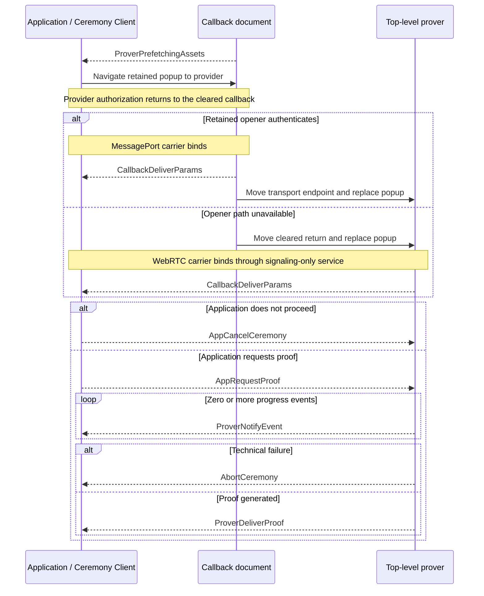

# Ceremony Cross-Document Protocol (CCDP)

This document defines the closed browser protocol used by `@libid/ceremony`
across the application, callback, and isolated prover. It owns ceremony
messages, their directions, ordering, and protocol compatibility.

The concrete [CCDP transport](CCDP-TRANSPORT.md) authenticates, structurally
decodes, and delivers messages, selects a carrier, and navigates the popup. Its
browser-local [MessagePort](CCDP-CARRIER-MESSAGEPORT.md) and fallback
[WebRTC](CCDP-CARRIER-WEBRTC.md) carriers are defined separately. The package
API and result lifecycle are defined in [ARCHITECTURE.md](ARCHITECTURE.md),
callback behavior in [CALLBACK.md](CALLBACK.md), proving in
[PROVER.md](PROVER.md), and deployed routes in [SERVER.md](SERVER.md). These are
implementation architecture, not part of the normative proof specification.
Package acceptance requirements are indexed by [TEST_PLAN.md](TEST_PLAN.md).

Shared package types such as `PlatformId`, `PlatformCeremonyVersion`, and
`PlatformStep` retain their definitions in the architecture document.
`CeremonyConfig` and deployed prover inputs retain theirs in the server
contract.

## Protocol boundary

| Context | Owns | Browser constraint |
|---|---|---|
| Application page | operation inputs, live `Ceremony`, durable application Job, and final result commit | has application-defined headers and lifecycle; may be cross-site from the ceremony server |
| Callback | OAuth navigation and return, initial opener authentication when available, and transition to proving | remains top-level and non-isolated until the returned transport endpoint selects a carrier; its configured alias is the registered server-hosted `redirect_uri` |
| Prover | credentials after callback, visible progress, and proof generation | reuses the popup's top-level browsing context under COOP/COEP isolation |

CCDP is transport-neutral. It defines what each message means, which
participant may send it, and its order. [CCDP-TRANSPORT.md](CCDP-TRANSPORT.md)
owns how values cross browser documents and carriers and invokes CCDP's injected
`Message.decode` before delivery. Callback, prover, and client code receive a
structurally valid `CCDPMessage` and enforce its direction and order.

## Protocol definition

### Version

```ts
type CCDPVersion = 1
```

`CCDPVersion` covers `CCDPMessage`, its direction, ordering, validation, and
transport-binding semantics. Ceremony code supplies it as the transport's
`applicationVersion`; transport exact-matches but does not interpret it.
Same-release carrier and navigation controls have no independent negotiated
version.

### Prefetch readiness

```ts
interface ProverPrefetchingAssets {
  ccdpVersion: CCDPVersion
  type: 'prover-prefetching-assets'
  ceremonyId: string
  platformId: PlatformId
  platformCeremonyVersion: PlatformCeremonyVersion
}
```

`ProverPrefetchingAssets` is the first CCDP message. The initial top-level
callback loads the same-origin prover prefetch child. That child
clears and exact-validates its bootstrap fragment, resolves the selected
profile, activates the prover Service Worker, starts the profile's public
fetches, and emits readiness after registration and dispatch settle. It does
not wait for downloads.

The callback accepts the message only from its exact child at the configured
server origin and passes it unchanged to its ceremony transport. The transport
sends it over `WindowProxy` using each configured allowed application origin as
an exact `targetOrigin`. The application exact-matches version, ceremony,
profile, callback origin, and browser-stamped popup source. A real-anchor launch
binds the observed source here. The application transport then navigates that
popup to the frozen provider URL.

The top-level callback visit places the child, Service Worker, and caches in the
ceremony server's first-party partition, which the later top-level prover
reuses. An application-hosted iframe may occupy another storage partition and
is not a launch dependency. Missing profile, document load, registration, or
activation fails before OAuth; an ordinary artifact-fetch failure continues on
the cold proving path.

### OAuth-return delivery

```ts
interface CallbackDeliverParams {
  type: 'callback-deliver-params'
  oauthReturn: {
    query: string
    fragment: string
  }
}
```

The callback creates this message from the bounded query and fragment copied and
cleared by the server bootstrap. It extracts only the single OAuth state needed
for ceremony routing and does not classify approval, denial, transport, or
platform fields.

`CallbackDeliverParams` is the first CCDP message after provider return. On
MessagePort it comes directly from the authenticated callback before the
endpoint moves. On RTC the callback queues the same message locally and the
replacement prover forwards it unchanged after the `RTCDataChannel` opens. The
`Callback` prefix records its creator, even when the prover forwards it.

The application-scoped client uses the live `Ceremony` already bound to that
transport and its platform/version parser to exact-validate transport, fields,
state, client, redirect, success, and provider denial. A stale, replayed,
retired, or post-reload delivery changes no live state.

### Proof request

```ts
interface AppRequestProof {
  type: 'app-request-proof'
  platformId: PlatformId
  platformCeremonyVersion: PlatformCeremonyVersion
  clientId: string
  redirectUri: string
  oauthReturn: {
    query: string
    fragment: string
  }
  codeVerifier: string | null
}
```

A malformed result rejects the ceremony. A valid provider denial resolves
`{ status: 'denied' }` and sends `AppCancelCeremony`. A valid acceptance creates
one `AppRequestProof` from the selected platform/version, frozen client and
redirect, derived code verifier, and unchanged OAuth return.

The application origin is trusted for this transient input: it already
supplies the operation being authorized. The client retains the authorization
nonce; only its derived code verifier crosses this boundary. No authorization
digest, operation field, separate OAuth state, Job revision, composition kind,
wallet state, connector, or transport kind enters the request.

Transport validates generic CCDP shape and bounds. The prover then applies the
exact selected platform/version parser before credential use. The callback and
transport have no platform configuration and cannot perform that second
validation. The one-shot ceremony and transport prevent duplicate proving; the
composition's final Job CAS prevents a late result from producing an application
effect.

### Progress and proof delivery

```ts
interface ProverNotifyEvent {
  type: 'prover-notify-event'
  platformStep: PlatformStep
  timestamp: number
}

interface ProverDeliverProof<Proof = unknown> {
  type: 'prover-deliver-proof'
  proof: Proof
}
```

After `AppRequestProof`, the prover sends zero or more bounded progress records
followed by one proof, unless the run aborts. The closed union uses
`ProverDeliverProof<unknown>`; CCDP validates only its envelope and passes the
logical value unchanged. The selected platform/version validator then narrows
it. Adding a platform does not change CCDP, the transport, or either carrier.

`PlatformStep.label` is nonempty package-owned display text of at most 96 UTF-8
bytes without control characters. `PlatformStep.progress` is finite,
monotonic, and in `[0, 1)`. Only local handling of `ProverDeliverProof` renders
completion as `1`. Progress is advisory; detailed semantics live in
[PROVER.md](PROVER.md#platform-progress).

### Cancellation and technical failure

```ts
interface AppCancelCeremony {
  type: 'app-cancel-ceremony'
}

interface AbortCeremony {
  type: 'abort-ceremony'
  reason: string
}
```

`AppCancelCeremony` is the parameterless downstream command for explicit user
cancellation, valid provider denial, invalid callback classification, or
retired application authority. Reachable proving work clears queued input and
attempts to close; no acknowledgement or platform-specific cancel path exists.

`AbortCeremony` is the upstream technical-failure message created by callback or
prover code. Its reason is a bounded sanitized diagnostic string, not a stable
code or raw exception. Exact reason enums may emerge from implementation
experience. The application rejects the live ceremony for every observable
abort. Context or transport loss may produce no message.

### Closed message union

```ts
type CCDPMessage =
  | ProverPrefetchingAssets
  | CallbackDeliverParams
  | AppRequestProof
  | AppCancelCeremony
  | ProverNotifyEvent
  | ProverDeliverProof
  | AbortCeremony
```

### Structural decoding

Each message interface has a same-named companion value containing its literal
discriminator and structural decoder. The shared assertion owns the common
plain-record, exact-field-set, and `type` checks:

```ts
declare function assertMessage<
  const Type extends string,
  const Fields extends readonly string[],
>(
  value: unknown,
  type: Type,
  fields: Fields,
): asserts value is { type: Type } & Record<Fields[number], unknown>

const ProverDeliverProof = {
  type: 'prover-deliver-proof',

  decode(value: unknown): ProverDeliverProof {
    assertMessage(value, this.type, ['proof'])
    return value
  },
}
```

A decoder exact-validates its message-specific fields and bounds, rejects
unknown fields, and returns the same received object. It never coerces,
normalizes, supplies defaults, strips fields, or allocates a replacement.
Nested platform proof remains `unknown` here and is decoded later by the
selected platform/version module.

The closed companion values form one immutable local registry. There is no
global registration, import-time self-registration, or plugin API:

```ts
const messages = [
  ProverPrefetchingAssets,
  CallbackDeliverParams,
  AppRequestProof,
  AppCancelCeremony,
  ProverNotifyEvent,
  ProverDeliverProof,
  AbortCeremony,
] as const

const messagesByType: ReadonlyMap<string, Message<CCDPMessage>> = new Map(
  messages.map(
    (message): [string, Message<CCDPMessage>] => [message.type, message],
  ),
)

if (messagesByType.size !== messages.length) {
  throw new TypeError('duplicate CCDP message type')
}

const CCDPMessage: Message<CCDPMessage> = {
  decode(value: unknown): CCDPMessage {
    const message = messagesByType.get(readMessageType(value))
    if (!message) throw new TypeError('unknown CCDP message type')
    return message.decode(value)
  },
}
```

`readMessageType` accepts only a plain record with a bounded string `type`; the
selected companion repeats the exact discriminator check so it also works
independently. Both transport endpoints receive `CCDPMessage` as their
injected `Message` and invoke its decoder once for each inbound carrier value.
Successful handlers therefore receive a structurally valid union without an
unchecked cast. Direction, order, and participant state remain higher-level
checks.

Opener authentication, Service Worker controls, SDP, and ICE candidates are not
`CCDPMessage`. The transport and carrier documents define those private
controls. Exact signaling-service records remain part of later server work.

## Ceremony sequence



The diagram intentionally hides MessagePort transfer, worker receipts, SDP,
ICE, framing, URL clearing, and callback/prover UI. Those mechanics are
transport or participant concerns and do not alter the logical sequence.

## Shared invariants

- One live ceremony accepts one prefetch readiness, one carrier, and one
  `CallbackDeliverParams`.
- A carrier authenticates and binds under the concrete transport before any
  OAuth return reaches the application or signaling carries data.
- Carriers cannot inspect or invent meaning for an opaque transport value.
- Unknown, malformed, replayed, out-of-order, wrong-direction, or post-terminal
  values change no state.
- Every CCDP message after prefetch readiness omits ceremony ID because
  transport ownership already supplies it.
- Progress remains advisory and cannot authorize, cancel, or complete a
  ceremony.
- Cancellation and context-loss handling are best effort; closure is never a
  result.
- No ceremony recovery, durable browser checkpoint, or transport migration
  exists.
- Callback owns return capture and transition UI; prover owns credentials,
  workers, visible proving UI, and proof behavior; the transport owns binding,
  selection, and navigation while carriers own delivery.

## Versioning and compatibility

A loaded application client and server browser artifacts must share
`CCDPVersion`. A compatible release may change internal carrier code, worker
controls, ICE policy, cache mechanics, or equivalent framing without changing
the logical transport or messages. A breaking message shape, direction,
ordering, authentication, transport-binding, or validation rule increments
`CCDPVersion`.

`PlatformCeremonyVersion` remains independent and versions one platform's
authorization, OAuth, proof, and output semantics. The server HTTP namespace is
also independent. Version axes and rollout rules are summarized in
[ARCHITECTURE.md](ARCHITECTURE.md#versioning-and-compatibility).
