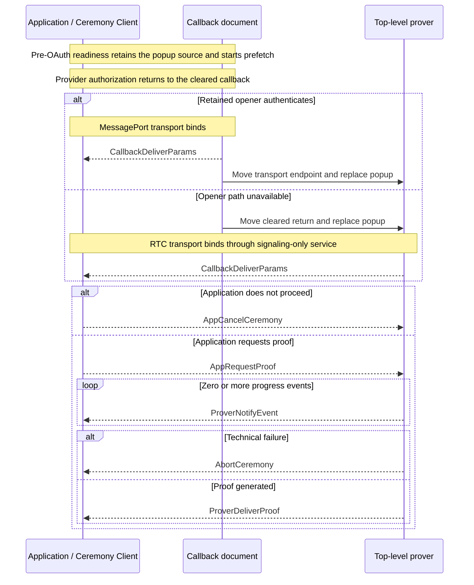

# Ceremony Cross-Document Protocol (CCDP)

This document defines the closed browser protocol used by `@libid/ceremony`
across the application, callback, and isolated prover. It owns the logical
transport contract, transport selection, ceremony messages, ordering, and
protocol compatibility.

The browser-local MessagePort transport is defined in
[CCDP-MESSAGEPORT.md](CCDP-MESSAGEPORT.md). The WebRTC fallback is defined in
[CCDP-RTC.md](CCDP-RTC.md). The package API and result lifecycle are defined in
[ARCHITECTURE.md](ARCHITECTURE.md), callback behavior in [CALLBACK.md](CALLBACK.md),
proving in [PROVER.md](PROVER.md), and deployed routes in
[SERVER.md](SERVER.md). These are implementation architecture, not part of the
normative proof specification. Package acceptance requirements are indexed by
[TEST_PLAN.md](TEST_PLAN.md).

Shared package types such as `PlatformId`, `PlatformCeremonyVersion`, and
`PlatformStep` retain their definitions in the architecture document.
`CeremonyConfig` and deployed prover inputs retain theirs in the server
contract.

## Architecture drivers

### Execution contexts

| Context | Owns | Browser constraint |
|---|---|---|
| Application page | operation inputs, live `Ceremony`, durable application Job, and final result commit | has application-defined headers and lifecycle; may be cross-site from the ceremony server |
| Callback | OAuth navigation and return, initial opener authentication when available, and transition to proving | remains top-level and non-isolated until the returned document chooses a transport; its configured alias is the registered server-hosted `redirect_uri` |
| Prover | credentials after callback, visible progress, and proof generation | reuses the popup's top-level browsing context under COOP/COEP isolation |

No single document can satisfy every browser constraint. OAuth returns by
replacing the document which started provider navigation, while multithreaded
proving requires response-level isolation which cannot be added by an
application library. A provider may also apply opener isolation before the
callback, making `window.opener` unavailable.

CCDP therefore separates **protocol** from **transport**:

- CCDP defines the messages and lifecycle visible to the Ceremony Client and
  prover.
- A transport authenticates one live ceremony and exposes one `CCDPTransport`.
- MessagePort is the local path when the callback retains its opener.
- WebRTC is the fallback when provider policy severs that path.

Neither transport changes authorization, OAuth parsing, proving, progress, or
proof-delivery semantics. Once selected, the transport is invisible to CCDP and
cannot change during the ceremony.

### Decision summary

| Decision | Constraint and rationale | Cost and revisit condition |
|---|---|---|
| Serve fixed callback and prover documents from the configured server | OAuth callback, isolation, CSP, allowed origins, and deployed assets are response properties | revisit only if browsers provide an authenticated callback and isolated prover without separate documents |
| Reuse one ceremony popup across provider navigation, callback, and proving | preserves activation and one visible ceremony surface without another popup or button | document replacement destroys memory, so transports must preserve only the live transport endpoint or cleared OAuth return |
| Always promote the callback to the top-level prover | one common path avoids prover-placement negotiation and keeps proving foregrounded | costs one same-origin navigation; a [Document Isolation Policy](https://github.com/WICG/document-isolation-policy) iframe may become an internal optimization after broader browser adoption or measured need |
| Prefer MessagePort and fall back to WebRTC only when opener authentication is unavailable | keeps the ordinary path browser-local while surviving adversarial provider opener policy | WebRTC requires an idle signaling subscription, STUN, framing, and ICE only for the fallback |
| Expose one transport-neutral interface | protocol code should not branch on browser transport | transports must preserve ordered one-shot delivery and report only observable failures |
| Signal selected-profile prefetch readiness before OAuth | consent time can overlap public downloads without waiting for them | the MessagePort transport owns this separate pre-transport bootstrap |
| Keep ceremonies memory-only and one-shot | recovery would add credential storage, replay, migration, and cleanup state | interruption before Identity delivery repeats OAuth |
| Use one `CCDPVersion` | messages and transport semantics are one package-owned browser protocol | a breaking protocol or binding change increments it; no per-message negotiation |

## Browser topology

```text
Application origin
  composition + Ceremony Client
  durable Job and live Ceremony
              │
              │ one CCDPTransport
              │ MessagePort normally, RTC after opener severance
              ▼
Configured ceremony server origin
  /api/v1/ceremony/callback and configured callback alias
    non-isolated callback document
              ├─ top-level navigation ── OAuth provider and back
              └─ immediate same-popup promotion after callback
              ▼
  /api/v1/ceremony/prover
    isolated foreground prover + workers/WASM
              ├─ platform/notary/JWK network selected by platform version
              └─ optional same-origin confidential platform route
```

The initial callback document uses the browser-local bootstrap to activate prefetch and let
the application retain its source before OAuth. After callback, transport
selection produces one application-to-current-ceremony transport. The callback
then becomes the top-level prover. The MessagePort transport moves its endpoint
through the Service Worker; the RTC transport moves only the cleared OAuth
return locally and opens its `RTCDataChannel` from the final prover. Exact mechanics
live in the transport documents.

The caller's scripted-open and real-anchor launch paths are defined by the
[client lifecycle](ARCHITECTURE.md#client-lifecycle). Both use the same popup,
prefetch, OAuth, transport selection, proving, and cleanup. Window versus tab is
presentation, not a protocol or transport mode.

## Transport contract

```ts
interface CCDPTransport {
  send(message: CCDPMessage): void
  receive(handler: (message: unknown) => void): () => void
  close(): void
}
```

This is an internal package boundary, not a public application API. An
implementation returns one transport only after binding it to one live ceremony
and protocol version. `send` accepts a message into the transport's local
ordered queue; it is not a delivery acknowledgement. `receive` installs the one active receiver and
returns its removal function. Received values remain `unknown` until the CCDP
directional and phase validator accepts them. `close` is idempotent and sends
no protocol result.

The interface deliberately exposes no transport kind, ceremony ID, origin,
transferable, reconnect, retry, readiness, or remote-close promise. MessagePort
may not report remote context loss, so CCDP permits silent failure under either
transport. RTC buffering and binary framing remain inside its implementation.

### Transport selection

The application prepares its live ceremony, retains the popup source, and arms
one idle RTC signaling subscription before provider navigation. The callback
then chooses exactly one path:

1. If the retained opener can complete exact source/origin authentication, the
   MessagePort transport binds immediately and the unused signaling subscription
   closes before any offer exists.
2. If the opener is absent, severed, invalid, or does not authenticate within
   the bounded callback deadline, the callback queues its cleared OAuth return
   for the replacement prover. That prover establishes the RTC transport through
   the pre-armed signaling subscription.

MessagePort has priority until callback navigation commits the RTC path. The
live application ceremony atomically accepts the first valid selected transport;
late authentication, signaling, or messages from another transport are inert.
After selection, transport failure rejects or strands the one-shot ceremony—it
never falls back again.

Both transports provide:

- one authenticated application/current-prover transport bound to one ceremony;
- ordered, nonduplicated logical messages;
- the same exact CCDP validation after receipt;
- bounded values with no transport-selected platform or extension; and
- best-effort cancellation and failure notification without recovery.

## Protocol definition

### Version

```ts
type CCDPVersion = 1
```

`CCDPVersion` covers `CCDPMessage`, its ordering and validation, and the common
transport-binding semantics. Each transport verifies it before exposing a
transport. The Service Worker's same-release navigation controls need no independent wire
version. RTC signaling carries the version only to reject incompatible peers;
it cannot negotiate another version.

### OAuth-return delivery

```ts
interface CallbackDeliverParams {
  type: 'callback-deliver-params'
  oauthReturn: {
    query: string
    fragment: string
  }
}
```

The callback creates this message from the bounded query and fragment copied and
cleared by the server bootstrap. It extracts only the single OAuth state needed
for ceremony routing and does not classify approval, denial, transport, or
platform fields.

`CallbackDeliverParams` is the first CCDP message delivered to the application.
On MessagePort it comes directly from the authenticated callback before the
endpoint moves. On RTC the callback queues the same message locally and the
replacement prover forwards it unchanged after the `RTCDataChannel` opens. The
`Callback` prefix records its creator, even when the prover forwards it.

The application-scoped client selects its live `Ceremony` from the transport and
uses that ceremony's platform/version parser to exact-validate transport,
fields, state, client, redirect, success, and provider denial. A stale,
replayed, retired, or post-reload delivery changes no live state.

### Proof request

```ts
interface AppRequestProof {
  type: 'app-request-proof'
  platformId: PlatformId
  platformCeremonyVersion: PlatformCeremonyVersion
  clientId: string
  redirectUri: string
  oauthReturn: {
    query: string
    fragment: string
  }
  codeVerifier: string | null
}
```

A malformed result rejects the ceremony. A valid provider denial resolves
`{ status: 'denied' }` and sends `AppCancelCeremony`. A valid acceptance creates
one `AppRequestProof` from the selected platform/version, frozen client and
redirect, derived code verifier, and unchanged OAuth return.

The application origin is trusted for this transient input: it already
supplies the operation being authorized. The client retains the authorization
nonce; only its derived code verifier crosses this boundary. No authorization
digest, operation field, separate OAuth state, Job revision, composition kind,
wallet state, connector, or transport kind enters the request.

The prover validates generic CCDP shape and bounds, then applies the exact
selected platform/version parser before credential use. The callback and
transports have no platform configuration and cannot perform that validation.
The one-shot ceremony and transport prevent duplicate proving; the composition's
final Job CAS prevents a late result from producing an application effect.

### Progress and proof delivery

```ts
interface ProverNotifyEvent {
  type: 'prover-notify-event'
  platformStep: PlatformStep
  timestamp: number
}

interface ProverDeliverProof<Proof = unknown> {
  type: 'prover-deliver-proof'
  proof: Proof
}
```

After `AppRequestProof`, the prover sends zero or more bounded progress records
followed by one proof, unless the run aborts. The closed union uses
`ProverDeliverProof<unknown>`; CCDP validates only its envelope and passes the
logical value unchanged. The selected platform/version validator then narrows
it. Adding a platform does not change CCDP or either transport.

`PlatformStep.label` is nonempty package-owned display text of at most 96 UTF-8
bytes without control characters. `PlatformStep.progress` is finite,
monotonic, and in `[0, 1)`. Only local handling of `ProverDeliverProof` renders
completion as `1`. Progress is advisory; detailed semantics live in
[PROVER.md](PROVER.md#platform-progress).

### Cancellation and technical failure

```ts
interface AppCancelCeremony {
  type: 'app-cancel-ceremony'
}

interface AbortCeremony {
  type: 'abort-ceremony'
  reason: string
}
```

`AppCancelCeremony` is the parameterless downstream command for explicit user
cancellation, valid provider denial, invalid callback classification, or
retired application authority. Reachable proving work clears queued input and
attempts to close; no acknowledgement or platform-specific cancel path exists.

`AbortCeremony` is the upstream technical-failure message created by callback or
prover code. Its reason is a bounded sanitized diagnostic string, not a stable
code or raw exception. Exact reason enums may emerge from implementation
experience. The application rejects the live ceremony for every observable
abort. Context or transport loss may produce no message.

### Closed message union

```ts
type CCDPMessage =
  | CallbackDeliverParams
  | AppRequestProof
  | AppCancelCeremony
  | ProverNotifyEvent
  | ProverDeliverProof
  | AbortCeremony
```

Prefetch readiness, opener authentication, Service Worker controls, SDP, and
ICE candidates are not ceremony messages. MessagePort controls are defined in
its transport document; the RTC document defines signaling behavior while its
exact service records remain part of later server work.

## Ceremony sequence



The diagram intentionally hides MessagePort transfer, worker receipts, SDP,
ICE, framing, URL clearing, and callback/prover UI. Those mechanics are transport or
participant concerns and do not alter the CCDP sequence observed after
transport binding.

## Shared invariants

- One live ceremony accepts one transport and one first `CallbackDeliverParams`.
- A transport authenticates and binds before any OAuth return reaches the
  application or signaling carries data.
- Transport records cannot carry or invent a CCDP message.
- Unknown, malformed, replayed, out-of-order, wrong-direction, wrong-transport,
  or post-terminal values change no state.
- All CCDP messages after binding omit ceremony ID because transport ownership
  already supplies it.
- Progress remains advisory and cannot authorize, cancel, or complete a
  ceremony.
- Cancellation and context-loss handling are best effort; closure is never a
  result.
- No ceremony recovery, durable browser checkpoint, or transport migration
  exists.
- Callback owns return capture and transition UI; prover owns credentials,
  workers, visible proving UI, and proof behavior; transports own only binding
  and delivery.

## Versioning and compatibility

A loaded application client and server browser artifacts must share
`CCDPVersion`. A compatible release may change internal transport code, worker
controls, ICE policy, cache mechanics, or equivalent framing without changing
the logical transport or messages. A breaking message shape, ordering,
authentication, transport-binding, or validation rule increments `CCDPVersion`.

`PlatformCeremonyVersion` remains independent and versions one platform's
authorization, OAuth, proof, and output semantics. The server HTTP namespace is
also independent. Version axes and rollout rules are summarized in
[ARCHITECTURE.md](ARCHITECTURE.md#versioning-and-compatibility).
