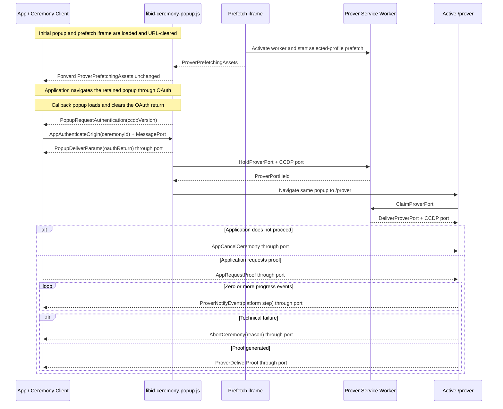

# Ceremony Cross-Document Protocol (CCDP)

This document defines the closed browser protocol used by `@libid/ceremony`
across the application, OAuth popup, and isolated prover. It also owns
cross-document prefetch readiness, the short-lived prover-port handoff, and
protocol compatibility rules.

The package boundary, public client API, and result lifecycle are defined in
[ARCHITECTURE.md](ARCHITECTURE.md). The popup participant's local state machine,
UI, and cleanup are defined in [POPUP.md](POPUP.md). Prover pipelines, assets,
workers, and cache behavior are defined in [PROVER.md](PROVER.md).
The deployed routes, embedded inputs, and response policy are defined in
[SERVER.md](SERVER.md). This is implementation architecture, not part of the
normative proof specification.
Package acceptance requirements are indexed by [TEST_PLAN.md](TEST_PLAN.md).
Shared package types and constants such as `PlatformId`,
`PlatformCeremonyVersion`, and `PlatformStep` retain their definitions in the
architecture document. `CeremonyConfig` and `ProverAssets` retain theirs in the
server contract.

## Architecture drivers and decisions

### Execution contexts

The browser ceremony crosses three protocol roles. COOP means
`Cross-Origin-Opener-Policy`; it is an HTTP response policy which application
JavaScript cannot add to an already loaded document.

| Context | Owns | Browser constraint |
|---|---|---|
| Application page | operation inputs, live `Ceremony`, durable application Job, final result commit | may be embedded into an application with its own headers and lifecycle; retains the popup `WindowProxy` through OAuth |
| Ceremony popup/callback | OAuth navigation and return, opener authentication, and port transfer | remains top-level and non-isolated until it authenticates the application; its callback alias is the registered server-hosted `redirect_uri` |
| Prover | credentials after callback, visible progress, and proof generation | reuses the popup's top-level browsing context under COOP/COEP isolation |

No single document can satisfy the interactive constraints. The OAuth callback
must preserve its cross-origin opener long enough to authenticate the
application, while the prover must use isolation headers which sever that
opener. OAuth also returns by loading a registered server route, replacing the
document that started provider navigation. Multithreaded proving cannot be made
a normal function call in the application page because isolation is a
response-level property, not a library option.

The **Ceremony Cross-Document Protocol (CCDP)** uses authenticated
`window.postMessage` only to bootstrap one `MessagePort`. The callback sends
the OAuth return through that port, transfers the port to the prover Service
Worker, and navigates its existing popup to the prover route as an isolated
top-level document.
Messages sent while the port is held remain queued on the entangled application
endpoint.

Collapsing the messages into ordinary library calls would require collapsing
the documents too, which would either lose OAuth opener continuity or lose the
isolation required by the prover. CCDP therefore stays a closed, package-owned
browser ABI: it binds exact application-facing sources, trusted internal
origins, versions, and one live ceremony while transporting only OAuth return,
proving input, progress, cancellation, and proof delivery. It is not a remote
API or extension surface.

### Decision summary

| Decision | Constraint and rationale | Cost and revisit condition |
|---|---|---|
| Serve fixed popup and prover documents from the configured server | OAuth needs a registered callback document; isolation, Content Security Policy (CSP), allowed origins, and asset manifests are response properties | server must expose the documented routes; revisit only if browsers provide an authenticated callback and isolated-prover primitive without separate documents |
| Navigate the callback to the same top-level prover | one common-denominator path avoids placement negotiation while preserving one visible popup and the required isolation | costs one immediate same-origin navigation and Service Worker port handoff; a [Document Isolation Policy](https://github.com/WICG/document-isolation-policy) iframe may become an internal optimization when adoption across supported browsers or measured navigation cost justifies a second placement |
| Reuse one ceremony popup across launch, provider navigation, callback, and proving | preserves user activation and one visible ceremony surface without a second popup or button | navigation destroys popup memory, so the application retains ceremony state and the transferred port carries later messages |
| Use `MessagePort` after callback authentication | one capability gives ordered application/prover delivery without depending on the severed `WindowProxy` | adds one standard `MessageChannel`; revisit only if a supported browser cannot transfer it through the existing Service Worker |
| Require provider navigation to preserve the opener through callback | callback authentication needs the retained cross-origin `WindowProxy`, and supported launch profiles are qualified against that behavior | a provider COOP policy which severs it fails closed; add another authenticated transport only for a demonstrated supported-provider requirement |
| Signal selected-profile prefetch readiness before OAuth | consent time can overlap large public downloads, but the application must not await their completion | adds one readiness message; the prover subsystem owns the fetch implementation |
| Keep ceremonies memory-only and one-shot | durable OAuth/proof recovery would add credential storage, replay, migration, and cleanup state | interruption before delivery repeats OAuth; add recovery only as a separately justified protocol revision |
| Use one closed message union and one `CCDPVersion` | application, popup, and prover participate in one package-owned cross-document protocol | a breaking wire change increments one version; no per-message negotiation |

Future material decisions belong here with their constraint, consequence, and
concrete revisit condition. Exact mechanics belong in their owning reference
section.

## Browser topology and routes

```text
Application origin
  composition + @libid/ceremony/client
  durable Job and retained WindowProxy
              │ authenticated postMessage bootstrap
              │ then one transferred MessagePort
              ▼
Configured server origin
  /api/v1/ceremony/popup and callback alias
    fixed URL-clearing bootstrap + libid-ceremony-popup.js
    non-isolated OAuth popup
              ├─ top-level navigation ── OAuth provider (and back)
              ├─ port ── prover Service Worker ── port
              │         immediate same-popup /prover navigation
              ▼
  /api/v1/ceremony/prover
    libid-ceremony-prover.js + workers/WebAssembly (WASM)
    one active isolated top-level prover with visible UI
              ├─ platform/notary/JWK-set network defined by platform version
              └─ optional server-owned same-origin platform route
```

The exact route surface and response contracts are defined in
[SERVER.md](SERVER.md#route-surface). `/api/v1/ceremony/popup` is the shared
launch document and its configured callback path is the registered OAuth
`redirect_uri`. `/api/v1/ceremony/prover` is the one document used for prefetch
and isolated proving. These roles are selected after fragment clearing; they
are not server response variants and keep no durable ceremony state.

The caller launches the popup through the scripted path or real-anchor fallback
defined under [client lifecycle](ARCHITECTURE.md#client-lifecycle). Both paths preserve
`window.opener`; `noopener` and `noreferrer` are forbidden. Their launch
fragment contains only the ceremony ID, platform ID, and selected ceremony
version and is cleared before subresources or network activity. Both paths then
use the same prefetch, OAuth, callback, and proving protocol; presentation as a
window or tab is a browser choice, not a protocol mode.

The initial popup's prover iframe activates the shared Service Worker and starts
prefetch. After the provider callback authenticates the application, the app
transfers one end of a fresh `MessageChannel`. The callback sends the OAuth
return through that port, hands the port to the worker, and navigates the same
top-level browsing context to `/api/v1/ceremony/prover#ceremonyId`. The
top-level prover claims the port before importing its root module. The worker
retains no durable record and never holds the port across OAuth. See
[launch and prefetch](#launch-and-prover-prefetch) and
[prover port handoff](#prover-port-handoff) for ordering,
[PROVER.md](PROVER.md#prefetch-and-cache-lifecycle) for caching, and
[POPUP.md](POPUP.md) for popup behavior.

## Protocol definition

CCDP is the closed internal browser protocol between the application, ceremony
popup, and prover. Its wire surface is the `CCDPMessage` union. It
carries one ceremony through launch, OAuth return, opener authentication,
proving, and delivery because those steps cross independent documents and
cannot share library calls or memory. The
[architecture drivers](#architecture-drivers-and-decisions) explain why these browser
boundaries exist; this section defines their ordered messages.

A message name starts with the component which creates it: `App`, `Popup`, or
`Prover`, followed by its action. Intermediaries forward a message unchanged, so
the prefix records its original creator rather than its latest transport hop.
`AbortCeremony` is the sole origin-prefix exception because popup and prover
share the same upstream technical-failure contract.

Application-facing window-message receivers exact-validate shape, direction,
browser-stamped origin, source, and current phase. Package-private messages
between same-server-origin popup and prover documents exact-validate shape,
origin, and phase but do not rely on `MessageEvent.source`, which is not stable
on every qualified WebKit path; compromise of that origin already controls both
documents. After authenticated transfer, port receivers exact-validate shape,
direction, and phase; possession of the bound port is the channel authority.
Unknown, replayed, out-of-order, or post-terminal messages change no state. The
protocol has no caller-defined message, extension point, or negotiated feature.

### Protocol version

```ts
type CCDPVersion = 1
```

`CCDPVersion` versions the complete `CCDPMessage` union shared by the
application/popup and popup/prover boundaries. The initial and returned
ceremony popup carries the version in its first application-facing message. The
client validates it before OAuth and again after return; it does not echo or
negotiate a version. The package-internal popup/prover boundary introduces no
second version exchange.

### Launch and prover prefetch

```ts
interface ProverPrefetchingAssets {
  ccdpVersion: CCDPVersion
  type: 'prover-prefetching-assets'
  ceremonyId: string
  platformId: PlatformId
  platformCeremonyVersion: PlatformCeremonyVersion
}
```

On initial launch, the popup exact-validates and clears its fragment's ceremony
ID, platform ID, and ceremony version, then loads
`/api/v1/ceremony/prover#prefetch(ceremonyId, platformId,
platformCeremonyVersion)`. The child clears that fragment, resolves the exact
profile, and asks the prover subsystem to start its selected-profile prefetch.
It returns `ProverPrefetchingAssets` after the registration/start attempt
settles; it does not wait for downloads to finish. The popup accepts the message
only from its server origin in the active prefetch phase and forwards it
unchanged to `window.opener` using only server-embedded allowed origins. A
missing or invalid profile, document load failure, or worker registration or
activation failure rejects before OAuth; ordinary cache or artifact-fetch
failure continues on the cold proving path. CCDP defines no prefetch timeout.

The application accepts `ProverPrefetchingAssets` only from the configured
server origin with its live ceremony ID, platform, version, and expected source. A
scripted launch exact-matches the supplied `WindowProxy`; a real-anchor launch
binds the matching message source. The client validates the protocol version,
retains that source, and navigates it to the frozen provider authorization URL.
Prefetch requires no opener reply because it handles only public assets.
It does not create a `MessagePort`: provider navigation would destroy the
popup endpoint before any credential-bearing phase. The one useful port is
created only after the callback document authenticates.

### Callback and opener authentication

```ts
interface PopupRequestAuthentication {
  ccdpVersion: CCDPVersion
  type: 'popup-request-authentication'
}

interface AppAuthenticateOrigin {
  type: 'app-authenticate-origin'
  ceremonyId: string
}

interface PopupDeliverParams {
  type: 'popup-deliver-params'
  oauthReturn: {
    query: string
    fragment: string
  }
}
```

The popup clears the provider callback URL before parsing it. An absent,
malformed, or duplicate OAuth `state` changes no live state and produces no
application message. After extracting exactly one syntactically valid state,
the callback popup sends `PopupRequestAuthentication`. It asks the
retained application to prove continuity before the popup releases the captured
redirect parameters; it exposes neither the ceremony ID nor those parameters and does not
classify approval, denial, or malformed platform fields. The client
accepts it only from the retained popup source at the configured server origin
and expected protocol version, then returns its retained ceremony ID in
`AppAuthenticateOrigin`.

The client creates one `MessageChannel` and transfers exactly one endpoint with
`AppAuthenticateOrigin`. The popup accepts that message only from
`window.opener`, requires the browser-stamped origin to be allowed,
exact-matches the supplied ceremony ID to the captured OAuth state, and rejects
a missing or additional transferred port. This one window-message exchange
binds the port to the retained popup source, browser-stamped application origin,
and live ceremony.

Only then does the popup send the unchanged bounded `oauthReturn` in
`PopupDeliverParams` through the port. The application retains the other
endpoint across the following prover navigation; subsequent CCDP messages use
the port and no longer depend on a `WindowProxy`, message origin, or source. A
different allowed application occupying the opener receives neither the
ceremony ID, port, nor redirect parameters. No callback-time storage record is
needed.

The callback gives opener authentication a
`REDIRECT_OPENER_TIMEOUT_MS = 30_000` deadline. Missing valid
`AppAuthenticateOrigin` clears the captured return, severs the opener, and
renders the same fixed unapproved-application result as an invalid opener
origin. It releases no callback value and performs no credential-bearing
navigation.

### OAuth classification and proof dispatch

```ts
interface AppRequestProof {
  type: 'app-request-proof'
  platformId: PlatformId
  platformCeremonyVersion: PlatformCeremonyVersion
  clientId: string
  redirectUri: string
  oauthReturn: {
    query: string
    fragment: string
  }
  codeVerifier: string | null
}
```

The application-scoped client selects the live `Ceremony` from the authenticated
bound channel; it does not query IndexedDB or reveal the ID to the composition.
A stale, replayed, retired, or post-reload binding changes no live state and
causes cleanup through `AppCancelCeremony`. Otherwise the client atomically
claims the state and uses that Ceremony's platform/version client parser to
exact-validate the `oauthReturn` transport and fields.

A malformed or mismatched result rejects the Ceremony. A valid provider denial
resolves `{ status: 'denied' }`. Both paths send `AppCancelCeremony` for popup cleanup.
A valid acceptance constructs `AppRequestProof` from the selected
platform/version, frozen client and redirect, derived code verifier, and
unchanged `oauthReturn`. The application origin is trusted for this transient input;
the protocol does not try to hide it from other scripts executing in that
origin. The Ceremony Client retains the authorization nonce; only its derived
code verifier crosses the prover boundary.

The isolated prover receives `AppRequestProof` once through the transferred
port, validates its generic CCDP shape and bounds, and applies the selected
platform/version parser before credential use. The callback cannot validate the
platform, version, client, redirect, or PKCE policy: it has no launch record or
`CeremonyConfig`, and deliberately fetches neither. The authenticated client has
already selected those values. The claimed client entry, one-shot Ceremony,
port ownership, and prover state machine prevent duplicate proving.
The composition's final Job CAS prevents a late result from producing an
application effect. No separate OAuth state, job revision, composition
discriminator, wallet state, or connector crosses this protocol.

### Prover port handoff

```ts
interface HoldProverPort {
  type: 'hold-prover-port'
  ceremonyId: string
}

interface ProverPortHeld {
  type: 'prover-port-held'
  ceremonyId: string
}

interface ClaimProverPort {
  type: 'claim-prover-port'
  ceremonyId: string
}

interface DeliverProverPort {
  type: 'deliver-prover-port'
  ceremonyId: string
}
```

These records are package-private browser controls, not members of
`CCDPMessage`. In the same task that sends `PopupDeliverParams`, the callback
sends `HoldProverPort` to the active
registration returned by
`navigator.serviceWorker.getRegistration('/api/v1/ceremony/')`, with the
authenticated CCDP port and one temporary receipt port in the transfer list. It
does not use `navigator.serviceWorker.ready`, because the configurable callback
path need not be inside that worker scope. The worker rejects a
malformed record, wrong port count, or duplicate ceremony ID. It stores the CCDP
port in memory, replies `ProverPortHeld` through the receipt port, and keeps the
message event alive until claim or a
short implementation-bounded expiry.

Only after that acknowledgement does the callback navigate itself to
`/api/v1/ceremony/prover#ceremonyId`. The URL-clearing prover bootstrap creates
a temporary claim channel and sends `ClaimProverPort` with its response endpoint
to the active worker from that same registration before importing package code
or using the network. The
worker atomically removes the matching holder and returns `DeliverProverPort`
with the CCDP port. Both temporary ports then close. Missing, expired, replayed,
or malformed handoff state fails closed and renders the fixed prover-load
failure; it does not start a fresh ceremony or recover through storage.

The worker stores no OAuth return or proof input. Application replies sent
after `PopupDeliverParams` remain ordered and queued
while ownership moves, becoming the prover's first input. Service Worker
lifetime is required only for one acknowledged, immediate same-origin
navigation—not provider consent time.

### Progress and proof delivery

```ts
interface ProverNotifyEvent {
  type: 'prover-notify-event'
  platformStep: PlatformStep
  timestamp: number
}

interface ProverDeliverProof<Proof = unknown> {
  type: 'prover-deliver-proof'
  proof: Proof
}
```

After `AppRequestProof`, the prover sends zero or more bounded
`ProverNotifyEvent` records followed by one `ProverDeliverProof`, unless the run
aborts. The closed `CCDPMessage` union uses the default
`ProverDeliverProof<unknown>`. CCDP validates only the envelope on the bound channel,
then delivers the structured-clone `proof` value unchanged. It neither knows nor
dispatches platform proof types. After receipt, the platform catalog uses the
platform and version retained by the live `Ceremony` to validate and narrow the
message. Adding a platform therefore does not change CCDP. `PlatformStep.label`
is nonempty package-owned display text of at most 96 UTF-8 bytes with no control
characters. `PlatformStep.progress` is finite, remains in `[0, 1)`, and never
decreases within a ceremony; only local handling of `ProverDeliverProof` renders
completion as `1`. Progress is advisory.
Detailed semantics are defined by the
[prover delivery boundary](PROVER.md#proof-delivery-boundary) and
[platform progress](PROVER.md#platform-progress).

### Cancellation and technical failure

```ts
interface AppCancelCeremony {
  type: 'app-cancel-ceremony'
}

interface AbortCeremony {
  type: 'abort-ceremony'
  reason: string
}
```

`AppCancelCeremony` is the parameterless downstream command used when the
application no longer wants the ceremony to continue, including explicit cancellation,
provider denial, invalid callback classification, or retired Job authority.
The isolated prover clears any queued input, cancels reachable work, and
attempts to close, rendering one fixed fallback if closing fails.

`AbortCeremony` is the upstream technical-failure message created by the popup
or prover. Its `reason` is a sanitized diagnostic string, not a stable
machine-readable code or raw exception. The application rejects the live
Ceremony for every `AbortCeremony`. A closed reason enum may replace the string
once implementation experience identifies stable, actionable failure
categories; launch does not guess them in advance. Neither message carries a
ceremony ID, acknowledgement, or response. Context loss may produce neither
message.

### Closed message union

```ts
type CCDPMessage =
  | ProverPrefetchingAssets
  | PopupRequestAuthentication
  | AppAuthenticateOrigin
  | PopupDeliverParams
  | AppRequestProof
  | AppCancelCeremony
  | ProverNotifyEvent
  | ProverDeliverProof
  | AbortCeremony
```

### CCDP message sequence



The diagram deliberately omits application self-transitions, provider
navigation mechanics, URL clearing, user-interface actions, validation
failures, queued messages during port transfer, and handoff expiry. Those rules
remain normative in their owning subsections.
`ProverDeliverProof` has no acknowledgement or ceremony-side checkpoint.

### Shared channel invariants

`PopupDeliverParams` and `AppRequestProof` carry the bounded query and fragment
copied and cleared by the [server bootstrap](SERVER.md#ingress-bootstrap).
The selected platform/version client leaf alone interprets their transport and
fields. The popup has no platform config.

After `AppAuthenticateOrigin`, the authenticated application channel is bound
to one ceremony; transferring that exact port through the ceremony-ID-keyed
worker handoff preserves the binding. Later
messages therefore omit the ID. Unknown, duplicate, out-of-order,
post-terminal, or off-channel messages change no state.

Progress is bounded, monotonic, advisory data forwarded unchanged; common
stages remain local to the [client](ARCHITECTURE.md#progress-cancellation-and-recovery),
and platform spans belong to the [prover](PROVER.md#platform-progress).
Cancellation is best effort, context loss may be silent, and popup closure is
never a result. No ceremony recovery or durable browser checkpoint exists.

The [popup](POPUP.md) owns opener authentication, port handoff, transition UI,
and cleanup. The [prover](PROVER.md) owns visible proving UI, fetches,
credentials, workers, pipelines, and proof behavior. The
[server contract](SERVER.md) owns URL clearing and response isolation policy.

## Versioning and compatibility

`CCDPVersion` changes only when the message union or ordering semantics break;
the package may retain older validators during its compatibility window. Other
version axes are defined in
[architecture versioning](ARCHITECTURE.md#versioning-and-compatibility).

An unsupported live popup restarts with fresh OAuth; committed Identity has
already left CCDP.
