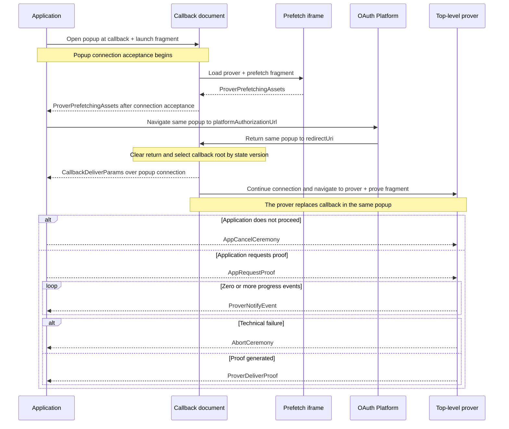

# Ceremony Cross-Document Protocol (CCDP)

This document defines the closed browser protocol across the Application,
Callback, and isolated Prover. It owns ceremony locations, navigations,
messages, ordering, and compatibility. Authorization, platform-proof, and
final-proof semantics are defined by the normative
[common ceremony](../../../specs/ceremony-common.md) and
[platform ceremony](../../../specs/platform-ceremonies.md) specifications.

An authenticated, ordered, bidirectional popup connection carries CCDP
messages unchanged. CCDP requires that connection but does not prescribe its
implementation.

## Actors and origins

An actor is an operator or external system. An origin is the exact
scheme/host/port authority used by browser security checks. A site is only the
browser's schemeful registrable-domain grouping: same-site actors may remain
cross-origin and do not gain authority over each other.
`Application` denotes both the actor and its top-level browser document when
the distinction is immaterial.

| Actor | Browser authority | Responsibility |
|---|---|---|
| Application | application origin | hosts the application document, owns the operation and ceremony state, and drives the protocol |
| OAuth Bridge | OAuth bridge origin | publishes ceremony configuration, hosts the callback document, owns OAuth registrations, and performs enabled confidential OAuth exchanges |
| Proving Host | proving origin | hosts the prefetch and isolated prover documents, prover roots, and proving assets; it may be the canonical libID deployment or an operator-selected replacement |
| OAuth Platform | OAuth-platform origin set | hosts authorization/login documents and issues the OAuth return |
| Notary Service | configured notary network origin | participates in TLS notarization and hosts no ceremony browser document |

The Application, OAuth Bridge, and Proving Host may be operated together or
independently and may be same-origin, same-site, or cross-site. CCDP assumes
none of those relationships. Browser authority is always established against
an exact origin. In particular, the Proving Host is not a wallet: both
external-wallet and native-wallet compositions consume the same independently
hosted proving boundary.

## Browser documents and routes

Before launch, the Application freezes the proving origin, redirect URI,
platform authorization URL, ceremony ID, platform ID, and platform ceremony
version. CCDP runs across these concrete browser documents and routes:

| Document | Served by | Browser context | Route | Responsibility and lifetime |
|---|---|---|---|---|
| Initial Callback | OAuth Bridge | ceremony popup, top-level and non-isolated | `${redirectUri}#launch` | accepts the Application connection and starts prefetch |
| Prefetch | Proving Host | child iframe of the Initial Callback | `${provingOrigin}/ccdp/prover#prefetch` | starts selected-profile asset fetching, then disappears with its parent Callback |
| Authorization | OAuth Platform | ceremony popup | frozen `platformAuthorizationUrl` | renders platform login/consent and returns to `redirectUri`; it is not a CCDP participant |
| Returned Callback | OAuth Bridge | ceremony popup, top-level and non-isolated | frozen `redirectUri` | delivers the OAuth-platform return and navigates to the Prover |
| Prover | Proving Host | ceremony popup, top-level and COOP/COEP-isolated | `${provingOrigin}/ccdp/prover#prove` | receives the validated OAuth result, exposes visible progress, and generates the proof |

The **ceremony popup** is a reusable browsing context, not an actor or document.
It sequentially contains Callback → Authorization → a new Callback → Prover.
The Prefetch document is a distinct iframe instance of the same stable prover
shell and never becomes the top-level Prover document. Navigation creates a new
JavaScript heap each time; no participant relies on document-local state
surviving it. These origins may all be cross-site, and same-site placement
grants no protocol authority.

The shell sections below define each fragment's full field set. Internal
fragments use the literal mode, `?`, and URL-search-parameter encoding shown
there. Producers emit each named field exactly once in the displayed order.
Receivers require the exact field set, reject duplicates, and otherwise do not
depend on parameter order. Ceremony IDs are lowercase UUIDv4 values.
Platform IDs use the exact identifiers defined by the selected platform
profile; platform ceremony versions are unsigned 16-bit integers.

The launch and prover routes have no query. Their fragments never reach either
HTTP server and are copied and cleared before rendering, module import,
storage, or network use. Their clearing bootstraps use `ccdpVersion` to select
one exact root module from a deployment-fixed supported map. No OAuth return,
credential, proof input, or proof is placed in an internal fragment. The
OAuth-platform-mandated query on `redirectUri` is the only protocol exception.

CCDP is connection-neutral. It defines which document runs at each location,
which participant initiates each navigation, what each message means, and their
order. Each recipient validates its permitted inbound messages and enforces
direction and state before acting.

## Version

This document defines CCDP version `1`. `ccdpVersion` is encoded in the
launch/prover fragments and OAuth `state`.
Version `1` selects matching callback and prover root modules, fragment
grammars, navigation order, and message semantics. A message does not repeat
the version selected before its module loads. The OAuth bridge API and popup
connection controls are independently versioned.

The version-1 browser roots have these exact filenames:

| Document | Root module |
|---|---|
| Callback | `libid-ccdp-v1-callback.js` |
| Prover | `libid-ccdp-v1-prover.js` |

A later CCDP version uses the same pattern with its decimal version substituted
for `1`. Each root is an immutable asset on its document's origin; callback and
prover roots need not share an origin. The stable HTML shells embed closed
CCDP-version-to-root maps; neither a request nor a CCDP message may supply a
root URL.

## Browser shells

The OAuth bridge's configured callback path and `GET /ccdp/prover` serve the
two stable CCDP HTML shells. They are browser documents, not JSON API routes. A shell update may add
a supported CCDP version to its closed map, while an already published root
remains immutable and available through its compatibility window.

Both responses are request-invariant security shells containing one
CSP-authorized inline clearing bootstrap and one empty mount point. They contain
no application UI. Before storage, rendering, error reporting, module import,
or subsequent network use, each bootstrap bounds and copies its URL input,
clears the input with `history.replaceState`, exact-validates the grammar below,
and imports the one root selected by the CCDP version. Missing, conflicting,
malformed, or unsupported versions import nothing and render only a fixed
failure after clearing. Selection replaces the module request the document
already needs; it adds no HTTP redirect, loader script, or document navigation.
An oversized input is not retained. A root import failure is terminal for that
document and is not retried against the browser's failed module-map entry; a
user retry starts in a fresh document.

### Callback shell

The OAuth bridge serves the callback shell at one developer-configurable
path whose default is `/auth/callback`. The Application uses its absolute
URL for initial launch, and every enabled OAuth application registers that same
URL as its `redirect_uri`. It is not an HTTP redirect and does not encode a
CCDP version.

The callback bootstrap accepts exactly two input modes:

- initial launch: an empty query and the exact fragment
  `#launch?ccdpVersion=1&ceremonyId=<uuid>&platformId=<id>&ceremonyVersion=<uint>`,
  whose `ccdpVersion` selects the Callback root; or
- OAuth-platform return: the bounded OAuth-platform-defined query and fragment containing
  exactly one OAuth `state` in the form `v<version>.<ceremonyId>`, whose version
  selects the Callback root.

The selected platform ceremony version owns the exact platform authorization
and return grammar. The authorization request uses the frozen `redirectUri`
and OAuth `state` `v1.<ceremonyId>`: the version selects the Callback namespace,
and the lowercase UUIDv4 suffix remains the popup connection ID. `redirectUri`
is the exact absolute configured callback URL for that platform; its default
path is `/auth/callback` and does not change between CCDP versions.

It bounds the combined raw query and fragment to
`MAX_OAUTH_RETURN_BYTES = 32 KiB`, preserves the leading `?` and `#` when
nonempty, and clears both. It parses no platform-specific return field beyond
locating the single routing state. The shell passes the copied query and
fragment plus the selected root's deployment-controlled inputs to that root.
Application origins and proving origin are immutable deployment data, never
derived from `Origin`, `Referer`, or URL input. Shell-to-root invocation is
outside CCDP and is not a protocol message. Google
credentials remain in the fragment and therefore never reach the bridge;
OAuth-platform-mandated query parameters are the only credential-bearing URL
exception.

### Prover shell

The prover bootstrap accepts an empty query and exactly one of these fragments:

- `#prefetch?ccdpVersion=1&platformId=<id>&ceremonyVersion=<uint>` in a child
  iframe; or
- `#prove?ccdpVersion=1&ceremonyId=<uuid>` in the popup's top-level browsing
  context.

Both modes receive byte-identical HTML, headers, deployment-controlled proving
inputs, and the same selected Prover root. Any other context imports nothing.
Prefetch carries only the selected public profile and no ceremony ID: the
Callback binds its one child by browser source, and the child does not join the
Application popup connection.
Shell-to-root invocation, asset caching, and popup-connection construction are
outside CCDP.

## End-to-end sequence



Popup-connection mechanics and URL clearing are omitted from the diagram but
are required at the transitions below.

## Protocol phases

### 1. Launch and prefetch

On user activation, the Application opens one named popup at the Initial
Callback location and establishes its authenticated connection. An
implementation may use scripted opening or preserve the same activation's
real-anchor navigation when scripted opening is unavailable.

After clearing and validating the launch fragment, the callback starts popup
connection acceptance and loads exactly one selected-profile prefetch iframe
concurrently. Neither operation waits for the other. The iframe clears and
validates its own fragment, dispatches prefetch, and reports readiness to its
exact parent. If readiness arrives first, the callback retains that fact only
in its current heap. It forwards the same logical value to the application only
after the popup connection is accepted:

```ts
interface ProverPrefetchingAssets {
  type: 'prover-prefetching-assets'
}
```

`ProverPrefetchingAssets` is delivered through the accepted popup connection.
It states that prefetch for the selected public
profile has been dispatched; it does not promise that downloads completed and
grants no authority. The callback already received and validated the selected
profile through its cleared launch input; echoing it would compare the
Application with its own values. Popup connection authentication and
correlation are independent of CCDP. Prefetch may start before connection
establishment, but no CCDP message crosses that boundary. Acceptance may cause
only navigation of that popup to the platform authorization URL already frozen by the live
ceremony.

After acceptance, the application connection navigates the retained popup to
the frozen `platformAuthorizationUrl`. That navigation destroys the initial
callback and prefetch iframe.

### 2. OAuth-platform authorization and return

The OAuth Platform owns the popup until it navigates to the frozen `redirectUri`.
That route serves the same request-invariant callback shell used at launch. Its
inline bootstrap bounds and clears both URL components, extracts exactly one
`v<version>.<ceremonyId>` state, and imports the matching immutable callback
root from its closed supported-version map in the same document. Unknown or
malformed versions fail before the selected root loads. This replaces the callback
module import the page already requires; it adds no document navigation.

```ts
interface CallbackDeliverParams {
  type: 'callback-deliver-params'
  oauthReturn: {
    query: string
    fragment: string
  }
}
```

The callback creates this message from the bounded query and fragment copied by
its clearing bootstrap. It extracts the ceremony ID suffix from the state and
does not classify approval, denial, OAuth transport, or platform fields.

On the successful path, `CallbackDeliverParams` is the first CCDP message after
OAuth-platform return and reaches the application only through the authenticated
popup connection. The `Callback` prefix records its creator even when
connection continuity delivers it after callback replacement.

The Application uses the live ceremony already bound to that connection and
its platform/version rules to exact-validate response location, fields, state,
OAuth client, redirect, success, and OAuth-platform denial. A stale,
replayed, retired, or post-reload delivery changes no live state.

### 3. Prover activation and application decision

The returned callback delivers `CallbackDeliverParams`, then asks its accepted
popup connection to navigate to the exact proof-generation location. The
connection owns immediate cross-document continuity.

The isolated top-level prover clears its fragment and accepts the same logical
popup connection before handling CCDP. No callback value enters a URL or
signaling record.

The Application classifies the already-delivered OAuth return using the live
ceremony's selected platform/version. It either cancels or sends one proof
request to the active prover:

```ts
interface AppRequestProof {
  type: 'app-request-proof'
  platformId: string
  platformCeremonyVersion: number
  clientId: string
  redirectUri: string
  oauthReturn: {
    query: string
    fragment: string
  }
  codeVerifier: string | null
}
```

A malformed result rejects the ceremony. A valid OAuth-platform denial resolves
`{ status: 'denied' }` and sends `AppCancelCeremony`. A valid acceptance creates
one `AppRequestProof` from the selected platform/version, frozen client ID and
redirect, derived code verifier, and unchanged OAuth return.

`platformId` is the supported platform identifier selected at launch, and
`platformCeremonyVersion` is the same unsigned 16-bit version selected there.
Both must match the active Prover profile exactly.

The application origin is trusted for this transient input: it already
supplies the operation being authorized. The Application retains the authorization
nonce; only its derived code verifier crosses this boundary. No authorization
digest, operation field, separate OAuth state, Job revision, composition kind,
wallet state, connector, or carrier kind enters the request.

For GitHub, the prover derives the fixed OAuth bridge token route from the
origin of this frozen `redirectUri`. No second bridge origin or endpoint field
enters CCDP or the prover document.

The Prover validates the CCDP record and then applies the exact selected
platform/version rules before credential use. The Callback and popup connection
have no platform configuration and cannot perform that second validation. The
one-shot ceremony accepts no duplicate request or late result.

### 4. Proof execution

```ts
interface ProverNotifyEvent {
  type: 'prover-notify-event'
  platformStep: {
    code: string
    label: string
    status: 'started' | 'completed' | 'failed'
    progress: number
  }
  timestamp: number
}

interface ProverDeliverProof {
  type: 'prover-deliver-proof'
  proof: unknown
}
```

After `AppRequestProof`, the prover sends zero or more bounded progress records
followed by one proof, unless the run aborts. `proof` is the exact value defined
by the selected platform ceremony version. CCDP treats it as opaque; adding a
platform does not change this record.

`platformStep.code` is selected from the platform ceremony version's closed
step set. `platformStep.label` is nonempty display text of at most 96 UTF-8
bytes without control characters. `platformStep.status` records the step's
lifecycle transition. `platformStep.progress` is finite, monotonic, and in
`[0, 1)`. `timestamp` is the Prover's finite nonnegative
`performance.timeOrigin + performance.now()` value in milliseconds; it permits
same-browser ordering and duration diagnostics but grants no authority.
Progress is advisory.

### 5. Terminal control and failure

```ts
interface AppCancelCeremony {
  type: 'app-cancel-ceremony'
}

interface AbortCeremony {
  type: 'abort-ceremony'
  reason: string
}
```

`AppCancelCeremony` is the parameterless downstream command for explicit user
cancellation, valid OAuth-platform denial, invalid callback classification, or
retired application authority. Reachable proving work clears queued input; no
acknowledgement or platform-specific cancel path exists. Callback and prover
never close or navigate the popup in response.

`AbortCeremony` is the upstream technical-failure message created by callback or
prover code. Its reason is a bounded sanitized diagnostic string, not a stable
code or raw exception. Exact reason enums may emerge from implementation
experience. The Application rejects the live ceremony for every observable
abort. It requires an accepted popup connection. Popup-connection construction
or acceptance failure has no CCDP path and remains a local failure.

## Direction and ordering

The following table is the complete CCDP version-1 message set.

| Message | Created by | Received by | Valid position and cardinality |
|---|---|---|---|
| `ProverPrefetchingAssets` | prover prefetch child, forwarded unchanged by callback | application | exactly once through the accepted popup connection before OAuth-platform navigation |
| `CallbackDeliverParams` | callback | application | exactly once after OAuth-platform return and popup-connection acceptance, before the application decision |
| `AppRequestProof` | application | active prover | exactly once after an accepted callback result; starts proving |
| `AppCancelCeremony` | application | active callback or prover endpoint | at most once before another terminal message; makes later messages inert and requests downstream cleanup |
| `ProverNotifyEvent` | prover | application | zero or more after `AppRequestProof` and before a terminal message |
| `ProverDeliverProof` | prover | application | at most once after `AppRequestProof`; ends the prover run |
| `AbortCeremony` | callback or prover | application | at most once after popup-connection acceptance for an observable technical failure before another terminal message |

Messages outside these directions or positions are invalid. Cancellation,
proof delivery, and abort make later messages inert even when they race in
transit. Every recipient requires a plain record with the exact fields, types,
and bounds defined here. Unknown fields, coercion, normalization, defaults, and
unrecognized discriminators are invalid. The selected platform/version rules
validate the opaque `proof` payload separately.

## Shared invariants

- One live ceremony accepts one prefetch readiness and one
  `CallbackDeliverParams`.
- Prefetch work may start while the popup connection is being accepted, but no
  CCDP message reaches the application before connection authentication.
- The popup connection authenticates before any OAuth return reaches the
  application and does not interpret or alter message meaning.
- Unknown, malformed, replayed, out-of-order, wrong-direction, or post-terminal
  values change no state.
- No CCDP message carries ceremony ID, CCDP version, or popup-connection
  version. Popup-connection ownership supplies correlation and its private
  version; the loaded route supplies CCDP version.
- Callback and prover accept only the locations and fragments defined above;
  received CCDP values never select a navigation destination.
- Progress remains advisory and cannot authorize, cancel, or complete a
  ceremony.
- Connection state, navigation, popup closure, and progress are never a ceremony
  result.
- The Application owns popup lifetime after every terminal outcome; Callback,
  Prover, and ceremony cleanup never close the connection.
- Cancellation and context-loss cleanup are best effort.
- No ceremony recovery, durable browser checkpoint, or migration to another
  popup connection exists.

## Versioning and compatibility

The Application selects the CCDP version in its launch fragment. The
callback shell carries it through OAuth `state`, every later internal navigation
repeats it in its fragment, and each shell loads that exact version's immutable
root. The configured callback path and stable `/ccdp/prover` path do not select
or encode a CCDP version.

Compatible implementation changes keep the version. A breaking navigation
order, message shape, direction, ordering, or validation rule increments the
CCDP version and publishes both new
versioned roots. The shells add the new roots to their closed maps while old
roots remain available for live ceremonies and a compatibility window. A root
may gain immutable companion chunks without changing CCDP when its shell and
protocol contracts remain compatible. No CCDP message repeats the
already-selected version.

Platform Ceremony Version remains independent and versions one platform's
authorization, OAuth, proof, and output semantics. The popup-connection
protocol independently versions its private controls. The OAuth Bridge API
namespace is also independent.
