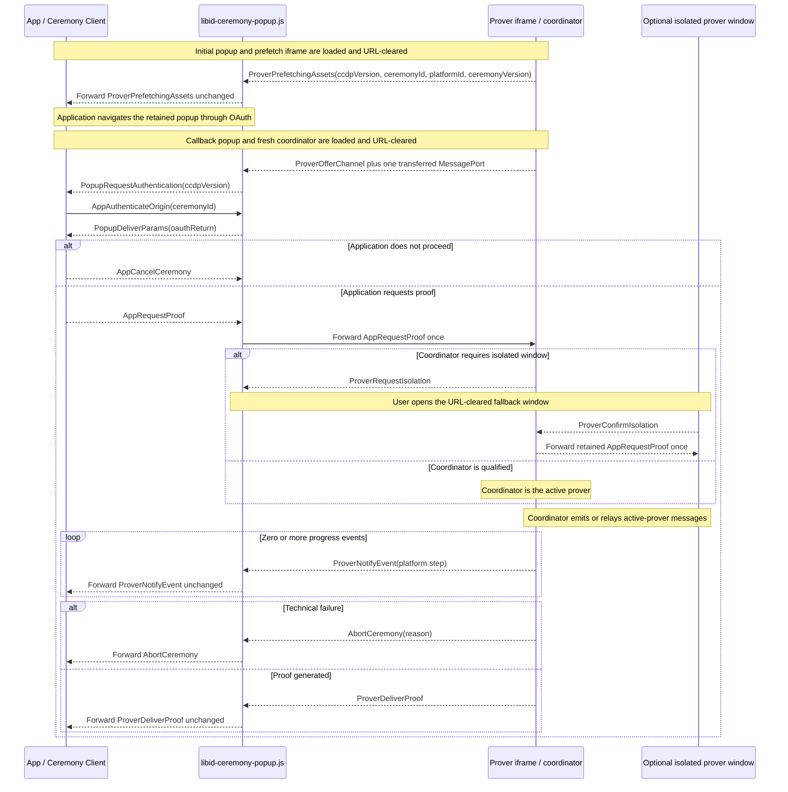

# Ceremony Cross-Document Protocol (CCDP)

This document defines the closed browser protocol used by `@libid/ceremony`
across the application, popup, prover iframe, and isolated prover window. It
also owns cross-document prefetch readiness, placement handoff, and protocol
compatibility rules.

The package boundary, public client API, and result lifecycle are defined in
[ARCHITECTURE.md](ARCHITECTURE.md). The popup participant's local state machine,
UI, and cleanup are defined in [POPUP.md](POPUP.md). Prover pipelines, assets,
workers, and cache behavior are defined in [PROVER.md](PROVER.md).
The deployed routes, embedded inputs, and response policy are defined in
[SERVER.md](SERVER.md). This is implementation architecture, not part of the
normative proof specification.
Package acceptance requirements are indexed by [TEST_PLAN.md](TEST_PLAN.md).
Shared package types and constants such as `PlatformId`,
`PlatformCeremonyVersion`, and `PlatformStep` retain their definitions in the
architecture document. `CeremonyConfig` and `ProverAssets` retain theirs in the
server contract.

## Architecture drivers and decisions

### Execution contexts

The browser ceremony crosses three protocol roles and may add a fourth document
for the isolated-window fallback.
DIP means `Document-Isolation-Policy`; COOP means
`Cross-Origin-Opener-Policy`. Both are HTTP response policies which application
JavaScript cannot add to an already loaded document.

| Context | Owns | Browser constraint |
|---|---|---|
| Application page | operation inputs, live `Ceremony`, durable application Job, final result commit | may be embedded into an application with its own headers and lifecycle; must retain the popup `WindowProxy` |
| Ceremony popup/callback | OAuth navigation and return, opener authentication, prover coordination, fixed progress UI | must remain top-level and non-isolated and preserve communication with the application opener; its callback alias is the registered server-hosted `redirect_uri` |
| Prover iframe or window | credentials after callback and proof generation | must be cross-origin isolated with `SharedArrayBuffer`; runs in a DIP-qualified iframe where available or a COOP-isolated top-level fallback |

No single page can satisfy the interactive constraints. The OAuth popup must
preserve its cross-origin opener, while the prover must use isolation headers
which sever that opener when applied to a top-level document. OAuth also
returns by loading a registered server route, replacing the document that
started provider navigation. Multithreaded proving cannot be made a normal
function call in the application page because isolation is a response-level
property, not a library option.

The **Ceremony Cross-Document Protocol (CCDP)** bridges those independent
documents with `postMessage` on the live opener and initial prefetch-child
channels, one transferred `MessagePort` for the popup/coordinator channel, and
a same-origin `BroadcastChannel` after COOP removes the fallback window's
opener. JavaScript objects and callbacks cannot cross any of those boundaries.

Collapsing the messages into ordinary library calls would require collapsing
the documents too, which would either lose OAuth opener continuity or lose the
isolation required by the prover. CCDP therefore stays a closed, package-owned
browser ABI: it binds exact sources, origins, versions, and one live ceremony
while transporting only OAuth return, proving input, progress, cancellation,
and proof delivery. It is not a remote API or extension surface.

### Decision summary

| Decision | Constraint and rationale | Cost and revisit condition |
|---|---|---|
| Serve fixed popup and prover documents from the configured server | OAuth needs a registered callback document; isolation, Content Security Policy (CSP), allowed origins, and asset manifests are response properties | server must expose the documented routes; revisit only if browsers provide an authenticated callback and isolated-prover primitive without separate documents |
| Keep the popup non-isolated and isolate the prover separately | preserving the application opener conflicts with top-level COOP isolation | requires CCDP and a prover child; this is the core unavoidable complexity |
| Reuse one ceremony popup across launch, provider navigation, callback, and proving UI | preserves user activation, opener continuity, and one primary visible ceremony surface | navigation destroys popup memory, so the application retains ceremony state and reauthenticates the returned document |
| Prefer DIP iframe proving with a user-opened isolated-window fallback | DIP gives an isolated child without severing the popup; browser support is not universal | adds two package-internal placement messages and a **Continue proving** action; remove the fallback only after the supported browser matrix makes it unnecessary |
| Signal selected-profile prefetch readiness before OAuth | consent time can overlap large public downloads, but the application must not await their completion | adds one readiness message; the prover subsystem owns the fetch implementation |
| Keep ceremonies memory-only and one-shot | durable OAuth/proof recovery would add credential storage, replay, migration, and cleanup state | interruption before delivery repeats OAuth; add recovery only as a separately justified protocol revision |
| Use one closed message union and one `CCDPVersion` | application, popup, coordinator, and fallback participate in one package-owned cross-document protocol | a breaking wire change increments one version; no per-message negotiation |

Future material decisions belong here with their constraint, consequence, and
concrete revisit condition. Exact mechanics belong in their owning reference
section.

## Browser topology and routes

```text
Application origin
  composition + @libid/ceremony/client
  durable Job and retained WindowProxy
              │ authenticated postMessage
              ▼
Configured server origin
  /api/v1/ceremony/popup and callback alias
    fixed URL-clearing bootstrap + libid-ceremony-popup.js
    non-isolated popup UI and controller
              ├─ top-level navigation ── OAuth provider (and back)
              │ prefetch postMessage / coordinator MessagePort handoff
              ▼
  /api/v1/ceremony/prover
    libid-ceremony-prover.js + workers/WebAssembly (WASM)
    DIP iframe, or coordinator + COOP-isolated fallback window
              │ same-origin BroadcastChannel on fallback path
              ├─ platform/notary/JWK-set network defined by platform version
              └─ optional server-owned same-origin platform route
```

The exact route surface and response contracts are defined in
[SERVER.md](SERVER.md#route-surface). `/api/v1/ceremony/popup` is the shared
launch document and its configured callback path is the registered OAuth
`redirect_uri`. `/api/v1/ceremony/prover` is the one document used for prefetch,
coordination, and isolated proving. These roles are selected after fragment
clearing; they are not server response variants and keep no ceremony state.

The caller launches the popup through the scripted path or real-anchor fallback
defined under [client lifecycle](ARCHITECTURE.md#client-lifecycle). Both paths preserve
`window.opener`; `noopener` and `noreferrer` are forbidden. Their launch
fragment contains only the ceremony ID, platform ID, and selected ceremony
version and is cleared before subresources or network activity. Both paths then
use the same prefetch, OAuth, callback, and proving protocol; presentation as a
window or tab is a browser choice, not a protocol mode.

After the provider callback, that redirect document creates one
`/api/v1/ceremony/prover#ceremonyId` iframe which remains the prover coordinator for the
rest of its lifetime. The coordinator runs the prover itself when DIP gives it
isolation, or relays the same protocol to a top-level isolated prover window
opened by the user's **Continue proving** anchor.

The redirect never user-agent sniffs. It accepts one channel offered by the
coordinator only from the exact child `WindowProxy` and browser-stamped server
origin, then uses that transferred `MessagePort` for all later traffic. The
fallback window cannot rely on `window.opener` after COOP; it receives only the
ceremony ID in its initial fragment, clears it before other work, and connects
to the coordinator through a same-origin `BroadcastChannel` derived from that
ID. The ceremony ID routes the live same-origin channel; it is not a separate
confidentiality boundary.

The initial popup's prover iframe only starts prefetch. The callback popup's fresh
iframe coordinates proving: it proves in place under DIP or relays to the
isolated-window fallback. Neither placement adds a server mode or durable state.
See [launch and prefetch](#launch-and-prover-prefetch) and
[isolated fallback](#isolated-prover-window-fallback) for CCDP ordering,
[PROVER.md](PROVER.md#prefetch-and-cache-lifecycle) for caching, and
[POPUP.md](POPUP.md) for popup behavior.

## Protocol definition

CCDP is the closed internal browser protocol between the application, ceremony
popup, and prover placements. Its wire surface is the `CCDPMessage` union. It
carries one ceremony through launch, OAuth return, opener authentication,
proving, and delivery because those steps cross independent documents and
cannot share library calls or memory. The
[architecture drivers](#architecture-drivers-and-decisions) explain why these browser
boundaries exist; this section defines their ordered messages.

A message name starts with the component which creates it: `App`, `Popup`, or
`Prover`, followed by its action. Intermediaries forward a message unchanged, so
the prefix records its original creator rather than its latest transport hop.
`AbortCeremony` is the sole origin-prefix exception because popup and prover
share the same upstream technical-failure contract.

Every receiver exact-validates message shape, direction, source, origin, and
current phase. Unknown, replayed, out-of-order, or post-terminal messages change
no state. The protocol has no caller-defined message, extension point, or
negotiated capability.

### Protocol version

```ts
type CCDPVersion = 1
```

`CCDPVersion` versions the complete `CCDPMessage` union shared by the
application/popup and popup/prover boundaries. The initial and returned
ceremony popup carries the version in its first application-facing message. The
client validates it before OAuth and again after return; it does not echo or
negotiate a version. The package-internal popup/prover boundary introduces no
second version exchange.

### Launch and prover prefetch

```ts
interface ProverPrefetchingAssets {
  ccdpVersion: CCDPVersion
  type: 'prover-prefetching-assets'
  ceremonyId: string
  platformId: PlatformId
  platformCeremonyVersion: PlatformCeremonyVersion
}
```

On initial launch, the popup exact-validates and clears its fragment's ceremony
ID, platform ID, and ceremony version, then loads
`/api/v1/ceremony/prover#prefetch(ceremonyId, platformId,
platformCeremonyVersion)`. The child clears that fragment, resolves the exact
profile, and asks the prover subsystem to start its selected-profile prefetch.
It returns `ProverPrefetchingAssets` after the registration/start attempt
settles; it does not wait for downloads to finish. The popup accepts the message
only from its exact child and forwards it unchanged to `window.opener` using
only server-embedded allowed origins. A missing or invalid profile or document
load failure rejects before OAuth; ordinary registration, cache, or fetch
failure continues on the cold proving path. CCDP defines no prefetch timeout.

The application accepts `ProverPrefetchingAssets` only from the configured
server origin with its live ceremony ID, platform, version, and expected source. A
scripted launch exact-matches the supplied `WindowProxy`; a real-anchor launch
binds the matching message source. The client validates the protocol version,
retains that source, and navigates it to the frozen provider authorization URL.
Prefetch requires no opener reply because it handles only public assets.

### Callback and opener authentication

```ts
interface PopupRequestAuthentication {
  ccdpVersion: CCDPVersion
  type: 'popup-request-authentication'
}

interface AppAuthenticateOrigin {
  type: 'app-authenticate-origin'
  ceremonyId: string
}

interface PopupDeliverParams {
  type: 'popup-deliver-params'
  oauthReturn: {
    query: string
    fragment: string
  }
}
```

The popup clears the provider callback URL before parsing it. An absent,
malformed, or duplicate OAuth `state` changes no live state and produces no
application message. After extracting exactly one syntactically valid state,
the callback popup sends `PopupRequestAuthentication`. It asks the
retained application to prove continuity before the popup releases the captured
redirect parameters; it exposes neither the ceremony ID nor those parameters and does not
classify approval, denial, or malformed platform fields. The client
accepts it only from the retained popup source at the configured server origin
and expected protocol version, then returns its retained ceremony ID in
`AppAuthenticateOrigin`.

The popup accepts `AppAuthenticateOrigin` only from `window.opener`, requires
the browser-stamped origin to be allowed, and exact-matches the supplied
ceremony ID to the captured OAuth state. Only then does it return the unchanged
bounded `oauthReturn` in `PopupDeliverParams` to that exact source
and origin. The message has no origin or version field: the browser supplies the
origin, and the client already validated the returned popup's version. A
different allowed application occupying the opener receives neither the
ceremony ID nor the redirect parameters. No callback-time binding record or
storage is needed.

If no valid `AppAuthenticateOrigin` arrives within
`REDIRECT_OPENER_TIMEOUT_MS = 30_000`, the popup clears its in-memory query and fragment,
severs the opener, and renders the same fixed unapproved-application result as
an invalid opener origin. It renders no callback value and performs no
navigation with it.

### Coordinator channel binding

```ts
interface ProverOfferChannel {
  type: 'prover-offer-channel'
}
```

After clearing its bare ceremony-ID fragment, the callback coordinator creates
one `MessageChannel`, keeps one end, and sends `ProverOfferChannel` to its parent
with exactly the other port in the transfer list. The popup accepts the offer
only from the exact coordinator iframe `WindowProxy`, the browser-stamped server
origin, and a message carrying exactly one port. It removes the temporary
window-message listener and uses only that port for later popup/coordinator
CCDP traffic.

The port is a one-shot capability for the coordinator already selected by the
popup and bound by its cleared ceremony-ID fragment. The message therefore has
no ID, version, payload, or application-facing hop. This handoff is required
because WebKit does not reliably preserve a usable `MessageEvent.source` for
every later parent/child exchange; weakening those exchanges to origin-only
`postMessage` is forbidden.

### OAuth classification and proof dispatch

```ts
interface AppRequestProof {
  type: 'app-request-proof'
  platformId: PlatformId
  platformCeremonyVersion: PlatformCeremonyVersion
  clientId: string
  redirectUri: string
  oauthReturn: {
    query: string
    fragment: string
  }
  codeVerifier: string | null
}
```

The application-scoped client selects the live `Ceremony` from the authenticated
bound channel; it does not query IndexedDB or reveal the ID to the composition.
A stale, replayed, retired, or post-reload binding changes no live state and
causes cleanup through `AppCancelCeremony`. Otherwise the client atomically
claims the state and uses that Ceremony's platform/version client parser to
exact-validate the `oauthReturn` transport and fields.

A malformed or mismatched result rejects the Ceremony. A valid provider denial
resolves `{ status: 'denied' }`. Both paths send `AppCancelCeremony` for popup cleanup.
A valid acceptance constructs `AppRequestProof` from the selected
platform/version, frozen client and redirect, derived code verifier, and
unchanged `oauthReturn`. The application origin is trusted for this transient input;
the protocol does not try to hide it from other scripts executing in that
origin. The Ceremony Client retains the authorization nonce; only its derived
code verifier crosses the prover boundary.

The popup byte-matches the echoed `oauthReturn` fields to its retained values,
validates the generic CCDP shape and bounds, and forwards the exact
`AppRequestProof` once to its coordinator iframe. It cannot validate the
platform, version, client, redirect, or PKCE policy: the returned document has
no launch record or `CeremonyConfig`, and deliberately fetches neither. The
authenticated client has already selected those values, and the prover leaf applies
the selected platform/version parser before credential use. The claimed client
entry, one-shot Ceremony, and popup state machine prevent duplicate proving.
The composition's final Job CAS prevents a late result from producing an
application effect. No separate OAuth state, job revision, composition
discriminator, wallet state, or connector crosses this protocol.

### Isolated prover-window fallback

```ts
interface ProverRequestIsolation {
  type: 'prover-request-isolation'
}

interface ProverConfirmIsolation {
  type: 'prover-confirm-isolation'
}
```

These messages remain package-internal. The coordinator iframe and fallback
window are two placements of the same prover implementation, not different
prover roles. A coordinator which cannot prove in its DIP iframe sends
`ProverRequestIsolation`; the popup exposes the user-opened
fallback action. The resulting COOP-isolated window sends
`ProverConfirmIsolation` over the ceremony-scoped same-origin channel. The
coordinator then forwards its retained `AppRequestProof` once. Neither message crosses the application boundary or
changes the Ceremony result. Prefetch selection remains document bootstrap
data, not a protocol message.

### Progress and proof delivery

```ts
interface ProverNotifyEvent {
  type: 'prover-notify-event'
  platformStep: PlatformStep
  timestamp: number
}

interface ProverDeliverProof<Proof = unknown> {
  type: 'prover-deliver-proof'
  proof: Proof
}
```

After `AppRequestProof`, the active prover sends zero or more bounded
`ProverNotifyEvent` records followed by one `ProverDeliverProof`, unless the run
aborts. The closed `CCDPMessage` union uses the default
`ProverDeliverProof<unknown>`. CCDP validates only the envelope on the bound channel,
then forwards the structured-clone `proof` value unchanged. It neither knows nor
dispatches platform proof types. After receipt, the platform catalog uses the
platform and version retained by the live `Ceremony` to validate and narrow the
message. Adding a platform therefore does not change CCDP. `PlatformStep.label`
is nonempty package-owned display text of at most 96 UTF-8 bytes with no control
characters. `PlatformStep.progress` is finite, remains in `[0, 1)`, and never
decreases within a ceremony; only local handling of `ProverDeliverProof` renders
completion as `1`. Progress is advisory.
Detailed semantics are defined by the
[prover delivery boundary](PROVER.md#proof-delivery-boundary) and
[platform progress](PROVER.md#platform-progress).

### Cancellation and technical failure

```ts
interface AppCancelCeremony {
  type: 'app-cancel-ceremony'
}

interface AbortCeremony {
  type: 'abort-ceremony'
  reason: string
}
```

`AppCancelCeremony` is the parameterless downstream command used when the
application no longer wants the ceremony to continue, including explicit cancellation,
provider denial, invalid callback classification, or retired Job authority.
Before `AppRequestProof`, the popup clears its retained query and fragment and attempts to close,
rendering one fixed fallback if closing fails. Afterwards it also cancels
reachable proving work.

`AbortCeremony` is the upstream technical-failure message created by the popup
or prover. Its `reason` is a sanitized diagnostic string, not a stable
machine-readable code or raw exception. The application rejects the live
Ceremony for every `AbortCeremony`. A closed reason enum may replace the string
once implementation experience identifies stable, actionable failure
categories; launch does not guess them in advance. Neither message carries a
ceremony ID, acknowledgement, or response. Context loss may produce neither
message.

### Closed message union

```ts
type CCDPMessage =
  | ProverPrefetchingAssets
  | PopupRequestAuthentication
  | AppAuthenticateOrigin
  | PopupDeliverParams
  | ProverOfferChannel
  | AppRequestProof
  | AppCancelCeremony
  | ProverRequestIsolation
  | ProverConfirmIsolation
  | ProverNotifyEvent
  | ProverDeliverProof
  | AbortCeremony
```

### CCDP message sequence



The diagram deliberately omits application self-transitions, provider
navigation mechanics, URL clearing, user-interface actions, validation
failures, mid-proving cancellation forwarding, and duplicate fallback relay
arrows. Those rules remain normative in their owning subsections.
`ProverDeliverProof` has no acknowledgement or ceremony-side checkpoint.

### Shared channel invariants

`PopupDeliverParams` and `AppRequestProof` carry the exact bounded query and
fragment copied and cleared by the [server bootstrap](SERVER.md#ingress-bootstrap).
The selected platform/version client leaf alone interprets their transport and
fields. The popup byte-matches the echoed values but has no platform config.

After `AppAuthenticateOrigin`, the authenticated application channel is bound
to one ceremony. The prover coordinator and fallback are likewise bound by the
cleared ceremony-ID fragment and exact transferred-port or same-origin channel.
Later messages therefore omit the ID. Unknown, duplicate, out-of-order,
post-terminal, or off-channel messages change no state.

Progress is bounded, monotonic, advisory data forwarded unchanged; common
stages remain local to the [client](ARCHITECTURE.md#progress-cancellation-and-recovery),
and platform spans belong to the [prover](PROVER.md#platform-progress).
Cancellation is best effort, context loss may be silent, and popup closure is
never a result. No ceremony recovery or durable browser checkpoint exists.

The [popup](POPUP.md) owns activation, relay, UI, and cleanup. The
[prover](PROVER.md) owns fetches, credentials, workers, pipelines, and proof
behavior. The [server contract](SERVER.md) owns URL clearing and response
isolation policy.

## Versioning and compatibility

`CCDPVersion` changes only when the message union or ordering semantics break;
the package may retain older validators during its compatibility window. Other
version axes are defined in
[architecture versioning](ARCHITECTURE.md#versioning-and-compatibility).

An unsupported live popup restarts with fresh OAuth; committed Identity has
already left CCDP.
