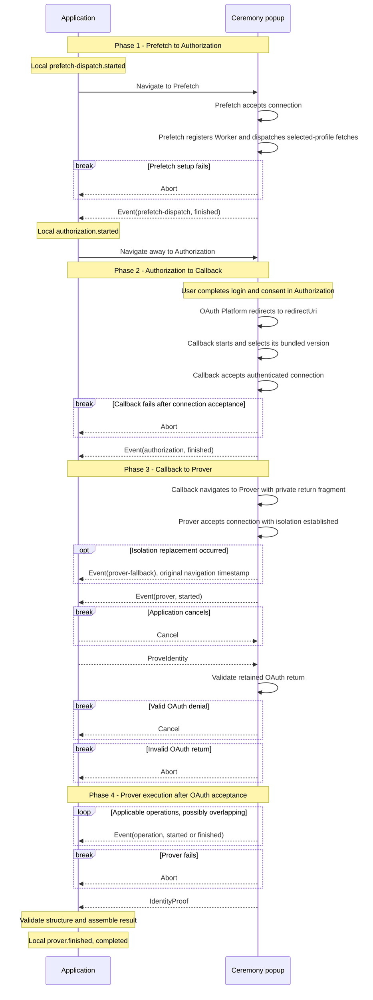

# Ceremony Cross-Document Protocol (CCDP)

This document defines the browser protocol across the Application and
the [documents](#documents-and-routes) it uses. It owns ceremony locations,
navigations, messages, ordering, and compatibility. Authorization,
platform-proof, and final-proof semantics are defined by the normative
[common ceremony](../../../specs/ceremony-common.md) and
[platform ceremony](../../../specs/platform-ceremonies.md) specifications.

An authenticated, ordered, bidirectional popup connection carries CCDP
messages unchanged. CCDP requires that connection but does not prescribe its
implementation. [CCDP_DISTRIBUTION.md](CCDP_DISTRIBUTION.md) defines the static
distribution and HTTP contract for the CCDP origin.

## Actors and origins

An actor is an operator or external system. An origin is the exact
scheme/host/port authority used by browser security checks. A site is only the
browser's schemeful registrable-domain grouping: same-site actors may remain
cross-origin and do not gain authority over each other.
`Application` denotes both the actor and its top-level browser document when
the distinction is immaterial.

| Actor | Browser authority | Responsibility |
|---|---|---|
| Application | application origin | hosts the application document, owns the operation and ceremony state, and drives the protocol |
| OAuth Bridge | OAuth bridge origin | publishes ceremony configuration, serves the complete Callback document obtained from the Distribution with bridge-owned inputs, owns OAuth registrations, and performs enabled confidential OAuth exchanges |
| CCDP Distribution | CCDP origin | contains the versioned [resources](#documents-and-routes) and proving assets used by any number of OAuth Bridges; it may be the canonical libID distribution or an operator-selected replacement |
| OAuth Platform | OAuth-platform origin set | hosts authorization/login documents and issues the OAuth return |

The Application and OAuth Bridge may be operated together or independently;
the selected CCDP Distribution may be published by either party or another
one. Their origins may be same-origin, same-site, or cross-site. CCDP assumes
none of those relationships. Browser authority is always established against
an exact origin. A composition which continues the live popup connection after
CCDP has the additional requirements below.

The OAuth redirect URI terminates on the bridge origin. The OAuth Bridge serves
CCDP's self-contained Callback artifact with its deployment inputs already
inserted; artifact retrieval happens server-side, independently of OAuth
requests. Callback captures and clears the OAuth return, then selects its
bundled CCDP implementation without another browser request.

Multiple independently operated OAuth Bridges may select the same CCDP
Distribution through its `ccdpOrigin`. The Distribution keeps no Bridge
registry or reciprocal allowlist and exposes identical public CCDP resources
across that relationship.

## Composition boundary

CCDP does not define documents, messages, or policy outside the ceremony. A
composition may use the same popup and connection before or after CCDP, but
those steps remain outside this protocol.

Carrying the live connection beyond Prover requires the next document to use
the exact CCDP origin; same-site placement is insufficient. All code on that
origin shares one browser authority and must therefore be mutually trusted.

## Documents and Routes

**Resources** collectively means Prefetch, Callback, Prover, and
Worker. Authorization is an external document, not a CCDP resource.

### Prefetch `GET /prefetch`

| Property | Contract |
|---|---|
| Parameters | <table><tr><th>Name</th><td><code>#ceremonyId</code></td><td><code>#platformId</code></td><td><code>#ceremonyVersion</code></td></tr><tr><th>Values</th><td>lowercase UUIDv4</td><td>exact identifier from the selected platform profile</td><td>unsigned 16-bit platform ceremony version</td></tr></table> |
| Location and context | CCDP origin; versioned, top-level, and non-isolated ceremony-popup document |
| Role | Starts the selected profile's fetches before the Application continues through [Prefetch to Authorization](#1-prefetch-to-authorization). It receives no authorization URL, OAuth return, or proof input. |

### Authorization `GET platformAuthorizationUrl`

| Property | Contract |
|---|---|
| Parameters | The complete frozen URL is opaque to CCDP. The selected platform ceremony version owns its parameters. |
| Location and context | Selected OAuth Platform; top-level ceremony-popup document |
| Role | Owns login and consent during [Authorization to Callback](#2-authorization-to-callback). No CCDP participant runs and no CCDP message or popup connection is exposed to this document. |
| External policy | Controlled entirely by the OAuth Platform. CCDP assumes nothing about its markup, scripts, headers, or origin transitions; it may sever the opener or browsing-context group. Callback reconnects without assuming direct window continuity. The selected platform ceremony version owns authorization request and return semantics. |

### Callback `GET redirectUri`

| Property | Contract |
|---|---|
| Location and context | OAuth Bridge origin at the fixed registered callback path `/auth/callback`; top-level, non-isolated document with complete bundled Callback code and bridge-owned deployment inputs |
| Role | Authenticates the Application during [Authorization to Callback](#2-authorization-to-callback), then privately carries the captured OAuth return in popup navigation to Prover during [Callback to Prover](#3-callback-to-prover). It installs no Service Worker, retains no state across navigation, and does not classify, prefetch, prove, verify, persist a checkpoint, or close the popup. |
| Presentation and cleanup | Renders fixed transition and failure views with an inline libID logo and accepts no Application markup or renderer. Terminal cleanup clears retained OAuth-return bytes, removes listeners, and releases unneeded references. Failure before connection acceptance is rendered locally and cannot release the return; observable failure after acceptance uses `Abort`. |

### Prover `GET /prover`

| Property | Contract |
|---|---|
| Parameters | <table><tr><th>Name</th><td><code>#ceremonyId</code></td><td><code>#oauthQuery</code></td><td><code>#oauthFragment</code></td></tr><tr><th>Values</th><td>lowercase UUIDv4</td><td>captured OAuth query, including leading <code>?</code> when nonempty</td><td>captured OAuth fragment, including leading <code>#</code> when nonempty</td></tr></table> |
| Location and context | CCDP origin; versioned, top-level ceremony-popup participant; cross-origin isolated before protocol readiness |
| Role | Accepts the logical Application connection during [Callback to Prover](#3-callback-to-prover), then validates the retained OAuth return under the Application-selected profile and runs [Prover execution](#4-prover-execution). [PROVING.md](PROVING.md) defines proof-generation pipelines, asset use, notarization, and caching. |
| Presentation and cleanup | Renders a persistent inline libID logo and accessible progress from the same local event stream it forwards to Application. User-facing stages, labels, and bar calculations are implementation-owned projections, not CCDP fields. Local proof delivery does not assert Application acceptance. Prover accepts no Application markup or renderer and clears inputs, workers, timers, and listeners without closing or navigating the popup. |

### Worker `GET /worker.js`

| Property | Contract |
|---|---|
| Location and context | CCDP origin; same-origin module Service Worker whose response sets `Service-Worker-Allowed: /` and which Prefetch registers with `scope: '/'` |
| Role | Composes MessagePort continuity across same-origin participating documents with asset and CRS single flights and caches for Prefetch and Prover. It remains compatible with every live CCDP version and passes requests outside its pinned resource graph to the network unchanged. |

### Common

#### Paths and versioning

Prefetch, Prover, and Worker routes are relative to
`{ccdpOrigin}/ccdp/v{CCDPVersion}`. Callback executes at the frozen `redirectUri`
on the OAuth Bridge origin; the Distribution defines the public artifact the
bridge retrieves to serve it. Authorization is the external frozen
`platformAuthorizationUrl`, not a CCDP route.

Before launch, the Application freezes the CCDP origin, redirect URI, platform
authorization URL, ceremony ID, platform ID, and platform ceremony version.
This document defines `CCDPVersion = 1`. The Application selects it in the
Prefetch path, carries the same version through OAuth `state`, and uses the
matching Prover path. Callback selects its bundled implementation from that
state; fragments and messages do not repeat the version. Google returns state
in the fragment, so the bridge cannot perform this selection at HTTP ingress.

Compatible implementation changes keep the version. A breaking fragment
grammar, navigation order, message shape, direction, ordering, or validation
rule increments it, publishes new CCDP paths and Worker, and adds that version's
implementation to the self-contained Callback artifact. Old resources and
bundled Callback implementations remain available for live ceremonies and a
compatibility window.

Once that window ends, a build may omit a retired Callback implementation.
Its version then takes Callback's local unsupported-version error path before
connection setup, rather than requiring an older transport or error protocol.
The popup owns that error display; it never falls forward to a different CCDP
version or reports this failure as OAuth denial.

A later CCDP version substitutes its decimal version in the common path. The
registered callback URL stays fixed: its document includes a closed set of
supported implementations and enters the selected one directly. All browser
documents execute embedded entry code. Internal bundle names are not protocol
surface; obtaining Callback bytes from the Distribution does not change its
OAuth Bridge execution origin.

The Prefetch and Prover paths select both CCDP version and document
role.

Platform Ceremony Version independently versions one platform's authorization,
OAuth, proof, and output semantics. Popup connection controls and the OAuth
Bridge API are independently versioned as well.

#### Popup and fragment model

The **ceremony popup** is a reusable browsing context, not an actor or
document. It sequentially contains Prefetch → Authorization → Callback →
Prover. Navigation creates a new JavaScript heap each time; no
participant relies on document-local state surviving it. These origins may all
be cross-site, and same-site placement grants no protocol authority.

Internal fragments use URL-search-parameter encoding after `#`. Producers emit
each named field exactly once in the displayed order. Receivers require the
exact field set, reject duplicates, and otherwise do not depend on parameter
order.

The Prefetch and Prover routes have no query. Their fragments are never sent
in HTTP requests and are copied and cleared before rendering, storage, or
network use. Prover's `oauthQuery` and `oauthFragment` are the sole internal
credential-bearing navigation fields. They preserve the original two URL
components separately, including empty values, with one outer
URL-search-parameter encoding layer; decoding that layer reproduces the
captured components without normalization or merging. The selected profile's
OAuth parser handles their contents later.

Callback constructs this fragment locally for the frozen CCDP-origin Prover;
the Application receives neither the return nor the navigation target.
The Prover captures and clears it before use. Any internal isolation
replacement preserves the captured fragment and clears it again on arrival.
No return enters a request query, connection notification, signaling record,
Worker record, telemetry, or error. Proofs and other proving inputs never enter
navigation fragments. The OAuth-platform-mandated query on `redirectUri`
remains the sole credential-bearing HTTP-request URL.

CCDP is connection-neutral. It defines which document runs at each location,
which participant initiates each navigation, what each message means, and their
order. Each recipient validates its permitted inbound messages and enforces
direction and state before acting.

#### Origin policy

Application, OAuth Bridge, CCDP, and notary origins use one rule: canonical
HTTPS origins, or HTTP origins on the exact hosts `localhost` and `127.0.0.1`.
An origin-only value has no credentials, path, query, or fragment; a nondefault
port is explicit. No protocol-specific port is required; example port numbers
are illustrative. Other HTTP hosts, aliases, subdomains, IP literals, and
noncanonical spellings are rejected rather than normalized into acceptance.
The origin of a URL-bearing field such as `redirectUri` follows the same rule;
its path and other components retain that field's own contract.

This rule applies to configuration, Callback inputs, explicit connection
allowlists, and open-origin admission alike. It needs no development flag.
Exact origin matching and duplicate rejection still apply: different ports,
schemes, or `localhost` versus `127.0.0.1` are not interchangeable. Open
admission never accepts an opaque or `null` origin. The exception does not
relax OAuth-platform TLS rules, pinned external-asset URLs, or browser
secure-context and Prover-isolation requirements.

Because one CCDP Distribution serves Applications admitted by any number of
independent OAuth Bridges, Prefetch and Prover use
`allowedApplicationOrigins: '*'`. They accept any browser-observed Application
origin satisfying the rule above and pin that exact origin and source for each
carrier, while the Application exact-authenticates the configured CCDP origin.
Open admission
grants only public asset prefetch, carrier continuity, and processing of the
connecting Application's own proof request. Prover receives the captured return
from Callback, not directly from the platform. Callback exact-authenticates the
Application against its containing OAuth Bridge's explicit deployment
allowlist before navigating with that return to the configured CCDP origin.
The public Callback artifact contains no Bridge policy; the serving Bridge
inserts its trusted configuration. Server-side artifact retrieval does not
replace Callback's credential-release check. Asset caching and popup-connection
construction are outside CCDP.

## Messages

The following table is the complete CCDP version-1 message set.

| Message | Direction | Accepted after | Cardinality and effect |
|---|---|---|---|
| [`ProveIdentity`](#proveidentity) | Application → Prover | `Event(prover, started)` | exactly once; selects the profile for OAuth validation and proof execution |
| [`IdentityProof`](#identityproof) | Prover → Application | `ProveIdentity` and valid OAuth acceptance | at most once; ends the Prover run |
| [`Cancel`](#cancel) | Application → Callback or Prover; Prover → Application | active connection for Application cancellation; `ProveIdentity` and valid OAuth denial for Prover cancellation | at most once; ends the run without a technical error |
| [`Abort`](#abort) | Prefetch, Callback, or Prover → Application | connection acceptance | at most once; reports technical failure and ends the run |
| [`Event`](#event) | Prefetch, Callback, or Prover → Application | connection acceptance and the event's documented emission point | core occurrences follow the [event catalog](#core-events); additional observations do not advance the protocol |

Every recipient requires a plain record with the exact fields, types, and bounds
defined below. Unknown fields, coercion, normalization, defaults, and
unrecognized discriminators are invalid. Messages outside the listed direction,
predecessor, and cardinality are invalid. Cancellation, proof delivery, and
abort make later messages inert even when they race in transit.

### ProveIdentity

```ts
interface ProveIdentity {
  type: 'prove-identity'
  platformId: string
  platformCeremonyVersion: number
  clientId: string
  redirectUri: string
  codeVerifier: string | null
  notaryAddress: string | null
}
```

`platformId` and `platformCeremonyVersion` are the exact supported profile
selected at launch and must match the active Prover. The message is valid only
after `Event(prover, started)`. The remaining fields are the frozen client
identifier and redirect, derived code verifier, and resolved notary address.
`redirectUri` is the canonical OAuth Bridge origin with the fixed
`/auth/callback` path and no
query or fragment. The Application derives it before OAuth; public bridge
configuration carries no redirect field. The OAuth return is already retained
by Prover and is not repeated in the message.
Starting Prover initiates OAuth validation; it does not assert acceptance or
mean that proof generation has already begun.

`notaryAddress` follows the [origin policy](#origin-policy) for a platform that
uses notarization; it is null for Google. The local HTTP exception needs no
client option or environment override. A remote HTTP address is rejected,
never upgraded or used as a downgrade fallback.
The Application selects and freezes it before OAuth. Prover validates it before
credential use and uses it unchanged for all sessions, including the GitHub
token request. It neither selects defaults nor accepts a separate profile,
ledger identifier, hash, or testnet flag. The address changes network routing,
not the proof statement or trusted signing keys.

The Application origin is trusted for this transient input because it already
supplies the operation being authorized. It retains the authorization nonce;
only the derived code verifier crosses this boundary. The message contains no
authorization digest, operation field, separate OAuth state, Job revision,
composition state, connector, or carrier kind.

For GitHub, Prover derives the fixed OAuth Bridge token route from the origin of
`redirectUri`; no second bridge origin or endpoint field is carried. Prover
exact-validates the CCDP record and selected platform/version before credential
use. That profile parses the retained query/fragment pair, enforcing exact
transport, fields, client/redirect checks applicable to the response, and
success/denial grammar. It matches OAuth `state` to
`v<CCDPVersion>.<ceremonyId>` using the versioned resource and the ID of the
authenticated logical connection, not a second caller-selected expected state.
The return is consumed once; no second request or replacement response can
restart the run.

### IdentityProof

```ts
interface IdentityProof {
  type: 'identity-proof'
  identity: {
    platformId: string
    oauthClientId: string
    userId: string
    userName: string
  }
  proof: unknown
}
```

`identity` is a separate, exact-shaped record of prover-extracted strings:
platform identifier, OAuth client identifier, user identifier, and user name
(the signed email for Google). The selected platform validator checks their
encodings and the platform/client binding to `ProveIdentity`.
`proof` is the exact value defined by that platform ceremony version, without
a nested identity copy. CCDP treats the proof as opaque; adding a platform does
not change this message. Neither browser endpoint cryptographically verifies
the delivered result; identity is non-authoritative until ledger verification.

### Cancel

```ts
interface Cancel {
  type: 'cancel'
}
```

`Cancel` is a parameterless, bidirectional terminal message:

- Application → Callback or Prover stops reachable work after explicit
  cancellation or retirement of Application authority.
- Prover → Application reports only a valid, ceremony-bound OAuth-platform
  denial discovered while validating `ProveIdentity`. The Application
  resolves `{ status: 'denied' }`. Prover sends it before token exchange,
  proof execution, or proving-operation events, never as a substitute for a
  failure.

Malformed, mismatched, or otherwise invalid OAuth returns use
`Abort`, not cancellation. An Application which has already canceled
ignores a racing denial or proof. Cancellation has no acknowledgement;
recipients clear reachable input but do not close or navigate the popup.

### Abort

```ts
interface Abort {
  type: 'abort'
  event: string
  message: string
}
```

`Abort` reports an observable technical failure after connection
acceptance from whichever of Prefetch, Callback, or Prover is active. `event`
is the nonempty, bounded, code-owned name of the failing core or
implementation-defined operation; it is not a UI
stage and need not have an earlier notification when failure preceded emission.
`message` is bounded, sanitized error text without credentials or raw exception
data. There is no required code, reason enum, or code-to-text mapping. The
Application rejects the live ceremony.

Failure before connection acceptance has no CCDP path. It is rendered locally
where possible and recorded through a sanitized local log or diagnostics sink.
Reporting failure neither releases inputs nor changes the ceremony outcome.

### Event

One event stream carries protocol readiness, operation timing, and additional
platform observations. The same observations can drive UI or tracing; they do
not require separate wire protocols. `Event(name, phase)` below abbreviates
this record, not a distinct message type:

| Field | Contract |
|---|---|
| `type` | Exactly `event` |
| `event` | Nonempty core or implementation-defined operation name |
| `phase` | `started` or `finished` for an operation; omitted for a single-shot observation |
| `timestamp` | Finite, nonnegative occurrence time in milliseconds on the browser's epoch-relative performance timeline |
| `operationId` | Optional, nonempty instrumentation-only identifier pairing repeated concurrent instances of the same operation |
| `attributes` | Optional bounded record of event-defined scalar measurements or facts: strings, finite numbers, or booleans |

Optional fields are absent when unused, not null. Event names, attribute names,
string values, and record sizes are bounded by the implementation. Names and
attribute meanings are code-owned, not supplied by OAuth returns or callers.
No event contains a UI stage, display label, progress percentage, overall
ceremony status, or error text. Technical failure uses `Abort`.

#### Core events

The catalog includes Application-local observations so a complete timeline has
one vocabulary. A **local** occurrence is not sent over CCDP. All other listed
occurrences are required `Event` messages from the indicated document when
their conditions are reached. Interrupted operations need not finish, and an
inapplicable operation emits nothing.

| Event | Start | Finish or observation |
|---|---|---|
| `prefetch-dispatch` | Application, locally before the first Prefetch navigation | Prefetch, after authenticating the connection, registering the Worker, and dispatching selected-profile fetches. Permits Authorization navigation; downloads need not be complete. |
| `authorization` | Application, locally when initiating Authorization navigation | Callback, after capturing the OAuth return and authenticating the Application, before navigating to Prover. Includes the return and connection setup; asserts neither approval nor pure user-consent duration. |
| `prover` | Prover, after isolated connection readiness and installation of its CCDP handlers. Permits `ProveIdentity`; does not assert OAuth acceptance or ZK execution. | Application, locally after structurally accepting `IdentityProof` and assembling its result. Prover never sends this finish over CCDP. |
| `prover-fallback` | — | Prover, once after an isolation replacement, with the replacement navigation's start timestamp and no `phase`. See [Fallback timing](#fallback-timing). |
| `token-fetch` | Prover, when starting to obtain a usable access token | Prover, when that token is available, without waiting for its final attestation |
| `token-attestation` | Prover, when starting work to obtain the token attestation | Prover, when the complete attestation passes its required structural, request-binding, and commitment/opening checks |
| `identity-fetch` | Prover, when starting the platform identity request | Prover, when its response has been received and parsed |
| `identity-attestation` | Prover, when starting work to obtain the identity attestation | Prover, when the complete attestation passes its required structural, request-binding, and commitment/opening checks |
| `zk-proof-preparation` | Prover, when starting input and proving-backend preparation | Prover, when both inputs and backend are ready |
| `zk-proof-generation` | Prover, when starting witness execution | Prover, when the ZK proof has been generated |

`prover-fallback` is the only single-shot core event. Each core operation has
one start and, on success, one finish per ceremony; these occurrences omit
`operationId`. X uses all six proving operations. GitHub omits `token-fetch`:
its `token-attestation` covers the complete Bridge request returning both the
token and its attestation. Its identity operations match X's. Google uses only
the two ZK operations.

The six proving operations start only after `ProveIdentity` and valid OAuth
acceptance. They may overlap according to the selected profile's dependencies.
Backend and input preparation need not wait for final attestations; proof
delivery still waits for all required evidence. Events describe logical work,
not a required scheduling algorithm or mutually exclusive execution intervals.
No event adds browser cryptographic verification of proofs or attestations.

`prefetch-dispatch.finished` and `prover.started` are protocol gates, each
accepted exactly once from its designated document at the matching phase.
`authorization.finished` is emitted once before Callback departs, but does not
require acknowledgement or introduce another gate before Prover readiness.
Additional attributes, operation IDs, or extension events cannot satisfy,
duplicate, or bypass a gate.

#### Extensions and observation

Implementations and platform-version modules may add operation pairs or
single-shot events without changing the message shape or core meanings.
Extensions cannot reuse a core name for a different operation. Receivers
validate the envelope and may ignore unknown extension names or attributes;
they never treat those as readiness, cancellation, or success. Core names with
wrong phase, sender, order, or cardinality are invalid, not extensions.

Repeated overlapping extension operations use `operationId` to pair starts and
finishes; the identifier has no routing or authorization role and must not
reuse ceremony IDs, OAuth state, credentials, or identity values. Observations
and attributes contain no OAuth parameters, URLs or origins, identity data,
proofs, witnesses, attestations, or raw exceptions.

The producing document may expose the same event locally before forwarding it
to Application. Local observers require no Application roundtrip. Required
events are emitted regardless of subscriptions; internal protocol handling
precedes observer filtering, and observer/exporter failure cannot interrupt it.
Application may merge local and remote events and derive UI stages, terminal
status, or tracing spans. Such projections and telemetry export policy are
outside CCDP, not additional messages or authorities.

#### Timing

Record the occurrence time as `performance.timeOrigin + performance.now()`
when an operation starts or finishes. Preserve that timestamp across forwarding
and delayed delivery; receipt time is not operation time. Independently running
operations may overlap, and retrospective observations may arrive after later
timestamps. Protocol ordering follows authenticated state and messages, never
timestamp sorting.

Start/finish differences measure operation intervals. Do not sum overlapping
intervals as total elapsed time, fabricate a finish after context loss, or turn
missing observations into zero-duration work. Resource observations distinguish
requests, shared-flight joiners, and actual network retrievals; a joiner or
cache hit is not another download. The event model adds no separate collector,
network export, or measurement acknowledgement.

#### Fallback timing

The isolation replacement occurs during connection establishment, before
ordinary CCDP delivery is available. The fallback document therefore records
its [navigation time origin](https://www.w3.org/TR/hr-time-3/#sec-time-origin)
as the occurrence timestamp of `prover-fallback`. Once its connection is ready,
it sends that observation retrospectively, before `Event(prover, started)`.
The successful non-replacement path emits no `prover-fallback`.

`prover.started.timestamp - prover-fallback.timestamp` measures replacement
navigation, document loading, and work up to Prover readiness. It excludes
source-document work before navigation, such as preserving a port, and is not
the exact additional cost against a hypothetical successful DIP path. This
requires no stored timestamp, pre-authentication message, extra handshake, or
new CCDP phase. If connection establishment fails, the observation stays local;
it does not invent readiness or a completed interval.

## Protocol

The protocol advances one named ceremony popup through
[Prefetch](#prefetch-get-prefetch),
[Authorization](#authorization-get-platformauthorizationurl),
[Callback](#callback-get-redirecturi), and
[Prover](#prover-get-prover). Those route sections own each participant's
inputs, context, and role; [Messages](#messages) owns the records crossing the
popup connection. The phases below own their sequencing, entry conditions, and
exit conditions. Navigation retires the source document, and no later message
can reactivate an earlier phase.

### Invariants

- One live ceremony owns one authenticated popup connection. Connection
  ownership supplies message correlation and its private version; loaded
  resources supply the CCDP version. CCDP messages repeat neither.
- Each participant accepts only exact records permitted by its direction,
  current state, and cardinality. Unknown message types, malformed, replayed,
  out-of-order, wrong-direction, and post-terminal values change no state.
  Valid event extensions may be observed but never advance the protocol.
- Browser-observed exact origins establish authority. Same-site placement,
  navigation history, request headers, and message fields do not substitute for
  connection authentication.
- Documents use only the frozen locations and fragments defined here. A CCDP
  message never selects an origin, implementation, or navigation destination.
- Raw OAuth returns pass only from the cleared Callback capture to Prover's
  private fragment, including any isolation replacement. Every arrival clears
  its URL before use; no intermediate store, notification, or diagnostic
  receives those values. The platform-mandated callback query is the sole
  HTTP-request ingress exception.
- Callback carries the return onward only after authenticating the Application.
  Prover validates it against the authenticated ceremony and selected profile
  before any credential-bearing request. Application receives only protocol
  outcomes and the final proof, whose evidence may contain profile-required
  disclosed fields. Authorization receives no CCDP message or connection.
- Events report only their defined conditions. Required readiness events permit
  the next protocol action, but neither they nor other observations, carrier
  state, navigation, popup closure, or unvalidated proof delivery constitute
  ceremony success. Operation completion is not ceremony completion.
- The Application owns terminal popup lifetime. No CCDP document closes the
  popup.
- Cancellation and context-loss cleanup are best effort. CCDP has no durable
  checkpoint, ceremony recovery, or migration to another popup connection.

### Phases

#### 1. Prefetch to Authorization

The protocol enters this phase on user activation. The Application records
`prefetch-dispatch.started` locally, then initiates one named popup's first
navigation to [Prefetch](#prefetch-get-prefetch) and
establishes its connection there. A scripted opener may first reserve the
popup at `about:blank`; if that fails, the same activation's real anchor
navigates it directly to Prefetch.

Prefetch clears and validates its fragment, accepts the connection, registers
the Worker, and dispatches the selected profile's fetches. It then sends
[`Event(prefetch-dispatch, finished)`](#event). Only after accepting that event
from Prefetch, the Application records `authorization.started` locally and
navigates the retained popup to
[Authorization](#authorization-get-platformauthorizationurl) at the frozen
`platformAuthorizationUrl`. The Application owns this transition because it
alone retains that URL; neither the URL nor a navigation command crosses the
carrier. Authorization is not a participating document, so the navigation
retires the Prefetch carrier while leaving the Application endpoint available
for Callback.

Worker registration, activation, or selected-profile dispatch failure after
connection acceptance sends `Abort` for `prefetch-dispatch` instead of its
finish event; Application rejects without navigating to Authorization. Download
failure after successful dispatch remains an asset-cache concern and uses the normal
cold-fetch path, not a late Prefetch abort. Failures before connection acceptance
are reported locally and release no protocol message.

#### 2. Authorization to Callback

This phase begins when the Application initiates navigation to
[Authorization](#authorization-get-platformauthorizationurl); CCDP cannot
observe when the platform page loads. The OAuth Platform owns the popup and
initiates browser navigation to the frozen `redirectUri` after approval or
denial; neither CCDP endpoint
initiates that transition. The Bridge serves the complete
[Callback](#callback-get-redirecturi), which captures and clears the return and
enters its bundled CCDP implementation selected by `state`. The
[OAuth Bridge contract](OAUTH_BRIDGE.md#callback-document) exclusively defines
ingress.

Callback accepts the Application connection using the ceremony ID extracted
from the captured `state`. This authenticates the Application against the
Bridge's deployment allowlist before the return can leave Callback. It sends
`Event(authorization, finished)` before navigating onward. This reports return
and connection readiness, not permission granted, and carries no OAuth-return
data. Callback need not wait for an acknowledgement or Application scheduling
before the Prover transition.

#### 3. Callback to Prover

The popup-side [Callback](#callback-get-redirecturi) endpoint asks its connection
to navigate to the frozen [Prover](#prover-get-prover) location, supplying the
ceremony ID and captured query/fragment as that route's structured fragment.
Callback owns this transition to keep the return private from Application and
because the OAuth Platform may have severed Application's direct popup handle.

Prover captures and clears the fragment, then accepts the same logical
Application connection. It sends [`Event(prover, started)`](#event) only after
cross-origin isolation is established and its CCDP handlers are installed.
Connection establishment and any internal isolation transition are below CCDP:
neither introduces another participant, message type, or phase. On the
replacement path, the connected Prover first reports `prover-fallback` as
specified in [Fallback timing](#fallback-timing). The captured parameters
survive that transition without passing through Application.

Application accepts one `Event(prover, started)` and sends one
[`ProveIdentity`](#proveidentity) using its frozen configuration and code
verifier. It does not receive or parse the OAuth return. On receiving
`ProveIdentity`, the selected platform/version validates the retained return
before credential use. A valid denial sends
[`Cancel`](#cancel); malformed or mismatched input sends
[`Abort`](#abort). Both end the run in this phase, as does
Application cancellation. Only valid OAuth acceptance enters Phase 4.

#### 4. Prover execution

This phase begins only after [Prover](#prover-get-prover) has validated and
accepted the OAuth return in Phase 3. It performs the selected profile's token
exchange, notarization, and proof-generation steps as applicable. It sends the
applicable [core operation events](#core-events) and may add implementation or
platform events. Each operation's `finished` reports only that operation;
events from overlapping operations are not forced into a global order.
After all required proof and evidence work completes, Prover sends one
[`IdentityProof`](#identityproof), unless it sends
[`Abort`](#abort) or receives
[`Cancel`](#cancel). The first terminal outcome—proof
delivery, abort, or cancellation—ends the phase; later messages have no effect.

### Terminal outcomes

Terminal processing begins when the Application cancels an active Callback
or Prover; Prover reports valid OAuth denial; an active document reports an
abort; or Prover delivers a proof. These outcomes are mutually terminal even
when they race in transit.
Cancellation has no acknowledgement. Prover's valid denial resolves denied;
Application cancellation retains its local canceled outcome. An observable
abort rejects the live ceremony; a failure before connection acceptance is
reported locally. Application structurally validates the delivered identity and
selected platform/version proof and assembles its result before recording
`prover.finished` locally. Neither endpoint adds local cryptographic proof or
attestation verification; ledger verification remains authoritative.

An Application event API may expose these outcomes as `completed`, `denied`,
`cancelled`, or `failed`, with earlier observations `active`. Such status is a
local projection, not an `Event` field or another wire notification. It emits
one terminal update before settling the result. Early failure, denial, and
cancellation do not fabricate `prover.finished`; late traffic cannot reactivate
the ceremony. No separate root ceremony event is needed: total attempt timing
runs from local `prefetch-dispatch.started` to the terminal update.

CCDP initiates no further navigation: the Application composition alone decides
whether to retain, navigate, or close the popup because any subsequent flow is
outside CCDP. Terminal cleanup follows the [invariants](#invariants).

### Successful sequence

The popup lifeline is one browsing context whose current document is replaced
at every navigation; it does not imply shared document state.



Terminal exits are shown without their cleanup details, which follow
[Terminal outcomes](#terminal-outcomes) and the [message contracts](#messages).
Carrier mechanics and proof-generation internals are omitted.
