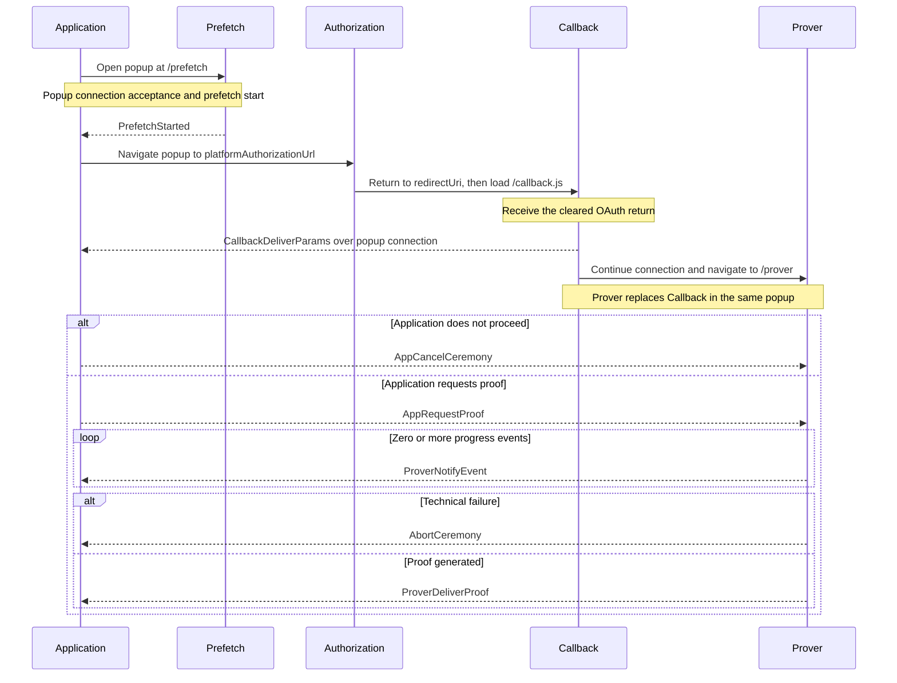

# Ceremony Cross-Document Protocol (CCDP)

This document defines the closed browser protocol across the Application,
Prefetch, Callback, and isolated Prover. It owns ceremony locations, navigations,
messages, ordering, and compatibility. Authorization, platform-proof, and
final-proof semantics are defined by the normative
[common ceremony](../../../specs/ceremony-common.md) and
[platform ceremony](../../../specs/platform-ceremonies.md) specifications.

An authenticated, ordered, bidirectional popup connection carries CCDP
messages unchanged. CCDP requires that connection but does not prescribe its
implementation.

## Actors and origins

An actor is an operator or external system. An origin is the exact
scheme/host/port authority used by browser security checks. A site is only the
browser's schemeful registrable-domain grouping: same-site actors may remain
cross-origin and do not gain authority over each other.
`Application` denotes both the actor and its top-level browser document when
the distinction is immaterial.

| Actor | Browser authority | Responsibility |
|---|---|---|
| Application | application origin | hosts the application document, owns the operation and ceremony state, and drives the protocol |
| OAuth Bridge | OAuth bridge origin | publishes ceremony configuration, hosts the callback document, owns OAuth registrations, and performs enabled confidential OAuth exchanges |
| CCDP Host | CCDP origin | owns and hosts the versioned Prefetch, Prover, and Worker implementations and proving assets; it may be the canonical libID deployment or an operator-selected replacement |
| OAuth Platform | OAuth-platform origin set | hosts authorization/login documents and issues the OAuth return |
| Notary Service | configured notary network origin | participates in TLS notarization and hosts no ceremony browser document |

The Application, OAuth Bridge, and CCDP Host may be operated together or
independently and may be same-origin, same-site, or cross-site. CCDP assumes
none of those relationships. Browser authority is always established against
an exact origin. In particular, the CCDP Host is not a wallet: both
external-wallet and native-wallet compositions consume the same independently
hosted CCDP boundary.

CCDP owns Callback behavior. The OAuth Bridge owns the registered callback
document and shell, then dynamically loads CCDP's same-origin Callback module
because the registered OAuth redirect URI must terminate on the bridge origin.

## Protocol invariants

- One live ceremony owns one authenticated popup connection. Connection
  ownership supplies message correlation and its private version; loaded
  resources supply the CCDP version. CCDP messages repeat neither.
- Each participant accepts only exact records permitted by its direction,
  current state, and cardinality. Unknown, malformed, replayed, out-of-order,
  wrong-direction, and post-terminal values change no state.
- Browser-observed exact origins establish authority. Same-site placement,
  navigation history, request headers, and message fields do not substitute for
  connection authentication.
- Documents use only the frozen locations and fragments defined here. A CCDP
  message never selects an origin, implementation, or navigation destination.
- No internal route carries an OAuth return, credential, proof input, or proof.
  The platform-mandated callback URL is the sole ingress exception and is
  cleared before Callback code runs.
- Callback releases an OAuth return only after authenticating the Application.
  Authorization receives no CCDP message or popup connection.
- Progress, carrier state, navigation, popup closure, and unvalidated proof
  delivery grant no authority and never constitute ceremony success.
- The Application owns terminal popup lifetime. Callback's transition to
  Prover is the only navigation initiated by a CCDP popup document; no CCDP
  document closes the popup.
- Cancellation and context-loss cleanup are best effort. CCDP has no durable
  checkpoint, ceremony recovery, or migration to another popup connection.

## Documents and Routes

### Prefetch `GET /prefetch`

| Property | Contract |
|---|---|
| Parameters | <table><tr><th>Name</th><td><code>#ceremonyId</code></td><td><code>#platformId</code></td><td><code>#ceremonyVersion</code></td></tr><tr><th>Values</th><td>lowercase UUIDv4</td><td>exact identifier from the selected platform profile</td><td>unsigned 16-bit platform ceremony version</td></tr></table> |
| Host and context | CCDP Host; versioned, request-invariant, top-level, and non-isolated ceremony-popup document |
| Role | Starts the selected profile's fetches before the Application continues through [Prefetch to Authorization](#1-prefetch-to-authorization). It receives no authorization URL, OAuth return, or proof input. |
| Response policy | `Content-Type: text/html`; `X-Content-Type-Options: nosniff`; `Cache-Control: no-cache`; strong `ETag`; `Referrer-Policy: no-referrer`; `Cross-Origin-Opener-Policy: unsafe-none`; no COEP; and `frame-ancestors 'none'`. CSP denies by default and admits only resources required by the closed Prefetch implementation. |

### Authorization `GET platformAuthorizationUrl`

| Property | Contract |
|---|---|
| Parameters | The complete frozen URL is opaque to CCDP. The selected platform ceremony version owns its parameters. |
| Host and context | Selected OAuth Platform; top-level ceremony-popup document |
| Role | Owns login and consent during [Authorization to Callback](#2-authorization-to-callback). No CCDP participant runs and no CCDP message or popup connection is exposed to this document. |
| Response policy | Controlled entirely by the OAuth Platform. CCDP assumes nothing about its markup, scripts, headers, or origin transitions; it may sever the opener or browsing-context group. Callback reconnects without assuming direct window continuity. The selected platform ceremony version owns authorization request and return semantics. |

### Callback `GET /callback.js`

| Property | Contract |
|---|---|
| Host and context | Same-origin module dynamically loaded by the OAuth Bridge's top-level, non-isolated callback shell |
| Role | Delivers the OAuth return during [Authorization to Callback](#2-authorization-to-callback), then replaces itself with Prover during [Callback to Prover](#3-callback-to-prover). It installs no Service Worker, retains no state across navigation, and does not classify, prefetch, prove, verify, persist a checkpoint, or close the popup. |
| Response policy | The OAuth Bridge contract alone defines the shell, registered `redirectUri`, URL clearing, version selection, response policy, and module invocation. |
| Presentation and cleanup | Renders fixed transition and failure views with an inline libID logo and accepts no Application markup or renderer. Terminal cleanup clears retained OAuth-return bytes, removes listeners, and releases unneeded references. Failure before connection acceptance is rendered locally and cannot release the return; observable failure after acceptance uses `AbortCeremony`. |

### Prover `GET /prover`

| Property | Contract |
|---|---|
| Parameters | <table><tr><th>Name</th><td><code>#ceremonyId</code></td></tr><tr><th>Values</th><td>lowercase UUIDv4</td></tr></table> |
| Host and context | CCDP Host; versioned, request-invariant, top-level, COOP/COEP-isolated ceremony-popup document |
| Role | Accepts the continuing Application connection during [Callback to Prover](#3-callback-to-prover), then runs [Prover execution](#4-prover-execution). [PROVING.md](PROVING.md) defines proof-generation pipelines, assets, notarization, and caching. |
| Response policy | `Content-Type: text/html`; `X-Content-Type-Options: nosniff`; `Cache-Control: no-cache`; strong `ETag`; `Referrer-Policy: no-referrer`; `Cross-Origin-Opener-Policy: same-origin`; and `Cross-Origin-Embedder-Policy: require-corp`. CSP denies by default and admits only the exact inline entry code, Worker, `blob:`, WebAssembly, styles, toolchain resources, and network classes required by the closed implementation. Proving starts only after confirming cross-origin isolation, shared memory, and worker support; there is no weaker fallback. |
| Presentation and cleanup | Renders a persistent inline libID logo and one accessible milestone progress bar. It begins at **Preparing proof**, advances only from valid platform events, and reaches 100% only on proof delivery. After `SLOW_PROVING_HINT_MS = 15_000`, it adds a nonblocking **Still proving** notice which may suggest enabling JavaScript JIT in Vanadium site controls. It accepts no Application markup or renderer, presents no ETA, and clears inputs, workers, timers, and listeners without closing or navigating the popup. |

### Worker `GET /worker.js`

| Property | Contract |
|---|---|
| Host and context | CCDP Host; same-origin module Service Worker registered by Prefetch |
| Role | Composes temporary MessagePort continuity with asset and CRS single flights and caches for Prefetch and Prover. |
| Response policy | Module Service Worker JavaScript media type; `X-Content-Type-Options: nosniff`; `Cache-Control: no-cache`; strong `ETag`; and policies compatible with the isolated Prover and its controlled scope. Whether its bytes are an on-disk file, generated output, or embedded in the CCDP Host binary is not part of CCDP. |

### Common

#### Paths and versioning

The CCDP routes above are relative to `/ccdp/v{CCDPVersion}`. Prefetch, Prover,
and Worker resolve against `ccdpOrigin`; Callback resolves against the OAuth
Bridge origin. Authorization is the external frozen `platformAuthorizationUrl`,
not a CCDP route.

Before launch, the Application freezes the CCDP origin, redirect URI, platform
authorization URL, ceremony ID, platform ID, and platform ceremony version.
This document defines `CCDPVersion = 1`. The Application selects it in the
Prefetch path, carries the same version through OAuth `state`, and uses the
matching Prover path. Callback selects its implementation from that state;
fragments and messages do not repeat the version.

Compatible implementation changes keep the version. A breaking fragment
grammar, navigation order, message shape, direction, ordering, or validation
rule increments it, publishes new CCDP Host paths and Worker, and adds the
Callback version to the OAuth Bridge shell's closed supported-version map. Old
resources remain available for live ceremonies and a compatibility window.

A later CCDP version substitutes its decimal version in the common path. The
OAuth Bridge dynamically loads the matching Callback module; the CCDP Host
documents execute their implementations directly. Internal bundle names are
not protocol surface. The Prefetch and Prover documents and Worker share the
CCDP origin.

The Prefetch and Prover paths select both CCDP version and document role. Each
response contains its clearing bootstrap and entry code directly, so no root
map, standardized root filename, or second entry-script request exists. Either
may load implementation-private immutable chunks, and both provide only an
empty mount point to their entry code.

The CCDP Host may serve the latest implementation compatible with a CCDP
version at these paths. Prefetch, Prover, and Worker responses use normal HTTP
cache revalidation, including an ETag, while implementation-private
content-addressed assets remain long-lived and immutable. A breaking change
uses a new CCDP-version path.

Platform Ceremony Version independently versions one platform's authorization,
OAuth, proof, and output semantics. Popup connection controls and the OAuth
Bridge API are independently versioned as well.

#### Popup and fragment model

The **ceremony popup** is a reusable browsing context, not an actor or document.
It sequentially contains Prefetch → Authorization → Callback → Prover.
Navigation creates a new JavaScript heap each time; no participant relies on
document-local state surviving it. These origins may all be cross-site, and
same-site placement grants no protocol authority.

Internal fragments use URL-search-parameter encoding after `#`. Producers emit
each named field exactly once in the displayed order. Receivers require the
exact field set, reject duplicates, and otherwise do not depend on parameter
order.

The Prefetch and Prover routes have no query. Their fragments never reach the
CCDP Host and are copied and cleared before rendering, storage, or network use.
No OAuth return, credential, proof input, or proof is placed in an internal
fragment. The OAuth-platform-mandated query on `redirectUri` is the only
protocol exception.

CCDP is connection-neutral. It defines which document runs at each location,
which participant initiates each navigation, what each message means, and their
order. Each recipient validates its permitted inbound messages and enforces
direction and state before acting.

#### Origin policy

With `allowedApplicationOrigins: '*'`, the Prefetch and Prover accept any valid
browser-observed HTTPS Application origin and pin that exact origin and source
for each carrier. The Application exact-authenticates the configured CCDP Host.
Open admission there grants only public asset prefetch and processing of the
connecting Application's own proof request; neither document receives an OAuth
return directly from the platform. Callback exact-authenticates the Application
against the OAuth Bridge's deployment allowlist before releasing that return.
Asset caching and popup-connection construction are outside CCDP.

## Messages

The following table is the complete CCDP version-1 message set.

| Message | Direction | Accepted after | Cardinality and effect |
|---|---|---|---|
| [`PrefetchStarted`](#prefetchstarted) | Prefetch → Application | connection acceptance and selected-profile dispatch | exactly once; permits navigation to Authorization |
| [`CallbackDeliverParams`](#callbackdeliverparams) | Callback → Application | OAuth return and connection acceptance | exactly once; starts Application validation |
| [`AppRequestProof`](#apprequestproof) | Application → Prover | validated OAuth acceptance and active Prover connection | exactly once; starts proof execution |
| [`ProverNotifyEvent`](#provernotifyevent) | Prover → Application | `AppRequestProof` | zero or more; advisory only |
| [`ProverDeliverProof`](#proverdeliverproof) | Prover → Application | `AppRequestProof` | at most once; ends the Prover run |
| [`AppCancelCeremony`](#appcancelceremony) | Application → Callback or Prover | active Callback or Prover connection | at most once; requests downstream cleanup and ends the run |
| [`AbortCeremony`](#abortceremony) | Callback or Prover → Application | connection acceptance | at most once; reports technical failure and ends the run |

Every recipient requires a plain record with the exact fields, types, and bounds
defined below. Unknown fields, coercion, normalization, defaults, and
unrecognized discriminators are invalid. Messages outside the listed direction,
predecessor, and cardinality are invalid. Cancellation, proof delivery, and
abort make later messages inert even when they race in transit.

### PrefetchStarted

```ts
interface PrefetchStarted {
  type: 'prefetch-started'
}
```

`PrefetchStarted` states only that fetching for the selected public profile
was dispatched. It does not promise completion or grant authority. Prefetch
already received the profile through its cleared fragment, so the message
repeats no selection field.

### CallbackDeliverParams

```ts
interface CallbackDeliverParams {
  type: 'callback-deliver-params'
  oauthReturn: {
    query: string
    fragment: string
  }
}
```

Callback constructs this message from the bounded query and fragment supplied
by the OAuth Bridge shell. It extracts the ceremony ID suffix from `state` but
does not classify approval, denial, transport, or platform fields. The
`Callback` prefix records its creator even when connection continuity delivers
the message after Callback replacement.

The Application uses the live ceremony already bound to the connection and its
platform/version rules to exact-validate response location, fields, state,
OAuth client, redirect, success, and denial.

### AppRequestProof

```ts
interface AppRequestProof {
  type: 'app-request-proof'
  platformId: string
  platformCeremonyVersion: number
  clientId: string
  redirectUri: string
  oauthReturn: {
    query: string
    fragment: string
  }
  codeVerifier: string | null
}
```

`platformId` and `platformCeremonyVersion` are the exact supported profile
selected at launch and must match the active Prover. The remaining fields are
the frozen client identifier and redirect, unchanged OAuth return, and derived
code verifier.

The Application origin is trusted for this transient input because it already
supplies the operation being authorized. It retains the authorization nonce;
only the derived code verifier crosses this boundary. The message contains no
authorization digest, operation field, separate OAuth state, Job revision,
composition kind, wallet state, connector, or carrier kind.

For GitHub, Prover derives the fixed OAuth Bridge token route from the origin of
`redirectUri`; no second bridge origin or endpoint field is carried. Prover
exact-validates the CCDP record and selected platform/version before credential
use.

### ProverNotifyEvent

```ts
interface ProverNotifyEvent {
  type: 'prover-notify-event'
  platformStep: {
    code: string
    label: string
    status: 'started' | 'completed' | 'failed'
    progress: number
  }
  timestamp: number
}
```

`platformStep.code` belongs to the selected platform ceremony version's closed
step set. `label` is nonempty display text of at most 96 UTF-8 bytes without
control characters. `status` records the step transition. `progress` is
finite, monotonic, and in `[0, 1)`. `timestamp` is the Prover's finite,
nonnegative `performance.timeOrigin + performance.now()` value in milliseconds.
It permits same-browser ordering and duration diagnostics but grants no
authority.

### ProverDeliverProof

```ts
interface ProverDeliverProof {
  type: 'prover-deliver-proof'
  proof: unknown
}
```

`proof` is the exact value defined by the selected platform ceremony version.
CCDP treats it as opaque and the selected platform validator checks it; adding a
platform does not change this message.

### AppCancelCeremony

```ts
interface AppCancelCeremony {
  type: 'app-cancel-ceremony'
}
```

`AppCancelCeremony` is the parameterless command for explicit user
cancellation, valid OAuth-platform denial, invalid callback classification, or
retired Application authority. Reachable work clears queued input; no
acknowledgement or platform-specific cancel path exists. Callback and Prover do
not close or navigate the popup in response.

### AbortCeremony

```ts
interface AbortCeremony {
  type: 'abort-ceremony'
  reason: string
}
```

`AbortCeremony` reports an observable technical failure after connection
acceptance. `reason` is a bounded sanitized diagnostic string, not a stable
code or raw exception. Exact reason enums may emerge from implementation
experience. The Application rejects the live ceremony. Failure before
connection acceptance has no CCDP path and remains local.

## Protocol

### 1. Prefetch to Authorization

On user activation, the Application opens one named popup at Prefetch and
establishes its connection. An implementation may use scripted opening or
preserve the same activation's real-anchor navigation when scripted opening is
unavailable.

Prefetch clears and validates its fragment, accepts the connection, registers
the Worker, and dispatches the selected profile's fetches. It then sends
[`PrefetchStarted`](#prefetchstarted). The Application navigates the retained
popup to the frozen `platformAuthorizationUrl` without sending that URL through
the carrier. This retires the Prefetch carrier while leaving the Application
endpoint available for Callback.

### 2. Authorization to Callback

The OAuth Platform owns the popup until it returns approval or denial to the
frozen `redirectUri`. The OAuth Bridge shell captures and clears the return,
selects the CCDP version from `state`, and loads the matching Callback module.
The [OAuth Bridge contract](OAUTH_BRIDGE.md#callback-document) exclusively
defines ingress.

Callback accepts the Application connection and sends
[`CallbackDeliverParams`](#callbackdeliverparams). No return reaches the
Application before authentication.

### 3. Callback to Prover

After delivery, Callback asks its connection to navigate to Prover. The
connection owns immediate cross-document continuity. Prover clears its fragment
and accepts the same logical connection; no callback value enters a URL or
signaling record.

The Application validates the delivered return under the selected
platform/version. A malformed result rejects the ceremony and sends
[`AppCancelCeremony`](#appcancelceremony). A valid denial resolves
`{ status: 'denied' }` and sends the same cancellation. A valid acceptance sends one
[`AppRequestProof`](#apprequestproof) after Prover is active.

### 4. Prover execution

Prover applies the selected platform/version rules before credential use. It
sends zero or more [`ProverNotifyEvent`](#provernotifyevent) messages followed
by one [`ProverDeliverProof`](#proverdeliverproof), unless it sends
[`AbortCeremony`](#abortceremony) or receives
[`AppCancelCeremony`](#appcancelceremony).

### 5. Terminal outcomes

Proof delivery, cancellation, and abort are mutually terminal even when they
race in transit. Cancellation has no acknowledgement. An observable abort
rejects the live ceremony; a failure before connection acceptance is rendered
locally. Terminal cleanup and popup ownership follow the protocol invariants.

## End-to-end sequence



Popup-connection mechanics and URL clearing are omitted from the diagram; the
contracts above remain required.
