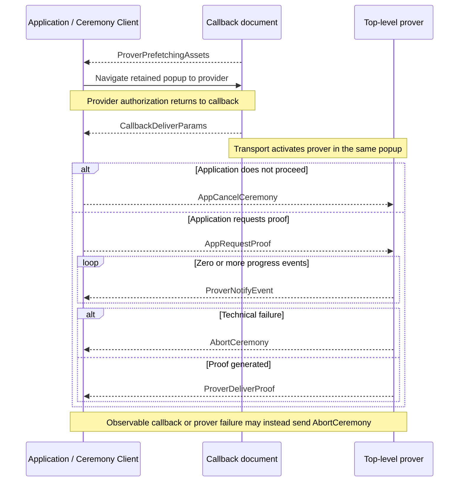

# Ceremony Cross-Document Protocol (CCDP)

This document defines the closed browser protocol used by `@libid/ceremony`
across the application, callback, and isolated prover. It owns ceremony
messages, their directions, ordering, and protocol compatibility.

The concrete [CCDP transport](CCDP-TRANSPORT.md) authenticates, structurally
decodes, and delivers messages, selects a carrier, and navigates the popup. Its
browser-local [MessagePort](CCDP-CARRIER-MESSAGEPORT.md) and fallback
[WebRTC](CCDP-CARRIER-WEBRTC.md) carriers are defined separately. The package
API and result lifecycle are defined in [ARCHITECTURE.md](ARCHITECTURE.md),
callback behavior in [CALLBACK.md](CALLBACK.md), proving in
[PROVER.md](PROVER.md), and deployed routes in [SERVER.md](SERVER.md). These are
implementation architecture, not part of the normative proof specification.
Package acceptance requirements are indexed by [TEST_PLAN.md](TEST_PLAN.md).

Shared package types such as `PlatformId`, `PlatformCeremonyVersion`, and
`PlatformStep` retain their definitions in the architecture document.
`CeremonyConfig` and deployed prover inputs retain theirs in the server
contract.

## Protocol boundary

| Context | Owns | Browser constraint |
|---|---|---|
| Application page | operation inputs, live `Ceremony`, message ordering, and protocol result | has application-defined headers and lifecycle; may be cross-site from the ceremony server |
| Callback | OAuth navigation, return capture, and transition to proving | remains top-level and non-isolated until the returned transport endpoint selects a carrier; its configured alias is the registered server-hosted `redirect_uri` |
| Prover | credentials after callback, visible progress, and proof generation | reuses the popup's top-level browsing context under COOP/COEP isolation |

CCDP is transport-neutral. It defines what each message means, which
participant may send it, and its order. [CCDP-TRANSPORT.md](CCDP-TRANSPORT.md)
owns how values cross browser documents and carriers and invokes CCDP's
registered per-message `Decoder` before delivery. Callback, prover, and client
code register only their permitted inbound messages and enforce state and order.

## Protocol definition

### Version

```ts
type CCDPVersion = 1
```

`CCDPVersion` covers `Message`, its direction, ordering, validation, and
transport-binding semantics. Ceremony code supplies it as the transport's
`applicationVersion`; transport exact-matches but does not interpret it.
Same-release carrier and navigation controls have no independent negotiated
version.

### Prefetch readiness

```ts
interface ProverPrefetchingAssets {
  type: 'prover-prefetching-assets'
  ceremonyId: string
  platformId: PlatformId
  platformCeremonyVersion: PlatformCeremonyVersion
}
```

`ProverPrefetchingAssets` is the sole nonterminal CCDP message before carrier
authentication; an already-constructed transport may instead send terminal
`AbortCeremony`. Readiness states that prefetch for the selected public profile
has been dispatched; it does not promise that downloads completed. Its fields
are public correlation data, grant no authority, and may cause only navigation
of the bound popup to the provider URL already frozen by the live `Ceremony`.

The application accepts it only when its ceremony ID and platform/version
match that live ceremony and its browser-stamped source and origin match the
expected callback. Callback and prefetch execution are defined in
[CALLBACK.md](CALLBACK.md) and [PROVER.md](PROVER.md#prefetch-and-cache-lifecycle).

### OAuth-return delivery

```ts
interface CallbackDeliverParams {
  type: 'callback-deliver-params'
  oauthReturn: {
    query: string
    fragment: string
  }
}
```

The callback creates this message from the bounded query and fragment copied and
cleared by the server bootstrap. It extracts only the single OAuth state needed
for ceremony routing and does not classify approval, denial, transport, or
platform fields.

On the successful path, `CallbackDeliverParams` is the first CCDP message after
provider return and reaches the application only through the authenticated
ceremony transport. The `Callback` prefix records its creator even when
transport continuity delivers it after callback replacement.

The application-scoped client uses the live `Ceremony` already bound to that
transport and its platform/version parser to exact-validate response location,
fields, state, client, redirect, success, and provider denial. A stale,
replayed, retired, or post-reload delivery changes no live state.

### Proof request

```ts
interface AppRequestProof {
  type: 'app-request-proof'
  platformId: PlatformId
  platformCeremonyVersion: PlatformCeremonyVersion
  clientId: string
  redirectUri: string
  oauthReturn: {
    query: string
    fragment: string
  }
  codeVerifier: string | null
}
```

A malformed result rejects the ceremony. A valid provider denial resolves
`{ status: 'denied' }` and sends `AppCancelCeremony`. A valid acceptance creates
one `AppRequestProof` from the selected platform/version, frozen client and
redirect, derived code verifier, and unchanged OAuth return.

The application origin is trusted for this transient input: it already
supplies the operation being authorized. The client retains the authorization
nonce; only its derived code verifier crosses this boundary. No authorization
digest, operation field, separate OAuth state, Job revision, composition kind,
wallet state, connector, or transport kind enters the request.

The registered decoder validates CCDP shape and bounds. The prover then applies
the exact selected platform/version parser before credential use. The callback
and transport have no platform configuration and cannot perform that second
validation. The one-shot ceremony accepts no duplicate request or late result.

### Progress and proof delivery

```ts
interface ProverNotifyEvent {
  type: 'prover-notify-event'
  platformStep: PlatformStep
  timestamp: number
}

interface ProverDeliverProof<Proof = unknown> {
  type: 'prover-deliver-proof'
  proof: Proof
}
```

After `AppRequestProof`, the prover sends zero or more bounded progress records
followed by one proof, unless the run aborts. The closed union uses
`ProverDeliverProof<unknown>`; CCDP validates only its envelope and passes the
logical value unchanged. The selected platform/version validator then narrows
it. Adding a platform does not change CCDP, the transport, or either carrier.

`PlatformStep.label` is nonempty package-owned display text of at most 96 UTF-8
bytes without control characters. `PlatformStep.progress` is finite,
monotonic, and in `[0, 1)`. `timestamp` is the prover's finite nonnegative
`performance.timeOrigin + performance.now()` value in milliseconds; it permits
same-browser ordering and duration diagnostics but grants no authority.
Progress is advisory; detailed semantics live in
[PROVER.md](PROVER.md#platform-progress).

### Cancellation and technical failure

```ts
interface AppCancelCeremony {
  type: 'app-cancel-ceremony'
}

interface AbortCeremony {
  type: 'abort-ceremony'
  reason: string
}
```

`AppCancelCeremony` is the parameterless downstream command for explicit user
cancellation, valid provider denial, invalid callback classification, or
retired application authority. Reachable proving work clears queued input and
attempts to close; no acknowledgement or platform-specific cancel path exists.

`AbortCeremony` is the upstream technical-failure message created by callback or
prover code. Its reason is a bounded sanitized diagnostic string, not a stable
code or raw exception. Exact reason enums may emerge from implementation
experience. The application rejects the live ceremony for every observable
abort. It requires a constructed transport but not an authenticated carrier.
Transport-construction failure has no CCDP path and remains local diagnostics
or metrics. Before a real-anchor launch binds its popup source, a callback
failure likewise cannot be correlated safely and remains local.

### Closed message union

```ts
type Message =
  | ProverPrefetchingAssets
  | CallbackDeliverParams
  | AppRequestProof
  | AppCancelCeremony
  | ProverNotifyEvent
  | ProverDeliverProof
  | AbortCeremony
```

### Direction and ordering

| Message | Created by | Received by | Valid position and cardinality |
|---|---|---|---|
| `ProverPrefetchingAssets` | prover prefetch child, forwarded unchanged by callback | application | exactly once before provider navigation and carrier authentication |
| `CallbackDeliverParams` | callback | application | exactly once after provider return and transport authentication, before the application decision |
| `AppRequestProof` | application | active prover | exactly once after an accepted callback result; starts proving |
| `AppCancelCeremony` | application | active callback or prover endpoint | at most once before another terminal message; makes later messages inert and requests downstream cleanup |
| `ProverNotifyEvent` | prover | application | zero or more after `AppRequestProof` and before a terminal message |
| `ProverDeliverProof` | prover | application | at most once after `AppRequestProof`; ends the prover run |
| `AbortCeremony` | callback or prover | application | at most once after transport construction for an observable technical failure before another terminal message |

Messages outside these directions or positions are invalid. Cancellation,
proof delivery, and abort make later messages inert even when they race in
transit.

### Structural decoding

Each message interface has a same-named `Decoder` companion containing its
literal discriminator and structural decoder. The shared assertion owns the
common plain-record, exact-field-set, and `type` checks:

```ts
declare function assertMessage<
  const Type extends string,
  const Fields extends readonly string[],
>(
  value: unknown,
  type: Type,
  fields: Fields,
): asserts value is { type: Type } & Record<Fields[number], unknown>

const ProverDeliverProof = {
  type: 'prover-deliver-proof',

  decode(value: unknown): ProverDeliverProof {
    assertMessage(value, this.type, ['proof'])
    return value
  },
} as const satisfies Decoder<ProverDeliverProof>
```

A decoder exact-validates its message-specific fields and bounds, rejects
unknown fields, and returns the same received object. It never coerces,
normalizes, supplies defaults, strips fields, or allocates a replacement.
Nested platform proof remains `unknown` here and is decoded later by the
selected platform/version module.

Participants register only their permitted inbound companions with transport:

```ts
transport.on(AppRequestProof, handleProofRequest)
transport.on(AppCancelCeremony, handleCancellation)
```

Transport uses the companion's `type` only as a generic dispatch key, invokes
its decoder exactly once, and gives the handler its concrete message type.
Unknown, duplicate, or unregistered discriminators fail closed. There is no
aggregate decoder, raw discriminator constant, large union handler, global
registration, import-time self-registration, or plugin API. Direction is the
registered decoder set; order and participant state remain handler checks.

Opener authentication, Service Worker controls, SDP, and ICE candidates are not
`Message`. The transport and carrier documents define those private
controls.

## Ceremony sequence



The diagram is the logical CCDP sequence. Transport establishment, continuity,
navigation, URL clearing, and participant UI do not alter it.

## Shared invariants

- `ProverPrefetchingAssets` is the only nonterminal pre-carrier message and
  carries no credential, proof input, proof, or authority; `AbortCeremony` is
  the only terminal exception.
- One live ceremony accepts one prefetch readiness and one
  `CallbackDeliverParams`.
- Transport authenticates before any OAuth return reaches the application and
  does not interpret or alter message meaning.
- Unknown, malformed, replayed, out-of-order, wrong-direction, or post-terminal
  values change no state.
- Every CCDP message after prefetch readiness omits ceremony ID because
  transport ownership already supplies it.
- Progress remains advisory and cannot authorize, cancel, or complete a
  ceremony.
- Transport state, navigation, popup closure, and progress are never a ceremony
  result.
- Cancellation and context-loss cleanup are best effort.
- No ceremony recovery, durable browser checkpoint, or transport migration
  exists.

## Versioning and compatibility

A loaded application client and server browser artifacts must share
`CCDPVersion`. A compatible release may change internal carrier code, worker
controls, ICE policy, cache mechanics, or equivalent framing without changing
the logical transport or messages. A breaking message shape, direction,
ordering, authentication, transport-binding, or validation rule increments
`CCDPVersion`.

`PlatformCeremonyVersion` remains independent and versions one platform's
authorization, OAuth, proof, and output semantics. The server HTTP namespace is
also independent. Version axes and rollout rules are summarized in
[ARCHITECTURE.md](ARCHITECTURE.md#versioning-and-compatibility).
