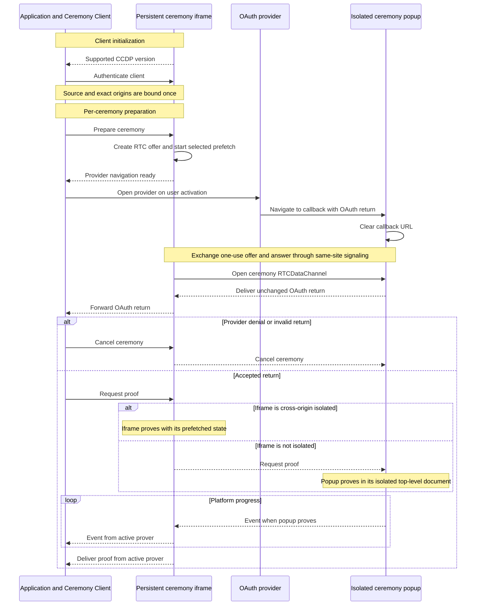

# Ceremony Cross-Document Protocol replacement draft

This document defines the browser protocol connecting an application, its
persistent ceremony iframe, and the OAuth popup returned to the ceremony
server. It is a clean replacement candidate for [CCDP.md](CCDP.md), not a
deployed wire-protocol version. If accepted before launch, the first shipped
protocol can still use version `1`.

The document settles the browser topology, transport, authentication,
lifecycle, and security boundaries. Exact proving algorithms and proof types
belong to [PROVER.md](PROVER.md); exact route bytes and response headers belong
to [SERVER.md](SERVER.md). Wire message names and schemas should be frozen only
after this lifecycle is accepted.

## Purpose and scope

The ceremony crosses documents because two browser properties cannot be added
to the application as ordinary library behavior:

- OAuth returns by navigating a registered server-hosted callback; and
- multithreaded browser proving requires a cross-origin-isolated document.

The protocol must continue after an OAuth provider severs the popup's opener
and browsing-context group. It must also:

- require no communication relay;
- require no route or script on the application origin;
- preserve application-visible progress and terminal results;
- add no window beyond the existing OAuth popup;
- work when the application and ceremony server are different origins;
- support Safari, Firefox, and Chromium without browser detection; and
- keep callback and proof data off communication relays and durable signaling
  storage.

CCDP does not define OAuth profile rules, proof construction, transaction
submission, application Jobs, wallet policy, or server implementation.

## Participants and documents

| Participant | Responsibility |
|---|---|
| Application | Supplies ceremony inputs, opens the provider, owns application state, and receives events and the final proof |
| Ceremony Client | Package code running in the application; owns the public API and the authenticated iframe channel |
| Ceremony iframe | Persistent server-origin `/api/v1/ceremony/prover` document; authenticates the application, prepares each ceremony, prefetches assets, owns signaling, and proves when DIP supplies isolation |
| Ceremony popup | Server-origin `/api/v1/ceremony/popup` document, also served through the configured OAuth callback alias; receives the OAuth return, establishes the popup channel, renders visible ceremony UI, and proves when the iframe cannot |
| OAuth provider | Displays provider authorization and navigates the popup to the registered callback |
| Ceremony server | Serves fixed ceremony documents and configured assets; it does not relay CCDP messages or proof bytes |

```text
Application
    │ authenticated postMessage
    ▼
Ceremony iframe ◄──────── RTCDataChannel ────────► Isolated ceremony popup
    │                                                  │
    └── prove when DIP isolates it                     └── otherwise prove here
```

The application never communicates directly with the popup. The iframe is the
only ceremony participant embedded by the application and the only participant
which reports events or results to it.

## Deployment and trust boundary

### Same-site launch prerequisite

The application and ceremony server may be different origins, but launch
requires them to be the same **schemeful site**. In practice,
`https://app.example.com` and `https://ceremony.example.com` qualify;
`https://one.vercel.app` and `https://two.vercel.app` do not because
`vercel.app` is a public suffix. A scheme change also changes the site.

Same-site deployment allows the embedded iframe and returned top-level popup
to exchange browser-local signaling despite storage partitioning in supported
browsers. It does not grant application authority. The iframe still
exact-validates the browser-observed application origin against the server's
configured allowlist, and the application exact-validates the ceremony-server
origin.

The server rejects an `allowedAppOrigins` deployment entry which is not
same-site with its configured public origin. This is a compatibility admission
rule, not application authentication. Runtime signaling failure still fails
without attempting a weaker transport.

The ceremony server is trusted to serve the popup, iframe, and prover code. A
script compromised on that exact origin already controls OAuth credentials and
proof generation; CCDP does not claim to protect against it.

### Future cross-site deployment

The RTC data plane is independent of web origins and sites after negotiation.
Only browser-local signaling imposes the launch same-site restriction. Future
cross-site support can therefore replace signaling without changing proof or
application messages.

A future revision requires either a durable cross-site browser primitive or an
explicit signaling service with a separately reviewed trust and availability
model. Partitioned storage, short-lived Service Workers, application-origin
return pages, and another retained window do not satisfy the launch
requirements. No speculative fallback is included now.

## Document topology and response policies

### Persistent ceremony iframe

One `/api/v1/ceremony/prover` iframe is created when a `CeremonyClient` is
initialized and remains alive for that client's lifetime. It:

- establishes the authenticated application channel once;
- creates independent signaling state for each ceremony;
- begins selected-platform prefetch before provider authorization completes;
- owns the WebRTC peer offered to the returned popup;
- forwards popup events and results to the application; and
- runs the prover itself when `crossOriginIsolated === true`.

The iframe is frameable only by configured application origins. Its response
requests Document Isolation Policy so supporting browsers may isolate it
without requiring the application page to opt into COOP and COEP.

### Isolated ceremony popup

The application opens the OAuth provider directly. A transient `about:blank`
window may reserve user activation for scripted launch, but it is not a libID
document or protocol participant.

The provider returns to the configured callback alias of
`/api/v1/ceremony/popup`. That response is always top-level, non-frameable, and
cross-origin isolated. Its first script clears the callback query and fragment
before loading subresources, reporting errors, or performing network access.
The popup then establishes WebRTC with the iframe and either delegates proving
to an isolated iframe or proves itself.

The popup and iframe import the same proof-engine implementation. They remain
different HTTP documents because their embedding policies are opposite: the
iframe must be frameable by an allowed application, while the credential
ingress popup must never be frameable. Response policy, not duplicated proving
code, creates the distinction.

Provider-set COOP may sever `window.opener`, `WindowProxy`, transferred ports,
and the original browsing-context group. CCDP depends on none of them after
provider navigation. Provider CSP, COEP, sandbox, document policy, and origin
isolation apply to the provider document and do not carry into the later
server-owned callback response.

## Transport

CCDP uses one transport per trust boundary.

### Application to iframe

The application and persistent iframe use `postMessage`. Every accepted
message requires:

- the exact expected `MessageEvent.source`;
- the exact browser-stamped origin;
- the supported CCDP version;
- the expected lifecycle position; and
- an exact closed message shape.

The application sends with the configured server `targetOrigin`; the iframe
sends only to the origin it observed and admitted during authentication. An
origin supplied in message data, a URL, `Referer`, or `Sec-Fetch-Site` is never
an authority input.

### Iframe to popup

The iframe and returned popup use one `RTCDataChannel` per ceremony. WebRTC is
used because it remains available after browsing-context isolation and carries
structured protocol data without a server relay. The channel transports:

- the captured OAuth return;
- proof dispatch when the popup is the prover;
- platform progress events;
- cancellation and technical failure; and
- proof delivery.

The data channel uses the browser's authenticated DTLS connection. CCDP still
binds negotiation to its own ceremony capability because WebRTC does not
expose or authenticate a web origin to its peer.

### Browser-local signaling

The iframe is the offerer and creates a fresh data channel, SDP offer, and
32-byte capability for each ceremony. The popup is the answerer. Launch uses a
bounded, expiring, one-use, host-only same-site record to move the offer from
the embedded server-origin iframe to the returned server-origin popup and the
answer back. ICE gathering completes before each side publishes its record, so
CCDP needs no trickle-candidate channel.

Signaling contains only routing, protocol, capability, and SDP data. It never
contains the OAuth return, prover input, progress, or proof. The server is not
used as a signaling API and does not interpret the records. The precise
browser-storage encoding and bounds must be qualified by the browser PoC
before the wire protocol is frozen.

## Handshakes

The client-lifetime application handshake and ceremony-lifetime popup
handshake authenticate different things and must not be collapsed.

### Application and iframe authentication

The handshake runs once for a `CeremonyClient`:

1. The iframe announces its supported CCDP version to `parent`.
2. The client accepts only the configured server origin and exact iframe
   `WindowProxy`.
3. The client replies using the exact server `targetOrigin`.
4. The iframe accepts only `MessageEvent.source === parent` and an observed
   origin in its server-embedded application allowlist.
5. Both endpoints bind that source, origin, and version for the iframe's
   lifetime.

The handshake authorizes the application to create ceremonies. It does not
bind one ceremony ID and is not repeated after OAuth.

### Per-ceremony preparation

For each ceremony:

1. The client sends the ceremony ID, platform, selected platform ceremony
   version, and proof request inputs over the authenticated iframe channel.
2. The iframe exact-validates the request and rejects a duplicate live ID.
3. It creates the ceremony-scoped WebRTC offer and capability.
4. It publishes the one-use offer record.
5. It starts the selected platform's prefetch without awaiting completion.
6. It tells the client that provider navigation may begin.

Shared prover dependencies may already be warm from an earlier ceremony. The
iframe fetches no unrelated platform circuit merely because it is persistent.

### Popup authentication

OAuth `state` carries the ceremony ID needed to select the signaling record.
After callback URL clearing:

1. The popup extracts exactly one syntactically valid ceremony ID from the
   bounded OAuth return.
2. It consumes the matching offer record and exact-validates its protocol
   version, ceremony ID, expiry, and capability.
3. It creates and publishes the answer record, repeating those bound values.
4. The iframe consumes only the exact expected answer and applies it to the
   ceremony's peer connection.
5. `RTCDataChannel.onopen` completes popup authentication.
6. Both offer and answer records are deleted; later duplicates are rejected.

Possession of the host-only record identifies code executing on the configured
ceremony-server host. The capability prevents concurrent ceremonies from
crossing channels, while the SDP fingerprints bind the encrypted peer
connection. No claimed origin is transported over WebRTC.

The popup's first data-channel message carries the unchanged bounded OAuth
return. The iframe forwards it to the authenticated client for the selected
platform/version parser to classify as acceptance, provider denial, or invalid
input.

## Ceremony lifecycle



The diagram shows the popup proving branch for relayed events. When the iframe
proves, it emits events and the proof directly to the application channel. The
proof algorithm and result type are identical in either placement.

The popup owns the visible proving status throughout callback handling and
popup proving. When the iframe proves, it sends the same progress events over
WebRTC so the popup can render matching status while the iframe forwards them
to the application.

## Proving placement

Placement is a local runtime decision:

- if the iframe observes `crossOriginIsolated === true`, it proves and reuses
  its already initialized assets and workers;
- otherwise, the always-isolated popup proves using the same proof engine and
  cached immutable assets.

CCDP never infers support from a browser name. Failure to obtain DIP isolation
does not weaken the prover and requires no new user action. There is no second
prover window, **Continue proving** button, isolation-request message, or
BroadcastChannel relay.

The popup remains isolated in both branches. This keeps callback ingress
uniform and guarantees that the fallback placement is already available if
iframe proving cannot start.

## Protocol surface

One CCDP version covers both transports. A breaking message shape, ordering,
or authentication change increments it; proof types and platform ceremony
versions remain separate axes.

The eventual closed message union needs only these semantic groups:

### Application and iframe

- client authentication and readiness;
- ceremony preparation and provider-navigation readiness;
- OAuth-return delivery;
- proof request;
- platform event and proof delivery;
- user cancellation; and
- technical abort.

### Iframe and popup

- OAuth-return delivery after the authenticated channel opens;
- proof request when the popup is the active prover;
- platform event and proof delivery;
- cancellation; and
- technical abort.

Signaling records are not CCDP messages and do not share the data-channel
union. Prefetch is iframe behavior initiated during preparation, not an
independent cross-document protocol.

Every ceremony-scoped message carries the ceremony ID until a concrete channel
is bound exclusively to that ceremony. Unknown, malformed, replayed,
out-of-order, off-channel, or post-terminal messages change no state. Adding a
platform does not change CCDP: platform-specific values remain opaque at this
boundary and are narrowed by the selected platform module.

## Cancellation and failure

Application cancellation travels through the iframe to the popup and active
prover. It is best effort. The popup clears credentials and attempts to close;
the iframe cancels reachable fetch and proving work.

A popup or prover technical failure carries a bounded sanitized reason to the
iframe, which terminates the ceremony and reports it to the client. Exact
machine-readable reason codes may emerge from implementation experience; the
protocol does not invent them before then.

Context loss may be silent. Popup closure, RTC disconnection, iframe removal,
or visibility change is never success, denial, or explicit cancellation. The
launch protocol is one-shot and has no OAuth or proof recovery checkpoint;
interruption before proof delivery starts a new ceremony.

## Security invariants

- The iframe admits only an exact configured application origin observed on
  the expected parent source.
- The application admits only its exact iframe source at the configured
  ceremony-server origin.
- Each popup connection is bound to one live ceremony, one one-use capability,
  and one SDP fingerprint pair.
- Signaling state is bounded, expiring, one-use, deleted after consumption, and
  contains no OAuth credential or proof material.
- The protocol never depends on opener continuity after provider navigation.
- Callback query and fragment are cleared before subresources, storage lookup,
  network access, error rendering, or logging.
- The raw OAuth return reaches only the authenticated Ceremony Client for the
  selected platform parser, then returns over the authenticated iframe channel
  if proving proceeds. It is never placed in signaling storage or sent to a
  communications relay.
- Proof generation runs only when the active document reports
  `crossOriginIsolated === true`.
- The popup is never frameable; the iframe is frameable only by configured
  application origins.
- Cross-origin modules, workers, WebAssembly, circuits, and CRS resources meet
  the popup and iframe's COEP, CORS, CORP, MIME, and CSP requirements.
- Duplicate, mixed, expired, or post-terminal ceremony traffic fails closed.
- Popup closure and transport loss are never interpreted as protocol results.

## Browser and failure behavior

Provider response headers are treated as adversarial. The design remains valid
when a provider combines standardized policies which sever opener
relationships, isolate its origin, restrict its own embedding or subresources,
or disable communication APIs inside the provider document. The provider must
still perform the registered callback navigation for OAuth to complete.

Same-site signaling is qualified in real Safari, Firefox, and Chromium. DIP is
an optimization selected solely through `crossOriginIsolated`; its absence is
the ordinary popup-proving path. Prefetch failure changes latency only. Asset
or isolation-policy incompatibility fails proving rather than falling back to
an unisolated execution mode.

## Conformance boundary

CCDP conformance covers:

- reciprocal application/iframe origin and source authentication;
- rejection of cross-site deployment configuration;
- concurrent ceremony separation and signaling replay rejection;
- return from a provider which has severed every opener-based channel;
- WebRTC establishment after callback isolation;
- both DIP-iframe and popup proving placements;
- unchanged OAuth-return transport and credential confinement;
- continuous platform events in both placements;
- proof, denial, cancellation, technical failure, and silent context loss;
- popup non-frameability and mandatory proof isolation; and
- the real nested proving asset graph under COEP in supported browsers.

Tests should assert one property per stable identifier in
[TEST_PLAN.md](TEST_PLAN.md) after the replacement design is accepted.

## Decisions and revisit conditions

| Decision | Reason | Revisit when |
|---|---|---|
| Persistent iframe | Gives the application one authenticated endpoint, starts prefetch early, and may reuse initialized assets for DIP proving | Measurement shows iframe proving or retained prefetch has no useful benefit |
| WebRTC data channel | Survives browsing-context isolation without a server relay or additional window | A simpler browser primitive satisfies the same supported-browser constraints |
| Same-site signaling | It is the only qualified relay-free way to reconnect the returned popup across supported browsers | A durable cross-site signaling primitive is broadly supported, or an explicit relay is accepted |
| Direct provider launch | Removes the non-isolated libID popup phase and its second handshake | A provider requires a package-owned page before authorization |
| Always-isolated popup | Makes credential ingress uniform and provides the portable prover placement | All supported browsers provide qualified embedded document isolation |
| Shared proof engine, separate documents | Avoids code duplication while preserving opposite framing policies | Browser response policy can vary safely without separate documents |
| One-shot ceremonies | Avoids credential persistence, replay, migration, and recovery state | Recovery has a separately justified user case and protocol revision |
