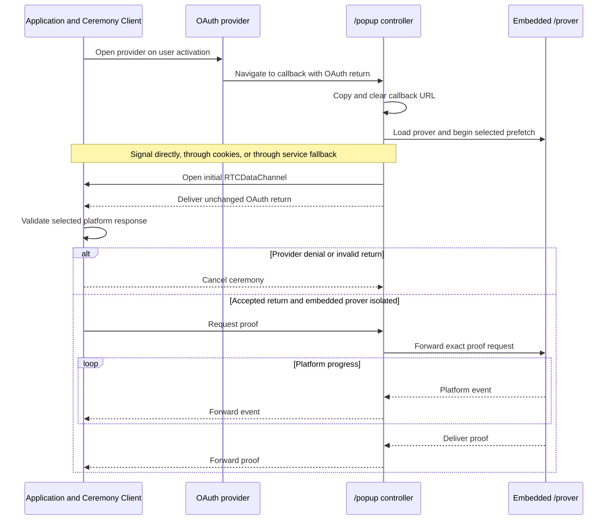
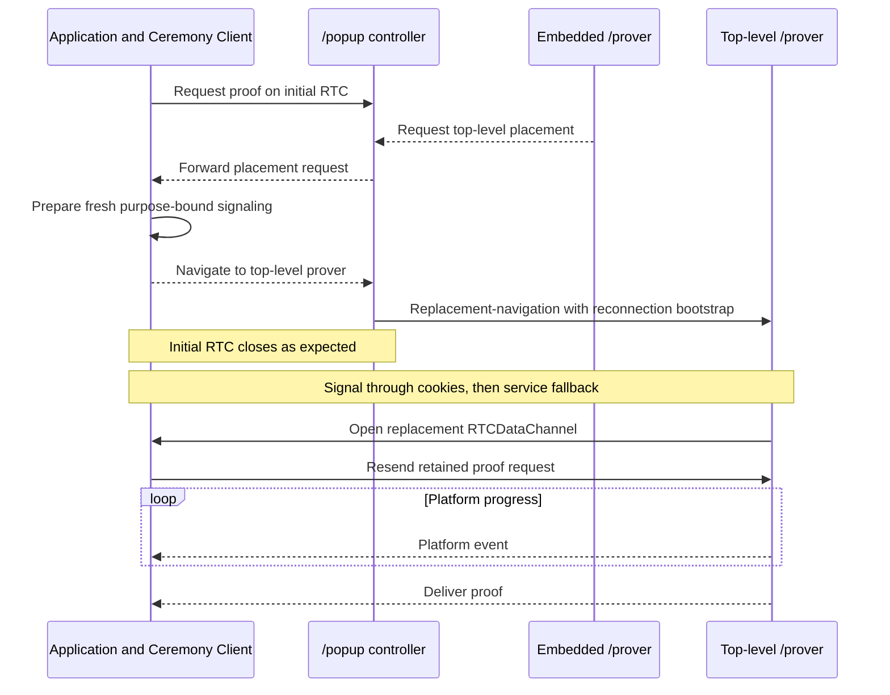

# Ceremony Cross-Document Protocol replacement draft

This document defines the browser protocol connecting an application, its
ceremony bridge, the OAuth callback popup, and the isolated prover. It is a
clean replacement candidate for [CCDP.md](CCDP.md), not a deployed
wire-protocol version. If accepted before launch, the first shipped protocol
can still use version `1`.

The document settles topology, transport, authentication, lifecycle, and
security boundaries. Exact proving algorithms and proof types belong to
[PROVER.md](PROVER.md); exact route bytes and response headers belong to
[SERVER.md](SERVER.md). Exact message and signaling schemas follow this
lifecycle rather than defining it indirectly.

## Purpose and scope

The ceremony crosses documents because two browser properties cannot be added
to the application as ordinary library behavior:

- OAuth returns by navigating a registered server-hosted callback; and
- multithreaded browser proving requires a cross-origin-isolated document.

The protocol must continue when an OAuth provider severs the popup's opener and
browsing-context group. It must also:

- keep the normal signaling path browser-local and use a signaling service only
  as a fallback;
- require no route or script on the application origin;
- preserve application-visible progress and terminal results;
- use only the one popup opened for OAuth;
- work when the application and ceremony server are cross-origin or cross-site;
- support Safari, Firefox, and Chromium without browser detection;
- keep OAuth returns, prover inputs, events, and proofs off cookies and
  signaling services; and
- let the application navigate the popup through an external document and
  receive its fragment result without recovering an opener.

CCDP does not define OAuth profile rules, proof construction, transaction
submission, application Jobs, wallet policy, or signaling-service
implementation.

## Participants and topology

| Participant | Responsibility |
|---|---|
| Application | Supplies ceremony inputs, opens the provider, owns application state and the application RTC peer, and receives events and the final proof |
| Ceremony Client | Package code running in the application; owns the public API, ceremony state, transport selection, and RTC reconnection |
| Ceremony bridge | Bare server-origin iframe embedded by the application; authenticates its parent, starts best-effort public-asset prefetch, and exposes same-site cookie signaling when available; it never owns RTC or ceremony data |
| Ceremony popup | Visible, non-isolated `/api/v1/ceremony/popup` controller, also served through the callback alias; clears the OAuth return, owns the popup RTC peer and UI, and embeds the prover |
| Prover | `/api/v1/ceremony/prover` running either as an isolated child of the popup or, after replacement navigation, as the isolated top-level document in the same popup window |
| Signaling service | Fallback exchange for authenticated signaling records when direct and cookie signaling are unavailable; it never carries CCDP data messages |
| OAuth provider | Displays provider authorization and navigates the popup to the registered callback |
| Ceremony server | Serves fixed ceremony documents and configured assets; it may expose or configure the fallback signaling service but never relays OAuth or proof data |

```text
Application and Ceremony Client
    │
    │ direct RTCDataChannel
    ▼
Visible /popup controller
    │
    ├── /prover iframe when DIP isolates it
    │
    └── replacement-navigation to top-level /prover otherwise

Application ──postMessage── Ceremony bridge ──cookies── /popup or /prover
                                      fallback signaling only
```

The RTC peer belongs to the application page, not its bridge iframe. Mobile
Safari may suspend a background iframe while a popup is foreground, so an
iframe-owned connection cannot be the ceremony data plane. The bridge may be
suspended after negotiation without affecting an established connection.

Proof generation always runs in the visible popup's document tree. An
application-level iframe may prefetch public assets, but never performs proving.
This avoids the mobile throttling observed when the foreground popup was active
while the prover ran under the background application page.

## Deployment and trust boundary

The application and ceremony server may be different origins and different
schemeful sites. Deployment does not require application-origin callback code.

Three signaling paths provide progressively broader compatibility:

1. direct `postMessage` when the callback retains its opener;
2. browser-local cookie signaling when the application and ceremony server can
   share the server's cookies; and
3. an authenticated signaling service otherwise.

The first two paths are communication-relay-free. The signaling service is a
fallback for cross-site deployment, partitioned storage, or provider isolation.
It learns bounded network metadata and may delay or drop negotiation, but
signaling records are capability-authenticated and its modification cannot bind
a peer to another ceremony. It never receives an OAuth return, proof request,
progress event, proof, or external-navigation payload.

Same-site deployment remains useful because it preserves the local cookie
fallback even after COOP severs the opener. It is no longer an admission rule:
the server must not reject an allowed application merely because it is
cross-site.

The ceremony server is trusted to serve the bridge, popup, and prover code. A
script compromised on that exact origin already controls OAuth credentials and
proof generation; CCDP does not claim to protect against it. A separately
operated signaling service is not granted that trust.

The initial signaling capability is derived under a CCDP domain separator from
the unpredictable ceremony ID already carried as OAuth `state`; no additional
OAuth field is introduced. The signaling service receives only a lookup digest
and capability-authenticated opaque records, not the ceremony ID or capability.
The application and returned popup independently derive the same value. Every
later connection uses a fresh random capability delivered over the preceding
authenticated RTC channel and carried to the replacement document only in its
cleared fragment. Exact derivation and record encoding are part of the signaling
schema freeze.

## Document topology and response policies

### Ceremony bridge

One bare ceremony-server iframe may be created when a `CeremonyClient` is
initialized. It:

- authenticates its exact parent source and browser-observed application origin;
- receives only bounded ceremony ID, platform, and version preparation data;
- starts best-effort selected-platform prefetch;
- retains one-use cookie signaling state when the browser exposes the same
  server cookies to the callback; and
- forwards signaling records between its authenticated parent and those
  cookies.

It never receives the OAuth return, proof request, platform event, proof, or
wallet payload. It owns no `RTCPeerConnection`. Cookie unavailability or later
iframe suspension selects another signaling path rather than affecting proof
execution.

The bridge is frameable only by configured application origins and has no
network authority beyond immutable public assets and the configured signaling
fallback. Its exact route is fixed by the server contract when the signaling
schemas are frozen.

### Ceremony popup

The application opens the OAuth provider directly. A transient `about:blank`
window may reserve user activation for scripted launch, but it is not a libID
document or protocol participant.

The provider returns to the configured callback alias of
`/api/v1/ceremony/popup`. The response is top-level, non-frameable, and
deliberately **not** cross-origin isolated so a retained opener can provide the
fast signaling path. Its first script copies and clears the callback query and
fragment before loading subresources, reporting errors, storage access, or
network access.

Provider-set COOP may already have severed `window.opener`, `WindowProxy`, and
the original browsing-context group. CCDP treats opener presence as an
optimization and falls back to cookie or service signaling. Provider CSP, COEP,
sandbox, document policy, and origin isolation do not carry into the later
server-owned popup response.

The popup renders the persistent libID ceremony UI. It loads `/prover` as a
same-origin child, forwards one accepted proof request to it, and forwards
platform events and the proof to the application over RTC. The popup itself
does not prove.

The same popup route also has a fragment-selected external-return mode. It
clears the bounded fragment first, reconnects to the application through a
fresh signaling capability, and delivers the opaque return. It performs no
OAuth parsing or proving in that mode.

### Prover

`/api/v1/ceremony/prover` is one implementation and one response policy with
two placements:

- as a same-origin iframe under `/popup`, where Document Isolation Policy may
  make it cross-origin isolated; or
- as the top-level document reached by replacement-navigation of the same popup
  window, where COOP and COEP provide isolation.

Its framing policy permits only the server's own popup origin. In both
placements it checks `crossOriginIsolated === true` and shared-memory support
before receiving credentials or starting proof work. The same platform module,
workers, assets, UI events, and proof type are used in either placement.

When embedded isolation is unavailable, the prover requests top-level
placement. The popup does not open another window or show a **Continue proving**
button. It waits for the application to prepare reconnection, then navigates the
existing popup window to `/prover`.

## Transport

### Why WebRTC is necessary

Authenticated `postMessage` is the simpler and more appropriate popup
transport. It provides browser-stamped sender origins and exact `targetOrigin`
delivery without ICE, SDP, STUN, or signaling state.

CCDP uses WebRTC because a provider or the top-level prover may apply COOP,
switch the popup into another browsing-context group, and invalidate the
retained `WindowProxy`. The security purpose of that switch is to reduce the
cross-origin window surface and permit process isolation; losing `postMessage`
is an artifact of COOP's current model. The
[standards discussion](https://github.com/whatwg/html/issues/6364) and
experimental `restrict-properties` policy demonstrate the missing narrower
primitive, but that policy is not part of the
[interoperable HTML COOP values](https://html.spec.whatwg.org/multipage/browsers.html#cross-origin-opener-policies).

WebRTC is therefore a compatibility workaround, not a preferred abstraction. A
broadly supported postMessage-only cross-group capability could replace it
without changing ceremony data messages or trust decisions.

### Application to popup or top-level prover

The application and current visible ceremony document use one ordered
`RTCDataChannel`. It carries:

- the unchanged captured OAuth return;
- the proof request;
- platform progress events;
- cancellation and technical failure;
- proof delivery; and
- isolated external-navigation commands, results, and acknowledgement.

The channel uses browser DTLS. CCDP additionally binds each negotiation to one
live ceremony, one connection purpose, and one one-use capability because
WebRTC does not expose or authenticate a web origin to its peer.

The application is always one RTC endpoint. The other endpoint is initially
`/popup`; it is replaced by top-level `/prover` only when embedded isolation is
unavailable. No RTC connection terminates in the application bridge or embedded
prover.

### Popup to embedded prover

The popup and its exact same-origin `/prover` child use `postMessage` or one
transferred `MessagePort`. Both endpoints exact-check source, origin, protocol
version, message shape, and lifecycle position. Only proof request, platform
event, proof delivery, cancellation, and technical failure cross this local
boundary.

The popup retains ceremony authority. A prover child cannot select another
ceremony, platform, version, client, redirect, or OAuth return.

### Trickle ICE and STUN

The peers use trickle ICE with a configured STUN server. Each side publishes
its local description immediately, then republishes a monotonically growing
candidate snapshot as candidates appear, followed by an explicit completion
marker. A receiver may observe duplicate snapshots or skip intermediate ones;
it accepts only an exact extension of the current generation.

Trickle ICE lets an available host or mDNS candidate connect immediately and
does not wait for the STUN lookup. Server-reflexive candidates provide the
general path when mobile browsers cannot resolve mDNS candidates or would
otherwise request local-network permission. STUN receives network metadata but
no CCDP payload; DTLS protects the resulting data channel.

TURN is not required for signaling. It may be added later as an ICE-connectivity
fallback if measurements show that direct candidate pairs fail materially.

### Signaling selection

The popup is the offerer and the application is the answerer. All signaling
paths carry the same bounded, capability-bound offer/answer and cumulative
candidate snapshots.

1. **Direct.** A popup with a live opener requests signaling through
   `postMessage`. The application accepts only the exact configured
   ceremony-server origin and either its retained popup source or, for native
   anchor launch, the first source atomically bound to the matching live
   ceremony. Both sides then exchange snapshots event-by-event.
2. **Cookie.** If direct signaling is unavailable, the server-origin popup and
   authenticated bridge exchange the latest cumulative snapshots through
   bounded, expiring, host-only cookies. Polling may miss a write but not a
   candidate because every value is cumulative. The bridge forwards snapshots
   to the application; it never owns the peer.
3. **Service.** If cookie signaling is unavailable or fails, both endpoints use
   the signaling service. Records are one-use, expiring, capability-
   authenticated, and opaque to the service. Delivery may be event-driven; the
   exact service API belongs to the server contract.

A deployment which cannot rely on the cookie path arms its one-use service
subscription before provider navigation: after a severed opener there is no
remaining browser-local event with which the popup could wake the application.
The subscription carries no signaling record until needed and is discarded if
direct signaling wins. A same-site deployment with a qualified cookie bridge
does not contact the signaling service on its normal path.

The first successful path fixes the signaling mode for that connection. Late
records from another path are ignored. Signaling is deleted or invalidated when
the channel opens, fails, expires, or is superseded.

Signaling never contains the OAuth return, proof request, progress, proof, or
external-navigation payload. The service is a signaling relay, never a CCDP
data relay.

## Connection establishment

### Initial callback connection

OAuth `state` carries the ceremony ID used to select the live application
ceremony. After first-script URL clearing:

1. `/popup` extracts exactly one syntactically valid ceremony ID from the
   bounded OAuth return.
2. It tries direct signaling when an opener remains, otherwise starting at the
   cookie path. Failure advances to the next available path.
3. The popup creates the offer and data channel; the application creates the
   answer. Both trickle cumulative candidates.
4. Each side exact-validates ceremony, connection purpose, capability, expiry,
   description, candidates, and DTLS fingerprint continuity.
5. `RTCDataChannel.onopen` completes binding. Signaling state is consumed.
6. The popup's first ceremony-data message carries the unchanged OAuth return.

The Ceremony Client selects the live platform/version parser and classifies the
return as acceptance, provider denial, or invalid input. The popup neither
classifies provider fields nor releases them through a signaling path.

### Embedded proving

The popup starts the child prover and public-asset prefetch as early as its
cleared callback page permits. The child reports readiness and whether it is
isolated without receiving the OAuth return.

After the client accepts the OAuth return, it sends the exact proof request. If
the child is isolated, the popup forwards the request once. The child emits
platform events followed by one proof or a technical abort; the popup forwards
those records over the existing RTC channel. This path uses one RTC connection.

### Top-level proving fallback

If the child is not isolated, one popup still suffices, but two sequential RTC
connections are required:

1. The child sends the popup a top-level-placement request; the popup forwards
   it to the application over the initial channel.
2. The application creates a fresh one-use signaling capability with purpose
   `top-level-prover` and prepares cookie and service fallback state.
3. The application instructs the popup to navigate only after preparation
   succeeds.
4. The popup clears its retained proof input and replacement-navigates the same
   window to `/api/v1/ceremony/prover`, carrying only the bounded reconnection
   bootstrap in the fragment.
5. Navigation destroys the initial popup document and RTC connection. Their
   closure is expected progress, not cancellation.
6. Top-level `/prover` clears the fragment first, establishes a fresh RTC
   connection with the application through cookie signaling or the signaling
   service, and proves only after isolation checks pass.
7. The application resends its retained exact proof request. Events and the
   proof return over the replacement channel.

The ceremony ID remains constant, while each connection has a fresh purpose-
bound capability. Once replacement begins, messages from the initial channel
are inert. No credential, proof request, or proof is stored for navigation or
sent through signaling.

Avoiding this second connection would require a representative pre-OAuth DIP
probe plus another registered callback mode, transient credential storage, or
credential delivery over another transport. Launch accepts the extra handshake
on the fallback path instead.

### External-document navigation and return

After proof delivery, the application may request one external-document detour:

1. It prepares a fresh one-use return capability and signaling state.
2. It sends the target canonical HTTPS URL and bounded opaque fragment bytes to
   the current visible ceremony document over RTC.
3. That document combines the fragment-free target with protocol-owned return
   framing and calls `location.replace()`.
4. The external document returns to `/api/v1/ceremony/popup` with the return
   capability and opaque result in the fragment.
5. Popup return mode clears the fragment first, establishes a fresh RTC channel
   through cookie or service signaling, and sends the opaque result.
6. The application commits the result before acknowledging it; the popup may
   then close.

CCDP interprets neither opaque payload. It owns only canonical framing,
version, ceremony and return correlation, byte bounds, the fixed return path,
one-use capability, and acknowledgement. A target base URL has no credentials
or fragment. Unknown, duplicate, expired, oversized, or post-terminal traffic
changes no state.

## Ceremony lifecycle

### Embedded prover path



### Top-level prover fallback



## Protocol surface

One CCDP version covers ceremony data on direct, embedded-prover, and RTC
boundaries. A breaking message shape, order, or authentication rule increments
it; platform ceremony versions remain independent.

The closed ceremony-data union needs only:

- unchanged OAuth-return delivery;
- proof request;
- platform event and proof delivery;
- top-level-prover placement request and prepared-navigation command;
- external-document navigation request, opaque result, and committed
  acknowledgement;
- user cancellation; and
- technical abort.

Signaling snapshots, bridge commands, and signaling-service records form a
separate closed signaling protocol. They cannot carry arbitrary CCDP messages.
Prefetch status is local behavior, not a ceremony-data message.

Every ceremony-scoped message carries its ceremony ID until a concrete channel
is bound exclusively to that ceremony. The connection binding supplies the
purpose and generation; ceremony data does not repeat signaling capabilities or
SDP identifiers. Unknown, malformed, replayed, out-of-order, wrong-channel, or
post-terminal messages change no state.

Adding a platform does not change CCDP. Platform-specific values remain opaque
at this boundary and are narrowed by the selected platform module.

## Cancellation and failure

Application cancellation travels over the current RTC channel to the popup and
active prover. It is best effort. Reachable proving work stops, credentials are
cleared, and the visible document attempts to close.

A popup or prover technical failure carries a bounded sanitized reason upstream.
Exact machine-readable reason codes may emerge from implementation experience;
the protocol does not invent them before then.

Context loss may be silent. Popup closure, RTC disconnection, bridge suspension,
or visibility change is never success, denial, or explicit cancellation. The
initial RTC closing during prepared top-level navigation is the one expected
transport replacement. The launch protocol otherwise remains one-shot and has
no OAuth or proof recovery checkpoint.

## Security invariants

- Direct signaling admits only the exact retained popup source and configured
  ceremony-server origin.
- The bridge admits only its exact parent source and a browser-observed origin
  in the server-embedded allowlist.
- Each RTC connection is bound to one live ceremony, one purpose, one one-use
  capability, and one SDP fingerprint pair.
- Cookie and service signaling state is bounded, expiring, one-use, and deleted
  after consumption. It contains no ceremony data.
- The signaling service cannot modify or cross two negotiations without failing
  capability authentication. It remains able to delay or deny service.
- The protocol never requires opener continuity after provider navigation.
- Callback query and fragment are cleared before subresources, storage access,
  network access, error rendering, or logging.
- The raw OAuth return reaches only the authenticated Ceremony Client and the
  selected prover after validation. It never enters cookies or signaling.
- Proof generation runs only in a document which reports
  `crossOriginIsolated === true` and supports the required shared memory.
- Top-level-prover navigation carries only reconnection bootstrap data. The
  application resends the proof request after the replacement channel opens.
- Navigation targets are canonical HTTPS URLs without credentials or a prior
  fragment; return always uses the fixed popup path, and opaque payloads never
  enter a request body, cookie, signaling record, or server log.
- The popup is never frameable; `/prover` is frameable only by the ceremony
  server's own popup origin.
- Cross-origin modules, workers, WebAssembly, circuits, CRS resources, and STUN
  configuration meet the prover's isolation and loading requirements.
- Duplicate, mixed, expired, superseded, or post-terminal traffic fails closed.
- Popup closure and unexpected transport loss are never interpreted as protocol
  results.

## Browser and failure behavior

Provider response headers are treated as adversarial. The design remains valid
when a provider combines standardized policies which sever opener relationships,
isolate its origin, restrict its own embedding or subresources, or disable
communication APIs inside the provider document. The provider must still
perform the registered callback navigation for OAuth to complete.

Signaling selection is capability-driven, not browser-name-driven. Embedded
proving is selected only by the child's observed isolation state. Its absence is
the ordinary automatic top-level-prover path, not a degraded proof mode.

Trickle ICE with STUN is the general connectivity path. Host and mDNS candidates
remain useful when available but are not required. A signaling-service failure
after direct and cookie signaling are unavailable fails the ceremony without
sending ceremony data through another channel.

## Conformance boundary

CCDP conformance covers:

- exact direct-signaling source and origin authentication;
- same-site cookie signaling and partitioned-cookie failure;
- cross-site signaling-service fallback, capability authentication, replay,
  expiry, and denial;
- trickle ICE with host, mDNS, and server-reflexive candidate paths;
- return from a provider which has severed every opener-based channel;
- direct application-to-popup RTC while the bridge is suspended;
- embedded DIP proving in the foreground popup;
- automatic one-window replacement by top-level `/prover`, expected initial
  channel closure, fresh signaling, and proof-request resend;
- unchanged OAuth-return transport and credential confinement;
- continuous platform events and exact proof delivery in both placements;
- proof, denial, cancellation, technical failure, and silent context loss;
- external-origin navigation, first-script return-fragment clearing,
  fresh-channel delivery, acknowledgement, replay, expiry, and byte bounds;
- popup non-frameability and mandatory prover isolation; and
- the real nested proving asset graph under COEP in supported browsers.

Tests should assert one property per stable identifier in
[TEST_PLAN.md](TEST_PLAN.md) after the replacement design is accepted.

## Decisions and revisit conditions

| Decision | Reason | Revisit when |
|---|---|---|
| Application-owned RTC peer | Background iframe RTC was suspended while proving in foreground on mobile Safari | Browsers provide a durable worker-owned peer that survives the required transitions |
| Non-isolated `/popup` controller | Preserves the direct event-driven signaling path while keeping credentials in the visible package-owned page | A portable isolated page can retain authenticated opener messaging |
| Foreground `/prover` | Avoids throttling under the background application and keeps progress visible | Measurements show equivalent foreground scheduling elsewhere |
| Embedded prover with automatic top-level fallback | Uses DIP without depending on it and preserves one popup with no extra click | All supported browsers provide qualified embedded isolation |
| Two sequential RTC connections on top-level fallback | Avoids credential storage, credential relay, and speculative DIP preflight | Fallback frequency and reconnection latency become material |
| Direct, cookie, then service signaling | Keeps the common path event-driven and local while supporting severed-opener and cross-site cases | A portable browser-local cross-site signaling primitive exists |
| Trickle ICE with STUN | Avoids waiting for full gathering and removes dependence on unreliable mobile mDNS | Browser host connectivity alone becomes reliably portable |
| Signaling-only service | Enables cross-site fallback without exposing ceremony data | A stronger browser primitive removes it or measurements justify TURN/data relay |
| One-shot ceremonies | Avoids credential persistence, replay, migration, and recovery state | Recovery has a separately justified user case and protocol revision |
| Opaque popup navigation | Lets a composition add a post-proof authority step without another window or CCDP dependency on wallet policy | No launch composition needs a cross-origin post-proof step |
