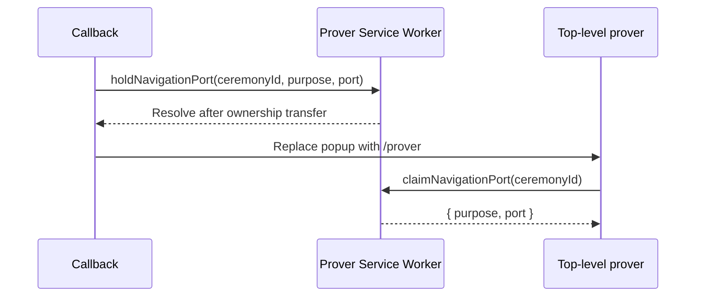

# Navigation port handoff

This document defines the package-private mechanism which moves one opaque
`MessagePort` across the callback-to-prover navigation. It is shared browser
infrastructure, not a CCDP message, transport, public API, or durable ceremony
record.

[CCDP-TRANSPORT.md](CCDP-TRANSPORT.md) defines the transport lifecycle which
constructs and interprets these ports. [CALLBACK.md](CALLBACK.md) and
[PROVER.md](PROVER.md) host its two popup-side endpoints.

## API

```ts
async function holdNavigationPort(
  ceremonyId: string,
  purpose: string,
  port: MessagePort,
): Promise<void>

async function claimNavigationPort(ceremonyId: string): Promise<{
  purpose: string
  port: MessagePort
}>
```

`purpose` is an opaque, bounded string chosen and exact-validated by the
transport coordinator. The handoff defines no purpose registry or carrier enum
and never interprets the port.

## Behavior

`holdNavigationPort` transfers the supplied port and a fresh receipt port to the
active prover Service Worker. It resolves only after the worker has accepted
one holder for the exact ceremony ID into its short-lived in-memory map. The
callback navigates only after that acknowledgement.

`claimNavigationPort` contacts the same active worker with another fresh receipt
port. The worker atomically removes the matching holder and returns its unchanged
purpose and port. The clearing top-level prover calls it before package import or
network use. Both receipt ports close after their replies.

The callback obtains the registration with
`navigator.serviceWorker.getRegistration('/api/v1/ceremony/')`, not
`navigator.serviceWorker.ready`: a developer-configurable callback alias need
not be controlled by that scope. The worker implementation is emitted by the
prover bundle but belongs to this shared module.

The two acknowledged calls are necessary because the callback must establish
worker ownership before destroying itself and the destination prover does not
exist before navigation. The worker extends each handling event through its
reply. It keeps no durable record and never reads messages queued on the held
port.

## Failure and security invariants

- Ceremony ID, purpose type and bound, transferable count, duplicate ownership,
  expiry, and one-use claim are checked before a port changes ownership.
- Wrong, missing, expired, duplicate, replayed, or post-terminal calls reject and
  close every reachable port.
- A worker loss or failed acknowledgement prevents navigation with live
  credential-bearing state.
- The holder expires after a short implementation-bounded interval; Service
  Worker lifetime is needed only across the immediate same-origin navigation.
- No `BroadcastChannel`, cookie, IndexedDB record, request, or URL carries the
  port, purpose, or its queued payload.

## Sequence


