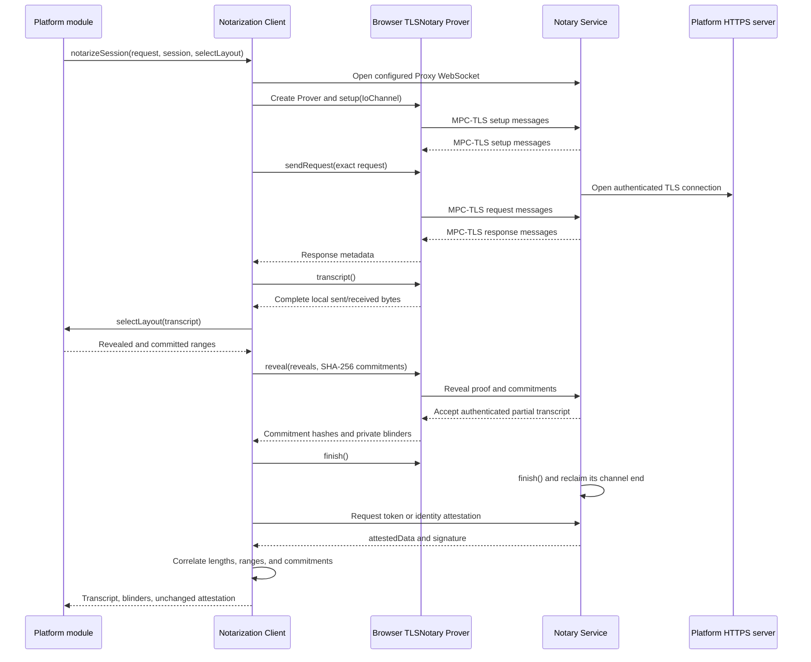

# `@libid/ceremony` notarization architecture

This document defines how the ceremony package uses the pinned raw TLSNotary
browser client, how TypeScript selects authenticated transcript disclosures,
and how byte-exact notary attestations and private commitment blinders reach the
platform prover. It covers X token and identity sessions, GitHub identity
sessions, and the equivalent server-side GitHub token exchange.

The enclosing prover pipeline is defined in [PROVER.md](PROVER.md), its browser
placement and messages in [CCDP.md](CCDP.md), and the Notary Service and asset
URLs supplied by the integrating server in [SERVER.md](SERVER.md). The exact
profile statements remain normative in the
[common ceremony rules](../../../specs/ceremony-common.md) and
[identity-platform ceremonies](../../../specs/platform-ceremonies.md).

## Boundary and rationale

Launch uses the upstream TLSNotary WASM API behind the internal
`prover/notarization` TypeScript adapter. The browser-side TLSNotary Prover and
the Notary Service's TLSNotary Verifier run MPC-TLS; the adapter owns browser
transport and attestation delivery; each closed platform-version module owns
the HTTP request, response parsing, and transcript layout its Platform Verifier
expects.
The adapter ships in `libid-ceremony-prover.js`; the separately fetched
notarization-client release remains the pinned raw TLSNotary JavaScript/WASM
bundle.

The adapter is a code boundary, not a browser security boundary. Moving the
platform logic into a custom libID WASM facade would not protect it from the
prover origin that loads both JavaScript and WASM, and would require rebuilding
the large notarization artifact for a small platform change. One adapter keeps
raw TLSNotary API churn out of platform code without splitting platform logic
between Rust and TypeScript.

The adapter is internal to the prover. Applications, ceremony inputs, OAuth
responses, and CCDP messages cannot supply a Notary Service, provider URL,
request, layout, or session tag. The prover receives the deployment's common
`notaryAddress`; each platform-version module constructs the remaining values
from closed code plus bounded ceremony credentials.

## Internal TypeScript contract

The pinned raw TLSNotary types are normalized at one import site:

```ts
interface ByteRange {
  start: number // inclusive
  end: number   // exclusive
}

interface DirectionLayout {
  revealed: readonly ByteRange[]
  committed: readonly ByteRange[]
}

interface SessionLayout {
  sent: DirectionLayout
  received: DirectionLayout
}

interface ExactHttpRequest {
  url: string
  method: 'GET' | 'POST'
  headers: Readonly<Record<string, Uint8Array>>
  body: Uint8Array
}

interface Transcript {
  sent: Uint8Array
  received: Uint8Array
}

interface NotaryAttestation {
  attestedData: Uint8Array
  signature: Uint8Array
}

interface CommitmentOpening {
  direction: 'sent' | 'received'
  start: number
  end: number
  blinder: Uint8Array // exactly 16 bytes
}

interface NotarizeSessionInput {
  notaryAddress: string
  session: 'token' | 'identity'
  request: ExactHttpRequest
  selectLayout(transcript: Transcript): SessionLayout
}

interface NotarizeSessionResult {
  transcript: Transcript
  openings: readonly CommitmentOpening[]
  attestation: NotaryAttestation
}

declare function notarizeSession(
  input: NotarizeSessionInput,
): Promise<NotarizeSessionResult>
```

This is not exported from `@libid/ceremony`. Header order is not semantic: the
selector runs on the actual serialized transcript, while the verifier checks
the request line, coverage, authorization-header uniqueness, and bearer
framing rather than relative header position. The raw body remains intentional
because form-field order and byte encoding can be profile semantics; in
particular, GitHub's server-side token exchange places its redacted
`client_secret` last. The platform module pins the provider URL;
`notarizeSession` accepts it only because the internal raw TLSNotary call needs
it.

The result retains the transcript only long enough for the calling platform
module to parse its private response and build the circuit witness. It never
crosses CCDP or the public ceremony API and is cleared with the other prover
inputs. The adapter correlates the raw TLSNotary commitment output with the
signed attestation, then discards the duplicate commitment hash and returns
only each range and its private blinder.

## Session lifecycle



`finish()` is the ownership boundary. On the browser side it resolves only
after the TLSNotary Prover has released the original JavaScript `IoChannel`;
on the service side it returns the stream after the TLSNotary Verifier has
released it. Only then may the adapter and service exchange the
application-level attestation request and response without racing either
TLSNotary session driver.

The application-level request selects only `token` or `identity`, which lets
the configured Notary Service apply the corresponding signed operation tag. It
does not resend transcript bytes, disclosure ranges, commitments, provider
authority, or platform-derived fields. Those already come from the verifier
output and deployment configuration.

## Disclosure and commitment selection

The Notary Service does not decide what the browser-side prover discloses.
After the provider responds, the platform module sees its local complete
transcript and returns a layout. The adapter supplies that layout to
`Prover.reveal`; the browser-side TLSNotary Prover and the Notary Service's
TLSNotary Verifier establish that every revealed byte and commitment belongs
at its claimed transcript offset.

Each selector states only its ascending, non-overlapping revealed ranges. One
shared helper derives the commitments as their complement over `[0, length)`:

```ts
function layout(length: number, revealed: readonly ByteRange[]): DirectionLayout {
  return {
    revealed,
    committed: complement(length, revealed),
  }
}
```

This makes every byte revealed or committed by construction. It avoids two
independently maintained lists that can leave an unauthenticated gap or overlap.
Every committed range uses SHA-256 and a fresh TLSNotary-generated 16-byte
blinder. The adapter preserves the input order when associating returned
blinders with ranges.

For a bearer range, TLSNotary commits:

```text
SHA256(bearer || blinder)
```

The notary learns its position, length, and blinded commitment, plus the
revealed framing around it. It learns neither the bearer nor the blinder. The
notary signs the attested-data bytes containing those ranges and commitments;
it never receives a caller-supplied identity, handle, OAuth client, chain,
transaction, or extracted bearer.

The prover later gives `bearer-link` the bearer and the two independent
blinders. The circuit proves that the same private bearer opens the token and
identity commitments. The Platform Verifier reconstructs those public
commitments from the two verified attestations, so neither commitment is copied
into the delivered platform proof.

## Platform-owned requests and layouts

The shared adapter is identical across platforms. Differences live in the
selected platform-version module:

| Browser session | Exact request | Sent layout | Received layout | Private value retained |
|---|---|---|---|---|
| X token | `POST /2/oauth2/token` with the bounded form fields owned by X ceremony version `1` | reveal the profile request | reveal the required response framing and access-token delimiters; commit the complement | parsed access token and its blinder |
| X identity | `GET /2/users/me` with the bearer in the profile-owned header set | reveal everything except the framed bearer value | reveal the required response framing plus exact string `id` and `username` members; commit the complement | identity-session blinder |
| GitHub identity | `GET /user` with the bearer and GitHub's profile-owned headers | reveal everything except the framed bearer value | reveal the required response framing plus exact integer `id` and string `login` members; commit the complement | identity-session blinder |

X and GitHub identity therefore reuse the same request-side bearer selector.
Their response selectors differ only where their JSON profiles differ: X reads
a quoted identifier and `username`; GitHub reads an integer identifier and
`login`. X token uses a different selector because the bearer first appears in
a response rather than an `Authorization` request header.

Conceptually, the three calls are:

```ts
const token = await notarizeSession({
  notaryAddress,
  session: 'token',
  request: buildXTokenRequest(code, codeVerifier, clientId, redirectUri),
  selectLayout: selectXTokenLayout,
})

const xIdentity = await notarizeSession({
  notaryAddress,
  session: 'identity',
  request: buildXIdentityRequest(accessToken),
  selectLayout: selectXIdentityLayout,
})

const githubIdentity = await notarizeSession({
  notaryAddress,
  session: 'identity',
  request: buildGitHubIdentityRequest(accessToken),
  selectLayout: selectGitHubIdentityLayout,
})
```

The exact field grammar, response anchors, limits, and reveal sets are fixed by
the normative platform profile. The architecture does not introduce a generic
caller-defined profile or plugin.

## GitHub server token session

GitHub's confidential token exchange is a fourth notarized session but not a
browser-WASM operation. The integrating server holds the GitHub client secret
and runs the equivalent Rust TLSNotary prover using the same canonical
attested-data codec and transcript-layout vectors. It returns a bounded access
token, the exact token attestation, and the token session's 16-byte
`bearerBlinder` through `/api/v1/ceremony/github-token`.

Before starting the browser `/user` session, `platforms/github`:

- exact-validates and bounds the response, access token, attested-data,
  signature, and blinder;
- verifies the signature over the original attested-data bytes against the
  ceremony version's pinned notary key;
- requires the pinned format, GitHub platform, token-session tag, token
  authority, method, path, and exact transcript layout;
- exact-matches the revealed code, client identifier, redirect URI, and code
  verifier against the live Ceremony; and
- requires `SHA256(accessToken || bearerBlinder)` to equal the uniquely framed
  bearer commitment in the attestation.

Any failure discards the complete response and starts no `/user` session. This
local verification prevents the browser from spending a dependent notarized
session on malformed server output. It is not authoritative proof acceptance:
the Consumer's Platform Verifier independently verifies and interprets the
same unchanged attestation.

## Attestation handoff

The Notary Service returns exactly the signed envelope:

```ts
interface NotaryAttestation {
  attestedData: Uint8Array
  signature: Uint8Array
}
```

The adapter may decode `attestedData` as a read-only view for bounds and
correlation, but it never normalizes or re-encodes it. X and GitHub platform
proofs carry the original token and identity envelopes in that order alongside
the `bearer-link` proof. Private transcripts, access tokens, blinders, raw
TLSNotary outputs, and locally extracted identity fields do not enter the
platform proof.

Malformed range ordering, gaps, overlap, commitment mismatch, trailing or
truncated attested data, same-channel framing failure, cancellation, or loss of
either side rejects without a partial result. Final signature and profile
acceptance remains the Consumer's responsibility except for GitHub's explicit
pre-identity check above.

## Conformance boundary

[TEST_PLAN.md](TEST_PLAN.md) owns executable requirements. Its notarization
coverage includes the three closed browser operations, the Rust GitHub token
session, byte-exact cross-language attestation vectors, layout coverage,
independent blinders, bearer-opening correlation, same-WebSocket delivery,
GitHub pre-identity validation, cancellation, and absence of credential-bearing
progress or partial results.
