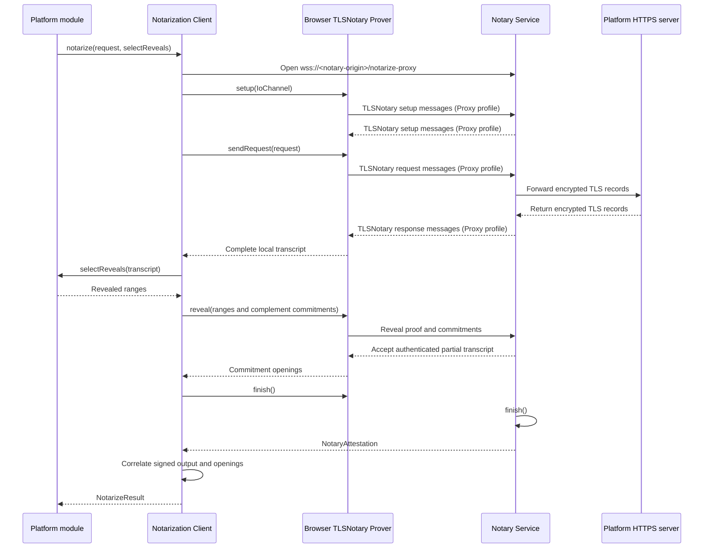

# `@libid/ceremony` notarization architecture

This document defines the browser-side `prover/notarization` module: how it
runs a TLSNotary session, applies platform-selected transcript disclosures, and
returns a byte-exact attestation plus private commitment openings. The enclosing
pipeline is defined in [PROVER.md](PROVER.md), browser placement in
[CCDP.md](CCDP.md), and bridge inputs in
[OAUTH_BRIDGE.md](OAUTH_BRIDGE.md). Exact
proof semantics remain normative in the
[common ceremony rules](../../../specs/ceremony-common.md) and
[identity-platform ceremonies](../../../specs/platform-ceremonies.md).

## Boundary and rationale

The module is one internal TypeScript adapter over the pinned upstream
TLSNotary JavaScript/WASM client. Browser notarization uses the launch Proxy
profile: the Notary Service opens the pinned platform connection. The adapter
owns the browser transport, disclosure call, reclaimed-channel attestation
delivery, and output correlation. Each closed platform-version prover leaf owns
its exact HTTP request, response parser, and revealed transcript ranges.

Keeping platform logic in TypeScript avoids rebuilding a custom WASM facade
for every profile change without creating a security boundary: the prover
origin loads both TypeScript and WASM. The adapter still isolates upstream API
churn from platform code. It ships inside the selected versioned prover root; the
separately fetched notarization client is the pinned `tlsn_wasm.js` module and
its deterministic sibling `tlsn_wasm_bg.wasm`.

The enclosing prover supplies the deployment's common `notaryAddress` when the
module starts. Applications, ceremony inputs, OAuth responses, and CCDP
messages cannot replace that address or select a provider request, disclosure
layout, or Notary Service behavior.

## Internal contract

```ts
interface ByteRange {
  start: number // inclusive
  end: number   // exclusive
}

interface Reveals {
  sent: readonly ByteRange[]
  received: readonly ByteRange[]
}

interface ExactHttpRequest {
  url: string
  method: 'GET' | 'POST'
  headers: Readonly<Record<string, Uint8Array>>
  body: Uint8Array
}

interface Transcript {
  sent: Uint8Array
  received: Uint8Array
}

const MAX_SENT_DATA = 4 * 1024
const MAX_RECEIVED_DATA = 32 * 1024

interface CommitmentOpening {
  direction: 'sent' | 'received'
  start: number
  end: number
  blinder: Uint8Array
}

interface NotaryAttestation {
  attestedData: Uint8Array
  signature: Uint8Array // exactly 65 bytes
}

interface NotarizeResult {
  transcript: Transcript
  openings: readonly CommitmentOpening[]
  attestation: NotaryAttestation
}

declare function notarize(
  request: ExactHttpRequest,
  selectReveals: (transcript: Transcript) => Reveals,
): Promise<NotarizeResult>
```

This API is internal to the prover. `CommitmentOpening.blinder` is exactly 16
bytes. Header order is not semantic: selection operates on the actual
serialized transcript, while the Platform Verifier checks request framing and
profile-significant fields without requiring relative header position. Request
body bytes remain exact because a platform's form grammar may depend on them.
The adapter applies the code-owned `MAX_SENT_DATA = 4 KiB` and
`MAX_RECEIVED_DATA = 32 KiB` ceilings to all three calls; no caller,
server response, or CCDP input can change them. Exceeding either ceiling fails
the notarization instead of truncating the transcript.

The transcript exists only long enough for the platform module to parse its
private response and build its witness. It never crosses CCDP or the public
ceremony API. The adapter correlates the raw TLSNotary commitments with the
signed attestation, discards duplicate commitment hashes, and returns only the
range and private blinder for each opening.

## Canonical attested-data decoder

`prover/notarization` owns one read-only decoder for the signed attested-data
bytes. It does not expose an encoder and never reserializes a received record.
The decoder returns this internal view:

```ts
const MAX_ATTESTED_DATA_BYTES = 2 * 1024 * 1024

interface DecodedRevealedRange {
  start: number
  bytes: Uint8Array
}

interface DecodedRangeCommitment {
  start: number
  end: number
  commitment: Uint8Array // exactly 32 bytes
}

interface DecodedDirection {
  revealed: readonly DecodedRevealedRange[]
  commitments: readonly DecodedRangeCommitment[]
}

interface DecodedAttestedData {
  authorityId: Uint8Array // exactly 32 bytes
  createdAt: bigint
  sentTranscriptLength: number
  receivedTranscriptLength: number
  sent: DecodedDirection
  received: DecodedDirection
}

declare function decodeAttestedData(bytes: Uint8Array): DecodedAttestedData
```

The wire is bincode 2.0.1 with fixed-width big-endian integers and fields in
the order shown below. Collection and byte-string lengths are unsigned 64-bit
integers; transcript offsets and lengths are unsigned 32-bit integers.

```text
AttestedData =
  bytes32 authorityId
  u64     createdAt
  u32     sentTranscriptLength
  u32     receivedTranscriptLength
  Direction sent
  Direction received

Direction =
  u64 revealedCount
  RevealedRange[revealedCount]
  u64 commitmentCount
  RangeCommitment[commitmentCount]

RevealedRange = u32 start || u64 byteLength || bytes[byteLength]
RangeCommitment = u32 start || u32 end || bytes32 commitment
```

Before allocating or converting to a JavaScript `number`, the decoder rejects
an input over `MAX_ATTESTED_DATA_BYTES` and bounds every count and length against
the remaining input and signed transcript length. It rejects truncation,
trailing bytes, overflow, empty or unordered ranges, overlaps, out-of-bounds
ranges, malformed commitments, and values that cannot be represented exactly.
`createdAt` stays a `bigint`; every accepted offset and transcript length fits
exactly in a JavaScript `number`.

The decoder is pinned to the complete cross-language fixture from the rebased
[`libid-rs` encoder](https://github.com/libid-org/libid-rs/blob/239a4bb426ac72591fe30006f22660e164a98d96/crates/libid-ceremony/src/attestation.rs).
The implementation test copies those exact bytes and checks this `keccak256`:

```text
48162f05bdb27b19b3544bf2aae608745861bf357bb31e07f536b6fb50e95936
```

The decoded values and every malformed variant are asserted by the
[conformance plan](TEST_PLAN.md).

## Session lifecycle

### Network transport

`notaryAddress` is the deployment's canonical HTTPS origin. The adapter changes
only its scheme from `https` to `wss` and opens the exact
`/notarize-proxy` path with no query. For the testnet deployment this is:

```text
https://notary.testnet.lib.id
    -> wss://notary.testnet.lib.id/notarize-proxy
```

The same WebSocket carries the complete TLSNotary Proxy byte stream and the
final attestation. This flow performs no `POST /session`, carries no
`sessionId`, and polls no HTTP endpoint; the live channel is the correlation.
Redirects, credentials, query parameters, fragments, and any path other than
`/notarize-proxy` are rejected.

After both TLSNotary drivers finish, the Notary Service writes one outer frame:
a four-byte unsigned big-endian length followed by that many UTF-8 JSON bytes.
The JSON object contains exactly `attested_data` and `notary_signature`, each an
array of integer bytes in `[0, 255]`. The frame is at most 10 MiB;
`attested_data` remains subject to `MAX_ATTESTED_DATA_BYTES`, and
`notary_signature` is exactly 65 bytes. The adapter maps those fields to the
internal camel-case `NotaryAttestation` without changing either byte string,
then requires end-of-stream. A malformed length or UTF-8/JSON value, unknown or
duplicate field, trailing byte, second frame, or missing close fails.

### Implementation status

This is the target launch transport, not the contract of the currently deployed
notary. The implementation is assembled from three in-flight pieces:

1. [notary #3](https://github.com/libid-org/notary/pull/3) produces the canonical
   ceremony attestation and removes the single-platform authority pin;
2. [notary #4](https://github.com/libid-org/notary/pull/4) moves the browser
   bundle to the required TLSNotary release; and
3. [TLSNotary #1178](https://github.com/tlsnotary/tlsn/pull/1178) returns the
   completed session channel to the caller.

The remaining integration replaces the current session creation and
attestation polling with the final frame below on the reclaimed WebSocket, then
qualifies X token, X identity, and GitHub identity against the testnet service.
Until that integration lands, the deployed service is useful for implementation
work but does not satisfy this browser transport contract.



`finish()` releases each TLSNotary driver from its side of the original
JavaScript `IoChannel`. Once its verifier finishes, the Notary Service writes
the one length-prefixed `NotaryAttestation` on that same channel and closes it;
it reads no application-level request. The verified session already supplies
all signed data, so no ceremony ID, request ID, platform, or token/identity tag
crosses this boundary.

The adapter is also indifferent to application sequencing. Platform code
retains which call produced each result; within one X ceremony, token
notarization completes before identity notarization starts because the latter's
request requires the bearer. Independent ceremonies may notarize concurrently
on separate channels. The final Platform Verifier checks each attestation's
exact authority, method, path, framing, and proof position rather than trusting
browser execution order.

## Disclosure and commitments

The Notary Service does not choose disclosures. After the platform responds,
the platform module selects ascending, non-overlapping revealed ranges from its
local transcript. One adapter helper validates those ranges and commits their
complement over the complete signed transcript length. Every byte is therefore
revealed or committed by construction, with no separately maintained committed
range list that could leave a gap or overlap.

Every committed range uses SHA-256 and a fresh 16-byte blinder. For a bearer:

```text
SHA256(bearer || blinder)
```

The Notary Service learns the range, its blinded commitment, and any revealed
framing, but neither the bearer nor blinder. It signs the verifier-produced
attested data containing the transcript lengths, reveals, commitments,
authority, and evidence time. It receives no caller-supplied identity, handle,
OAuth client, chain, transaction, or extracted bearer.

For X and GitHub, `bearer-link` later proves that one private bearer opens the
token-exchange and identity-request commitments under their independent
blinders. The Platform Verifier reconstructs both public commitments from the
verified attestations; the delivered proof does not copy them.

## Platform call sites

The adapter has exactly three browser call sites at launch:

| Platform operation | Request | Selected disclosure |
|---|---|---|
| X token exchange | `POST /2/oauth2/token` | reveal the profile request and access-token framing; commit the returned bearer |
| X identity request | `GET /2/users/me` | reveal request framing except the bearer and the response's `id` and `username` framing |
| GitHub identity request | `GET /user` | reveal request framing except the bearer and the response's `id` and `login` framing |

X and GitHub reuse the request-side bearer selector. Their response selectors
differ only in platform JSON grammar. X token exchange differs because its
bearer occurs in the response. Exact fields, bounds, and layouts belong to the
selected normative platform version; no caller-defined profile or plugin
exists.

GitHub's confidential token exchange is server-side and does not use this
browser module. Its HTTP contract is defined in
[OAUTH_BRIDGE.md](OAUTH_BRIDGE.md#github-token-endpoint), while the GitHub platform module
owns browser-side response validation and subsequent `/user` orchestration.

## Attestation handoff

The adapter preserves `attestedData` and its signature byte-for-byte. It decodes
the required read-only view for bounds and commitment correlation but never
normalizes or re-encodes the signed bytes. Platform proofs place the unchanged
token and identity attestations in their named fields alongside the
`bearer-link` proof. Transcripts, access tokens, blinders, raw TLSNotary objects,
and locally extracted identity fields do not enter the platform proof.

Malformed signed data, range ordering, coverage, commitment correlation,
same-channel framing, cancellation, or a partial result rejects the call.
Authoritative signature and platform-profile acceptance remains the Ledger Verifier's
responsibility.

[TEST_PLAN.md](TEST_PLAN.md) owns the executable notarization requirements.
