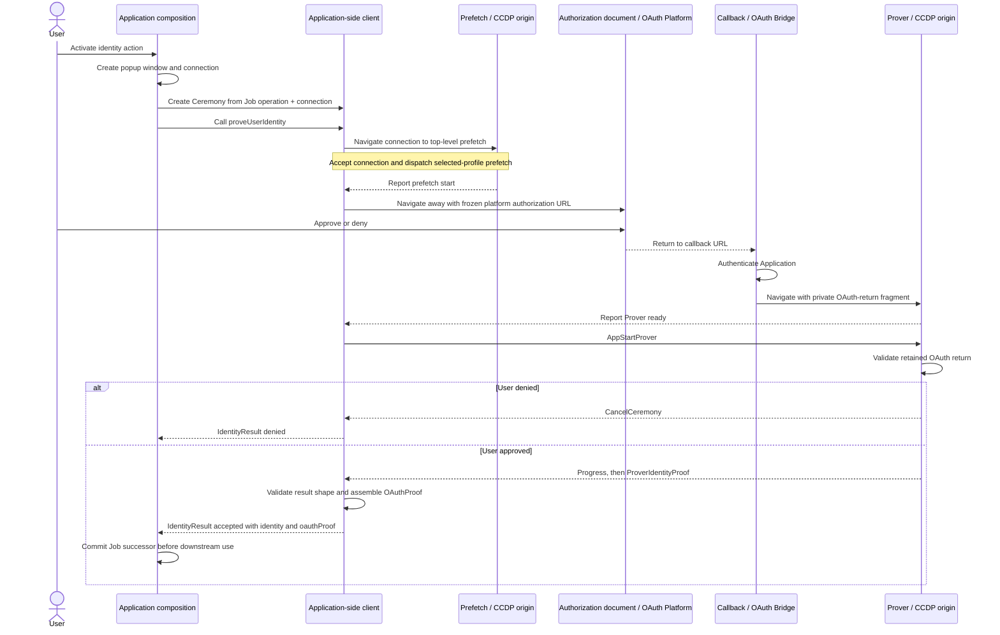

# `@libid/ceremony` architecture

`@libid/ceremony` runs an identity-proof ceremony in the browser. An
application supplies an operation to authorize; the package obtains and proves
platform identity evidence, then returns an `IdentityResult` with separate
`identity` and `oauthProof` fields. Those identity details are not
authoritative until ledger verification.

This document defines the package boundary, public application API and
configuration, and result lifecycle. The package's browser protocol is defined
in [CCDP.md](protocol.md), and its static distribution contract in
[CCDP_DISTRIBUTION.md](distribution.md); popup lifecycle and communication
are supplied by
[`@libid/popup`](../../popup/README.md). Proof-generation internals are defined in
[PROVING.md](proving.md). Browser TLSNotary sessions and
signed-attestation handoff are defined in [NOTARIZATION.md](notarization.md).
The OAuth bridge's routes, deployment inputs, and callback response policy are
defined in [OAUTH_BRIDGE.md](oauth-bridge.md). The package's measurement and
export boundary is defined in [METRICS.md](metrics.md). This document and the
linked component documents define implementation architecture; CCDP defines
the browser protocol.

The normative libID specification owns the proof statement and authorization
encoding. See the
[common ceremony rules](../../../../specs/ceremony-common.md) and
[identity-platform ceremonies](../../../../specs/platform-ceremonies.md)
for their exact content. Together, this document, CCDP, and the OAuth bridge
contract
and their linked proof-generation and notarization documents otherwise stand
alone; application job storage and all post-ceremony effects are outside their
scope.
Package acceptance requirements are indexed by [TEST_PLAN.md](test-plan.md).

The specification's **Ceremony Client** role maps to this package's closed
client, platform implementation, and CCDP [resources](documents.md#documents-and-routes)
as a whole. Its
**Ceremony Popup** is the auxiliary browser window containing the CCDP
[documents](documents.md#documents-and-routes). `@libid/popup` owns the window and
connection but is not a ceremony-protocol participant.

## System boundary

One ceremony returns identity and proof for an application-owned operation:



The ceremony owns authorization construction, OAuth, callback handling,
isolated proving, sanitized progress, proof delivery, and prover-side evidence
interpretation. It does not own application jobs, wallet keys or policy,
Registry calls, connectors, transaction submission, finality, React UI, or a
server status service.

External-wallet and native libID wallet compositions use the same ceremony.
They encode their operation into opaque `transactionData` before the ceremony
and combine those retained inputs with the accepted `IdentityResult` for
downstream submission. A native wallet
may run key preparation before the ceremony and wallet confirmation afterward;
those sessions do not extend the browser message protocol.

The application origin owns the durable operation record, called the Job. One
application-scoped `CCDPClient` creates independent `Ceremony` instances.
Each instance owns its in-memory state and handlers on the popup connection
supplied by the composition. Apart from the transient private OAuth-return
fragment handoff, credentials, witnesses, and the generated proof remain in
memory; the package creates no credential store. The
application origin is an authority boundary: it supplies the operation domain
and transaction data, so compromising it already permits authorizing a
different operation. Raw OAuth returns stay in the popup documents and are not
sent to the Application. This narrows transient credential exposure, not
operation authority; the delivered proof still contains the evidence required
by its platform profile. If the application does not assemble and commit the
delivered result before the live connection is lost,
the ceremony restarts with fresh OAuth. Downstream application work may remain
resumable independently.

Prover is one logical CCDP participant. Its [isolation response
contract](distribution.md#prover-isolation) and `@libid/popup` own any
browser-dependent document replacement; the ceremony client and CCDP handlers
do not branch on it.

## Ceremony Cross-Document Protocol

[CCDP.md](protocol.md) defines the protocol between the Application, Callback,
and isolated Prover, including each participant's local lifecycle and
UI. [`@libid/popup`](../../popup/README.md) carries it. This document owns only the
package and public client contracts around them.

## Package composition

Launch publishes one `@libid/ceremony` package:

```text
@libid/ceremony
├── ccdp
│   ├── index         pure message codecs and protocol version
│   ├── client        CCDPClient, CeremonyConfig and application-side orchestration
│   └── documents
│       ├── callback  OAuth return capture and navigation
│       ├── prefetch  Prefetch page and root Worker entrypoint
│       ├── prover    isolated Prover page
│       └── ui        shared document UI
├── assets            declarations, URL resolution, cache and root Worker delivery
├── barretenberg      Noir/bb engine and barretenberg.assets.ts
│   └── circuits      oidc_google and bearer_link adapters and *.assets.ts
├── notary            TLSNotary sessions, transcripts, attestations and notary.assets.ts
└── platforms
    ├── index         client-safe platform/version catalog and result types
    ├── platforms.assets.ts  platform/version resource catalog
    ├── context       shared ProverContext for platform orchestration
    ├── authorization shared digest and PKCE helpers
    ├── google/<version>/{google.assets,url,types,prover}
    ├── x/<version>/{x.assets,url,types,prover}
    └── github/<version>/{github.assets,url,types,prover}
```

The public `@libid/ceremony/{callback,prefetch,prover}` subpaths resolve directly
to `ccdp/documents`. The Prover document imports platform pipelines and shared
proving code from the top-level `platforms`, `barretenberg`, and `notary` modules.

`ccdp/index` is the pure protocol leaf imported by client, callback,
prefetch, and prover. It performs no platform dispatch, browser work, storage,
network, authorization construction, or cryptographic proof verification.
Those entrypoints use the caller-supplied `@libid/popup` connection without
owning its carriers or continuity machinery.

### CCDP codecs

The implementation represents each CCDP record with one TypeScript interface
and a same-named decoder companion. A shared assertion performs the plain-record,
exact-field-set, and discriminator checks; each companion validates its own
field types and bounds. Decoding returns the received object without coercion,
normalization, defaults, field removal, or replacement allocation.

```ts
const ProverIdentityProof = {
  type: 'prover-identity-proof',

  decode(value: unknown): ProverIdentityProof {
    assertMessage(value, this.type, ['identity', 'proof'])
    assertIdentity(value.identity)
    return value
  },
} as const satisfies MessageType<ProverIdentityProof>
```

Each endpoint registers only its permitted inbound companions with its popup
connection. The connection dispatches by the companion discriminator, invokes
that decoder once, and gives the handler the narrowed record. Direction and
ceremony state remain handler checks. The platform proof stays opaque at this
layer and is validated by the selected platform/version module. The shared
identity record is structurally decoded here; the selected module then checks
its platform and profile-specific encodings. There is no
aggregate runtime decoder, global registration, import-time registration, or
plugin API; any aggregate TypeScript union exists only for compile-time
connection typing.

`platforms/authorization`
provides the shared Authorization Digest and PKCE helpers, but each
platform/version slice owns whether and how those helpers participate in its
ceremony. Its `url` leaf owns authorization-request construction and final
assembly and re-exports its
`types` leaf; `types` owns the proof type and side-effect-free runtime validator;
and `prover` owns OAuth-return parsing, progress, witness construction, and
proof generation.
`platforms/index` imports only the client-safe `url` leaves, derives the
catalog and public result types, and is re-exported by the package root and
client API. Prover leaves are internal imports of the prover entrypoint and
never enter the client catalog.
Individual platform leaves never import the aggregator. `callback`,
`prefetch`, and `prover` are build entrypoints, not separately versioned
packages. The CCDP Distribution serves Callback as a cross-origin-loadable
module, embeds Prefetch and Prover entry code directly into their
versioned documents, and serves the Prefetch Service Worker at CCDP's versioned
worker path; internal bundle filenames are deployment details. The Prefetch entrypoint
runs in Window and Service Worker contexts: its
Window branch dispatches the selected asset profile, while its Service Worker
branch composes popup continuity with ceremony-owned asset single flights and
cache. Both Prover responses embed the same entrypoint, which configures
`PopupConnection.accept` with the Distribution's isolation fallback URL.
The popup package owns isolation selection and carrier continuity. Prover
registers its CCDP handlers, awaits connection readiness, and only then emits
`ProverReady` and accepts proof input. It joins the cached flights in the active
top-level document. The OAuth-bridge Callback installs no Worker.
`notary` is an internal leaf shared by
the X and GitHub prover leaves, not another package entrypoint or artifact.

Shared integrations declare their resources in lightweight `*.assets.ts` modules,
separate from execution code. They use the package's internal `assets` helper:
`archive().member()` selects build-resolved archive files, `external()` declares
runtime HTTPS requests, and `resolve()` returns either asset's runtime URL.
Shared `assets.headers` groups supply declared response policy, not generated
representation metadata. Downloading, extraction, and wildcard resolution
belong to the build and never enter browser bundles.
Each platform/version `assets` leaf composes
shared declarations with its circuit and other dependencies; it copies no
shared URL, mode, or request parameters. `platforms/platforms.assets` collects these sets
by platform/version for Prefetch and the artifact build, without importing
`platforms/index`, platform implementations, or proving/notarization runtimes.
Execution modules import their asset declarations, never the reverse. This is
an explicit dependency boundary, not a reliance on tree-shaking. The build
checks that the asset catalog covers exactly the supported platform/version
pairs and resolves the same declarations for prefetch and execution; the
[Distribution's source declarations](distribution.md#source-declarations)
define the asset API, header ownership, and profile collection.

OAuth Bridge implementations are outside the package. The GitHub version's
prover leaf implements only the bridge-contract browser request/response codecs
and validation; the bridge implements the required confidential endpoint.

The dependency direction is closed:

```text
client, native wallet ───> platforms/index
                                │
                                ▼
                 platforms/<platform>/<version>/{url,types}

client ───> platforms/authorization

prover ───> platforms/<platform>/<version>/prover ───> types
                              │
                              └──> platforms/authorization

platforms/{x,github}/<version>/{types,prover} ───> notary

prefetch, artifact build ───> platforms/platforms.assets ───> platforms/<platform>/<version>/*.assets
platforms/<platform>/<version>/prover ───────────> platforms/<platform>/<version>/*.assets
platforms/<platform>/<version>/*.assets ───> shared integrations' assets modules
owner-defined asset modules ───> assets (declarations and URL resolution only)

client, callback, prefetch, prover, platforms/index ───> ccdp
client, callback, prefetch, prover ───> @libid/popup
client ───> @libid/ledger
wallet-client ─────────> client + ceremony + wallet/protocol + @libid/popup
```

`ceremony` never imports the client job store or either wallet composition.
The compositions adapt cancellation, progress projection, and the final
result commit around `proveUserIdentity()`. No generic plugin, caller-selected platform
module, validator, or finalizer exists.

The package-facing API surface is:

| Export or entrypoint | Contract |
|---|---|
| `@libid/ceremony` | catalog-derived `PlatformId`, `PlatformCeremonyVersion`, `supportedPlatforms`, `ProofByPlatformVersion`, `OAuthProof`, `Identity`, and `IdentityResult` |
| `@libid/ceremony/ccdp` | internal CCDP record types, per-record decoder companions, protocol version, and direction/order checks; no application export |
| `@libid/ceremony/ccdp/client` | `CeremonyConfig` fetch/validation, application-scoped `CCDPClient`, stateful `Ceremony` orchestration, and public catalog/result re-exports |
| `@libid/ceremony/callback` | [browser entrypoint](documents.md#callback-get-redirecturi) bundled into the complete Callback artifact; the OAuth Bridge retrieves it from the CCDP Distribution, inserts deployment data, and serves it without a separate browser script fetch |
| `@libid/ceremony/prefetch` | dual-context browser entrypoint embedded by the versioned Prefetch document and served at the versioned Worker path |
| `@libid/ceremony/prover` | [browser entrypoint](documents.md#prover-get-prover) embedded by the versioned isolated Prover document |

The API below and the [CCDP records](protocol.md#messages)
are the launch surface.
Implementation-private helpers may change without changing authority or wire
behavior.

## Application integration

See [Client API and lifecycle](client.md).

## Proof-generation subsystem

[PROVING.md](proving.md) defines pipelines, asset use, workers, caching, and
proof delivery; [CCDP_DISTRIBUTION.md](distribution.md) defines asset deployment. After
`ProverReady`, the client sends one `AppStartProver`, validates the returned
identity and platform proof's structure, and assembles `IdentityResult`.

## Progress, cancellation, and recovery

See [Client API and lifecycle](client.md).

## Versioning and compatibility

`PlatformCeremonyVersion` versions one platform's authorization digest, OAuth
grammar, progress-code lifecycle, circuit, witness, proof pieces, and final
`OAuthProof` assembly. `PlatformConfig.ceremonyVersions` advertises what the
deployment can execute; the client selects the numerically greatest member also
present in its closed local catalog, independent of list or object-key order,
and every live ceremony pins it. Chain-specific contract and
Registry versions are outside this boundary and independently decide which
ceremony outputs they accept.

Changing a status label or tuning presentation weights without changing the
closed progress codes or their causal lifecycle is UI-compatible and does not
increment `PlatformCeremonyVersion` or `CCDPVersion`.

`platforms/authorization` is code reuse, not a second compatibility boundary.
Each platform-version slice owns the helper inputs, outputs, and whether it
uses the shared digest or PKCE construction at all. Changing those semantics
therefore changes that platform's `PlatformCeremonyVersion`; it does not version
the helper independently or force another platform to adopt the change.

The launch protocol intentionally does not split digest, OAuth, proof, and
output-shape versions. A proof change normally changes the assembled
`OAuthProof`; a rare compatible internal change does not justify another
public compatibility axis. One package release may retain older platform-version
validators during its compatibility window.

[`CCDPVersion`](documents.md#paths-and-versioning) independently versions CCDP
[resources](documents.md#documents-and-routes), navigation, fragments, and browser
messages.
CCDP paths and OAuth `state` select it before protocol code runs;
messages do not repeat it. The OAuth bridge API
namespace remains independent. The popup package's
[`ConnectionVersion`](../../popup/docs/connection.md) independently versions private
connection controls. Local Job schema versioning
remains owned by the client store, while immutable asset revisioning remains a
[CCDP Distribution](distribution.md#proving-assets) release concern. A Job which has
already committed `IdentityResult` with its operation inputs has left the ceremony and remains usable under its
composition's own compatibility rules.
