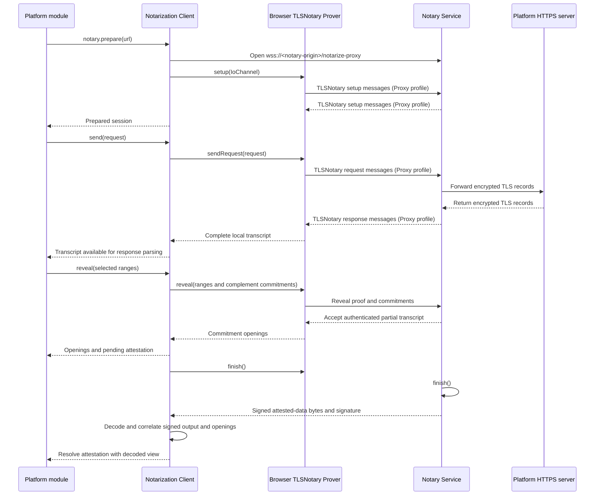

# `@libid/ceremony` notarization architecture

Local development exception: references to HTTPS Bridge, CCDP, application and
notary URLs below also admit canonical HTTP URLs on exactly `localhost` or
`127.0.0.1`. A local HTTP notary uses WS at the same authority. This exception does
not apply to OAuth provider requests or external proving assets. COOP/COEP, origin
admission, callback privacy and all other validation remain required. LAN addresses,
lookalike domains and noncanonical spellings are not admitted.

This document defines the browser-side `prover/notarization` module: how it
runs a TLSNotary session, applies platform-selected transcript disclosures, and
returns a byte-exact attestation with its decoded view plus private commitment
openings. The enclosing pipeline is defined in [PROVING.md](proving.md), browser placement in
[CCDP.md](protocol.md), asset serving in [CCDP_DISTRIBUTION.md](distribution.md#proving-assets),
and GitHub's confidential exchange in
[OAUTH_BRIDGE.md](oauth-bridge.md#github-token-endpoint). Exact proof semantics
remain normative in the
[common ceremony rules](../../../../specs/ceremony-common.md) and
[identity-platform ceremonies](../../../../specs/platform-ceremonies.md).

## Boundary and rationale

The module is one internal TypeScript adapter over the pinned upstream
TLSNotary JavaScript/WASM client. Browser notarization uses the launch Proxy
profile: the Notary Service opens the pinned platform connection. The adapter
owns the browser transport, disclosure call, reclaimed-channel attestation
delivery, and output correlation. Each closed platform-version prover leaf owns
its exact HTTP request, response parser, and revealed transcript ranges.

Keeping platform logic in TypeScript avoids rebuilding a custom WASM facade
for every profile change without creating a security boundary: the prover
origin loads both TypeScript and WASM. The adapter still isolates upstream API
churn from platform code. It ships inside the selected versioned prover root; the
separately fetched notarization client is the pinned `tlsn_wasm.js` module and
its deterministic sibling `tlsn_wasm_bg.wasm`.

### Notary address

The adapter receives the canonical HTTPS `notaryAddress` read from the ledger and frozen
by [CeremonyClient](client.md#notary-selection), through `AppStartProver`.
It owns no profile defaults, ledger classification, or environment override.
X uses that address for both browser sessions. GitHub passes it unchanged in
its Bridge token request and uses it locally for identity notarization. Neither
Prover nor Bridge remaps the address, and failure never selects a different
notary. Google supplies null and never invokes this adapter.

The address is only network routing, not a caller-selected platform request,
disclosure layout, or Notary Service behavior. Ledger Verifier governance
independently decides which notary signatures are authoritative. No browser
signature check or notary-key input is introduced by this selection. Asset
declarations, prefetch, and proof formats do not depend on the address.

## Internal contract

```ts
interface ByteRange {
  start: number // inclusive
  end: number   // exclusive
}

interface Reveals {
  sent: readonly ByteRange[]
  received: readonly ByteRange[]
}

interface ExactHttpRequest {
  url: string
  method: 'GET' | 'POST'
  headers: Readonly<Record<string, Uint8Array>>
  body: Uint8Array
}

interface Transcript {
  sent: Uint8Array
  received: Uint8Array
}

const MAX_SENT_DATA = 4 * 1024
const MAX_RECEIVED_DATA = 32 * 1024

interface CommitmentOpening {
  direction: 'sent' | 'received'
  start: number
  end: number
  blinder: Uint8Array
}

interface NotaryAttestation {
  attestedData: Uint8Array
  signature: Uint8Array // exactly 65 bytes
  decoded: DecodedAttestedData
}

interface RevealResult {
  openings: readonly CommitmentOpening[]
  attestation: Promise<NotaryAttestation>
}

interface NotarizationSession {
  send(request: ExactHttpRequest): Promise<Transcript>
  reveal(reveals: Reveals): Promise<RevealResult>
}

declare class Notarization {
  readonly signal: AbortSignal
  constructor(notaryAddress: string, signal: AbortSignal)
  prepare(url: string): Promise<NotarizationSession>
}
```

The platform leaf supplies its code-owned canonical HTTPS request URL and the
ceremony's resolved notary address before preparation. The latter is a canonical
HTTPS origin, distinct from the platform target; all sessions reuse it unchanged.
The request URL contains no credentials or fragment. The adapter derives the
TLS server name and port from it before constructing the TLSNotary prover and
performing setup; it neither accepts a separate hostname nor follows redirects.
`send` requires the exact prepared URL, while headers and body may wait for the
bearer. Thus independent setup needs no credential, but has a fixed TLS target.
Each session accepts one `send`, followed by one `reveal`.
`send` exposes the complete local transcript before reveal/finalization;
`reveal` exposes the private commitment openings as soon as available, while its
`attestation` promise covers final channel retrieval, decoding, and correlation.
Platform code selects reveals from that session's transcript. This staged API
keeps independent setup, token parsing, and witness construction off the final
attestation critical path; it is not a generic session/job framework.

Early transcript and opening values are provisional. The adapter retains what
it needs to correlate them against the final signed bytes before resolving
`attestation`. The pipeline observes failures immediately, tears down sibling
work on failure/cancellation, and delivers nothing until all final attestation
promises succeed. The supplied signal covers preparation and every later stage,
including an idle prepared session. An already-aborted signal opens nothing;
later abort rejects pending operations, closes the socket, releases session-owned
runtime and private buffers, and prevents later sends. Successful sessions release
their own prover and message channel; the shared WASM worker remains alive until
the ceremony aborts its controller in `finally`. Any session failure aborts all
sessions in that runtime. Cleanup removes the session abort listener. The platform
pipeline aborts its shared controller on cancellation, sibling failure, or
abandonment in `finally`; no separate session disposal API is needed.

Session operations and openings are internal to the prover; `NotaryAttestation`
and its decoded view are also returned in the public platform proof.
`CommitmentOpening.blinder` is exactly 16 bytes. Header order is not semantic:
selection operates on the actual
serialized transcript, while the Platform Verifier checks request framing and
profile-significant fields without requiring relative header position. Request
body bytes remain exact because a platform's form grammar may depend on them.
The adapter applies the code-owned `MAX_SENT_DATA = 4 KiB` and
`MAX_RECEIVED_DATA = 32 KiB` ceilings to all three calls; no caller,
server response, or CCDP input can change them. Exceeding either ceiling fails
the notarization instead of truncating the transcript.

These are adapter-enforced transcript acceptance bounds, not TLSNotary Proxy
setup parameters. The pinned Proxy implementation does not enforce the SDK's
`max_sent_data` or `max_recv_data` options. The adapter checks actual sent and
received transcript lengths before resolving `send`, exposing them to platform
parsing, or permitting reveal. A post-receive length check bounds acceptance,
not memory or network consumption during reception; any receive-time resource
cap needs separate enforcement.

The transcript exists only long enough for the platform module to parse its
private response and build its witness. It never crosses CCDP or the public
ceremony API. The adapter correlates the raw TLSNotary commitments with the
signed attestation before final completion, discards duplicate commitment hashes,
and exposes only the range and private blinder for each opening.

## Canonical attested-data decoder

`prover/notarization` owns one read-only decoder for the signed attested-data
bytes. It does not expose an encoder and never reserializes a received record.
The decoder returns this view, attached as `NotaryAttestation.decoded` and
exposed through the public platform proof. Its types are client-safe; the
decoder implementation stays in the Prover:

```ts
const MAX_ATTESTED_DATA_BYTES = 2 * 1024 * 1024

interface DecodedRevealedRange {
  start: number
  bytes: Uint8Array
}

interface DecodedRangeCommitment {
  start: number
  end: number
  commitment: Uint8Array // exactly 32 bytes
}

interface DecodedDirection {
  revealed: readonly DecodedRevealedRange[]
  commitments: readonly DecodedRangeCommitment[]
}

interface DecodedAttestedData {
  authorityId: Uint8Array // exactly 32 bytes
  createdAt: string // canonical unsigned decimal u64, signed Unix seconds
  sentTranscriptLength: number
  receivedTranscriptLength: number
  sent: DecodedDirection
  received: DecodedDirection
}

declare function decodeAttestedData(bytes: Uint8Array): DecodedAttestedData
```

The wire is bincode 2.0.1 with fixed-width big-endian integers and fields in
the order shown below. Collection and byte-string lengths are unsigned 64-bit
integers; transcript offsets and lengths are unsigned 32-bit integers.

```text
AttestedData =
  bytes32 authorityId
  u64     createdAt
  u32     sentTranscriptLength
  u32     receivedTranscriptLength
  Direction sent
  Direction received

Direction =
  u64 revealedCount
  RevealedRange[revealedCount]
  u64 commitmentCount
  RangeCommitment[commitmentCount]

RevealedRange = u32 start || u64 byteLength || bytes[byteLength]
RangeCommitment = u32 start || u32 end || bytes32 commitment
```

Before allocating or converting to a JavaScript `number`, the decoder rejects
an input over `MAX_ATTESTED_DATA_BYTES` and bounds every count and length against
the remaining input and signed transcript length. It rejects truncation,
trailing bytes, overflow, empty or unordered ranges, overlaps, out-of-bounds
ranges, malformed commitments, and values that cannot be represented exactly.
`createdAt` is decoded losslessly and exposed as canonical unsigned decimal
text (`0` or a nonzero digit followed by digits, no leading zeroes), bounded by
`18446744073709551615`. This preserves the full u64 range without a `bigint`
transport requirement. Every accepted offset and transcript length fits exactly
in a JavaScript `number`.

`decoded` contains only data present in the original signed record, not the
private transcript, bearer, or commitment openings. It is convenient for
inspection and UI, not a second signed representation. The Client checks its
shape and bounds but does not re-decode `attestedData` or authenticate the view.
Ledger serialization omits `decoded` and preserves the original signed bytes;
the Ledger Verifier derives all authoritative values from those bytes. Decoded
reveals remain evidence-bearing data and must not enter progress or metrics.

The decoder is pinned to the complete cross-language fixture from the rebased
[`libid-rs` encoder](https://github.com/libid-org/libid-rs/blob/239a4bb426ac72591fe30006f22660e164a98d96/crates/libid-ceremony/src/attestation.rs).
The implementation test copies those exact bytes and checks this `keccak256`:

```text
48162f05bdb27b19b3544bf2aae608745861bf357bb31e07f536b6fb50e95936
```

The decoded values and every malformed variant are asserted by the
[conformance plan](test-plan.md).

## Session lifecycle

### Network transport

The adapter validates the already resolved [notary address](notarization.md#notary-address),
changes only its scheme from `https` to `wss`, and opens the exact
`/notarize-proxy` path with no query:

```text
https://notary.lib.id
    -> wss://notary.lib.id/notarize-proxy
https://testnet.notary.lib.id
    -> wss://testnet.notary.lib.id/notarize-proxy
```

The same WebSocket carries the complete TLSNotary Proxy byte stream and the
final attestation. This flow performs no `POST /session`, carries no
`sessionId`, and polls no HTTP endpoint; the live channel is the correlation.
Redirects, credentials, query parameters, fragments, and any path other than
`/notarize-proxy` are rejected.

After both TLSNotary drivers finish, the Notary Service writes one outer frame:
a four-byte unsigned big-endian length followed by that many UTF-8 JSON bytes.
The JSON object contains exactly `attested_data` and `notary_signature`, each an
array of integer bytes in `[0, 255]`. The frame is at most 10 MiB;
`attested_data` remains subject to `MAX_ATTESTED_DATA_BYTES`, and
`notary_signature` is exactly 65 bytes. The adapter maps those fields to the
camel-case fields without changing either byte string, requires end-of-stream,
then attaches the validated decoder result as `decoded`. The Notary Service's
wire record does not gain that field. A malformed length or UTF-8/JSON value,
unknown or duplicate field, trailing byte, second frame, or missing close fails.

### Integration qualification

The reported active PoC exercises direct WebSocket notarization and receives
the final attestation over that same reclaimed socket, without HTTP session
creation or polling. Related upstream work is tracked in:

1. [notary #3](https://github.com/libid-org/notary/pull/3) produces the canonical
   ceremony attestation and removes the single-platform authority pin;
2. [notary #4](https://github.com/libid-org/notary/pull/4) moves the browser
   bundle to the required TLSNotary release; and
3. [TLSNotary #1178](https://github.com/tlsnotary/tlsn/pull/1178) returns the
   completed session channel to the caller.

Qualify the selected server/client artifacts together for X token, X identity,
and GitHub identity against the framing below. The PoC result does not establish
that every deployed service or older release supports this transport.



`finish()` releases each TLSNotary driver from its side of the original
JavaScript `IoChannel`. Once its verifier finishes, the Notary Service writes
the one length-prefixed signed-data/signature record on that same channel and
closes it; it reads no application-level request. The verified session already supplies
all signed data, so no ceremony ID, request ID, platform, or token/identity tag
crosses this boundary.

The adapter is also indifferent to application sequencing. Platform code
retains which session produced each result. Within one X ceremony, both
sessions connect and perform setup concurrently; only sending the identity
request waits for the bearer parsed from the token transcript. Reveal and final
attestation work may overlap that request and proof generation. Independent
sessions and ceremonies use separate channels. The final Platform Verifier checks each attestation's
exact authority, method, path, framing, and proof position rather than trusting
browser execution order.

## Disclosure and commitments

The Notary Service does not choose disclosures. After the platform responds,
the platform module selects ascending, non-overlapping revealed ranges from its
local transcript. One adapter helper validates those ranges, merges adjacent
intervals to match TLSNotary's range-set serialization, and commits their
complement over the complete signed transcript length. Every byte is therefore
revealed or committed by construction, with no separately maintained committed
range list that could leave a gap or overlap.

Every committed range uses SHA-256 and a fresh 16-byte blinder. For a bearer:

```text
SHA256(bearer || blinder)
```

The Notary Service learns the range, its blinded commitment, and any revealed
framing, but neither the bearer nor blinder. It signs the verifier-produced
attested data containing the transcript lengths, reveals, commitments,
authority, and evidence time. It receives no caller-supplied identity, handle,
OAuth client, chain, transaction, or extracted bearer.

For X and GitHub, `bearer-link` later proves that one private bearer opens the
token-exchange and identity-request commitments under their independent
blinders. The Platform Verifier reconstructs both public commitments from the
verified attestations; they appear in `decoded` for inspection, not as separate
proof-input fields.

## Platform call sites

The adapter has exactly three browser call sites at launch:

| Platform operation | Request | Selected disclosure |
|---|---|---|
| X token exchange | `POST /2/oauth2/token` | reveal the profile request and access-token framing; commit the returned bearer |
| X identity request | `GET /2/users/me` | reveal request framing except the bearer and the response's `id` and `username` framing |
| GitHub identity request | `GET /user` | reveal request framing except the bearer and the response's `id` and `login` framing |

X and GitHub reuse the request-side bearer selector. Their response selectors
differ only in platform JSON grammar. X token exchange differs because its
bearer occurs in the response. Exact fields, bounds, and layouts belong to the
selected normative platform version; no caller-defined profile or plugin
exists.

GitHub's confidential token exchange is server-side and does not use this
browser module. Its HTTP contract is defined in
[OAUTH_BRIDGE.md](oauth-bridge.md#github-token-endpoint), while the GitHub platform module
owns browser-side response validation and subsequent `/user` orchestration.

## Attestation handoff

The adapter preserves `attestedData` and its signature byte-for-byte. It reuses
the decoded view needed for bounds and commitment correlation as `decoded`,
without another parse, normalization, or re-encoding. Platform proofs place
both attestations in their named fields alongside `bearerLinkProof` and the
platform-extracted `identity`. Private transcripts, access tokens, blinders,
and raw TLSNotary objects never enter the result. Exposing the complete signed
view requires no new reveals and creates no additional notary or ledger field.

Malformed signed data, range ordering, coverage, commitment correlation,
same-channel framing, cancellation, or a partial result rejects final completion
and invalidates any speculative witness or proof built from the early material.
Neither this adapter, the platform Prover, nor the Ceremony Client verifies
notary signatures locally. Exact signature length/encoding, canonical decoding,
request bindings, and commitment/opening correlation remain required at their
existing owners; they do not establish signature authenticity. A structurally
valid forgery can survive browser checks, so delivery and convenience views
remain unverified. The Ledger Verifier's trusted-notary signature and
platform-profile checks remain mandatory over the original signed bytes.

[TEST_PLAN.md](test-plan.md) owns the executable notarization requirements.

## Implementation guide

Shared TLSNotary adapter for X and GitHub: exact HTTP requests, bounded transcripts,
selective disclosures and correlation with canonical final attestations.

- [Platform pipelines](pipelines.md): token/identity overlap and delivery dependencies.
- [Qualification blockers](qualification.md#actual-blockers-and-unqualified-boundaries): matched service, timing and profile gaps.

[session.ts](../src/prover/notarization/session.ts) controls one ceremony-owned
[session.worker.ts](../src/prover/notarization/session.worker.ts). X creates one
`Notarization` instance for both requests, sharing WASM initialization and its
thread pool. Each request has a separate native message channel, TLSNotary prover,
socket, transcript and attestation. Each socket opens alongside shared WASM
initialization; TLS session setup waits for both and checks the socket is still
open. A failed connection or initialization reports failure without waiting for
the other branch and closes the socket; the owner aborts the shared worker and
sibling sessions. Setup remains concurrent; no state or runtime is shared across
ceremonies. The runtime exposes its combined abort signal for
concurrent dependent work, so even a failure after a session is prepared can
cancel a pending Bridge fetch. GitHub uses the same adapter for its one browser
identity request. Real shared-runtime concurrency and timing remain subject to
qualification; unit-level overlap does not establish WASM liveness.
[transport.ts](../src/prover/notarization/transport.ts) frames final output, [decode.ts](../src/prover/notarization/decode.ts) reads canonical
attested bytes, and [notarize.ts](../src/prover/notarization/notarize.ts) correlates transcripts and openings.
Original attestations and signatures are preserved; local signature verification is
outside the adapter's responsibility.

[Client](../src/client/ceremony.ts) snapshots the ledger's notary address before OAuth.
X uses it for both sessions; GitHub sends it unchanged to the Bridge and uses it
for the browser identity session. Prover performs no ledger lookup.

## Token layout alignment

The token layouts follow [spec PR #31 at ae33a29](https://github.com/libid-org/libid/blob/ae33a29e454198212215764c167eb10f624d926a/specs/platform-ceremonies.md),
REQ-PLAT-56A/B/C and §6.4. X reveals its entire request as one range. GitHub
admits one revealed prefix followed by one committed suffix covering the trailing
`&client_secret=…` field, matching the
[Rust layout builder](https://github.com/libid-org/libid-rs/blob/501f094bf10f776c2227ef345908f507a0c80fd0/crates/libid-transcript/src/ceremony.rs).
No hidden-header or per-field compatibility layout is accepted. Both paths
check the five permitted token headers in any order, reject duplicates and
non-CRLF/folded framing, and compare Content-Length with the complete body length,
including GitHub's signed committed suffix. Authority still comes from the
attested TLS server identity, not Host.

**Identity header alignment:** [spec PR #31 at 5bbd838](https://github.com/libid-org/libid/blob/5bbd838c81d4a47849104cf0f965ad985b2e5b98/specs/platform-ceremonies.md)
now explicitly permits additional identity-request headers for both X (§5.3)
and GitHub (§6.5). X still sends its four required headers. GitHub sends six,
including `X-GitHub-Api-Version: 2022-11-28` and a runtime-chosen `User-Agent`;
ceremony uses `navigator.userAgent` without adding a libID identifier. This
resolves the documented User-Agent mismatch. The Platform Verifier compares
the request line and Authorization line, while the runtime remains responsible
for sending the required headers.

Both browser selectors accept additional headers through one shared HTTP framing
parser. It retains required-header values and uniqueness, rejects malformed
framing, and discloses the complete request except exactly one bearer range.
Offsets count wire bytes, including when extra headers contain non-ASCII values. Token requests are unchanged: their five-header set
remains closed. Additional identity headers do not imply additional token headers.

Regression coverage is in [transcript tests](../src/prover/transcript.test.ts),
[GitHub admission](../src/platforms/github/1/token.test.ts), and
[attestation correlation](../src/prover/notarization/notarize.test.ts). This covers
adjacent GitHub `id`/`login` disclosures as well as token requests. Fixtures model
native range coalescing; they do not establish a live notarized ceremony.
