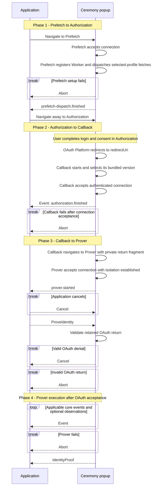

# Ceremony Cross-Document Protocol (CCDP)

Local development exception: references to HTTPS Bridge, CCDP, application and
notary URLs below also admit canonical HTTP URLs on exactly `localhost` or
`127.0.0.1`. A local HTTP notary uses WS at the same authority. This exception does
not apply to OAuth provider requests or external proving assets. COOP/COEP, origin
admission, callback privacy and all other validation remain required. LAN addresses,
lookalike domains and noncanonical spellings are not admitted.

This document defines the closed browser protocol across the Application and
the [documents](documents.md#documents-and-routes) it uses. It owns ceremony locations,
navigations, messages, ordering, and compatibility. Authorization,
platform-proof, and final-proof semantics are defined by the normative
[common ceremony](../../../../specs/ceremony-common.md) and
[platform ceremony](../../../../specs/platform-ceremonies.md) specifications.

An authenticated, ordered, bidirectional popup connection carries CCDP
messages unchanged. CCDP requires that connection but does not prescribe its
implementation. [CCDP_DISTRIBUTION.md](distribution.md) defines the static
distribution and HTTP contract for the CCDP origin.

## Actors and origins

An actor is an operator or external system. An origin is the exact
scheme/host/port authority used by browser security checks. A site is only the
browser's schemeful registrable-domain grouping: same-site actors may remain
cross-origin and do not gain authority over each other.
`Application` denotes both the actor and its top-level browser document when
the distinction is immaterial.

| Actor | Browser authority | Responsibility |
|---|---|---|
| Application | application origin | hosts the application document, owns the operation and ceremony state, and drives the protocol |
| OAuth Bridge | OAuth bridge origin | publishes ceremony configuration, serves the complete Callback document obtained from the Distribution with bridge-owned inputs, owns OAuth registrations, and performs enabled confidential OAuth exchanges |
| CCDP Distribution | CCDP origin | contains the versioned [resources](documents.md#documents-and-routes) and proving assets used by any number of OAuth Bridges; it may be the canonical libID distribution or an operator-selected replacement |
| OAuth Platform | OAuth-platform origin set | hosts authorization/login documents and issues the OAuth return |

The Application and OAuth Bridge may be operated together or independently;
the selected CCDP Distribution may be published by either party or another
one. Their origins may be same-origin, same-site, or cross-site. CCDP assumes
none of those relationships. Browser authority is always established against
an exact origin. A composition which continues the live popup connection after
CCDP has the additional requirements below.

The OAuth redirect URI terminates on the bridge origin. The OAuth Bridge serves
CCDP's self-contained Callback artifact with its deployment inputs already
inserted; artifact retrieval happens server-side, independently of OAuth
requests. Callback captures and clears the OAuth return, then selects its
bundled CCDP implementation without another browser request.

Multiple independently operated OAuth Bridges may select the same CCDP
Distribution through its `ccdpOrigin`. The Distribution keeps no Bridge
registry or reciprocal allowlist and exposes identical public CCDP resources
across that relationship.

## Composition boundary

CCDP does not define documents, messages, or policy outside the ceremony. A
composition may use the same popup and connection before or after CCDP, but
those steps remain outside this protocol.

Carrying the live connection beyond Prover requires the next document to use
the exact CCDP origin; same-site placement is insufficient. All code on that
origin shares one browser authority and must therefore be mutually trusted.

## Documents and Routes

See [CCDP documents and navigation](documents.md).

## Messages

The complete CCDP message catalog has five exact records. Wire discriminators use
kebab case; names do not encode the sender. Popup authenticates the configured
peer origins and connection. CCDP enforces message meaning and protocol state;
it does not add sender-role claims or a second authentication handshake.

| Message | Sender | Accepted after / consequence |
|---|---|---|
| `ProveIdentity` | Application | one `prover.started`; supplies frozen inputs once |
| `IdentityProof` | Prover | one request and valid OAuth acceptance; delivers identity and proof once |
| `Cancel` | Application, or Prover reporting OAuth denial | existing directional cancellation rules below |
| `Abort` | active Prefetch, Callback, or Prover | authenticated connection; terminates technical failure |
| `Event` | active participating document; Application also produces local events | core event ownership and state rules below |

Unknown message types, extra fields, invalid types and invalid predecessors fail.
Event names may be extended, but arbitrary extension events cannot substitute for
core readiness or declare success. Terminal outcomes make later traffic inert.
There is no parallel readiness, stage, or platform-step wire stream.

### ProveIdentity

```ts
interface ProveIdentity {
  type: 'prove-identity'
  platformId: string
  platformCeremonyVersion: number
  clientId: string
  redirectUri: string
  codeVerifier: string | null
  notaryAddress: string | null
}
```

`platformId` and `platformCeremonyVersion` are the exact supported profile
selected at launch and must match the active Prover. The message is valid only
after `prover.started`. The remaining fields are the frozen client identifier and
redirect, derived code verifier, and resolved notary address. The
OAuth return is already retained by Prover and is not repeated in the message.
Starting Prover initiates OAuth validation; it does not assert acceptance or
mean that proof generation has
already begun.

`notaryAddress` is a canonical HTTPS origin with no credentials, path, query,
or fragment for a platform that uses notarization; it is null for Google.
The Application selects and freezes it before OAuth. Prover validates it before
credential use and uses it unchanged for all sessions, including the GitHub
token request. It neither selects defaults nor accepts a separate profile,
ledger identifier, hash, or testnet flag. The address changes network routing,
not the proof statement or trusted signing keys.

The Application origin is trusted for this transient input because it already
supplies the operation being authorized. It retains the authorization nonce;
only the derived code verifier crosses this boundary. The message contains no
authorization digest, operation field, separate OAuth state, Job revision,
composition state, connector, or carrier kind.

For GitHub, Prover derives the fixed OAuth Bridge token route from the origin of
`redirectUri`; no second bridge origin or endpoint field is carried. Prover
exact-validates the CCDP record and selected platform/version before credential
use. That profile parses the retained query/fragment pair, enforcing exact
transport, fields, client/redirect checks applicable to the response, and
success/denial grammar. It matches OAuth `state` to
`v<CCDPVersion>.<ceremonyId>` using the versioned resource and the ID of the
authenticated logical connection, not a second caller-selected expected state.
The return is consumed once; no second request or replacement response can
restart the run.

### Event

```ts
interface Event {
  type: 'event'
  event: string
  phase?: 'started' | 'finished'
  timestamp: number
  operationId?: string
  attributes?: Record<string, string | number | boolean>
}
```

The producing document or worker captures a finite, nonnegative occurrence time
using `performance.timeOrigin + performance.now()`. Receivers preserve it;
arrival time must not replace it. A start/finish pair describes one operation.
An observation has no phase. Repeated overlapping extension operations use an
instrumentation-only `operationId` to pair their occurrences. It is never an
OAuth, ceremony, user, or request identifier and supplies no authority.

Event names and attribute names match `[a-z][a-z0-9-]{0,63}`. Optional operation
identifiers are nonempty strings of at most 64 UTF-8 bytes without control
characters. Attributes have at most 16 entries; strings have at most 128 UTF-8
bytes without controls, numbers are finite, and booleans are allowed. Producers
own the attribute meanings and units. Credentials, identity, proofs, witnesses,
attestations and error text do not belong in these records.

Core operations occur once and do not carry operation identifiers. Each has a
`started` and `finished` occurrence except `prover-fallback`, the only single-shot
core event. Each applicable occurrence is emitted when reached; interrupted operations
do not fabricate a finish. Core duplicates, invalid phases, finishes without their
required start and out-of-state occurrences reject independently of subscribers.
Optional extension observations may be absent without invalidating proof delivery.

| Core event | Emission ownership and meaning |
|---|---|
| `prefetch-dispatch` | Application starts preparation; authenticated Prefetch finishes after the root Worker dispatches/joins the selected fetches. Downloads may remain pending. |
| `authorization` | Application starts immediately before platform navigation. Callback finishes after capture/clearing and Application authentication. This does not imply consent. |
| `prover` | Prover starts after authentication, isolation, handler installation and root-worker claim. Client alone derives the public finish after accepting `IdentityProof` and assembling the result. |
| `prover-fallback` | The isolated fallback document reports its own navigation start retrospectively, before `prover.started`. |
| `token-fetch` | X obtains and parses a usable access token, without waiting for final token attestation. |
| `token-attestation` | X obtains its complete token attestation. For GitHub it covers the whole Bridge request and response admission, obtaining both token and attestation. |
| `identity-fetch` | Obtains and parses the platform identity response. |
| `identity-attestation` | Obtains the complete identity attestation. |
| `zk-proof-preparation` | Prepares circuit inputs and proving backend; finishes when both are ready. |
| `zk-proof-generation` | Executes the witness and generates the ZK proof. |

X emits all six proving operations. GitHub omits `token-fetch`. Google emits only
the two ZK operations. Platform and implementation modules may add observations
and operations; their definitions belong beside their implementation, not here.
No globally sequential ordering is imposed on concurrent work. Witness execution
can overlap backend initialization, so the two ZK intervals may also overlap.
Finishing ZK generation does not finish pending attestations or the ceremony.

Two core event occurrences provide mandatory readiness:

- `prefetch-dispatch.finished`, accepted once during Prefetch, permits private
  navigation to Authorization.
- `prover.started`, accepted once during OAuth return, permits one `ProveIdentity`.

Their production and processing run independently of subscriptions, filters,
rendering and optional recorders. Send failures are technical failures, not
silently dropped readiness. Extension events and source-supplied terminal claims
cannot open either gate. `authorization.finished` and `prover-fallback` are
observations in the OAuth-return phase, not extra readiness gates. Only Prover
produces proving operations, after request acceptance and valid OAuth approval.
A remote `prover.finished` is invalid; `IdentityProof` owns delivery.

For fallback timing, the replacement document emits `prover-fallback` with its
own `performance.timeOrigin`, once authenticated. It then emits `prover.started`
after all readiness work. Their difference includes fallback navigation, document
loading and remaining readiness work. It excludes source-document port
preservation and is not the counterfactual cost of fallback versus DIP. It uses
no timestamp storage, extra handshake or pre-authentication message.

### IdentityProof

```ts
interface IdentityProof {
  type: 'identity-proof'
  identity: {
    platformId: string
    oauthClientId: string
    userId: string
    userName: string
  }
  proof: unknown
}
```

`identity` is a separate, exact-shaped record of prover-extracted strings:
platform identifier, OAuth client identifier, user identifier, and user name
(the signed email for Google). The selected platform validator checks their
encodings and the platform/client binding to `ProveIdentity`.
`proof` is the exact value defined by that platform ceremony version, without
a nested identity copy. CCDP treats the proof as opaque; adding a platform does
not change this message. Neither browser endpoint cryptographically verifies
the delivered result; identity is non-authoritative until ledger verification.

### Cancel

```ts
interface Cancel {
  type: 'cancel'
}
```

`Cancel` is a parameterless, bidirectional terminal message:

- Application → Callback or Prover stops reachable work after explicit
  cancellation or retirement of Application authority.
- Prover → Application reports only a valid, ceremony-bound OAuth-platform
  denial discovered while validating `ProveIdentity`. The Application
  resolves `{ status: 'denied' }`. Prover sends it before token exchange,
  proof execution, or core proving operations, never as a substitute for a failure.

Malformed, mismatched, or otherwise invalid OAuth returns use
`Abort`, not cancellation. An Application which has already canceled
ignores a racing denial or proof. Cancellation has no acknowledgement;
recipients clear reachable input but do not close or navigate the popup.

### Abort

```ts
interface Abort {
  type: 'abort'
  event: string
  message: string
}
```

`event` identifies the failing core or implementation operation using the event
name grammar. `message` is nonempty opaque display text, bounded to 2048 UTF-8
bytes without control characters. There is no required code, closed error-text
catalog, or code-to-message equality check. Recipients render it as text and do
not interpret it as control data, markup, navigation, or a retry instruction.

The implementation preserves the caught exception's message (or a thrown string),
normalizes controls, and bounds its size. It never serializes error objects,
stacks, nested causes or arbitrary objects. This is an explicit display boundary:
bounded text is not guaranteed to be redacted and may contain sensitive details
from a dependency. Applications must exclude it from telemetry exports. The
original cause can remain in the producing context for inspection.

Client rejects with `CeremonyError`, retaining `event` and `message`. Failures
before authentication remain local. An undeliverable report logs a fixed sanitized
local diagnostic; a logging/reporting failure must not replace the original failure.

## Protocol

The protocol advances one named ceremony popup through
[Prefetch](documents.md#prefetch-get-prefetch),
[Authorization](documents.md#authorization-get-platformauthorizationurl),
[Callback](documents.md#callback-get-redirecturi), and
[Prover](documents.md#prover-get-prover). Those route sections own each participant's
inputs, context, and role; [Messages](protocol.md#messages) owns the records crossing the
popup connection. The phases below own their sequencing, entry conditions, and
exit conditions. Navigation retires the source document, and no later message
can reactivate an earlier phase.

### Invariants

- One live ceremony owns one authenticated popup connection. Connection
  ownership supplies message correlation and its private version; loaded
  resources supply the CCDP version. CCDP messages repeat neither.
- Each participant accepts only exact records permitted by its direction,
  current state, and cardinality. Unknown, malformed, replayed, out-of-order,
  wrong-direction, and post-terminal values change no state.
- Browser-observed exact origins establish authority. Same-site placement,
  navigation history, request headers, and message fields do not substitute for
  connection authentication.
- Documents use only the frozen locations and fragments defined here. A CCDP
  message never selects an origin, implementation, or navigation destination.
- Raw OAuth returns pass only from the cleared Callback capture to Prover's
  private fragment, including any isolation replacement. Every arrival clears
  its URL before use; no intermediate store, notification, or diagnostic
  receives those values. The platform-mandated callback query is the sole
  HTTP-request ingress exception.
- Callback carries the return onward only after authenticating the Application.
  Prover validates it against the authenticated ceremony and selected profile
  before any credential-bearing request. Application receives only protocol
  outcomes and the final proof, whose evidence may contain profile-required
  disclosed fields. Authorization receives no CCDP message or connection.
- Progress, carrier state, navigation, popup closure, and unvalidated proof
  delivery grant no authority and never constitute ceremony success.
- The Application owns terminal popup lifetime. No CCDP document closes the
  popup.
- Cancellation and context-loss cleanup are best effort. CCDP has no durable
  checkpoint, ceremony recovery, or migration to another popup connection.

### Phases

#### 1. Prefetch to Authorization

The protocol enters this phase on user activation. The Application initiates
one named popup's first navigation to [Prefetch](documents.md#prefetch-get-prefetch) and
establishes its connection there. A scripted opener may first reserve the
popup at `about:blank`; if that fails, the same activation's real anchor
navigates it directly to Prefetch.

Prefetch clears and validates its fragment, accepts the connection, registers
the Worker, and dispatches the selected profile's fetches. It then sends
[`prefetch-dispatch.finished`](protocol.md#event). Only after accepting that message, the
Application endpoint navigates the retained popup to
[Authorization](documents.md#authorization-get-platformauthorizationurl) at the frozen
`platformAuthorizationUrl`. The Application owns this transition because it
alone retains that URL; neither the URL nor a navigation command crosses the
carrier. Authorization is not a participating document, so the navigation
retires the Prefetch carrier while leaving the Application endpoint available
for Callback.

Worker registration, activation, or selected-profile dispatch failure after
connection acceptance sends `Abort` instead of `prefetch-dispatch.finished`;
Application rejects without navigating to Authorization. Download failure
after successful dispatch remains an asset-cache concern and uses the normal
cold-fetch path, not a late Prefetch abort. Failures before connection acceptance
are reported locally and release no protocol message.

#### 2. Authorization to Callback

This phase begins when [Authorization](documents.md#authorization-get-platformauthorizationurl)
loads. The OAuth Platform owns the popup and initiates browser navigation to
the frozen `redirectUri` after approval or denial; neither CCDP endpoint
initiates that transition. The Bridge serves the complete
[Callback](documents.md#callback-get-redirecturi), which captures and clears the return and
enters its bundled CCDP implementation selected by `state`. The
[OAuth Bridge contract](oauth-bridge.md#callback-document) exclusively defines
ingress.

Callback accepts the Application connection using the ceremony ID extracted
from the captured `state`. This authenticates the Application against the
Bridge's deployment allowlist before the return can leave Callback. It sends
`Event` for `authorization.finished`, never an OAuth-return payload or outcome. Connection
acceptance permits the Prover transition; milestone delivery is not a prerequisite.

#### 3. Callback to Prover

The popup-side [Callback](documents.md#callback-get-redirecturi) endpoint asks its connection
to navigate to the frozen [Prover](documents.md#prover-get-prover) location, supplying the
ceremony ID and captured query/fragment as that route's structured fragment.
Callback owns this transition to keep the return private from Application and
because the OAuth Platform may have severed Application's direct popup handle.

Prover captures and clears the fragment, then accepts the same logical
Application connection. It sends [`prover.started`](protocol.md#event) only after
cross-origin isolation is established and its CCDP handlers are installed.
Connection establishment and any internal isolation transition are below CCDP:
neither introduces another participant, message, or phase. The captured
parameters survive that transition without passing through Application.

Application accepts one `prover.started` and sends one
[`ProveIdentity`](protocol.md#proveidentity) using its frozen configuration and code
verifier. It does not receive or parse the OAuth return. On receiving
`ProveIdentity`, the selected platform/version validates the retained return
before credential use. A valid denial sends
[`Cancel`](protocol.md#cancel); malformed or mismatched input sends
[`Abort`](protocol.md#abort). Both end the run in this phase, as does
Application cancellation. Only valid OAuth acceptance enters Phase 4.

#### 4. Prover execution

This phase begins only after [Prover](documents.md#prover-get-prover) has validated and
accepted the OAuth return in Phase 3. It performs the selected profile's token
exchange, notarization, and proof-generation steps as applicable. It sends the
applicable core occurrences and any extension [`Event`](#event) messages followed by one
[`IdentityProof`](#identityproof), unless it sends
[`Abort`](#abort) or receives
[`Cancel`](#cancel). The first terminal outcome—proof
delivery, abort, or cancellation—ends the phase; later messages have no effect.

### Terminal outcomes

Terminal processing begins when the Application cancels an active Callback
or Prover; Prover reports valid OAuth denial; an active document reports an
abort; or Prover delivers a proof. These outcomes are mutually terminal even
when they race in transit.
Cancellation has no acknowledgement. Prover's valid denial resolves denied;
Application cancellation retains its local canceled outcome. An observable
abort rejects the live ceremony; a failure before connection acceptance is
rendered locally. CCDP
initiates no further navigation: the Application composition alone decides
whether to retain, navigate, or close the popup because any subsequent flow is
outside CCDP. Terminal cleanup follows the [invariants](protocol.md#invariants).

### Successful sequence

The popup lifeline is one browsing context whose current document is replaced
at every navigation; it does not imply shared document state.



Terminal exits are shown without their cleanup details, which follow
[Terminal outcomes](protocol.md#terminal-outcomes) and the [message contracts](protocol.md#messages).
Carrier mechanics and proof-generation internals are omitted.

## Implementation guide

Pure message types, decoder companions and navigation encodings shared by the Client
and document entrypoints. This internal module stays browser-free and has no
public package subpath.

- [Documents](documents.md#implementation-guide): Callback, Prefetch and Prover entrypoints.
- [Routes and fragments](documents.md): versioned locations and private handoff.

[index.ts](../src/ccdp/index.ts) defines the nine message companions. [navigation.ts](../src/ccdp/navigation.ts)
owns fragment codecs and state routing. `@libid/popup` supplies authenticated delivery,
window lifecycle and continuity; CCDP owns no carrier implementation.
