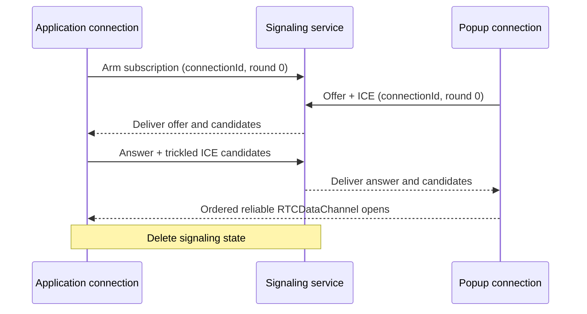
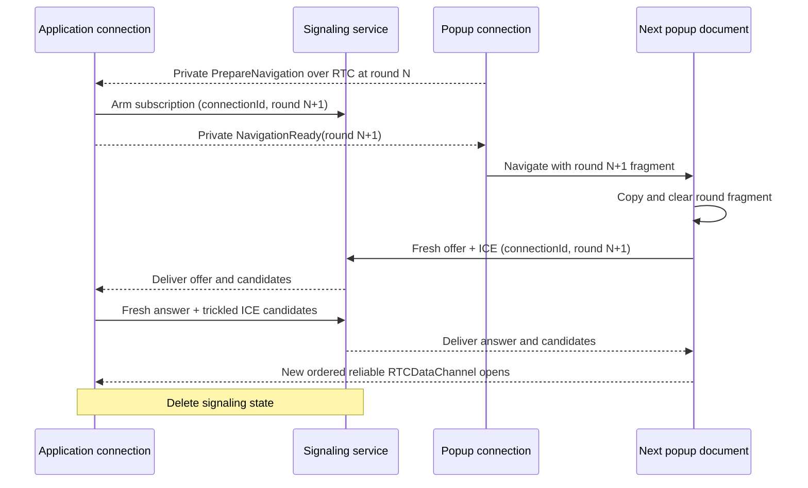

# WebRTC carrier

This document defines the WebRTC fallback carrier for the
[popup connection](CONNECTION.md) when response policy severs popup opener
authentication. It owns peer establishment and logical-value delivery over one
`RTCDataChannel`.

MessagePort is preferred while the popup retains its opener. WebRTC covers the
case where external response isolation requires an opener-independent path.
The signaling service's exact routes, records, bounds, and implementation are
outside this specification; this document fixes only the connection boundary
and the security properties that contract must preserve.

## Why this carrier exists

The browser-local [MessagePort carrier](CONNECTION-MESSAGEPORT.md) is simpler,
but cannot establish after response isolation severs the popup's opener.
This follows the [HTML COOP model](https://html.spec.whatwg.org/multipage/browsers.html#cross-origin-opener-policies)
and its unresolved [cross-group opener-messaging limitation](https://github.com/whatwg/html/issues/6364).
No known alternative to WebRTC satisfies the connection constraints after that
severance: cross-site operation, current-engine support, mobile suspension, no
application-origin endpoint, no additional window, and direct browser-local
application messages. WebRTC is therefore the available opener-independent
fallback. Its signaling service establishes the peers but never relays
application-level messages. A deployment without TURN accepts that direct ICE
can fail on restrictive networks.

## Topology

The application page and final top-level popup document are the only RTC peers.
A transient popup document never creates an `RTCPeerConnection` when its next
navigation would destroy it. No iframe, worker, or signaling service terminates
the `RTCDataChannel`.

```text
Application connection      Signaling service      Destination popup connection
        |<--- SDP / ICE --------->|<--- SDP / ICE --------->|
        |<========== direct RTCDataChannel =================>|

        ---- signaling through service
        ==== direct browser-to-browser application data
```

The application connection starts one bounded, one-use signaling subscription
before each popup navigation which may require RTC in the destination. This
creates no peer connection, SDP, ICE candidate, or transported-value record.
The application closes the subscription unused when MessagePort wins. When RTC
is committed, the destination popup creates a fresh offer and the application
creates a fresh matching answer.

## Signaling service

The signaling service is a bounded rendezvous, not a carrier. For each round,
the application subscribes as answerer and the destination popup publishes as
offerer under the same fresh, unguessable connection ID and exact signaling
round. The ID is the logical connection's rendezvous capability. Round is a
non-secret unsigned 32-bit monotonic stale-signal discriminator: the initial
round is zero and each replacement uses exactly the previous round plus one.
The browser-stamped `Origin` restricts which browser role may present the tuple
but is not a general client credential. The service exact-checks the application
and popup origins. Signaled DTLS fingerprints bind the resulting channel to
that round's descriptions but do not independently authenticate the signaling
service. No second nonce is added.

The signaling contract accepts only:

- one application subscription from an allowed application origin;
- one popup offer from the configured popup origin;
- one fresh application answer;
- bounded trickled ICE candidate updates from the bound roles; and
- terminal connected, failed, or abandoned cleanup.

The live subscription and every offer, answer, candidate, and cleanup record
exact-match the caller-supplied connection version, connection ID, round, and
role. State is transient and is deleted when the channel opens, either side
fails, MessagePort wins, or the round is abandoned. Only after that deletion may
the same live logical connection start its next round. At most one round for a
connection ID may be live. A delayed record from an earlier round cannot match
or create state for the current round. Signaling records are consumed once and
never enter signaling URLs, logs, analytics, or durable storage.

The signaling service handles independent one-shot rounds. It does not retain a
subscription for the logical connection, detect popup navigation, or understand
carrier continuity.

### Private navigation preparation

When popup-side navigation would destroy an active RTC carrier, the popup sends
package-private `PrepareNavigation` through its `prepareNavigation` lifecycle
hook with the caller-selected target. The application carrier internally
increments the round, starts a fresh one-use answerer subscription, reports its
pending authenticated carrier through `onReplacement`, and replies with
package-private `NavigationReady` carrying the exact next round only after the
subscription is armed. The popup carrier adds that round to its private fragment
field and resolves the prepared target. The destination carrier copies and
immediately clears the field before constructing its fresh offer. Failure,
timeout, malformed round, or unsigned 32-bit overflow closes the logical
connection without navigating.

These controls exist only in the WebRTC carrier. They are consumed before the
generic carrier value stream and never enter `PopupControl`, the caller message
union, or another carrier. A MessagePort which can be transferred across an
immediate participating-document replacement uses `PortKeeper` instead and
emits neither control.

The symbol-keyed hooks are the only RTC lifecycle extension to the common
carrier. The popup hook resolves with a target decorated only by the RTC
carrier's private metadata. The application hook reports only the pending
authenticated replacement carrier. Connection retains that promise and later
installs its result; it never observes a signaling round. The RTC module does
not navigate or select a route.

An honest service is not on the data path and cannot read DTLS-protected framed
values. A compromised service can replace exchanged fingerprints and
man-in-the-middle the channel, but the signaling service belongs to the same
configured server trust boundary that supplies the popup program.
It therefore adds no independent signature or trust system.

The signaling service is selected over the available establishment mechanisms:

| Mechanism | Tradeoff |
| --- | --- |
| Signaling service | Works cross-site, is event-driven, and needs no application-origin endpoint or additional iframe. It carries only bounded SDP and ICE metadata; application messages remain browser-local. |
| Cookie or storage polling | Requires an additional popup-server iframe under the application and works only when application and popup server are same-site. Browser throttling made PoC signaling take more than one second, comparable to a service round trip, while still not covering cross-site deployments. |
| `BroadcastChannel` or shared worker | Cannot reliably cross the origin and storage-partition boundary between application and popup server. |
| Application endpoint or frontend-origin rendezvous page | Can rendezvous the peers, but adds application-specific server or hosting integration that the deployment model excludes. |
| TURN | Solves peer reachability rather than signaling. It relays encrypted DTLS/SCTP packets, placing a service on every packet path and violating the direct browser-local connection constraint, but does not terminate the data channel or read its plaintext. |

The selected path supports cross-site peers without turning the signaling
service into an application-message relay. With STUN only, inability to form a
direct ICE path fails the connection rather than selecting another carrier.

## API

Signaling is private carrier machinery. Both endpoints receive the connection
ID as a connection-construction input before any caller message exists; neither
finds it by inspecting a transported value. The application starts connecting
before popup navigation, and the popup endpoint connects only after connection
commits RTC fallback:

```ts
interface ApplicationWebRTCOptions {
  signalingServiceUrl: string
  stunUrls: readonly string[]
  connectionId: string
  popupOrigin: string
  signal: AbortSignal
}

interface PopupWebRTCOptions {
  signalingServiceUrl: string
  stunUrls: readonly string[]
  connectionId: string
  allowedApplicationOrigins: readonly string[]
  signal: AbortSignal
}

declare function connectApplicationWebRTC(
  options: ApplicationWebRTCOptions,
): Promise<Carrier>

declare function connectPopupWebRTC(
  options: PopupWebRTCOptions,
): Promise<Carrier>
```

Each endpoint closes over its WebRTC options in the optional constructor passed
to `PopupConnection`:

```ts
fallback: signal => connectApplicationWebRTC({
  ...webRTCOptions,
  connectionId,
  popupOrigin,
  signal,
})
```

The popup supplies `connectPopupWebRTC` in the same form with its immutable
allowed application origins. Each initial `connectApplicationWebRTC` call
synchronously starts bounded answerer round zero and returns its pending carrier
promise. It creates the answering peer only after a valid fresh offer arrives.
`connectPopupWebRTC` creates the offering peer and data channel, publishes its
offer and candidates, and consumes the answer and remote candidates. Each
function resolves with an authenticated carrier only after its local channel
opens.
Internally they retain the peer connection and channel and own every signaling
request, trickled candidate update, origin-bound role, timeout, codec, framing,
pressure, and cleanup operation.

The application connection observes the initial promise without awaiting it
during popup navigation, so an early failure produces no unhandled rejection.
MessagePort selection aborts that attempt. During controlled replacement, the
active application RTC carrier internally starts the exact next round while the
old channel remains usable and reports only its pending authenticated carrier
through the package-private replacement hook. Each popup fallback creates a new
physical peer; the application creates a new peer and answer rather than reusing
an earlier description. Under RTC selection each endpoint otherwise exposes
only the common carrier API.
Abort, logical connection closure, or establishment failure closes every
reachable signaling, peer, and channel resource and releases no transported
value. No signaling API or native RTC resource is exposed to caller protocols
or package consumers.

## Peer establishment

The destination popup creates one ordered reliable `RTCDataChannel` and offers;
the application answers. Neither peer sets `maxPacketLifeTime` nor
`maxRetransmits`.

Both use trickle ICE with deployment-configured STUN servers. They send each
local description as soon as it exists and forward candidates as discovered.
Host and mDNS candidates may connect immediately; server-reflexive candidates
provide a mobile path without depending on mDNS resolution or local-network
permission. ICE completion is diagnostic because the channel may open earlier.
The deployment configures no TURN server. Networks whose NAT or firewall prevents a
direct path fail closed; this is an explicit availability tradeoff, not a
connection downgrade or recovery signal.

The selected SDP and DTLS fingerprints are immutable for one signaling round.
Duplicate signaling records are idempotent; candidate records append only exact
new candidates. Changed descriptions, roles, fingerprints, or accepted
candidates fail. Signaling state is deleted when the channel opens, either side
fails, MessagePort wins, or the round is abandoned.

## Message delivery

[`RTCDataChannel.send`](https://www.w3.org/TR/webrtc/#dom-rtcdatachannel-send)
accepts strings and binary buffers, not structured-clone objects. This carrier
therefore owns one dependency-free wire codec in addition to bounded framing,
reassembly, and send-buffer pressure. Its logical value domain is `null`,
booleans, finite numbers other than negative zero, strings, dense arrays, plain
records with enumerable own string-keyed data properties, and `Uint8Array`.
It rejects `undefined`, `bigint`, nonfinite numbers, negative zero, sparse
arrays or arrays with non-index properties, symbol or nonenumerable keys,
accessors, functions, cycles, class instances, `Date`, `Map`, `Set`, raw
`ArrayBuffer`, and other platform objects before sending.

The codec recursively replaces each `Uint8Array` with the exact JSON object
`{"$bytes":"<unpadded-base64url>"}`. `$bytes` is reserved and cannot be an
ordinary record key. It then uses `JSON.stringify` and `TextEncoder` to produce
UTF-8 bytes. JSON is selected because it is built into every target browser and
needs no package; CBOR or MessagePack would reduce byte expansion but add a
dependency or custom codec without changing the protocol boundary. The JSON
encoding is not canonical and is never hashed, signed, or otherwise treated as
proof bytes; only each byte tag's base64url spelling is canonical.

One framed item is sent completely before the next. The ordered reliable channel
uses two value frame forms and two package-private navigation controls:

```text
first:         0x01 | uint32be totalLength | payload
continuation:  0x00 | payload
prepare-nav:   0x02
nav-ready:     0x03 | uint32be round
```

The first frame may complete the message. Otherwise continuation payloads append
until exactly `totalLength` bytes have arrived. The carrier fragments below the
retained peer connection's `RTCSctpTransport.maxMessageSize` and its own bounded
chunk cap, and pauses its bounded send queue using `bufferedAmount` and
`bufferedamountlow`. Private navigation controls are valid only between complete
values, in their defined direction, and once per replacement. Ordering and the
noninterleaving send queue remove the need for message IDs, chunk indexes,
acknowledgements, or a checksum.

On receipt the channel uses `binaryType = 'arraybuffer'`. The carrier exact-checks
the frame sequence and total length, decodes UTF-8 fatally, parses JSON, restores
exact canonical byte tags to `Uint8Array`, validates the generic value domain,
and gives the resulting `unknown` to the connection. The connection then selects
and calls its registered `MessageType`. The carrier recognizes only its two
private frame tags; it never reads a caller message discriminator.

An unexpected start or continuation, incomplete or excess body, oversized
message, invalid UTF-8 or JSON, malformed or noncanonical byte tag, unsupported
value, decode failure, or send-buffer overflow closes the carrier before any
value reaches a handler. The connection functions return the carrier and retain
the native peer and channel privately. A physical carrier never reconnects,
switches, or resends. Only a controlled navigation may replace it under the
logical connection; unexpected carrier failure closes the connection.

## Failure and security invariants

- Signaling carries no transported value.
- The application signaling handshake requires an allowed browser-stamped
  `Origin`; the popup handshake requires the exact configured popup origin.
  Origin restricts browser callers but is not accepted as a standalone client
  credential.
- Connection ID is the fresh, unguessable logical rendezvous capability. It is
  exact-matched with the bounded monotonic round for every signaling record and
  retired when the logical connection closes. Round zero is initial; each
  replacement uses exactly the previous round plus one. Round is not a
  capability.
- A private navigation control cannot reach caller code or another carrier, and
  cannot navigate until the application has armed the exact next round. The
  destination clears its package-owned round fragment before code or network
  use. Stale, missing, malformed, noncanonical, or overflowing rounds fail.
- `RTCDataChannel` message encoding and framing are bounded and cannot add a
  value outside its authenticated connection.
- Signaling loss, ICE failure, channel loss, popup closure, or context
  destruction is never a caller result or recovery signal.
- Observable failure clears reachable inputs without selecting another carrier;
  failure may otherwise be silent.

## Connection establishment

These diagrams show initial RTC fallback and controlled RTC replacement. They do
not define signaling-service wire records or show transported values.




